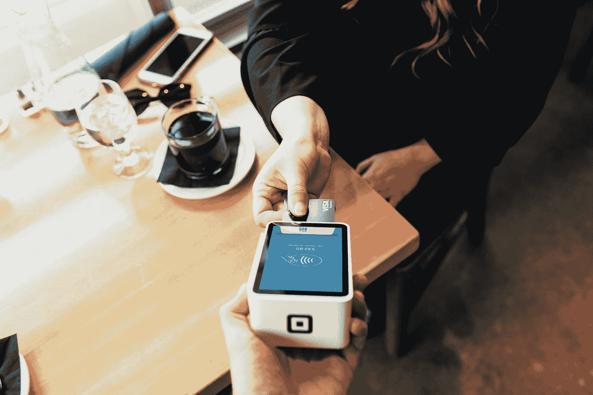

# 让我们废话少说:为什么支付是加密最重要的用例

> 原文：<https://medium.com/hackernoon/lets-cut-the-crap-why-payments-is-the-most-important-use-case-for-crypto-7044ac31966b>

Photo by [Blake Wisz](https://unsplash.com/@blakewisz?utm_source=medium&utm_medium=referral) on [Unsplash](https://unsplash.com?utm_source=medium&utm_medium=referral)

从标题来看，似乎每个问题都可以用一个好的区块链来解决。人们希望它能规范供应链、存储和分发音乐、运行游戏、追踪武器、执行工人权利、追踪选举投票、运行奖励计划，等等。本周，我的健身房打广告说，我们可以在他们的新区块链上跟踪我们的锻炼。区块链对于我们来说，就好像互联网对于 20 年前的世界一样。

一篇标题幽默的论文，叫做“[你需要区块链吗？](https://eprint.iacr.org/2017/375.pdf)”正在四处传播，并提供了一些重要的见解。它指出，尽管区块链令人兴奋，但对于人们想用它来完成的许多任务来说，它并不实用。区块链为个人提供了一种相互交流的方式，交换某种信息、货币等。在不信任的环境中。它的主要好处是透明和权力下放，消除了互动中的第三方。

虽然区块链*可以在我们提到的大多数情况下使用，但许多这些热门的新区块链应用程序对区块链毫无意义。分布式分类账成本高昂。由于分散化，它们需要时间来达成共识，并且在网络中的每台计算机上存储和/或执行文件在时间和能量上是昂贵的。当去中心化、透明和不信任所获得的价值大于计算时间和金钱的成本时，就是使用区块链的时候。*

对区块链来说，支付系统是迄今为止最合理、最重要的用例。正如比特币和以太坊等主要加密货币所证明的那样，区块链可以为用户提供一个安全的点对点交易场所，费用仅为信用卡和其他标准支付处理解决方案的一小部分。如果这两个区块链能够扩展，它们将成为日常交易的可行选择。这种方式如此有效的原因是，使用第三方来处理交易成本很高。事实上，如此昂贵，以至于区块链的优势盖过了它的成本。

为了便于理解，我们来看看区块链的其他流行用例，并将它们与支付处理进行比较。其中一些最著名的是:存储和流媒体音乐，允许人们直接向艺术家付费，减少版权侵权；作为投票平台；用于交换房地产、汽车或武器所有权；跟踪医疗记录；监控供应链，清除现代奴隶和非法偷猎。

从表面上看，这些是区块链可能能够解决的令人兴奋的问题！让我们来看看，从存储和流式播放音乐开始。区块链上的文件存储比集中式数据库中的文件存储要昂贵得多，因为您必须在网络中的每台机器上存储一些东西，才能将它们存储在区块链上。的确，分发音乐的问题得益于去中心化、点对点的互动，以及某种程度上的不信任(音乐家不相信消费者会遵守版权法)。另一方面，消费者可能不欣赏区块链的透明度，除非这个音乐区块链有一种可以兑换流媒体音乐之外的其他东西的货币，否则我们可能会冒险成立一个集中的、可信的第三方公司来连接用户和区块链。收益大于成本吗？

将区块链作为投票平台也存在固有的挑战。例如，我们如何保持匿名投票以避免强制投票，同时也允许执法部门检查投票欺诈？即使每个投票者对自己的身份保密，如果投票是公开可见的，也有可能对投票链进行流量分析，并潜在地发现某些投票者的身份。此外，谁应该保护网络并成为矿工？有特殊利益的私人公司，政府团体，地方政府？那个问题很快就变得棘手了。

对于房地产、汽车或武器，区块链可能也不是正确的解决方案。请记住，如果透明、不信任和去中心化能产生足够高的收益，那么区块链是值得的。这里要问的第一个问题是:为什么政府不能就这些头衔保持一个集中的数据库？我们可能不信任政府。但是，即使你有一辆区块链，你怎么能相信政府会强制执行所有权呢？我们将不得不信任某人来实施所有权——不管是谁，只要保持一个数据库即可。

以医疗记录为例——当然，这是一个分布式数据库很好，但我们必须减轻的不信任在哪里？有了区块链，每家医院都会将每个病人的记录保存在他们的系统中，并且花费电力来达成共识。这一共识能解决什么争议？有人会花双倍的钱去看医生，然后被诊断两次吗？此外，如果医院彼此足够信任，想要知道彼此的诊断和治疗记录，为什么他们不能信任彼此，在请求时正确地提供记录？对于医院来说，保持集中的数据库更有意义。

最后，监控供应链。就像前面的一些例子一样，在这种情况下，我们没有办法完全消除对信任的需求。我们必须依靠公司来记录他们在区块链的交易，并且诚实地记录所有的交易。即使这个过程在某种程度上是自动化的，也必须有物理设备，记录关于物理世界的事情，我们必须相信这些设备不会出错，不会被篡改。即使我们想追踪专门使用比特币或以太坊等加密货币平台的公司的供应链，我们也必须相信该公司所有的采购都是用这种货币进行的，而且是诚实地进行的。由于区块链的要点是不信任，这只是一种保持信任公司遵守法规的昂贵方式。

我们废话少说。支付，区块链的原始用例，是迄今为止最符合逻辑和最可行的加密用例。让我们简化事情，冷静下来，让一个全球可扩展的交易平台启动并运行。在对加密的大肆宣传中，我们已经忘记了为什么我们需要区块链，它们有什么用处，以及为什么不幸的是它们不能解决所有的问题。