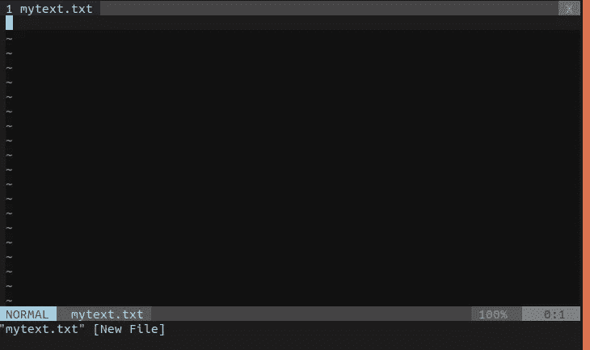
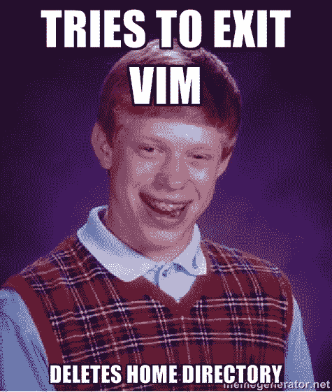
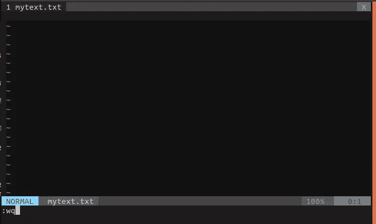
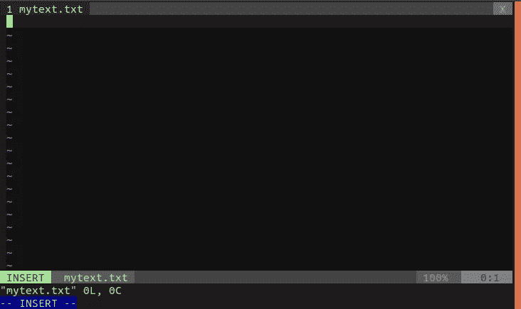
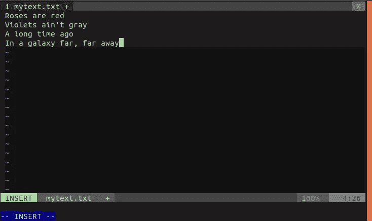
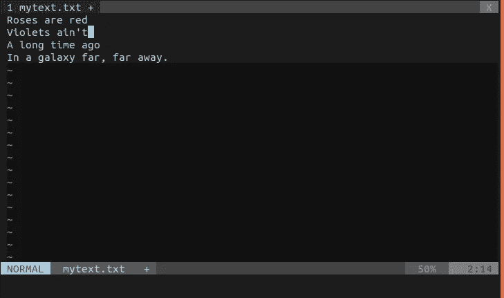
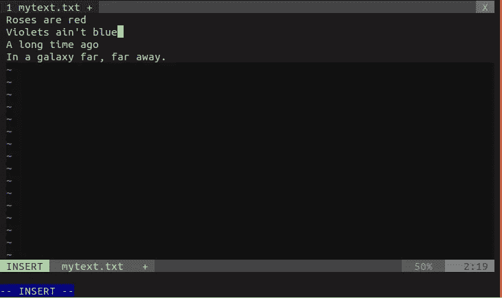
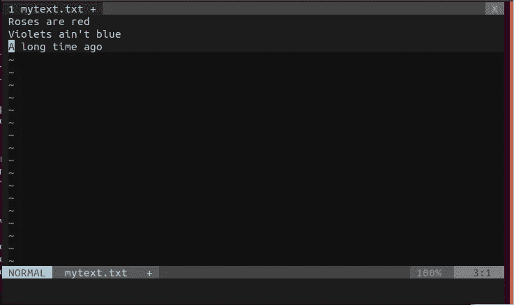
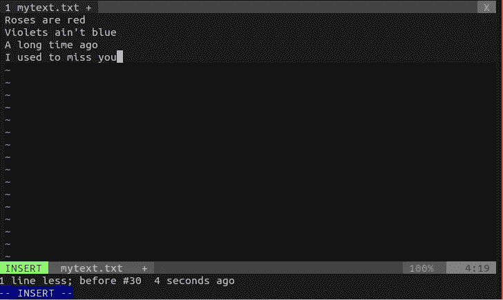

# 让我们学习 Vim！第一部分

> 原文：<https://medium.com/hackernoon/lets-learn-vim-part-1-4752116637b4>

你终于可以戒掉了！

所以我曾经试着抓住维姆，那时我更高，更年轻，更犀利。

那大概是 2016 年 12 月下旬某个寒风凛冽的午夜。我打开我的金库，拿起我的黑色连帽衫，上面有 Linux 企鹅，穿上它。然后我把房间所有的灯都关了，从里面反锁。

只有我终端的浅绿色字体发出的黑色阴影照亮了我的房间。在这种 10 倍的黑客环境下，当然没有考虑到进一步的后果，正如我一直做的那样，我打开了我的终端，简单地写下`**vim**`并点击回车。

剩下的就是噩梦了。

Photo by [Marten Newhall](https://unsplash.com/@laughayette?utm_source=medium&utm_medium=referral) on [Unsplash](https://unsplash.com?utm_source=medium&utm_medium=referral)

好吧，我夸大了很多。😛

最近，当我在办公室被老板要求学习 Vim 时(因为我必须通过一个`**ssh**`服务器导航)，我决定**用 Vim 完成**我的**未完成的**任务。

这让我来到了 Medium，来写关于 Vim 的文章。正如一位智者曾在脸书上发帖指出的那样，*分享知识就是力量。*

所以，打开你的终端*让我们来讨论一下*。

## 步骤 1:安装 Vim

我假设你有`**bash**`，并且你是一个 Linux 用户。希望 Windows 用户安装 Vim 也有类似的方法。

*   在你的终端上，写下:`**sudo apt-get update**`。
*   使用`**sudo apt-get install vim**`安装 Vim。就是这样。

## 步骤 2:启动 Vim

这会很有趣的！

*   在终端上写下`**vim mytext.txt**`并点击回车。
*   你会看到类似下图的东西。请记住，我使用的是一种叫做`**vimrc**`的特殊工具。这就是为什么它可能会看起来不同于你的终端。你可以在这里找到`**vimrc**`。现在我想你应该忽略它。

Vim!

*   不要试图随意敲击任何键！在这个阶段，你的 Vim 处于正常模式。这种模式类似于*检查模式，*在这种模式下，您基本上可以进行导航、删除、替换等一系列操作。当此模式打开时，您不能书写文本。
*   让我们先从 Vim 退出，不要破坏任何东西！

只需写下`**:wq**`并按下回车键。

它所做的是，它**将文件**写到你的磁盘上，并保存你所做的所有更改，然后**退出**。如果不想保存更改，点击`**:q!**`。

对，就是这样！

## 第三步:用 Vim 写点东西

现在我们将在 Vim 上写点东西。

*   在上一步中，正如您所看到的，我们正在正常模式下工作。当这个模式打开时，你不能真正地在你的文件里面写东西。你必须切换到插入模式。
*   要做到这一点，你需要做的就是在正常模式下键入并点击`**i**`。

*   现在你可以简单地输入你想要的任何东西。

Poem from Reddit.

*   我们想拯救它，对吗？要保存磁盘上的更改，点击`**ESC**`切换到正常模式。并键入`**:w**`。或者你也可以写`**:wq**`来写并退出。
*   感觉像个科学家。

*   当你在正常模式下，要上下左右移动，你应该使用:
    `**h**` —左
    `**j**` —下
    `**k**` —上
    `**l**` —右
    是的，这太奇怪了。但这是为了方便。我想一旦你非常习惯于 Vim 的按键绑定，你就能意识到这一点。
*   您可以在插入模式下使用箭头键进行导航。
*   假设您希望在文本文件的特定行的末尾追加一些文本。将光标移动到该行(当然是在正常模式下),用`**<shift>**`键点击`**A**`。

## 步骤 4:编辑文件

*   让我们假设我们想要编辑我们先前的文本文件。比如说，你想把*灰色*这个词换成*蓝色。要做到这一点，你当然可以进入插入模式，使用退格键删除并写入任何你想要的内容。但是在普通模式下我们可以做得更流畅。将光标移动到您想要删除的单词的开头，然后点击`**dw**`。*

*   然后切换到插入模式，写*蓝色。*

*   现在的问题是，我们的诗不押韵！我们应该用押韵的方式来获得诺贝尔文学奖。我们把最后一行删掉，写点有价值的吧。
*   为此，在正常模式下，将光标移动到您想要删除的行，并点击`**dd**`。

*   然后切换到插入模式来写你想要的。

Poem by M Chowdhury (1995 — )

## 步骤 5:更多的命令

*   这个命令`**:d$**`从光标位置删除到行尾。
*   在正常模式下，您可以轻松地进行撤消操作。就打`**u**`。要重做，点击`**CTRL-R**` 。
*   假设你在某个地方打错了，你想用一个字符替换另一个字符。在正常模式下，你只需将光标移动到字符上方，点击`**rx**`，其中 **x** 是你想要替换当前字符的字符。
*   或者你只是想删除一个字符。把光标移到那上面，然后点击`**x**`。

我想这是第一部分。我希望尽快完成下一部分！希望你学到了新东西。现在去给你女朋友炫耀一下吧。

谢谢！

对于第 2 部分:[让我们学习 Vim！第二部分](https://hackernoon.com/lets-learn-vim-part-2-66b968f1551f)