# 让我们学习 Vim！第二部分

> 原文：<https://medium.com/hackernoon/lets-learn-vim-part-2-66b968f1551f>

在这里找到第 1 部分:[我们来学习 Vim 吧！第一部分](https://hackernoon.com/lets-learn-vim-part-1-4752116637b4)

所以，上次当我们用 Vim 弄脏我们的手时，我们最终写了一首非常好的有深刻含义的诗。

万一你不相信这首诗，我谅你能写出一首更好的。谢谢你。

现在，您已经在本系列的第一部分中看到，要在 Vim 中移动光标，您需要在普通模式下使用`**h,j,k,l**`。这很奇怪，直到你习惯了。

除此之外，你可以使用`**w**`和`**e**`来浏览你的文本。

`**w**`:将光标移动到下一个单词的开头。
`**e**`:将光标移动到下一个单词的末尾。

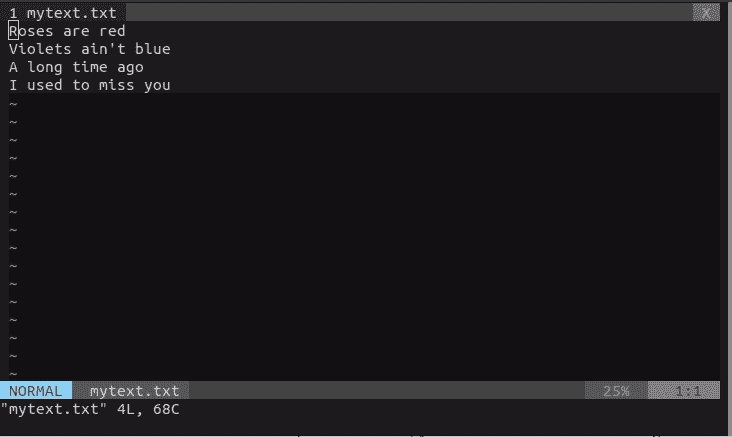

Effects of commands `w` and `e`

在上面发布的 gif 中，请注意，当您使用`**w**`或`**e**`命令时，它不会跳过标点符号撇号( **'** )。要始终移动到空行后的下一个位置，使用`**W**`和`**E**`。

另一方面，说你想一次移动 3 个单词。为此，您可以在正常模式下点击`**3w**`。这意味着，一般来说，你点击`**nw**`一次浏览 **n 个单词。**

我猜你在想，*如果我们想反过来做同样的操作呢？*他们就是简单的`**w->b, W->B, e->ge, E->gE**`。很可能，并不是所有这些操作都会被大量使用。

有时候，你在一长行的中间，你只想把光标移到那一行的开头。不需要连续点击`**h**`或其他命令，只需点击`**0**`即可。

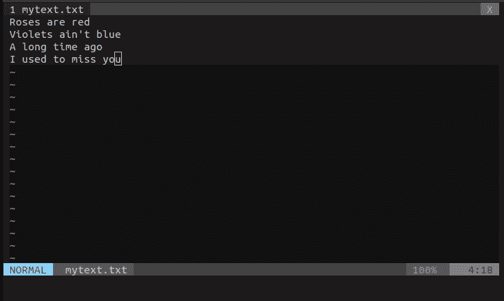

Zero.

同样的，

`**gg**` —移动到文档的最开头。
`**G**` —移动到文档最后一行的开头。
`**G$**` —移动到文档末尾。
`**nG**` —移动到第 n 行，这里 n 是你给的一个数字。

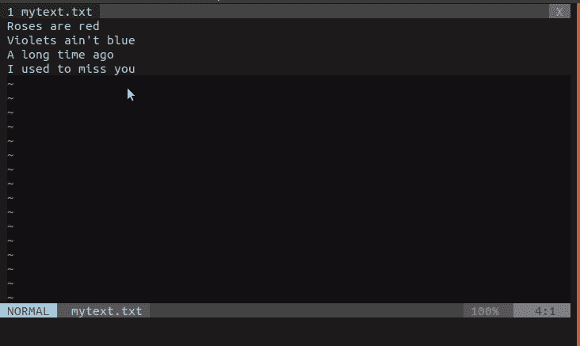

2G, 3G, 1G, 4G

现在，您正在当前目录下工作，却忘记了该目录下的文件。一般来说，我们只是做一个简单的`**ls**` 并列出文件和文件夹。您可以在 Vim 内部做同样的事情。这个想法是在不退出 Vim 的情况下广播一个 shell 命令。

这可以通过命令后面的`**:!**`来完成。

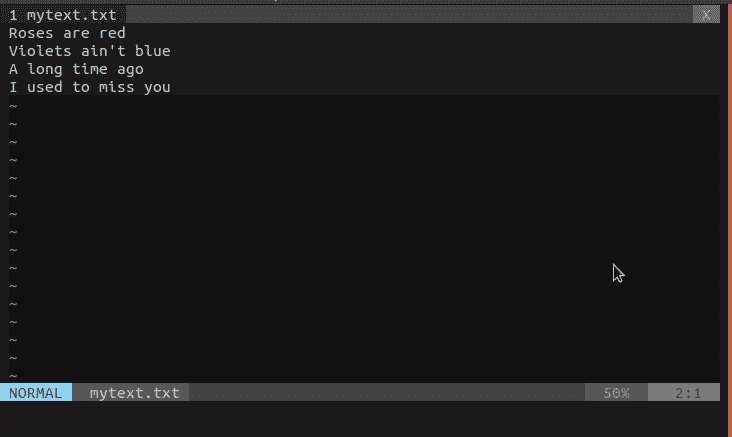

Vim 还支持将当前文件的内容写入新文件。大概你已经猜到了，命令是`**:w <filename>**`。

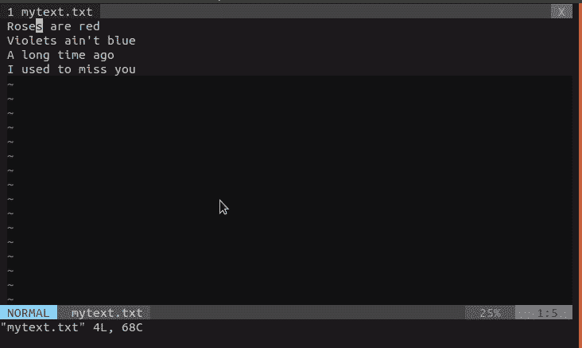

要选择文本的某个部分，在普通模式下，你可以从`**v**` 开始。现在，如果你移动光标，你会看到特定的部分将被选中。

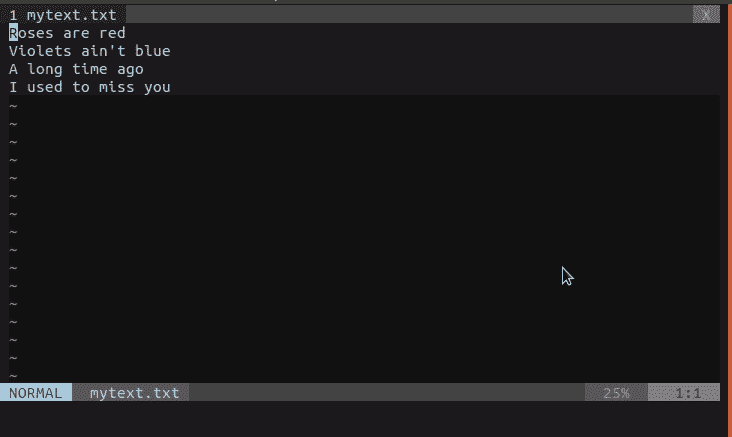

正如你已经看到的，我们有两个相同诗歌的文本文件。让我们一起打开它们。

要将多个文件作为选项卡打开，您可以采用以下两种方式之一。从终端点击`**vim -p file1 file2 file3**`。或者在 vim 中，您可以编写命令`**:tabnew filename**`。让我们这样打开`**poem.txt**` :

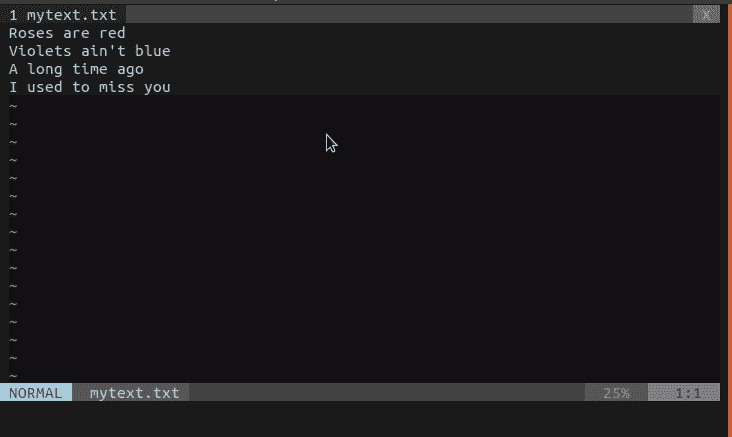

问题是，当你有多个标签时，你需要从一个标签导航到另一个标签。这可以使用 go 命令来完成:`**gt**` 和`**gT**` 或第 n 个标签`**ngt**`。这里，`**n**`是一个标签号。

在这一点上你可能有一个问题。对分屏感兴趣怎么办？这在处理同一个文件的多个部分时会方便得多。

维姆已经处理好了。要分割屏幕，你可以点击`**ctrl+w+v**`。它将屏幕垂直分成两半。要以水平方式进行同样的操作，点击`**ctrl+w+s**`。

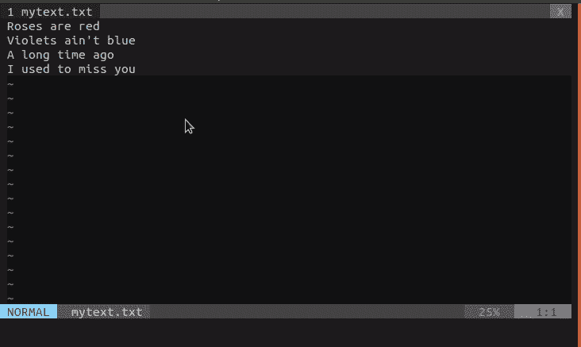

请注意我们是如何在分割中导航的。就用`**ctrl+w+<cursor moves>**`吧。

如果您需要在这些单独的分割中编辑多个文件，该怎么办？可以像 [StackOverflow](https://vi.stackexchange.com/questions/64/is-it-possible-to-split-vim-window-to-view-multiple-files-at-once) 中提到的那样轻松完成！

比方说，你有兴趣再写一首诗。正如所有的好诗都应该以*玫瑰是红的，玫瑰是蓝的开始一样，很久以前——*你决定创建一个新文件，在其中复制这两行诗。

Vim 使得这种操作变得非常简单。您首先需要选择要复制到新文件中的文本部分，然后写入其中。

如您之前所见，首先使用`**v**` 并移动光标来选择文本部分。然后点击`**:**`。你会看到这些字符:`**:’<,’>**`。它们是一种命令提示。如果点击`**w <filename>**`，将会创建一个包含所选部分的新文件。

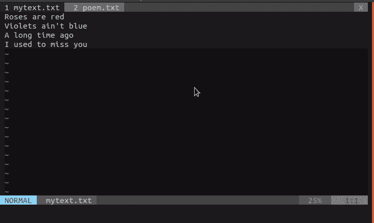

最后，我想演示的最后一个操作是 Vim 中的复制粘贴。

目视选择想要复制的部分，点击`**y**` 进行复制，然后点击`**p**`进行粘贴。

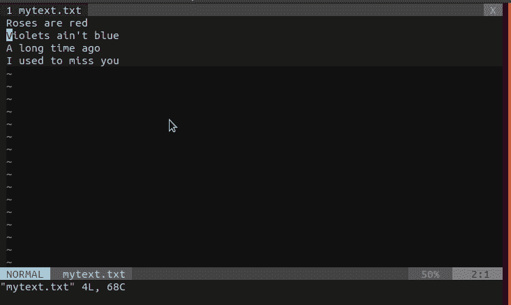

然后还有另外一种方法就是视觉块模式复制。命令是这样的:`**ctrl+v -> shift+v -> y -> p**` 。

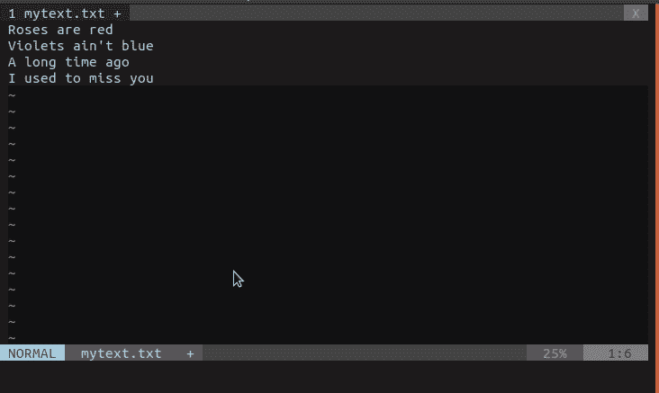

请注意这两种方法的区别。在第二种方法中，文本被选择为块。

到目前为止，我已经向你们展示了 Vim 的一些非常基本的命令和用例。它们有很多，你总能找到更方便的方法来进行各种操作。我的建议是遵循一些备忘单，其中至少列出了重要的命令，以便于学习。

首先，这里有一张[小抄](https://web.archive.org/web/20161221161539/http://bullium.com/support/vim.html#move)，你可以照着做。

最后，如果您已经阅读了这两篇文章，您应该会对 Vim 感到更加舒服。

请随时指出任何错误，并感谢阅读！