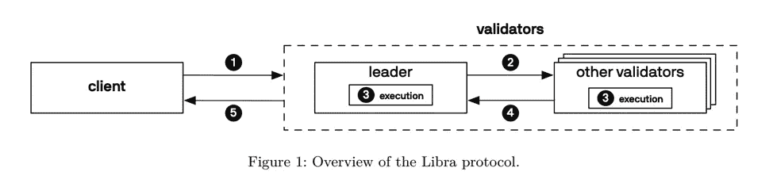
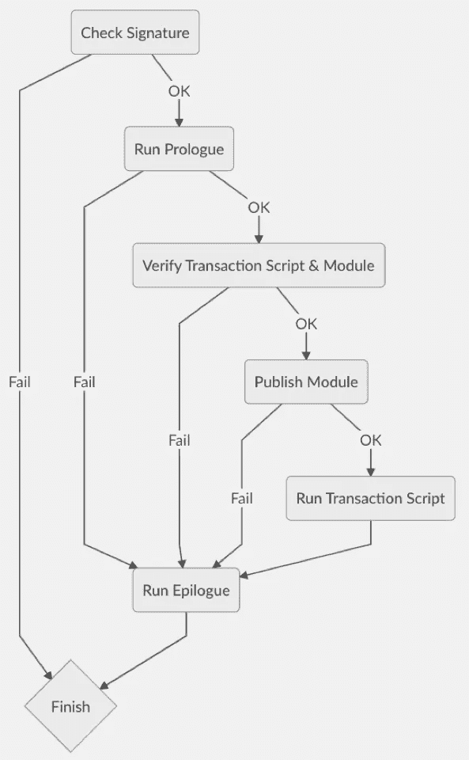
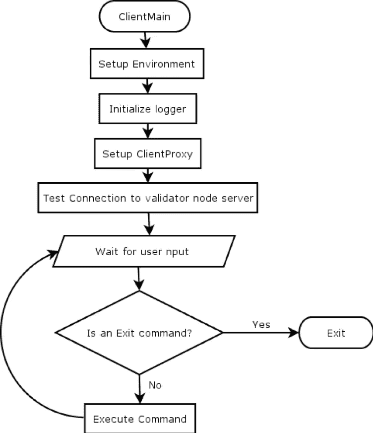
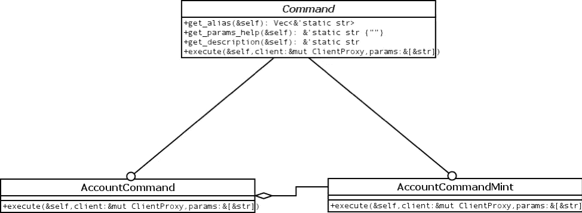
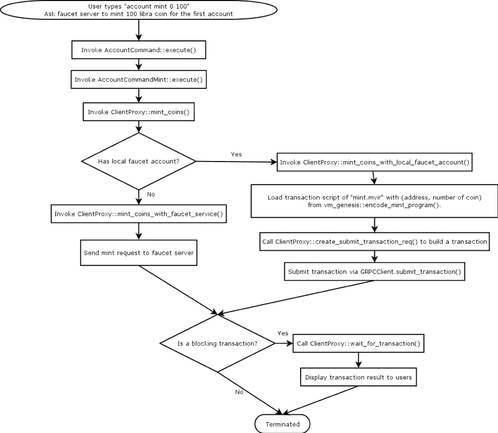
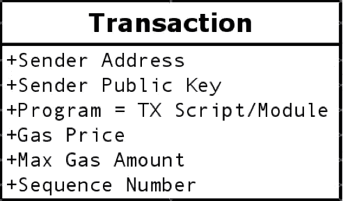

# 天秤座第一印象

> 原文：<https://medium.com/hackernoon/libra-first-impressions-ab98b831fefe>

***第二部:深潜与天秤座的交易***

这是关于 Libra 背后的技术的 3 篇文章系列的第二篇文章。第一篇文章是[对 Libra 及其智能合约编程语言 Move](https://hackernoon.com/libra-first-impressions-ed6b5f15ae63) 的概述。在这篇文章中，我们将深入研究技术堆栈，并使用源代码来展示用户与 Libra 交互时幕后发生的事情。以“获得 Libra 币”为例，让我们来看看 Libra 客户端和 Validator 水龙头如何处理和运行一个交易。

*本文由*[*Hydai*](https://www.linkedin.com/in/hydai/)*整理自* [*二邦*](https://www.secondstate.io/) *，一家由风投出资，以企业为核心，智能合约平台公司。在为领先的开源项目做出贡献的同时，我们仍然处于隐形模式。我们很快将推出我们的第一批产品。*

# 与天秤座互动

我们可以通过 Libra 技术白皮书中的下图来解释 Libra 客户端和验证器之间的关系。

Libra 有两类区块链参与者:客户(用户)和验证者(LibraBFT 共识节点)。普通用户需要通过客户端将事务和数据库查询提交给验证器。

## 从水龙头请求天秤座硬币

1.  启动 Libra 客户端，等待 Libra CLI 连接到 testnet。Libra CLI 显示`libra%`，现在可以接受用户命令了。
2.  当用户在 Libra CLI 中输入`account mint <MyAddr> <NumberOfCoins>`来铸造一些硬币时，Libra CLI 会将当前发送者`<MyAddr>`、铸造操作的交易脚本`libra/language/stdlib/transaction_scriptsmint.mvir`和请求的数量打包成一个交易(交易格式见下面的参考部分)。
3.  Libra 客户机在签名后将这个事务提交给验证器。
4.  当验证器接收到事务时，它将被放在 mempool 中，并与其他验证器共享。
5.  验证者的治理设计是 LibraBFT:每个验证者轮流充当领导者。领导者将他想要执行的事务从 mempool 中挑选出来，放到建议的块中，并将其广播给其他验证器。等到 2f+1 个验证者投票支持这个提议的块，领导者将制作一个法定人数证书并广播给所有的验证者。
6.  此时，该建议块中的事务将在版本化数据库上执行和提交。

# 验证器如何执行事务

Libra 专门为 Move 语言设计了一个 Move VM。当验证器执行一个事务时，它使用 Move VM！让我们看看怎么做。有 6 个步骤:检查签名、序言、验证、发布模块、运行事务脚本，最后是结语。

*检查签名:*检查交易签名是否与交易数据和发送方公钥匹配。在这个阶段，它只是验证交易细节。它尚未与版本化数据库和移动虚拟机进行交互。

*运行序言:*

按以下顺序有三种检查:

1.  检查交易中的发送方公钥是否与数据库中发送方帐户持有的身份验证密钥相同。
    `HASH(Sender Public Key) == SenderAddr.LibraAccount.T.AuthenticationKey`
2.  检查发送者是否有足够的天秤座硬币支付汽油费
    `TX.gasPrice * TX.maxGasAmount <=
    SenderAddr.LibraAccount.T.balance`
3.  检查交易的序列号是否与当前数据库中发送方帐户的序列号匹配。
    `TX.SequenceNumber ==
    SenderAddr.LibraAccount.T.SequenceNumber`

所有检查都是通过执行内置模块`0x0.LibraAccount`的程序`prologue()`进行的。

由于`prologue()`工作是系统要求的，Libra 不收取`0x0.LibraAccount.prologue()`过程的汽油费，即使`prologue()`是由 Move VM 执行的。

*验证交易脚本和模块:*安全性是设计 Move 的重中之重。为了确保安全性，VM 使用移动字节码验证器来检查事务脚本或部署的模块，以确保类型、引用和资源的安全性。

*发布模块:*如果有要部署的模块，则在此阶段将模块部署到发送方地址。

*运行事务脚本:*移动虚拟机绑定事务参数和对应于该事务脚本的自变量。然后运行脚本。
如果成功，将生成事件，并将结果写回全局状态。

如果失败(包括没气，执行错误等。)，对全局状态的修改将被还原。

*运行尾声:*无论成功还是失败，VM 都会对所有事务执行这一步。

Move VM 调用内置模块`0x0.LibraAccount`的过程`epilogue()`:

*   收取燃气费:`SenderAddr.LibraAccount.T.Balance -= TX.gasPrice * TX.gasUse`
*   调整顺序号:`SenderAddr.LibraAccount.T.SequenceNumber += 1`。

与`prologue()`类似，即使`LibraAccount.epilogue()`是通过 Move VM 运行的，发送方也不会因为`epilogue()`本身而被收取任何油费。

# 具体的例子

现在我们已经看到了验证器是如何处理事务的。让我们用一个完整的例子来演示如何在测试网上铸造或创造一些天秤座硬币。该过程从 Libra CLI(命令行界面)开始。

当我们启动 Libra CLI 时，它通过以下过程初始化客户端，并允许用户输入命令与 Libra testnet 交互。在本节中，让我们回顾一下 CLI 如何处理`account mint <address> <number of coin>`命令。

在用户看到 libra %的输入提示之前，Libra CLI 从配置文件中加载 genesis、水龙头账号、本地账号等信息，启动`ClientProxy`。在随后的操作中，用户的指令由`ClientProxy`包装，相应的事务被组合并发送到 Libra 的验证器。

## 图书馆命令

当用户想要为他们的第一个账户申请 100 个 libra 币时，他输入`account mint 0 100`，Libra CLI 将解析整个输入字符串并将其发送给`LibraCommand`以供执行。

字符串中的`account`关键字表示命令将调用`LibraCommandAccount::execute()`执行`mint 0 100`。当`LibraCommandAccount`识别命令中的关键字`mint`时，用`0 100`调用子命令`LibraCommandAccountMint::execute()`。

## 客户端代理

但是`AccountCommandMint::execute()`并不直接向 libra 验证器发送交易。相反，它通过 Libra CLI 最重要的元素:`ClientProxy`。我们来看看流程吧！

`AccountCommandMint::execute()`发送`0`(第一笔账)`100`(天秤币数)给`ClientProxy::mint_coins()`。

`ClientProxy`将首先确认本地机器上是否有水龙头账户。

如果本地机器没有水龙头帐户，`ClientProxy`调用`mint_coins_with_faucet_service()`方法并将`mint 0 100`包装成 url ( `https://<faucet server>?amount=100&account=0`)以将请求发送到远程水龙头服务器。

当有一个本地水龙头账户时，`ClientProxy`使用一个完全不同的路径来执行 mint 请求并调用`ClientProxy::mint_coins_with_local_faucet_account()`。此时，将创建一个 Libra 事务:

*   `vm_genesis::encode_mint_program()`方法在`language/stdlib/transaction_scripts`下加载用 Move 语言编写的`mint.mvir`事务脚本。
*   然后`ClientProxy`调用`ClientProxy::create_submit_transaction_req()`将交易脚本、发送者地址、汽油价格、最大汽油量等信息包含到 Libra 交易中。
*   最后，`ClientProxy`使用`GRPCClient::submit_transaction()`将交易发送给验证器。

如果用户要求在返回`account mint 0 100`之前完成交易，`ClientProxy`将调用`wait_for_transaction()`并显示“等待…”直到交易完成。

# 下一步是什么

在本文中，我们展示了 Libra 如何通过查看事务的源代码来处理事务。在本系列的下一篇文章中，我们将创建新的 Libra 模块来支持我们自己在 Libra 区块链上的硬币。敬请期待！

# 参考

## 交易格式

Libra 详细定义了交易应具有以下字段:

*   发送人地址:发送人的地址，将用于在分类帐中查询此地址的 Libra 帐户。
*   发送方公钥:发送方的公钥，将用于验证该交易是否由发送方签名；并检查该公钥是否与由地址中的`LibraAccount`保留的认证密钥相匹配。
*   程序:移动模块或事务脚本。
*   天然气价格:此事务处理的天然气价格。
*   最大气体量:此事务处理的气体限制。
*   序列号:这需要与当前地址中的`LibraAccount.T.SequenceNumber`匹配。这是用于检查攻击(如重放攻击)的验证字段。

## Libra 储物布局

每个地址都有一个模块部分和一个资源部分。

每个地址可以有多个模块。唯一的限制是地址中只能有一个同名的模块。比如下图中，`0x0`已经有了`Account`模块。当用户试图将另一个账户模块发布到`0x0`时，交易将失败并出现错误。

在 Libra 中，每个地址都有一个独立的名称空间。因此，如果一个模块部署在不同的地址，每个模块部署都有不同的名称。例如，在下图中，尽管`0x0`和`0x4`拥有相同的账户模块，但是`0x0.Account.T {…}`和`0x4.Account.T {…}`是完全不同的资源。

