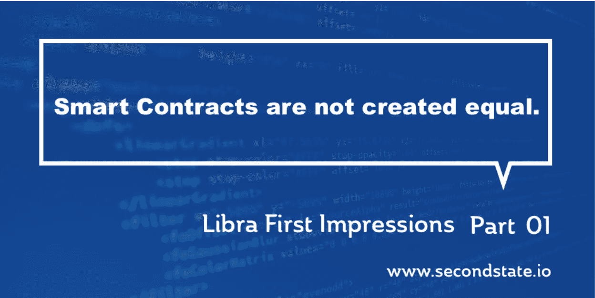

# 天秤座第一印象

> 原文：<https://medium.com/hackernoon/libra-first-impressions-ed6b5f15ae63>

*第 1 部分:智能合同并不平等*

今年最令人期待的科技故事之一是脸书的加密货币——T2 的 Libra 项目。2019 年 6 月 18 日，脸书发布了带有[项目源代码](https://github.com/libra/libra)第一次迭代和一份[技术白皮书](https://developers.libra.org/docs/the-libra-blockchain-paper.html)的 [Libra 白皮书](https://libra.org/en-US/white-paper/)。以非国有化的全球货币为目标( [Hayek 1976](https://en.wikipedia.org/wiki/The_Denationalization_of_Money) )，Libra 项目拥有雄心勃勃的加密经济设计、治理规则和令人印象深刻的合作伙伴联盟。

> Libra Blockchain 是一个去中心化、可编程的数据库，旨在支持一种低波动性的加密货币，这种货币将有能力成为全球数十亿人的高效交易媒介。—天秤座白皮书。

然而，作为技术专家，我们最感兴趣的是 Libra 对区块链技术本身的处理方式。为什么天秤座需要自己的区块链？应用开发者有哪些机会？它对企业和传统 IT 有何影响？在这个 3 篇文章的教程中，我们将首先回顾 Libra 的应用程序开发方法，然后深入探究 Libra 的一个核心应用程序，最后，通过一个教程来指导您如何创建自己的应用程序。

*本文章系列由* [*二态*](https://www.secondstate.io/) *出品，是一家由 VC 出资，专注于企业的智能合约平台公司。在为领先的开源项目做出贡献的同时，我们仍然处于隐形模式。我们很快将推出我们的第一批产品。*

# 智能合同优先方法

天秤座最显著的设计特点之一是它的**“智能合同优先”**方法。有人可能会说，即使在以太坊这样的智能合约平台上，智能合约执行也只是交易的一种类型。以太坊的“原生”操作仍然是硬币交易。天秤座就不一样了。聪明的合同是天秤座的一等公民。

Libra 区块链本身是用 Rust 编写的，但是 Libra 应用程序是用一种叫做 [Move](https://developers.libra.org/docs/move-paper) 的新编程语言编写的。所有与天秤座区块链的外部互动都由 Move 程序处理。在 Libra 上，甚至硬币的转移都是由 Move 程序处理的。每个 Libra 节点运行一个虚拟机，该虚拟机执行 Move 程序并在达成共识时记录结果。

我们相信这种**“智能合同优先”**的方法能够让 Libra 构建一个能够适应未来需求的通用基础设施。

# 为什么搬家？

那么，我们为什么需要一种新的编程语言呢？我们需要它来保证安全性和性能。Libra 正在构建区块链，因为目前市场上的区块链解决方案无法满足其性能和安全目标。

脸书和 Libra 希望建立一个专注于支付和资产数字化的区块链。因此，他们创造了一种编程语言，这种语言内置了对不可变和不可复制资产的支持。Move 是一种用于数字资产管理的 DSL(领域特定语言)。

> 比特币是一项非凡的加密成就，创造在数字世界中不可复制的东西的能力具有巨大的价值。——谷歌董事长埃里克·施密特。

Move 语言的名字来源于该语言本身支持的一个基本操作符。移动操作员负责移动资产。它消除了先从一个帐户中减去，然后再添加到另一个帐户中的两步操作。该语言旨在将资产和资源视为一流的构造。当然，Move 还有其他重要的特性，使得它对于资产管理来说是安全和健壮的。

*   Move 语言是静态类型的，由编译器工具检查错误和潜在问题。
*   移动源代码被编译成将由虚拟机执行的静态类型化 IR(中间表示)代码。还可以通过工具检查和验证 IR 代码的正确性。

*事实上，目前的 Libra 文档只有 Move IR 的例子。在撰写本文时，Move source 规范还没有发布。*

Move 语言和虚拟机是 Libra 项目的关键创新。但是，与传统的智能契约语言(如 Solidity 和 Vyper)以及区块链虚拟机(如以太坊虚拟机和 WebAssembly)相比，Move 必须做出哪些妥协？

# 图灵完全性权衡

大多数 DSL 系统针对特定任务进行了优化，因此不适用于一般计算。Libra 项目没有明确说明 Move 是否会是一个转动的完整系统。但通过优化金融交易，Move 系统可能不太适合加密货币游戏和赌博。

然而，这也意味着 Libra 软件不太适合大多数企业智能合同用例。

但是还有更多。在许多方面，Move 程序**根本不是**智能合约。

# 移动程序真的是智能合同吗？

Move 程序必须编译并内置到 Libra node 软件中，以便用户可以使用。为了让 Libra 区块链支持新的 Move 程序，它必须停止，并且所有验证器节点的⅔必须全部升级它们的软件以支持相同的 MOVE 程序。这实质上意味着，对于要添加到区块链平台的每个 Move 程序，都要进行服务停机的硬分叉。这不是明智的合同。那就是[链码](https://hyperledger-fabric.readthedocs.io/en/release-1.4/chaincode.html)。

智能合约的一个定义特征是能够通过协商在区块链上按需部署和执行新代码，而不会出现任何停机。这尤其适用于区块链的公共或企业。

*   公共区块链必须允许任何人在没有许可或服务中断的情况下部署和执行智能合约代码。
*   企业区块链通常利用智能合同来做出自动化的业务决策，例如在各方之间进行协调。员工和合作伙伴必须能够根据需要无中断地更改和部署合同。

作为一个专注于金融交易的许可区块链，Libra 最初采用的固定链码方法可以使系统更加安全和稳定，因为所有 Move 程序都将由 100 个验证者中的 67 个进行审查和批准。但是天秤座的既定目标是在 5 年内发展成为一个公开的区块链。我们相信，移动架构将会随之发展。

# 敬请期待

在本文中，我们重点介绍了 Move 编程语言及其支持的智能契约。当然，Libra 还有其他有趣的技术创新。这里有几个值得注意的。

*   与 Ethereum 不同，在 ether eum 中，每个节点维护一个全局状态数据库，并在每个块之后进行更新，Libra 具有版本化的状态数据库。Libra 状态数据库在每次交易后都会更新。“块”的概念在天秤座远没有“交易”重要。
*   Libra 区块链的初始性能目标是 1000 TPS(每秒事务数)。对于一家全球支付(或电子商务)初创公司来说，这当然足够了，因为 VISA 网络的平均速度约为 1700 TPS。不存在不切实际、不负责任的吹嘘“百万 TPS”。

在本系列的下一篇文章中，我们将深入探究 Libra 的一个捆绑 Move 程序，并向您展示它是如何工作的。敬请关注。