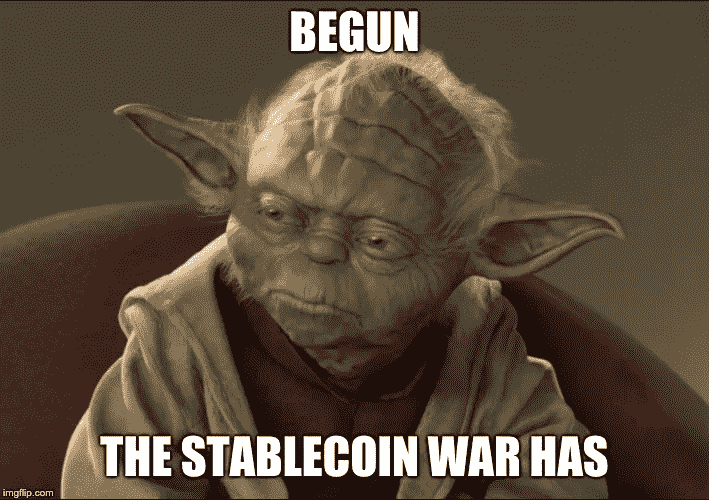

# 天秤座只是圆一。接下来是什么。

> 原文：<https://medium.com/hackernoon/libra-is-only-round-one-heres-what-comes-next-8ff05370f2b6>

# 随着 Libra 的宣布，加密货币进入了大联盟。

脸书进入加密货币市场意味着每一家公司现在都必须认真对待加密货币。世界各地的公司现在都在考虑他们的加密货币策略。

这不是 2015 年和 2017 年企业循环的重演。然后，公司开始玩“区块链”战略的主意。区块链是时下的流行语，公司纵容他们的创新部门制造玩具，这些玩具从未作为实际产品出现过。

> 这一次有天壤之别。脸书给“区块链不是比特币”的棺材钉上了最后一颗钉子。

脸书非常重视区块链。他们明白“技术”并不酷。酷的是技术可以用来创造前所未有的产品:数字现金、新货币和程序化货币。

每个企业都曾试图赚钱。现在，世界上最大的企业之一，已经决定省去中间步骤，直接进入赚钱部分。

“为什么”，密码专家一直在问，“他们需要一个区块链吗？”毕竟，天秤座是被允许的。他们本可以“只使用一个数据库”。

答案很简单。

如果没有区块链所提供的(尽管有限的)分权，即使是脸书也无法创造出这种产品。出于同样的原因，脸书需要区块链，任何加密货币都需要区块链。唯一被允许发行货币的核心角色是受监管的金融机构。在货币发行和使用的任何地方，都需要对它们进行监管。

这是数百个不同的管辖区，有数以千计的不同法规。区块链是以加密证明的形式创造货币和交易货币的协议。它们不受监管的原因与对等加密不受监管的原因相同:

它们太抽象了。

解决数学问题所带来的分权治理和价值的结合意味着，监管者甚至可以定义范围足够有限的法律，以使其有意义，范围足够广泛以使其有效。

他们曾多次试图规范密码术和加密，但总是失败。到目前为止，这是一个奇怪的事实，上流社会已经同意大部分忽略，有时带着嘲笑。从现在开始，认真的高管需要掌握一个商业事实。

他们会掌握它，脸书已经展示了剧本:

1.  尽可能多地分散权力，但不要更多
2.  提供一个稳定值的令牌，以便可以在商业中可靠地使用它
3.  利用您现有的生态系统来赢得用户

做了这些事情，一个从铸币税中获利的世界就展现在你面前。建立忠诚度，不仅仅是品牌和产品，而是购买这些产品的手段。

收集前所未闻的数据，并以前所未有的方式将购买行为归因于营销。对每笔交易或作为储备持有的资金的利息征税。如果你处理得当，甚至可能凭空创造出钱来。

大联盟吸引大玩家。银行、科技公司、大型零售商、电信公司现在别无选择，只能加入这场游戏。世界不会坐视不管，让脸书拥有这个新的、非凡的市场机会。一千匹马就要来了。

星巴克会让你用“星钱”买你的大杯咖啡。威瑞森和美国电话电报公司将发行像你口袋里的设备一样移动和智能的货币。如果你用现金付款，朱尔会给你打折。威尼斯城将会让游客为他们所承受的负担付出代价，除此之外，还有金币。

当然，这些产品中的许多将面临与 Pets.com 相同的命运。大多数产品都失败了。那又怎样？现在钱是一种产品，如果有一件事每个企业都想做，那就是赚钱。