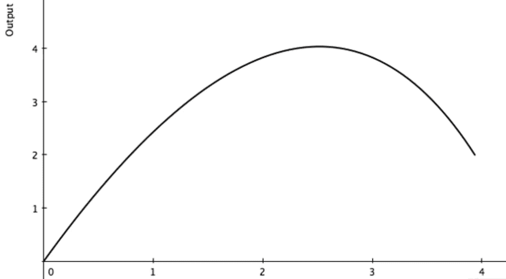

# 分散或消亡——艺术模仿算法

> 原文：<https://medium.com/hackernoon/life-imitates-art-imitates-the-algorithm-d495637a41>

## 关于分权和集权的未来的想法

## 集权的历史

互联网就像一个分成几个王国的国家。一开始是一大群部落和乌合之众，但有几方意识到这些象征性的村庄正在产生什么。这时他们有意或无意地控制了资源:数据。

纵观历史，越大越有组织的社区意识到他们可以通过获得新的领土来获得资源和权力。他们确实这么做了。历史是征服、十字军东征和战争的血腥织锦，无论这个世纪在资源方面的味道如何。土地，丝绸，盐，黄金，有足够的理由去掠夺。在过去的几十年里，同样的事情也发生在互联网上，只不过是发生在数字房地产上。流血事件并不多，因为这十年的资源就是数据。

## 互联网已经变成了寡头垄断，你向哪个国王低头取决于你登录后要执行的活动。

*搜索？谷歌勋爵*

*采购？亚马逊女王*

*信息？军阀百科*

*娱乐？YouTube 子爵*

*音乐？爵士 Spotify*

你明白了吗？

我并不是说上述公司完全控制了他们的行业(除了谷歌)，但在上述大多数类别中，只有少数几个关键人物控制着他们的整个数字业务子集。

> “通过 Gmail 发送的每封电子邮件的每一个字，以及在 Chrome 浏览器上的每一次点击都受到该公司的监控。施密特曾说，我们根本不需要你打字。我们知道你在哪里。我们知道你去过哪里。我们或多或少能知道你在想什么。"

似乎我们已经开始将进步与集权联系起来。好像要在技术、艺术等方面进化和进步，需要有集中的组织来促进。想想“一站式商店”这个词在营销语言和文案中有多流行——我们重视集中化带来的好处，我们被教导这样做。

## 谁在乎呢？

仔细想想，集权只是一个可怕的概念。问题是，没有人真正考虑过这个问题。没有人会想到它，因为我们免费得到了所有这些伟大而闪亮的东西。所有这些美妙的互联网服务让我们的生活更加简单，但代价是公开我们的在线身份。我们很少停下来想知道我们的一举一动都可以被预测的未来会是什么样子，我们很少停下来想知道极端集权的后果。

不管你是不是一个内容创作者，积极地尝试塑造一个数字角色，或者你只是随便地在网上冲浪，除了短期娱乐之外没有任何意图:你有一个在线个人资料。谷歌在你身上创造了一个，脸书有一个，推特，你能想到的都有。他们策划了你每次登录电脑打开浏览器的旅程。你消费的内容是由一种算法喂给你的，这种算法根据你过去的消费预测你想看什么。Youtube 希望你在他们的平台上花尽可能多的时间，最好的方法就是给你他们确信你会喜欢的视频。为了给你服务，他们为你创造了一个内容气泡。

算法背后的意图不是恶意的，它是为了给客户，你，提供更好的服务。然而，长期的结果有点可怕。

> 这个世界的人们只知道证实他们自己偏见的信息。那么教我孩子的人会在哪个内容泡沫中长大呢？

## 权力下放的真正含义是什么？

在我们继续深入之前，让我们花点时间来解释一下什么是真正的去中心化。有各种各样的定义，也有大量过度使用的图表试图解释这个术语，但没有一个真正抓住了这个概念的整体。

Vitalik Buterin 不久前发表了一篇文章，其中他谈到了去中心化的主题以及在互联网上流传的几个不正确的定义。这里有一个直接引用，他讨论了不同类型的分权可能。

> **架构(去)集中化** —一个系统由多少台**物理计算机**组成？在任何时候，它能容忍多少台这样的计算机发生故障？
> 
> **政治(去)集权** —有多少**个人或组织**最终控制着组成系统的计算机？
> 
> **逻辑(去)集中化** —系统呈现和维护的**接口和数据结构**看起来更像一个单一的整体对象，还是一个无定形的群体？一个简单的启发是:如果你把系统分成两半，包括提供商和用户，这两半会继续作为独立的单元完全运行吗？

你可以在下面找到原文，我强烈建议阅读！

 [## 分权的含义

### “去中心化”是密码经济学领域中使用频率最高的词之一，甚至经常被认为是一个“去中心化”的词

medium.com](/@VitalikButerin/the-meaning-of-decentralization-a0c92b76a274) 

他接着列举了几个例子来更好地解释这个概念:

> 传统的公司在政治上是集中的(一个 CEO)，在架构上是集中的(一个总部)，在逻辑上是集中的(不能把它们一分为二)
> 
> 语言在逻辑上是分散的；爱丽丝和鲍勃之间讲的英语和查理和大卫之间讲的英语根本不需要一致。一种语言的存在不需要集中的基础设施，英语语法的规则也不是由任何一个人创造或控制的(而世界语最初是由路德维希·扎门霍夫发明的，尽管现在它的功能更像是一种没有权威的渐进发展的活语言)
> 
> 区块链在政治上是分散的(没有人控制它们)，在架构上也是分散的(没有基础设施的中心故障点)，但在逻辑上却是集中的(有一个共同认可的状态，系统*的行为*就像一台单独的计算机)

虽然 Vitalik 关注的是权力下放的技术好处，但我倾向于考虑社会好处:尽管它们是携手并进的。更好的系统架构和组织将带来社会效益。

如果我们把这些相同的概念应用于社会，我们人类世界的现状，它对我们如何组织自己的经济和政府有着有趣的影响。同时也指出了我国现行中央集权制度的缺陷。

## 集权的收益递减

互联网很好地创造了这种个性化的感觉，就像每个使用互联网的人都在进行一次独特的旅行——而事实上，所有人之间最大的共同点是我们都认为自己是独一无二的。很抱歉扫了你的兴，我相信你很特别，但我保证有了正确的数据点，我可以创造一个(至少)500 万人的目标市场，他们会在特定的网站和平台上执行几乎完全相同的操作。同样的购买习惯，同样的阅读习惯，同样的游戏，甚至在你决定“结束”之前，你能在色情行业走多远。

都是为了简单。简单就是速度，如今人类都在追求速度。我对此的主要问题是，写这篇文章的原因是，这种人为的个性化和简单性将会像其他任何事情一样运作，随着**收益递减。**

The Law of Diminishing Returns

最终，我们将达到钟形曲线上的一个点，在这个点上，回报不再到达最终用户，而是完全由提供服务的人累积。那些我们已经使用了很多年的“免费”服务。没有意识到我们正在把我们吃的、住的、购物的、看的和手淫的数据直接提供给那些可以从这些信息中获利的公司。

在 PornHub 在你之前预测你的下一个怪异癖好之前，这都是有趣的游戏。

我希望我们不要触及那一点。对我来说，这意味着我们已经创造了如此多的相关内容泡沫，社会很容易融入其中，根本没有更多的个性。所有的内容都是通过特定的渠道传递给特定的受众，所有的质量都是由算法决定的，这些算法决定了大众能看到什么内容。

## 生活模仿艺术远远多于艺术模仿生活，因为艺术忙于迎合 Youtube 搜索算法。

这是一个可怕的想法。

如果生活模仿艺术，而艺术则不断试图在集中式内容分发渠道认为“合适”或“好”的内容内符合，那么我们当前的道路可能会导致一个世界，在这个世界中，生活已经变成了对搜索算法认为人类希望看到的东西的模仿——这是精神自慰。由不同的搜索算法决定的不断循环的自我实现的内容最有可能保持注意力。

## 那么，为什么要分权呢？

因为现在我们还没有到达光谱的极端。我们还有时间。我们这一代人的最大障碍不会是瘟疫或世界大战，它将不得不保持完整和人道，而权力完全转移到公司和中央集权实体，他们一旦意识到自己的无能和破产，就会受到绝大多数人的挑战。我们需要去中心化，以避免一小撮组织支配我们消费、生产或利用的一切。

我认为导致文化向去中心化转变的步骤(如果去中心化不是自然发生的话)应该是这样的:

*   微型社区成为理想的泡沫
*   大公司比政府获得更多的权力(君主制和共产主义国家除外，因为它们本质上是一个巨大的中央集权企业)
*   人造天堂发生:科技进步到一个地方，已经积累了足够的数据，有足够的基础设施让我们生活，请原谅我“我们最好的生活”。一切都将变得容易，一切都将被连接，一切都将被监控，一切都将被控制。

我想在某种程度上，我们会对集中化的结果感到满意。极端的集中化将允许无缝的互操作性，这将是非常酷的。只是极端的互操作性需要极端的去中心化或者极端的集中化——我们已经看到了在过去极端的合作中我们有多么幸运。

你个人是否认为人类需要开始向去中心化转变的问题归结于你的价值观。我发现自己很难真正确定自己的意识形态。我可以是一个伪君子，我宣扬隐私和安全，但却用面部识别解锁我的 iPhone。

也就是说，我重视自由思想、独立以及我们目前仅有的一点点个性意识。我珍惜我们正在创造的未来，珍惜我所拥有的希望，我并不羞于为此做出贡献。