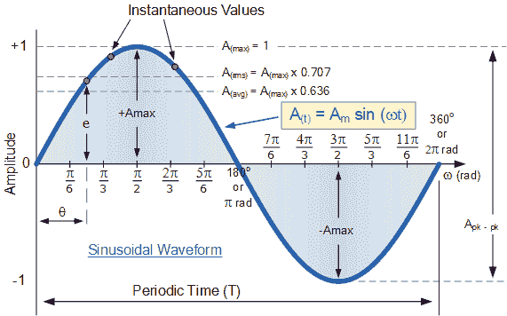
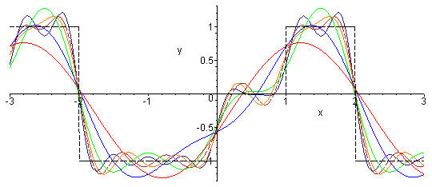

# 简单和长寿:正弦波教会我的人生课程

> 原文：<https://medium.com/hackernoon/life-lessons-from-electronics-sine-wave-7b8a16407d13>

我是一名电子和通信工程师。我通过完成电子学学位所学到的技术是很有争议的。但我从电子产品中学到了很多东西，这一事实是毋庸置疑的:)

今天我想分享正弦波教会我的东西。

[https://upload.wikimedia.org/wikipedia/commons/0/0c/Vale_sinusoidale.gif](https://upload.wikimedia.org/wikipedia/commons/0/0c/Vale_sinusoidale.gif)

# 1.保持简单。

正弦波是可以自然产生的最简单的波形。

它说让简单的事情变得简单。不要养成拿简单的东西做复杂的东西的习惯，我通常称之为理学硕士学位。

`Whatever is natural is simple and long lasting.`

# 2.发展长期观点

当δt 很小时，我们可以假定波是平滑的。如果我们看一下短范围，它似乎是单调增加(例如 0 到π/4a)或在其他范围单调减少。但是，当你考虑整个范围时，很明显，这个波既有正斜率也有负斜率。

它说，当我们在小范围内考虑时，它可能表现为一连串的好时光(或一连串的坏时光)，但当你考虑整个生活时，你会知道每个低谷之后都有一个波峰，每个波峰之后都有一个低谷。

所以当你向上走的时候要谦虚，当你向下走的时候要乐观。

# 3.继续

余弦波是正弦波的变体。它只是一个有相移的正弦波。它从峰值开始，而正弦波从零值开始。

有些人可能从高点开始，有些人可能从低点开始。但是我们每个人都会经历高潮和低谷。

# 4.将它分解

[http://www.peterstone.name/Maplepgs/images/Fourier_series.gif](http://www.peterstone.name/Maplepgs/images/Fourier_series.gif)

傅立叶波认为，任何复杂的波形都可以分解为不同频率和振幅的 **n** 个正弦波(随着 **n** 的增加，近似值变得更好),当它们叠加时，反过来产生复杂的波形。

每一个复杂而困难的任务都可以分解成许多简单而容易的任务。但是在现实生活中实际值不应该很高，它必须是最优的。在某种程度上，这在电子学中也是真实的。随着 n 的增加，近似值变得更加精确。但是在某个值之后，精确度的增加不值得额外的时间和努力。

# 5.你的海拔很重要

正弦波的平均输出为零。因此，仅仅通过增加振幅或频率，你无法增加总功率输出。增加平均输出功率的唯一方法是增加一个正失调。

因为你知道你必须经历高潮和低谷，所以让你的态度独立于它们。你的输出{或成功}取决于偏移量，这就是海拔高度。所以正向增加你的高度。

记住，你的态度决定了你的高度。所以，培养一种态度，你可以像处理低谷一样轻松地处理顶峰。