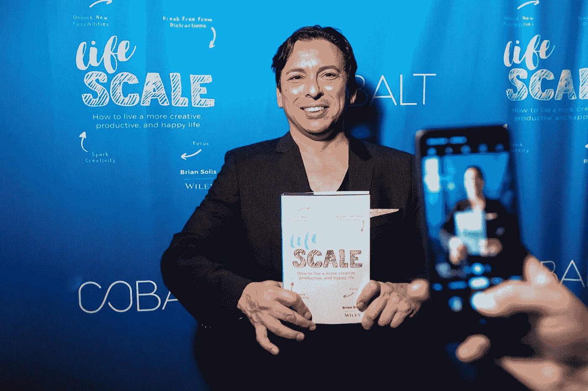

# Lifescale:我们沉迷于技术、被数字分散注意力的生活方式的解毒剂

> 原文：<https://medium.com/hackernoon/lifescale-the-antidote-to-our-tech-addicted-digitally-distracted-lifestyle-f7b5f8e73827>

如果你已经是布莱恩·索利斯的读者，准备好迎接一个令人惊讶的转变吧。如果你以前从未读过索利斯的书，那就从他的第八本也是最新的一本开始吧。上个月在奥斯丁的 SXSW 上发布的《Lifescale:如何过上更有创造力、更有效率、更幸福的生活 [，它承诺帮助我们从沉迷于技术的昏迷中醒来，重新发现有创造力、有能力的生活。](https://hackernoon.com/brian-soliss-new-book-premiered-at-sxsw-here-s-why-it-should-be-on-your-spring-reading-list-a375c697681a)

索利斯是先知数字研究小组 Altimeter 的首席分析师。他最近的七本书都在分析颠覆性技术对商业、市场和社会的影响。

现在，他把他的研究力量转向了一个不同的方向。 *Lifescale* 问当我们人类被“颠覆性技术”破坏时，我们的注意力持续时间和创造力发生了什么变化更重要的是，他冒险踏上了一段真实世界的旅程，它超越了数字排毒和极简主义，以及在我们这个科技饱和的世界里，我们可以做些什么来恢复生活质量……而不放弃科技。

## **透过科技奇才的幕后看“真的很可怕”**

索利斯向我们展示了科技应用背后的真实。他引用了科技高管、社交媒体工程师、设计师和其他注意力行业建筑师的证词，他称之为“非常可怕”。

硅谷科技文化的问题不一定是它像易受影响的小实验室老鼠一样操纵我们(事实的确如此)。问题是，当我们沉迷于技术时，我们并不是最好的。索利斯说:“没有人一定要让我们不开心。”“但他们确实希望我们沉迷于技术，而技术成瘾正在耗尽我们的幸福，以及我们的专注和生产力。”

索利斯提供个人解决方案，开头是一线希望。“这都是自愿的，”他提醒我们。“不一定非要这样。”

索利斯说:“在过去的十年里，我们的思想已经被篡改了，这对我们的生产力产生了明显的影响，更不用说我们带着动力和目标生活的能力了。”

有目的地生活是《生活量表》的中心主题。索利斯认为这是我们过上快乐、积极生活的关键之一。他说，带着目标生活的第一步是重新获得我们的注意力。

## **这些社交媒体通知比我们所知的更具“可怕的破坏性”**

索利斯将社交媒体通知描述为“对你的生产力造成可怕的损害”，这是一种“弄巧成拙的诱惑，旨在欺骗你，让你相信只有当人们对你做出反应或向你伸出援手时，你才是重要的。”他提醒我们，它们是有意“设计来从内部刺激中创造一个令人陶醉的反馈回路，让我们感觉良好，因为我们被注意到了，人们想要我们的注意。”但是这些刺激的调情带来了沉重的代价。

“研究表明，当你从主要任务转移到查看电子邮件、回复短信、查看社交媒体状态或其他事情时，你完成主要项目的总时间平均会增加 25%。”

这意味着让 Twitter 在另一个标签页中保持打开状态，将会在我的笔记本电池没电或者我工作的咖啡馆关门后保证我们继续工作。我将不得不把工作带回家，这将减少家庭时间，侵蚀我的幸福感，因为它会影响我明天早上的能量水平，影响我一天的剩余时间。等等，我有个推特通知。

嗯，那五分钟我再也回不来了。但更重要的是，它耗尽了我的动力。根据索利斯的研究，在这种分心之后，我的大脑需要 23 分 15 秒才能完全恢复写作。这就是为什么简单的点击鼠标来检查可以增加项目四分之一的时间。你可以计算一下，看看这些社交媒体的干扰对你的银行账户有什么影响。

索利斯的解决方案？致力于在时间段内工作，他称之为“冲刺”，在这段时间里，你可以在物理上和数字上建立一个“请勿打扰”的工作泡泡。关上门。关掉手机，带点零食。并关闭通知。

## **数据支持我们拥有创造性的快乐生活的能力**

索利斯不是自助大师，这是他的书最棒的地方之一。他从研究的角度来探讨健康和生活目标。这些数字很能说明问题，但最终还是令人鼓舞的。

因为所有这些科技成瘾都是自愿的。有了关于这些技术如何扰乱我们思维的良好信息，我们都可以就是否、何时以及在多大程度上接触技术做出更好的决定。然后我们都可以享受更有创造力、更有成效的生活。