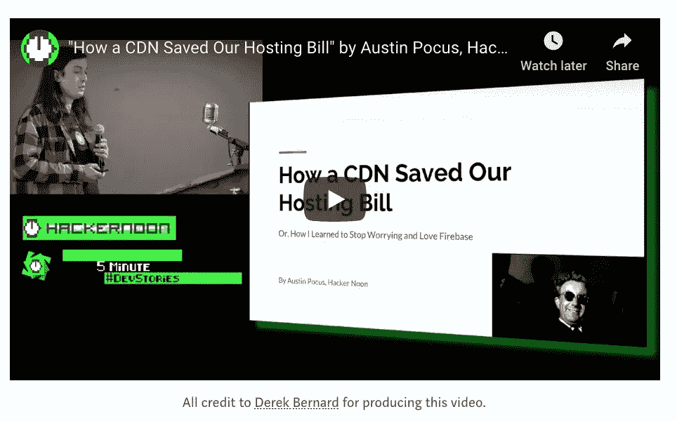

# 我在准备第一次 Dev 演讲时学到了什么

> 原文：<https://medium.com/hackernoon/lightning-talks-at-github-hq-how-a-cdn-saved-our-hosting-bill-b5cc1c6edaa5>

## # Github 总部的开发故事:

## CDN 如何节省我们的托管费用

All credit to [Derek Bernard](https://haberdasherband.com/production) for producing this video.

上个月，我做了我的第一次 dev 演讲！这是我 11 岁以来第一次在众人面前讲话，所以很自然地，我非常紧张。在这里，我想分享一些开发者第一次演讲的技巧，来自一个刚刚经历过的人:

1.  看着别人的眼睛！如果这太伤脑筋，试着看向观众的后面。你不必进行直接的眼神交流，但这会让你看起来像是在交流。与观众互动！
2.  把手拿开。没有人来这里看你站在那里双手插在口袋里。我在演讲的早期犯了这个错误，但是我的训练和练习起作用了，我记得用我的手来表达。表达自己！
3.  说到练习:熟能生巧！这是真的:当你开始时，你会忘记你要说什么，结巴，并撒上许多“嗯”和“啊”。实践将磨练你的谈话成为一台运转良好的机器，这是你真正站起来开始说话时需要的。练习直到它成为第二天性！
4.  自嘲一下。在我的演讲中，我本想说，“我的名字是奥斯汀·波库斯(就像‘霍库斯·波库斯’)……”但是我忘了。我并不是说你必须去寻找笑点——事实上，你不应该试图去寻找笑点，除非你绝对确定除了你的朋友和家人之外有人会为此发笑。我的观点是:不要太把自己当回事！
5.  如果你像我一样，人群让你焦虑:人群并不反对你。他们在活动中听到有趣的故事，而你是一个有趣的人——你是一名软件开发人员，这并不像硅谷的回音室看起来那样常见。你有有趣的事情要说，观众只想听听你的故事。给他们点话题！
6.  即使你轰炸，也不是世界末日。你明天醒来，这将是新的一天。别担心！

我仍然对我的演讲持高度批评态度，并且我已经在思考我可以做得更好的事情。上面的列表对我和读者都一样重要。在一天结束的时候，试着从中获得乐趣！你的举止和说话风格越自然，你就越能吸引观众。

万一我没开回家:**练**！当我走上舞台时，我紧张得几乎发抖，试图不让自己的声音听出来。但是在某一点上，我的练习时间开始了，我开始了我的演讲。当你在浴室的镜子前说了几十遍后，它就会自然而然地出现。试试看，告诉我没用。

在我做这个演讲之前，我想“我再也不会这么做了。”现在，我已经在计划我的下一次演讲，评估我的第一次演讲，找出我可以做得更好的地方。每个人都必须从某个地方开始，你的观众明白这一点。如果你愿意，可以说一个自嘲的笑话，说这是你的第一次演讲。最后，就像写代码一样，你变得更好的唯一方法就是去做。

[https://www.youtube.com/watch?v=UQgJXCBpRFw](https://www.youtube.com/watch?v=UQgJXCBpRFw)