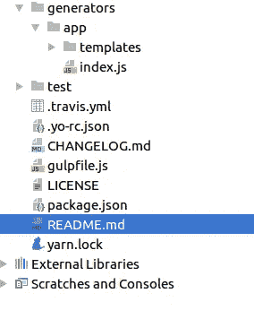
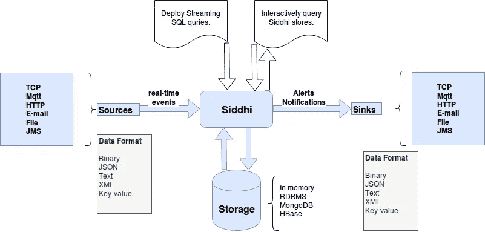

# Spring Boot + WSO2 神功的轻量级实时分析

> 原文：<https://medium.com/hackernoon/lightweight-real-time-analytics-with-spring-boot-wso2-siddhi-23f0cbf08e7b>


**A** 您是否正在寻找创建轻量级实时分析引擎的方法？本文解释了如何通过将快速、可嵌入的实时分析库(WSO2 Siddhi)与非常流行的微服务平台 Spring Boot 相结合来实现这一点。作为奖励，我会告诉你如何在 5 分钟内完成代码生成！。阅读完本文后，您可以生成一个完整的 Java spring boot 项目，它具有一个文档化的 REST API、友好的、响应性强的前端、基本的 spring 安全性、全面的测试覆盖和数据库集成，只需几个 shell 命令。生成的代码将是你实时微服务/应用的基础。

Jhipster 是一个方便的应用程序生成器，可以创建 Spring Boot 和角度应用程序。Jhipster 是开源社区中最好的低代码开发平台之一。Jhipster 在短时间内成为非常受欢迎的 GitHub。它在服务器端有一个带 spring boot 的高性能 Java 栈，前端有 angular、bootstrap 和 react。它通过强大的工作流、构建工具(如 Yeoman、Webpack 和 Maven/Gradle)使项目管理变得简单。许多开发人员个人使用它来生成多个 Spring micro 服务，这些服务被预先配置为在他们公司的基础设施中工作。但是这篇文章的目的并不是详细解释 Jhipster。本文将关注如何为 WSO2 Siddhi 创建一个 Jhipster 模块。如果您是 Jhipster 的新用户，或者想了解更多关于 Jhipster 的信息，请阅读 https://cbornet.github.io/ {}。

您可能有一些特定的实时分析(WSO2 Siddhi)设置，希望在 Jhipster 项目中使用。因为您不想在每个项目中重新发明自己的轮子，所以将所有样板文件抽象到您自己的生成器中是有意义的。在这种情况下，您可以为 WSO2 Siddhi 构建自己的 Jhipster 生成器，并将其用于您的每个 Jhipster 项目。

在 [Xiges.io](https://www.xiges.io/) ，我们严重依赖代码生成(使用定制的工具链)来消除大量样板代码，我们倾向于将这些代码编程到每个解决方案/项目/产品中。当我们遇到一个可重复的架构模式时，我们倾向于应用我们的工具链，这样下次我们就不必再编码了。包括工具链在内的大部分工作都是 Xiges 低代码平台的一部分。

**进行设置**

**本节介绍如何构建基本的 Jhipster 生成器模块。如果您已经知道如何创建 jhipster 模块，那么您可以跳过这一部分，进入下一节。**

Jhipster 模块是一个约曼发电机。此外，这是一个 NPM 包。作为生成一个基本的约曼生成器(最终将成为我们的 jhipster 生成器)的第一步，安装[**NodeJS**](https://nodejs.org/en/download/) 。之后你需要安装[](http://yeoman.io/)****纱**和 [**凉亭**](http://bower.io/) 以及用于创建发电机的发电机(yo)。请使用 npm 执行以下命令。**

****npm 安装-g 发电机-发电机****

**国家预防机制安装-约曼**

****npm 安装-g yo****

**要检查 Yeoman 是否安装正确，只需在命令行上输入 **yo** 命令，它会列出所有已安装的发电机。如果你能在那里找到约曼，你就可以走了。最后，确保你已经安装了 git。首先创建一个新目录，您将在其中编写 jhipster 生成器。这个目录必须命名为 **generator-jhipster- <你的模块名(Siddhi) >** 。通常情况下，约曼发电机以“**发电机-**为前缀，但 Jhipster 模块以**“发电机-Jhipster-**为前缀。按顺序执行以下命令将创建文件夹并生成 jhipster 模块模板。**

```
 npm install -g generator-jhipster-module
 mkdir generator-jhipster-siddhi
 cd generator-jhipster-siddhi
 yo jhipster-module
```

**这不是一个真正的 JHipster 模块，这意味着不能在 JHipster 应用程序中使用。该模块用于生成一个新模板，为 Siddhi 编写一个新的 JHipster 模块。JHipster 模块创建 JHipster 模块。回答问题以生成模块，这样我们就可以实施更改。**

****文件结构****

****

**如您所见，我们为生成器本身准备了 readme 文件和 package.json。测试文件夹包含生成器的测试。index.js 文件是生成器的入口点。它包含样板文件的模板文件(用于生成实际的搭建)。我们创建了默认生成器。现在我们可以修改它，并添加我们的自定义功能。**

****编写 WSO2 神功发生器的脚本****

**现在，我们将检查如何定制我们创建的 jhipster 生成器，并通过以下步骤在生成器中添加我们自己的特性:**

1.  ****设置并导入生成器-jhipster****

**index.js 文件需要导出 generator-jhipster，它将由 Yeoman 运行。现在，我将清除生成器中的所有内容，从头开始。这是 index.js 文件之后的样子。**

```
const chalk = require(‘chalk’);
const generator = require(‘yeoman-generator’);
const packagejs = require(‘../../package.json’);// Stores JHipster variables
const jhipsterVar = { moduleName: ‘siddhi’ };// Stores JHipster functions
const jhipsterFunc = {};module.exports = generator.extend({// all your yeoman code here});
```

**我们将扩展的生成器分配给*模块，导出*使其对生态系统可用。这是我们在 Node.js 中导出模块时使用的典型方法。在我们添加到 index.js 的每一个方法中，一旦生成器被调用，js 就会运行，通常是按顺序运行。一些方法名在这个生成器中有优先权。可用优先级(按运行顺序)依次为:**

1.  **初始化-初始化你的方法。(获取配置并检查项目当前状态)**
2.  **提示—提示选项的用户首选项(调用 this.prompt())。**
3.  **配置—保存配置并配置项目。**
4.  **默认-如果您的方法名与优先级不匹配，则放入该组。**
5.  **写入—将模板文件复制到输出文件夹并解析(路线、控制器等)。**
6.  **冲突—处理冲突。**
7.  **install——安装运行的地方，特别是将 maven 依赖项添加到目标 Jhipster 项目 pom 文件中。(npm，鲍尔)**
8.  **结束—称为最后一次，清理。**

**实现这些方法后，您的文件应该是这样的。**

**Jhipster 模块使用了**可组合性**，这是 Yeoman 中的主要功能之一。yeoman generators 中的“compose with”(this . compose with())方法允许该生成器与另一个生成器并行运行，并且它可以使用另一个生成器的功能，而不必独自完成所有工作。在上面的例子中，它由“jhipster:modules”子生成器组成，并获得对 jhipster 的变量和函数的访问。**

**正如您在代码中看到的，我们添加了 Jhipster 函数(在 install()阶段下)来将 Maven 依赖项添加到 pom.xml 文件中(addMavenDependency)。还使用了 Jhipster 全局变量。这些是每个变量的简短定义。**

```
 baseName: the name of the application

packageName: the Java package nameangularAppName: the AngularJS application name

javaDir: the directory for the Java application, including the            package folder

resourceDir: the directory containing the Java resources (always src/main/resources)

webappDir: the directory containing the Web application (always src/main/webapp)
```

**您可以看到 java spring boot 类和资源文件，添加到**编写**()阶段，这是通过调用模板函数完成的(所有 java spring boot 类将在下一节中描述)。如果您对 Jhipster 模块中的其他功能感兴趣，请访问—[https://cbornet.github.io/modules/creating_a_module.html.](https://cbornet.github.io/modules/creating_a_module.html.)**

****2。初始化发电机****

**我们用 package.json 初始化生成器。在上面的代码中，节点调用 require()函数，将本地文件路径作为函数的唯一参数，并获取 package.json 文件。该文件是 Node.js 模块清单。我们的 package.json 文件必须包含以下内容。**

**我配置了以下内容:**

*   **yo:运行约曼发电机的 CLI 工具。**
*   **生成器-mocha:mocha 测试框架的生成器。**
*   **gulp:一个前端构建工具。**
*   **mocha: mocha 是 Node.js 程序的 JavaScript 测试框架。**

****3。创建吞咽文件****

**我们使用 gulp 文件作为我们的构建系统。像 Gulp 这样的工具通常被称为“构建工具”，因为它们是运行构建 web 应用程序的任务的工具。您的 gulp 文件必须是这样的。**

**它通常用于执行前端任务，例如:**

*   **启动 web 服务器**
*   **每当保存文件时自动重新加载浏览器**
*   **使用像 Sass 或更少的预处理器**
*   **优化 CSS、JavaScript 和图像等资产**

**所以现在我们已经完成了 WSO2 神功 jhipster 生成器的创建基础。但是现在我们必须用实时分析(WSO2 神功)配置 Spring boot。**

****春季启动+实时分析****

**Spring boot 是一个非常流行的基于 java 的框架，用于构建基于 web 和企业的应用程序。Spring framework 提供了各种各样的特性来满足现代商业需求。Spring boot 使得创建独立的、生产级的基于 Spring 的应用程序变得容易，这些应用程序可以“直接运行”。Spring boot 对 Spring 平台和第三方库的结合持有自己的观点，因此开发人员可以毫不费力地开始。大多数 spring boot 应用程序都需要一点 spring 配置。正因为如此，spring boot 已经成为低代码开发平台。所以很容易将 WSO2 神功嵌入到 spring boot 中。让我们看看它是怎么做的。**

**在我们进一步深入之前，我们必须了解有关 WSO2 神功实时分析的主要概念。WSO2 Siddhi 是一个 java 库，它对复杂事件进行实时处理。Siddhi 的流 SQL 语言被用来描述来自数据流的复杂条件。Siddhi 能够执行流和复杂事件处理。下图显示了 WSO2 神功 3.0 的基本工作流程。**

****

**Basic workflow of the WSO2 Siddhi 3.0**

**现在，我们正在 Java Spring boot 项目中嵌入 Siddhi，它允许您使用 Siddhi 查询语言来执行复杂事件的实时处理，而无需运行 WSO2 CEP 服务器。**

****实现业务服务，增加神功应用后休息服务****

**第一步，我们需要定义一个流定义和 Siddhi 查询。流定义总是定义传入事件的格式，查询定义如下。**

```
String definition = "define stream TempStream(roomNo int, temperature double, deviceId long);"String query = "@info(name = 'avgTemperature') " +"from TempStream#window.time(60 sec)  " +"select avg(temperature) as temperature,deviceID " +"group by roomNo " +
"insert into AvgTempStream ;";
```

****步骤 02:创建神功运行时****

**这一步包括通过组合流定义和您在第一步中创建的 siddhiAppRuntime 的运行时表示。**

```
SiddhiManager siddhiManager = new SiddhiManager();
//Generating runtime
SiddhiAppRuntime siddhiAppRuntime = siddhiManager              .createSiddhiAppRuntime(definition+query);
```

**神功管理器解析神功 app，为你提供神功 App 运行时间。这个 Siddhi 应用程序运行时用于向 Siddhi 应用程序运行时添加回调和输入处理程序。**

****步骤 03:注册回拨****

**神功有两种类型的回调。**

*   **流回调—订阅事件流**
*   **查询回调-这是对查询的订阅**

**我们需要一个回调来从查询中检索输出事件。所以我们可以注册一个对 Siddhi 应用程序运行时的回调。当结果生成时，它们被发送到这个回调的 receive 方法。此外，我们可以从事件打印机打印传入的事件，该打印机被添加到回调函数中。**

**例如:**

```
siddhiAppRuntime.addCallback("AvgTempStream", new QueryCallback() {
            @Override
            public void receive(Event[] events) {
                EventPrinter.print(*events*);
            }
        });
```

****步骤 04:发送事件****

**作为最后一步，您需要将事件流中的事件发送到查询，您需要获得一个输入处理程序，如下例所示。**

```
//Retrieving input handler to push events into Siddhi InputHandler inputHandler =siddhiAppRuntime .getInputHandler("StockEventStream"); //Starting event processing siddhiAppRuntime.start(); //Sending events to Siddhi inputHandler.send(new Object[]{2, 23.0, 100L});
```

**关于业务服务的准确实现和为 Siddhi 应用程序添加 POST Rest 服务，请参考本文底部的这些文件。**

****结论****

**用 WSO2 Siddhi 创建 JHipster 模块是简化微服务生成的一种简单方法，尤其是当您的微服务使用相同的配置时。因为它是一个模块，所以很容易添加功能并满足您的需求。我们的公司[**Xiges Solutions**](https://www.xiges.io/)**使用这种实时分析对我们的 IOT 产品进行实时预测和跟踪。****

****这里是 GitHub 知识库，包含了这篇博客中使用的模块。请随意使用它，并根据您公司的要求进行更改！****

****现在您可以使用这个命令下载 jhipster 生成器****

```
**npm install g generator-jhipster-siddhi**
```

****然后在 jhipster 生成的应用程序上运行该模块。****

```
**yo jhipster-siddhi**
```

****很快，该模块将在 jhipster 市场上推出。(JHipster 团队验证后)****

****链接为源代码-[https://github.com/xiges/generator-jhipster-siddhi.](https://github.com/xiges/generator-jhipster-siddhi.)****

****国家预防机制登记册的链接-[https://www.npmjs.com/package/generator-jhipster-siddhi.](https://www.npmjs.com/package/generator-jhipster-siddhi.)****

****如果您有任何建议或想在模块中看到的增强，请在 Xiges git hub 仓库中创建一个问题—[https://github.com/xiges/generator-jhipster-siddhi/issues](https://github.com/xiges/generator-jhipster-siddhi/issues)****

****这个题目我就说这么多。感谢阅读。下次见！****

******参考文献******

*   ****[https://yeoman.io/authoring/composability.html](https://yeoman.io/authoring/composability.html)****
*   ****[https://www.jhipster.tech/modules/creating-a-module](https://www.jhipster.tech/modules/creating-a-module)****
*   ****[https://www.baeldung.com/jhipster](https://www.baeldung.com/jhipster)****
*   ****[https://yeoman.io/authoring/file-system.html](https://yeoman.io/authoring/file-system.html)****
*   ****[https://gulpjs . com/docs/en/getting-started/JavaScript-and-gulpfiles](https://gulpjs.com/docs/en/getting-started/javascript-and-gulpfiles)****
*   ****[https://siddhi-io . github . io/siddhi/# try-siddhi-with-wso2-stream-processor](https://siddhi-io.github.io/siddhi/#try-siddhi-with-wso2-stream-processor)****
*   ****[https://docs.wso2.com/display/CEP400/SiddhiQL+Guide+3.0](https://docs.wso2.com/display/CEP400/SiddhiQL+Guide+3.0)****