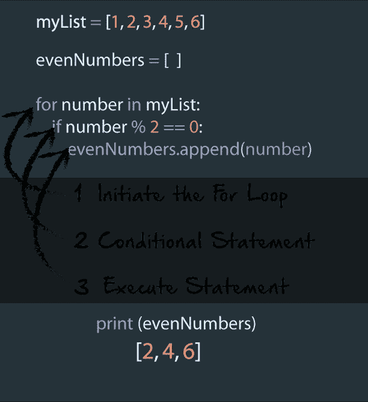
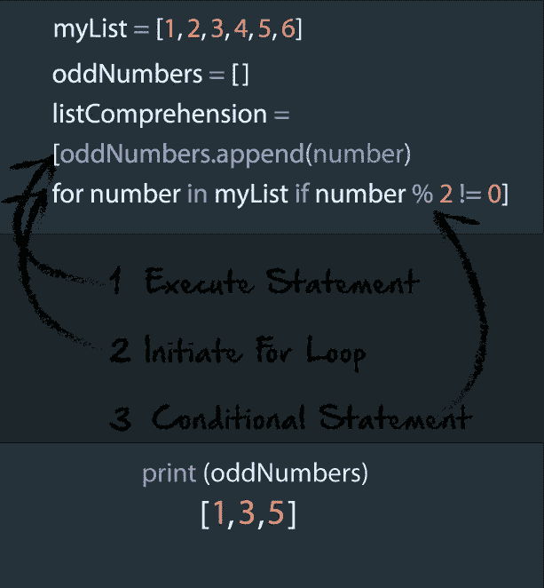
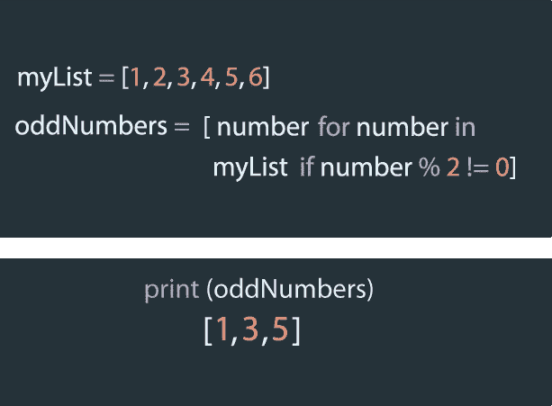
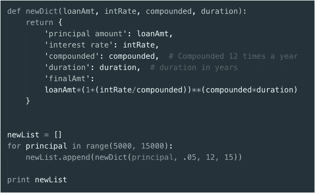
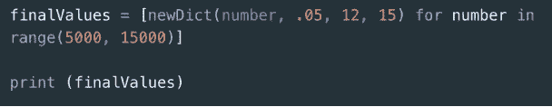
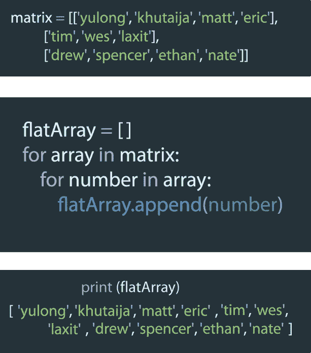
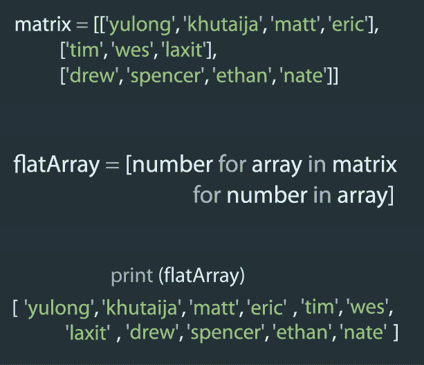

# Python 中的列表理解

> 原文：<https://medium.com/hackernoon/list-comprehension-in-python-c762ba1f523f>


List Comprehension in Python

对于任何语言的开发人员来说，列表都是一个基本的构件。Python 也不例外。然而，起初，列表理解有时似乎令人困惑。由于它不是所有语言都提供的功能，它也可能是一个完全陌生的概念。一些包含列表理解的流行语言有 JavaScript、Perl 6、C#当然还有 Python。今天，我们将看看 Python 中的列表理解是如何工作的。在本帖中，我们将介绍以下概念:

1.  **什么是列表理解？**
2.  **列表理解有什么好处？**
3.  **列表理解可以用在哪些方面？**
4.  **列表理解有哪些常见的例子？**
5.  与其他方法相比，什么时候应该使用列表理解法？

# 什么是列表理解？

在最基本的层面上，列表理解是一种从现有列表创建列表的语法结构。这个定义描述了我们将在后面讨论的一些用途。如果我们不需要创建一个新的列表，而只是简单地打印现有列表的结果，那么列表理解对我们来说就没有什么帮助了。在 Python 中，有许多方法可以创建列表。

**如果我们想创建一个空列表，我们可以这样声明:**

```
listA = []
```

**或者，如果我们想创建一个包含值的列表，我们可以这样做:**

```
listB = [1,2,3,4]
```

**如果我们想创建一个包含 10 个条目的列表，每个条目都有相同的值，我们也可以这样做:**

```
listB = [1]*10
# which would give us the following output:>>listB
>>1,1,1,1,1,1,1,1,1,1
```

创建列表的另一种方法是遍历现有列表，将第一个列表中的数据追加或插入到第二个列表中。

**这可能如下所示:**

```
listA = []
listB = [1,2,3,4,5,6]
for number in listB:
    if number % 2 == 0:
        listA.append(number)
```

这里，我们在 listB 上循环，如果列表中的当前值是偶数，我们将它追加到 listA。在这种情况下，我们可能会用到列表理解。让我们首先考虑如上所示的标准循环的语法，并将其与相同概念的语法进行比较，但使用的是列表理解。

**for 循环的语法:**

```
**for** item **in** list:
    **if** conditional:
        expression
```

**相当于这个列表的理解:**

```
[ expression **for** item **in** list **if** conditional ]
```

表达式是“输出”的一种花哨说法。所以在每种情况下，输出都是执行一些代码的结果。在我们之前的例子中，输出是向一个新的列表追加内容。

同样，在传统的 for 循环和 list comprehension 中，我们有要迭代的列表、列表中的 iterable 项和一个条件语句。

**让我们仔细看看 for 循环的语法:**



在 Python for 循环中，我们会开始循环，如果需要的话，使用一个条件语句，然后执行一段代码。在上面的例子中，我们可以看到这是如何工作的，以及预期的输出。

**下面是我们如何用列表理解重写这段代码:**



在这里，我们可以看到，我们在 for 循环中使用的所有相同的构件仍然存在于 list comprehension 中，尽管顺序略有不同。

# 列表理解的优势

这就把我们带到了下一个话题，列表理解的优势。上面的例子虽然没有 for 循环那么麻烦，但仍然可以合并成更简洁的格式。列表理解的一个很大的优点是，它们允许开发人员编写更少的代码，这些代码通常更容易理解。

**下面是我们如何进一步简化上面的例子:**



在这里，我们将原来的三行代码简化为一行易于阅读的代码。

**其他优势:**

列表理解通常更快，但前提是它实际上被用来创建一个新列表。如果你注意到，在第一个例子中，我们在 for 循环中包含了 append 方法，但是当我们完全合并我们的代码时，我们把 append 方法完全排除在列表理解之外。这是因为在 Python 中，我们不需要从列表中加载 append 属性并作为函数调用它。相反，在理解中，生成一个专门的 LIST_APPEND 字节码，用于快速追加到结果列表中。

在第一个例子中，append()方法必须在循环的每次迭代中调用。这意味着，如果我们的循环有一百万次迭代，append()方法将被调用一百万次，这使得它明显比列表理解慢。

# 列表理解怎么用？

上面的例子可以称为过滤函数。我们正在获取一个现有列表，并过滤该列表以创建一个新列表。在这种情况下，它是从一个序列中获取奇数或偶数，但同样可以在其他过滤场景中完成，如生成斐波那契数列。

这里有一些我们可能使用列表理解的其他方法的例子

1.  筛选现有列表。
2.  生成数据列表
3.  展平多维列表

我们已经看到了如何使用列表理解将一个列表的结果过滤到一个新列表中的例子。现在让我们看看如何使用它来生成数据列表。

在之前的一篇文章中，我们研究了如何使用 python 来确定贷款的复利。

下面，我们将生成一个字典列表，每个字典包含一笔具有不同本金值和最终值的贷款。每个字典中的最终值将由我们给它的初始值决定，基于确定复利的公式。这个公式和字典生成将存储在它自己的函数中，但是在循环中，我们将基于循环中的一系列数字来调用函数。

**我们先来看看 for 循环:**



每当 for 循环遍历我们设置的范围内的一个数字时，它就会调用 newDict 函数，并将该函数的结果附加到我们的 newList 中。如果我们打印结果，我们应该看到一个字典列表，每个字典都包含一组独特的数据。

如果我们使用 list comprehension 重写，我们可以再次避免使用 append 方法，在如此大的数据集上节省宝贵的资源。

**下面是它的样子:**



最后，让我们看看如何使用列表理解来展平 Python 中的多维列表。

**如果我们用 for 循环来做这件事，它可能需要一个嵌套循环，类似于下面的:**



我们可以在这里看到，如果我们有一个名字列表的列表，并需要将它们快速展平为一个列表，这可能会很方便。

**使用列表理解重写这段代码，如下所示:**



# 什么时候应该使用列表理解？

我们之前谈到了理解列表的优势之一。这个优点是我们不需要使用 append()方法来创建一个新的列表。列表理解对于创建新列表非常有用，原因有很多:

1.  代码更加简洁
2.  代码通常可读性更好
3.  在大多数情况下，代码会运行得更快

然而，这可能并不总是需要的。在某些情况下，我们可能只需要在迭代时打印列表的结果。在这种情况下，列表理解并没有提供明显的优势。事实上，我们最终会创建一个不需要的列表，使用不必要的内存。当决定列表理解是否是比循环更好的选择时，我们可以简单地问自己，“我在创建一个新的列表吗？”

如果答案是肯定的，那么列表理解可能是最好的方法。如果不是，比一个好的老式 for 循环可能更好。

感谢您的阅读，如果您有任何反馈，我很乐意听到。谢谢！