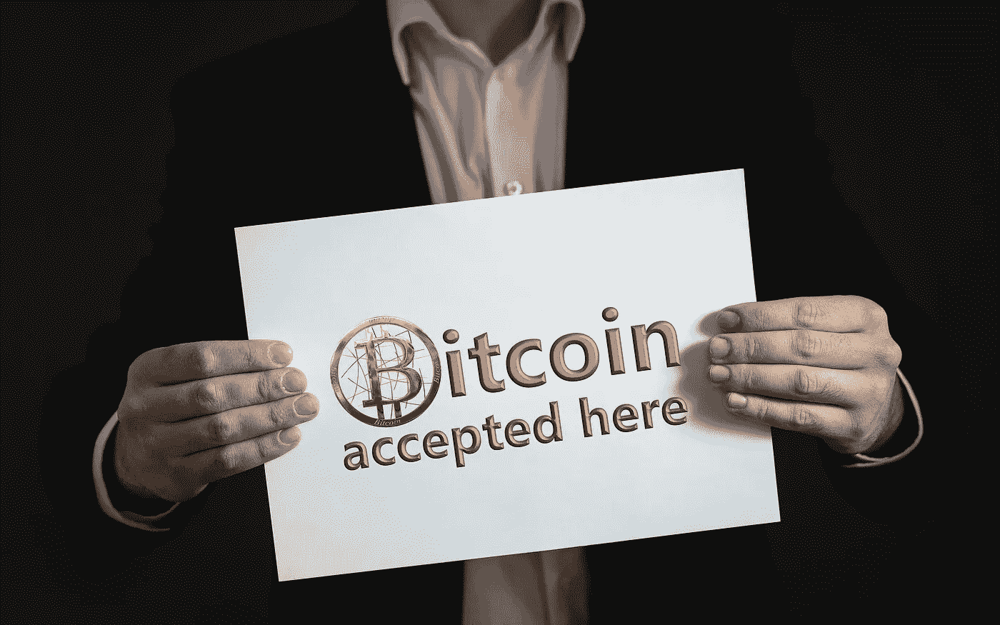

# 放弃支持比特币和加密货币的主流公司名单

> 原文：<https://medium.com/hackernoon/list-of-top-mainstream-companies-that-dropped-support-for-bitcoin-cryptocurrencies-a194a653626e>

Image Credit: Pixabay

就在所有人都认为这只是这个世界的书呆子程序员的又一次分心，不被认真对待时，一个比特币的价格从每比特币大约 0.008 美元升值到每比特币 0.08 美元[在 2010 年](https://en.m.wikipedia.org/wiki/History_of_bitcoin)的两个月内升值超过 900%，此前发生了用 1 万个比特币购买一个披萨的臭名昭著事件。然后嘣！每个人的注意力都转向了数字资产，至少华尔街那些喜欢交易收益的人对此感兴趣。随着其通常的迅速崛起，比特币的价格创下历史新高，并像一个 fugazi 一样，以可怕的速度挥霍掉，抨击专家提出的最博学的技术分析，常常让他们绝望地震惊。

每当行业巨头支持比特币或其他数字资产时，加密爱好者和普通加密货币社区都会庆祝通常的狂欢，当数字资产被拔掉插头时，失望情绪通常是显而易见的。在这篇文章中，让我们来看看一些在最初给予他们的祝福后拒绝比特币和其他数字资产的大人物。

## **五个**

今年 1 月，总部位于以色列的自由职业巨头 Fiverr 的许多用户都受到了令人震惊的消息的打击，Fiverr 突然停止了对最重要的数字资产比特币的支持。Fiverr 团队发出的[确切邮件内容如下](https://www.reddit.com/r/Bitcoin/comments/5phkbe/fiverr_has_officially_stopped_using_bitcoin_as_a/)

> *“我们注意到你之前在 Fiverr 上使用比特币购买服务。自 2017 年 1 月 19 日起，Fiverr 将不再接受比特币作为支付形式。但是，您仍然可以使用借记卡或信用卡、PayPal 或 Fiverr 信用卡进行购物。感谢大家的理解，Fiverr 团队"*

虽然这对于更喜欢比特币支付选项的用户来说是一个粗暴的打击，但 Fiverr 并没有明确说明他们做出这一决定的原因，从而为猜测提供了空间。许多人引用以色列最近颁布的法律对比特币和其他数字资产征税，因为它们被归类为财产而不是货币。其他一些用户似乎并不太在乎，因为他们认为这对比特币来说是最好的，因为它对数字资产造成了巨大的出售压力，因为 Fiverr 从未向选择用比特币支付的卖家付款。Fiverr 不断行使其作为中间人的全部权力，在向卖家(自由职业者)赊账之前转换为 fiat。

无论自由职业者和公众对这一事件的看法如何，你都会同意我的观点，对于一个产生巨大收入并拥有超过 300 万自由职业者的平台来说，据报道，在其存在的短短 8 年内增长了 600%以上，同时跻身全球 450 强网站，无疑引发了一些地震。

## **Expedia**

受欢迎的旅游巨头 Expedia 是另一个知名品牌，[放弃了对比特币的支持，早在 2014 年，比特币就已经成为最重要的数字货币。Expedia.com 是 Expedia 集团旗下的旅游预订网站。该网站可用于预订机票、酒店预订、汽车租赁、游轮和度假套餐。2018 年，它悄悄停止接受用户的比特币支付，理由是交易确认缓慢、交易便利化困难、交易费用高和重复收费，其中使用比特币支付的用户仍然必须使用他们的卡进行支付是主要原因。对于 Expedia 这样的公司来说，2018 年总预订量约为](https://uk.finance.yahoo.com/amphtml/news/expedia-stops-accepting-bitcoin-driving-230729890.html)[997 亿美元](https://www.statista.com/statistics/269386/gross-bookings-of-expedia/)，比特币的曝光和采用，或许还有其他数字资产，如 Ripple coin、以太坊、Stellar Lumen 等。，对数字资产来说无疑是一个巨大的损失。

## **Reddit**

Reddit 是另一个著名的平台，它停止接受比特币订阅其平台的黄金会员功能。Reddit [称](https://www.coindesk.com/reddit-drops-bitcoin-payment-option-for-gold-membership)用户难以获得比特币支付选项，以及比特币基地决定停止其商业工具产品，转而支持比特币基地的比特币基地商务政策，这是其从平台上移除加密支付选项的原因。虽然这可能看起来不太重要，但 Reddit 作为一个平台[每月的访问量高达 180 亿次](https://expandedramblings.com/index.php/reddit-stats/)，有 3.3 亿注册 Reddit，超过 15 万个社区被称为 subreddits。

## **微软**

媒体[报道](https://news.bitcoin.com/microsoft-has-stopped-accepting-bitcoin-deposits/)称，从 2017 年 12 月 26 日起，这家科技巨头将不再允许其“客户”在其平台上兑换比特币，这对已经存在的炒作造成了巨大打击。虽然它没有明确说明其决定的原因，但阅读其员工在不同论坛上的评论，人们可以了解到这样做不是因为任何监管要求或任何类似的原因，而是推断运营困难是这一发展的主要原因。

## **蒸汽**

一家主要的在线游戏流媒体公司[宣布](https://steamcommunity.com/games/593110/announcements/detail/1464096684955433613)由于波动性和高交易费用的极端情况，它不再支持比特币。这使得客户很难在其平台上购买游戏，因为客户购买的机会之窗在大多数情况下都被交易确认的延迟所抵消，这往往导致更多的比特币被充值，以扩大订单时间和交易确认之间的细微差异。由于极端的波动性，价值再次发生变化，一些因这一延迟而添加比特币的客户甚至被第二次套牢。一个游戏平台自诩截至 2014 年在其平台上拥有多达[7500 万注册账户](https://www.polygon.com/2014/1/15/5312550/steam-gained-10m-new-users-in-three-months)，人们可以想象如果比特币仍然享受着 Steam 这样的行业巨头的支持，它会是什么样子。

## **条纹**

在允许其平台用户选择接受和赠送比特币支付约 3 年后，支付巨头[在 2018 年 4 月拔掉了](https://www.coindesk.com/stripe-to-end-support-for-bitcoin-transactions)的插头。[据《财富》科技头脑风暴大会上发言的首席运营官·克莱尔·休斯·约翰逊报道，](http://fortune.com/2018/07/17/stripe-blockchain/)

> "比特币和其他基于区块链的支付服务速度慢、不切实际，而且被过度炒作."

她继续表示，除了犯罪分子使用的勒索软件，比特币没有任何可靠的用例或“杀手级应用”。自 2011 年成立以来，Stripe 一直在增长，据说目前[的估值已经超过了](https://www.theblockcrypto.com/tiny/payments-startup-stripe-raises-100-million-at-a-22-billion-valuation/)200 亿美元。Stripe 目前为超过[100 万](https://stripe.com/us/customers) B2B 和 B2C 客户提供服务，其中包括 Slack、Docusign、Digital Ocean、Hubspot 等知名企业。然而，一直被视为对比特币持批评态度的 Stripe 公开支持 Stellar 等加密货币，甚至在 IBM 支持的支付货币中拥有高达 2%的股权。

## **PayPal**

据[报道](https://www.theverge.com/2014/9/23/6834437/paypal-adds-limited-bitcoin-support)，支付处理巨头 PayPal 在 2014 年第三季度宣布对比特币的有限支持，这使其成为支持这种数字资产的最大支付公司，这种数字资产的迅速崛起引起了许多人的注意。然而，它发出警告说

> *“需要澄清的是，今天的消息并不意味着 PayPal 已经将比特币作为一种货币添加到我们的数字钱包中，也不意味着比特币支付将在我们的安全支付平台上处理。PayPal 一直欢迎创新，但总是让我们的客户能够更安全、更可靠地进行支付。我们对待比特币的方式并无不同。这就是为什么我们要循序渐进，今天在某些方面支持比特币，而在其他方面暂缓，直到我们看到事情如何发展。”*

在 PayPal 像许多其他人一样停止使用比特币后， [PayPal 的首席财务官在“疯狂金钱”主办的一个节目中说,](https://www.cnbc.com/2018/05/16/paypal-cfo-our-merchants-arent-interested-in-crypto-its-too-volatile.html)“现在，我们没有看到我们的商家有太多的兴趣。但如果它在未来变得稳定，并且是一种更好的货币，那么我们肯定会支持它。”

在某个时候，有人看到 Paypal 以交易比特币等加密货币为由，查封了其平台上的几个账户。试图在互联网上收集更多关于这方面的资源显示了更有趣的模式，因为这些帖子似乎已经被删除了。见[ [1](https://nulltx.com/paypal-continues-crackdown-on-crypto-sellers-permanently-limits-accounts/) ]，这里的第一个帖子和著名的 bitcoin.org 网站上的参考链接也显示帖子已被永久下架[ [2](https://forum.bitcoin.org/?topic=2555.msg101084#msg101084) ]。一些团体试图通过向 PayPal 用户发送虚假电子邮件警告他们停止使用 PayPal 进行加密货币交易[来引发狂热，这充满了违规行为，然而](https://www.paypal-community.com/t5/About-Protections/Fake-quot-Cryptocurrency-warning-quot-from-PayPal/m-p/1464517#M44045)[被平息](https://www.paypal-community.com/t5/About-Protections/Fake-quot-Cryptocurrency-warning-quot-from-PayPal/m-p/1464517#M44045)表明这是另一种旨在操纵比特币价格以谋取私利的欺骗企图。

## **戴尔**

在计算机巨头戴尔的创始人迈克尔·戴尔发布了臭名昭著的[推文](https://twitter.com/MichaelDell/status/490160329733586947?s=19)之后，选择在其平台上使用比特币支付的用户遭到了其客户支持部门的猛烈抨击，称该选项不再可用，将他们加入了再次拔掉比特币插头的大公司联盟[。](http://money.com/money/3658361/dell-microsoft-expedia-bitcoin/)

## **万事达卡&维萨卡**

这有点棘手。随着比特币被认为将结束万事达卡(Mastercard)和维萨卡(VISA)等信用卡和支付处理巨头的压倒性霸权，人们不会惊讶地看到这些权贵对比特币和其他数字资产的猛烈抨击，以继续保护他们的利益。虽然 VISA 和 Mastercard 都没有公开取消对比特币等加密货币的“完全”支持，但他们已经采取了一些措施，可以说是通过[重新分类](https://techcrunch.com/2018/02/05/visa-and-mastercard-make-it-harder-to-buy-bitcoin-and-other-cryptocurrencies/)数字资产来规避日常用户对加密货币的轻松采用和使用，从而对那些选择使用他们的卡(无论是 Mastercard 还是 VISA 发行的卡)购买加密货币的人征收巨额费用。虽然许多人认为比特币的崛起和加密货币的未来与 VISA 和万事达卡等金融中间商的最终衰落有关，但这些公司只是不遗余力地保护自己的利益，引用真实的说法来支持他们的决定。

## **抽搐**

最新的是 Twitch，亚马逊旗下的游戏流媒体平台。据报道，[已经悄悄地疏远了自己，并结束了对比特币和比特币现金支付的支持。在此之前，它早在 2014 年就开始接受比特币，但后来突然停止，并在 2016 年重新开放这一选项，将比特币基地作为其“首选支付网关”。随着 Twitch 成为最近一家在 2019 年放弃加密货币支付选项的主流公司，大规模采用的道路似乎不是一条直线，而是一段曲折的旅程。](https://cointelegraph.com/news/streaming-service-twitch-removes-crypto-payment-options-reddit-user-reports)

虽然这篇文章关注的是那些否认支持比特币和其他加密货币作为访问其产品或服务驱动平台的支柱或选项的大公司，但我必须在这里提到，许多其他可信的公司一直在展示他们的公开支持，并为加密货币开绿灯，例如 Twitter 的联合创始人兼 Square [的创始人杰克·多西公开支持比特币和开源社区。](https://www.financemagnates.com/cryptocurrency/news/twitter-ceo-jack-dorsey-launches-open-source-bitcoin-dev-team/) 彭博社报道[脸书推出自己的加密货币](https://www.bloomberg.com/news/articles/2018-12-21/facebook-is-said-to-develop-stablecoin-for-whatsapp-transfers)为其不断增长的 20 多亿用户供电，JP [摩根投资银行巨头最近推出 JPM 币](https://www.bloomberg.com/news/articles/2018-12-21/facebook-is-said-to-develop-stablecoin-for-whatsapp-transfers)与 Ripple technologies 的 XRP 币(Ripple coin)竞争，等等。

我在品牌管理、内容和增长黑客等领域帮助初创公司。在 [LinkedIn](https://www.linkedin.com/in/victor-ugochukwu-906942158) 上联系我，获取专题文章和咨询。