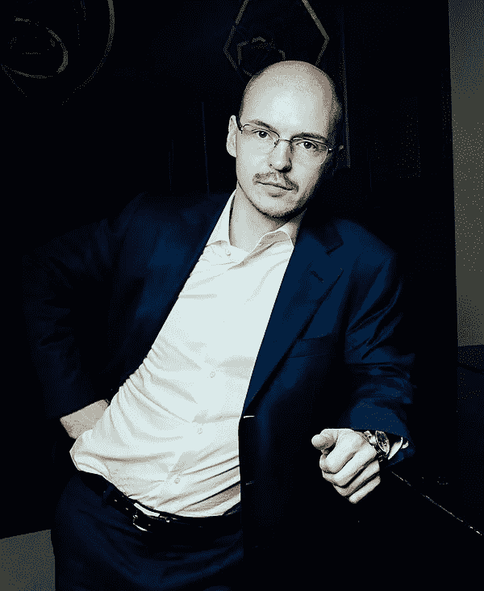

# 生活在创新的数字边缘——与 SDVentures 的德米特里·沃尔科夫的问答

> 原文：<https://medium.com/hackernoon/living-on-the-digital-edge-of-innovation-a-q-a-with-dmitry-volkov-of-sdventures-8e01f859838f>

社会发现风险投资(SDVentures)，是一家国际互联网控股集团，成立于 1998 年。该公司在纽约、香港、明斯克、里加和莫斯科设有办事处，当涉及联合旅行、语言学习、约会、游戏和休闲的项目时，它总是在寻找新的投资和发展机会。

去年，该公司向美国女性科技市场领导者 [Flo 健康](https://flo.health/)投资了 110 万美元，这是一款针对女性的数字生育预测工具。

在与 SDVentures 的交谈中，我了解到他们是围绕社会意识理论构建的，支持许多科学和艺术倡议，包括莫斯科意识研究中心。与俄罗斯和欧洲的艺术家、收藏家、评论家和音乐家合作，包括 Dmitry Gutov、Oleg Kilik、Pierre-Christian Brochet、Mikhail Pyatigorsky 和 Polina Osetinskaya。

我采访了 SDVentures 的创始人德米特里·沃尔科夫(Dmitry Volkov)，他是一位从高中开始就四处奔波的企业家，现在是十多个国际投资项目的有限合伙人，其中包括主要的财富 500 强公司。

**安德鲁·罗索:“自由和道德责任”的理论是如何影响一个企业投资其他公司机会的决策的？**

**Dmitry Volkov:** 我认为运用哲学方法在商业中非常有用。它让你怀疑既定的社会和经济惯例，并教一个人怀疑目前的情况明天是否会保持不变。

特别是对你来说，哲学的实施和运用对你作为一名企业家的旅程有什么帮助？

**DV:** 我在谈判中的成功很大程度上是基于哲学辩论的经验。哲学让我看到了危机中的积极因素。有一种从全局观察事物的技巧，从鸟瞰的角度。

我设法避免关注具体的问题，而是打开新机会的大门。我想这也是哲学方法的结果。哲学家不在实验室做实验，但他们会想象某些情况。我一直都是这样工作的，并且教会了自己详细思考未来的情况，从不同的角度评估一个情况。

你十几岁的时候开始了你的第一次创业。让我们来谈谈它的起源，以及这些年来这段经历如何改变了你的创业方式。

当我开始第一次创业时，我还在上学，那时我才 14 岁。一个朋友让我为我们同时代的人找工作，所以我们为孩子们开了一个就业中心。我们给孩子们找工作，做快递员或促销员——我们从他们的工资中提成。不幸的是，有一天我们的学校成绩直线下降，我们没有足够的时间学习，所以我们不得不关闭业务。

到了 20 世纪 90 年代，我成了 Fido 网络(一种互联网原型)的活跃分子之一。然后我开始在莫斯科国立大学历史系学习。有一个人，一个美国人，他问我是否可以给他找一些程序员，他们可以把一些东西从 ColdFusion 翻译成 ASP。我说当然可以。

首先，我找到了一个好的程序员，然后我又找到了另一个。四年后，我们总共有了 200 个。1998 年，IT-Online 就是这样诞生的。随着时间的推移，它变成了国际互联网控股公司，现在被称为 SDVentures。

**AR:自从 SDVenture 成立以来，创业和投资已经进入了一个数字时代。这种数字化对公司的发展方向和融资方式有何影响？**

**DV:** 对于我们近年来看到的快速技术变革，有很多恐惧和怀疑——对隐私、监控等等的担忧。然而，技术的巨大力量也可以用于对人类极其有益的事情。我们不能忘记这一点，这很重要。这只是揭示和理解最有前途的技术(如区块链，人工智能)并将它们应用于我们一直以来的核心任务的问题。

我的全部精力都放在为公司和风险投资者寻找增长机会上。我们自己投资创新公司。这些公司经常充当我们的试验台，我们通过它们获得尖端技术。

作为一名企业家和众多投资项目的合伙人，你的经历如何受到这种转变的影响？

**DV:** 我是加加林资本基金的普通合伙人，也是十多个国际投资项目的有限合伙人，其中大部分包括财富 500 强初创公司、iTech Capital 和区块链资本。然而，这些项目暴露了一个主要的缺点——发明和实施创新解决方案的速度。

然而，你必须记住公司的规模，以及由此产生的一定程度的惯性，我们通常很难与初创公司竞争。

每个企业家都有一个失败的故事。是什么让你的引擎保持运转？

当人们问我为什么要继续前进和发展时，我说我对生活没有冷漠的态度。我被激情所驱使。每座高峰背后都有一个平台，每项成就之后都有一段单调和例行公事的间歇。我已经学会了如何应对这些停滞期。许多人在这样的高原上止步不前，而我却在加速前进。这已经成为我的一个习惯——开始想一些令人不安的事情，然后离开。或者我只是更快地离开，什么都不用想。