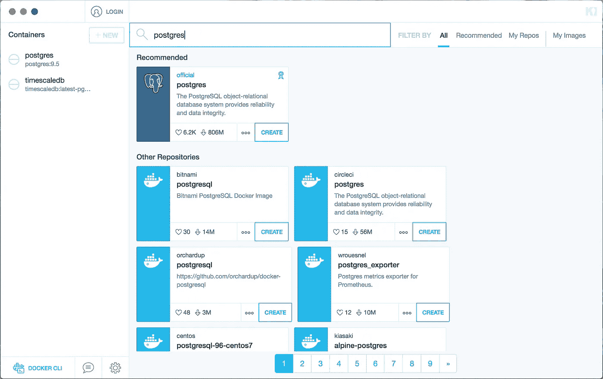
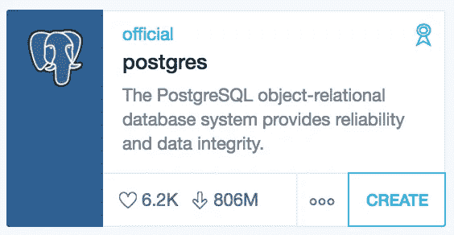
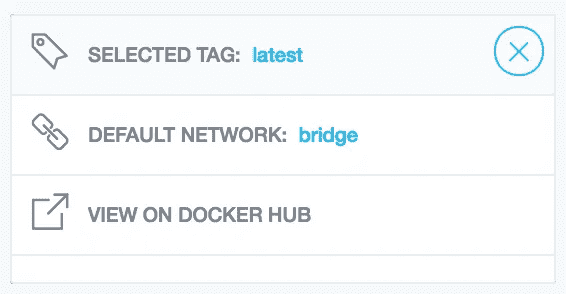
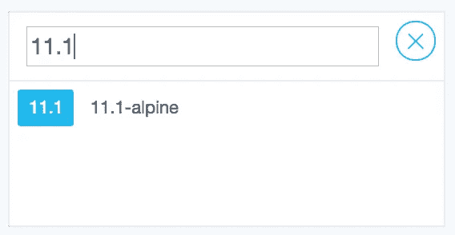
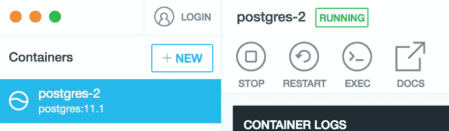
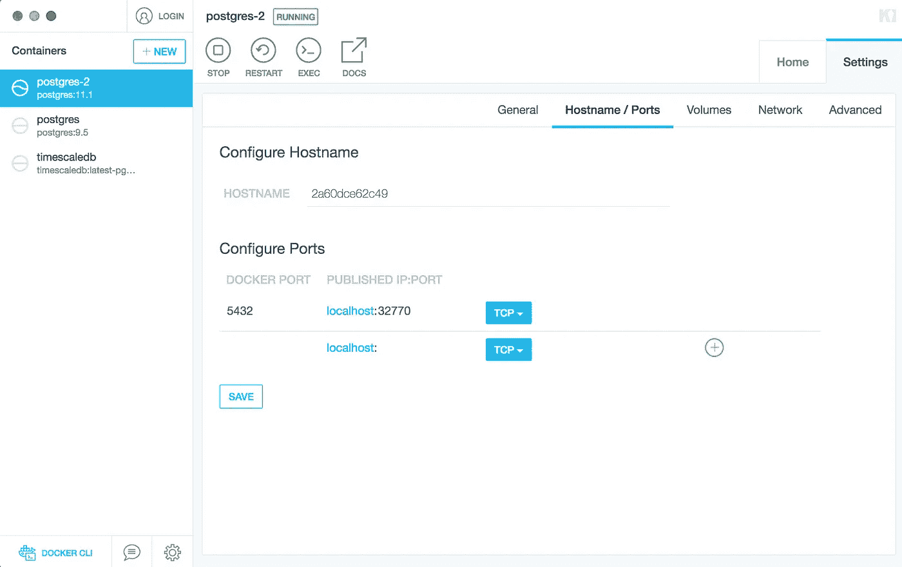
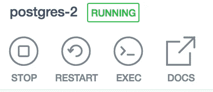
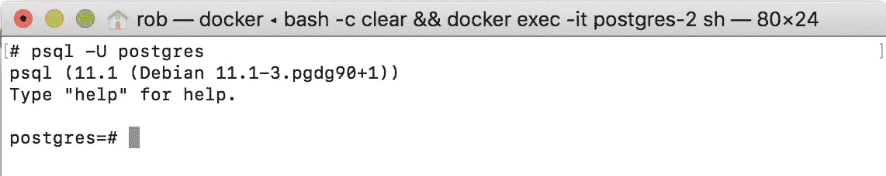
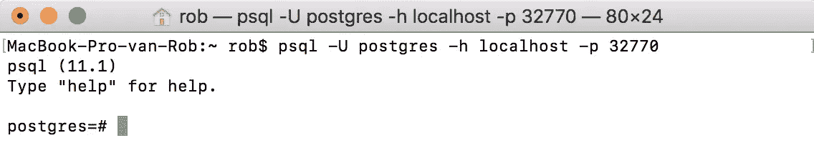
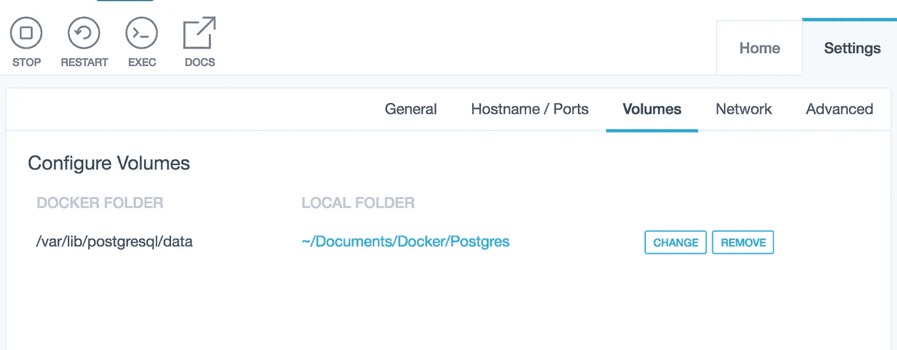

# 本地数据库与 Docker 在 5 分钟内

> 原文：<https://medium.com/hackernoon/local-database-with-docker-in-5-minutes-2c4862f17ae3>

使用 Docker 和 Kitematic 在本地安装 Postgres 数据库的轻松体验。

在本文中，您将体验到使用 Docker 在本地机器上快速、轻松地安装 PostgreSQL 数据库。这将允许您管理轻量级 Docker 容器中的应用程序，而不需要将它们安装在您的主机或虚拟机上。读完这篇文章，你将能够安装和管理 Docker Hub 上提供的数以千计的其他映像，如 Nginx、MongoDB、Redis、Node.js 等。，没有设置它们和管理自己的所有困难。

PostgreSQL (left) and Docker (Right)

# 步骤 1:安装工具

我们需要两个工具:Docker 桌面和 Kitematic。Docker 桌面包含了操作容器所需的 Docker 引擎，Kitematic 是一个运行容器的漂亮的图形用户界面。你可以在这里获得 Docker 桌面[，在这里](https://www.docker.com/products/docker-desktop)获得 Kitematic [，这两款应用都是免费的。](https://kitematic.com/)

# 步骤 2:下载 PostgreSQL 映像

酷，现在工具安装好了，在启动 Kitematic 之前确保 Docker 正在运行。一旦两者都运行了，你应该进入 Kitematic 界面。您可能需要创建一个 Docker Hub 帐户，因此如果 Kitematic 拒绝使用，请注册并登录。

现在你可以浏览中心里成千上万的 Docker 图片。让我们通过在搜索栏中输入“postgres”来找到 PostgreSQL 的官方图片。请注意，官方图片标有适当的标签，就像下面截图中“推荐”部分下的第一个搜索结果。

在点击“创建”按钮之前，点击它左边的三个点。将出现几个选项。

然后点击“选定的标签:最新的”。

在这里你可以选择你想要安装的 Postgres 版本。可用的还挺多的，选一个继续吧。我选了 11.1。

退出选项菜单，点击“创建”按钮。Kitematic 将为您下载图像并创建一个容器。它还应该在容器准备好的时候自动运行它。您应该在顶部的状态栏中的容器名称旁边看到“正在运行”状态。在“容器日志”部分，您可以观察到容器正在实时记录的信息。

# 步骤 3:容器设置

恭喜，您刚刚使用 Docker 和 Kitematic 在本地机器上安装并运行了 PostgreSQL 数据库！您可以在任何时候启动/停止/重启容器，这样做很快，因为 Docker 容器是非常轻量级的。

因为我们的容器运行在一个隔离的环境中，所以您应该能够从您的本地机器访问它。为此，让我们配置端口。选择您的容器，导航到设置->主机名/端口。您应该会看到这个屏幕:

以上意味着 Postgres 在容器(5432)的典型端口上运行，并且该端口被“桥接”到本地机器上的端口 32770。为了简单起见，如果您愿意，可以将“PUBLISHED IP:PORT”设置为 localhost:5432，但这不是必需的。

# 第四步:集装箱通道

现在您的容器正在运行，您可能想知道如何访问它。一种方法是使用 Kitematic，按下顶部的“执行”按钮:

按下按钮后，终端打开，您可以访问容器。对于 Postgres，您可以使用 psql 与数据库进行交互。请记住，默认用户名是`postgres`:

psql -U postgres

如果您想直接从主机访问您的数据库，唯一的区别是您需要向 psql 提供主机和端口参数:

psql -U postgres -h localhost -p 32770

# 步骤 5:配置卷

为了在 Docker 重启之间保留容器的数据，您需要配置一个 Docker 卷。它将使 Docker 使用一个你选择的文件夹来存储数据，并在 Docker 重启后保存它。单个卷也可以由多个容器使用。

在 Kitematic 中，选择您的容器，导航到设置并选择卷。将本地文件夹更改为您选择的文件夹，您就可以开始了。

I store my data inside ~/Documents/Docker/Postgres

# 结论

感谢完成这个小教程。同样，正如我们对 PostgreSQL 数据库所做的那样，您现在应该能够使用 Docker Hub 中的任何其他可用映像。

在[Pinch——移动应用创造者](http://www.pinch.nl),我们使用 Docker 进行我们的 Maven 知识库和后端开发，并托管我们的 Sonarqube instence，我们对它给我们带来的可能性感到满意。

欢迎提问，并在评论区留下反馈。玩得开心！

