# SAS 中的逻辑回归指南

> 原文：<https://medium.com/hackernoon/logistic-regression-using-sas-enterprise-guide-3ffb7774f765>

## 让我们探索一种使用 SAS 分析模型的简单方法。


**什么是逻辑回归？**

> 逻辑回归是一种受监督的机器学习分类算法，用于预测分类因变量的概率。因变量是一个二元变量，包含编码为 1(是/真)或 0(否/假)的数据，用作二元分类器(不在回归中)。逻辑回归可以利用大量的特征，包括连续和离散变量以及非线性特征。在逻辑回归中，使用了 **Sigmoid** (又名逻辑)函数。

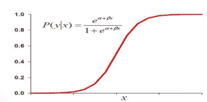

> 我们想要一个预测概率在 0 到 1 之间的模型，也就是 S 形。有许多 S 形曲线。我们用的是 logistic 模型:概率= 1 / [1 +exp (B0 + b1X)]或者 loge[P/(1-P)] = B0 +B1X。左边的函数 loge[P/(1-P)]称为逻辑函数。

## **使用 SAS 企业指南建立物流模型**

我使用的是来自 Kaggle.com 的泰坦尼克号数据集，其中包含一个训练和测试数据集。在这里，我们将尝试预测分类——幸存或死亡。我们的目标变量是“幸存”。我使用 SAS 企业指南来分析这个数据集。SAS 给出了很多输出，所以我只发布了与我们的分析相关的部分。

```
**Setting the library path and importing the dataset using proc import**/* Setting the library path */%let path=C:\dev\projects\SAS\PRACDATA;libname PRAC “&path”;/* Importing dataset using proc import */proc import datafile = “C:/dev/projects/sas/pracdata/train.csv”out = PRAC.titanicdbms = CSV;run;**Checking the contents of the dataset by using proc contents functio**n/* Checking the contents of the data*/proc contents data=work.train;run;
```

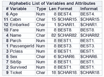

我们有 12 个变量。我们的目标变量是有 1 和 0 的“存活”。1 表示存活，0 表示未存活。**类别变量**:客舱，性别，Pclass。**数字变量:**乘客 ID、SibSp、Parch、幸存者、年龄和票价。**文本变量:**票证和名称

## **使用 proc frequency** 检查目标变量“存活”的频率

/*检查目标变量幸存的频率*/

proc freq data = work.train

表幸存；

跑步；

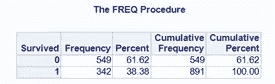

我们可以清楚地看到，342 人幸存，549 人没有生还。观察总数= 891。

## **数据可视化**

通常，通过使用可视化来研究数据是一种很好的做法。我使用`proc sgplot`来可视化这个类，`Embark`。

```
title "Analysis of embarkation locations";proc sgplot data=prac.titanic;
vbar Embarked / datalabel missing;label Embarked = "Passenger Embarking Port";run;
```

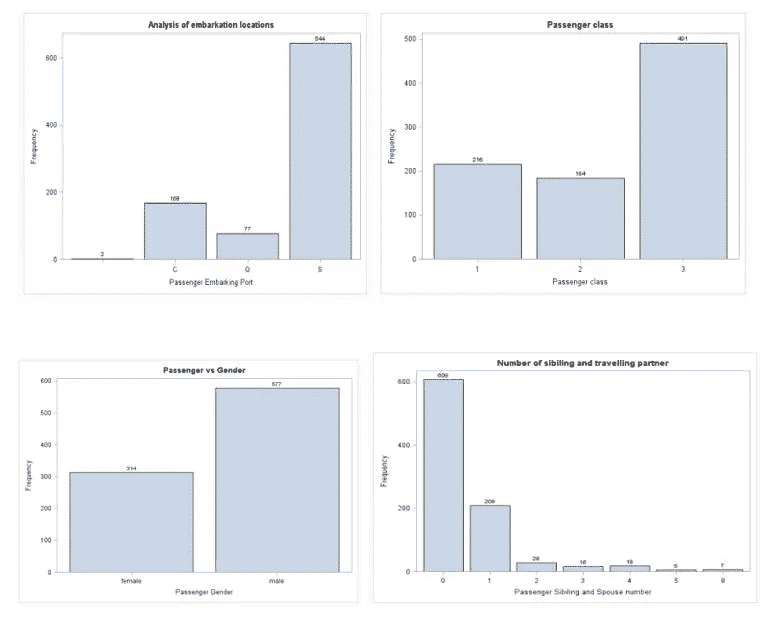

在价值分布中没有什么不寻常的。让我们用其他变量来分析幸存率。

```
title "Survived vs Gender";proc sgplot data=prac.titanic pctlevel=group;vbar sex / group=Survived stat=percent missing;label Embarked = "Passenger Embarking Port";run;
```

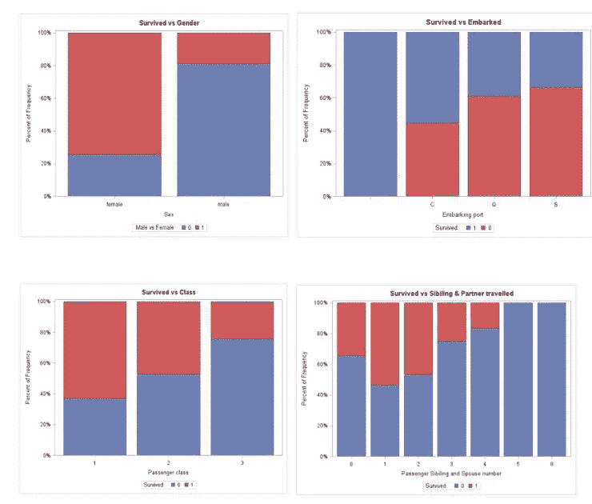

在这里，我们看到一种趋势，即女性比男性存活的更多。乘坐三等舱旅行的人死亡最多。尽管如此，还是有很多方法可以将数据可视化。我就不细说了。

## **使用 proc 方法检查缺失值**

```
/* Checking the missing value and Statistics of the dataset */proc means data=work.train N Nmiss mean std min P1 P5 P10 P25 P50 P75 P90 P95 P99 max;run;
```

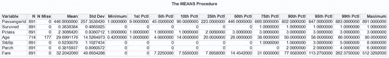

我们可以看到 Age 有 177 个缺失值，并且没有检测到异常值。

```
**Checking for categorical variables:**title “Frequency tables for categorical variables in the training set”;proc freq data=PRAC.TITANIC nlevels;tables Survived; tables Sex; tables Pclass; tables SibSp; tables Parch; tables Embarked; tables Cabin;run;
```

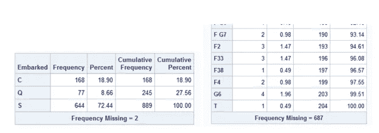

我们失去了年龄、船和船舱的价值。我们需要填充所有缺失的年龄，而不是删除缺失的行。用平均年龄填充的一种方法。但是，我们可以使用箱线图检查乘客等级的平均年龄。在 SAS 中，我们需要先将它从班级和年龄变量中分离出来，然后再制作盒状图。

```
/* Sorting out the Pclass and Age for creating boxplot */proc sort data=work.train out=sorted;by Pclass descending Age;run;title ‘Box Plot for Age vs Class’;proc boxplot data=sorted;plot Age*Pclass;run;
```

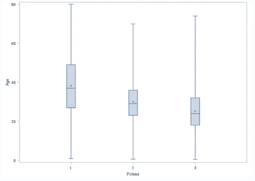

我们可以看到，在较高的阶层中，较富裕的乘客往往年龄较大，这是有道理的。我们将根据年龄的 Pclass 使用这些平均年龄值进行估算。

```
/* Imputing Mean value for the age column */data work.train2;set work.train;if age=”.” and Pclass = 1 then age = 37;else if age = “.” and Pclass = 2 then age = 29;else if age = “.” and Pclass = 3 then age = 24;run;
```

我已经放弃了客舱变量，因为我认为它不会影响我们的模型，并使用中位数填充了“已装船”中缺少的值。(由于类别变量而选择的中间值)。

## **数据分区**

使用 70:30 的比例将数据集拆分为定型和验证数据集。首先，我需要使用`proc sort`整理数据，并使用`proc surveyselect`进行拆分。

```
/* Splitting the dataset into traning and validation using 70:30 ratio */proc sort data = prac.train6 out = train_sorted;by Survived;run;proc surveyselect data = train_sorted out = train_survey outallsamprate = 0.7 seed = 12345;strata Survived;run;
```

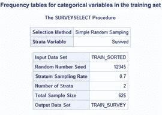

为了验证正确的数据分区，我正在使用`proc freq`生成一个频率表。

```
/* Generating frequency table */proc freq data = train_survey;tables Selected*Survived;run;
```

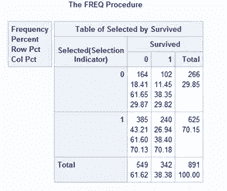

值为 1 的选定变量将是我们对训练部分的目标观察。让我们也执行快速设置处理，以便只留下我们感兴趣的列，并正确命名变量。

## **建筑模型**

我们填充了所有缺失的值，数据集已准备好构建模型。我现在使用`proc logistic`创建一个逻辑回归模型。逻辑回归非常适合为二元变量建立模型。在我们的例子中，目标变量是存活的。

```
/* Creating Logistic regression model */proc logistic data=titanic descending;where part=1;class Embarked Parch Pclass Sex SibSp Survived;model Survived(event=’1') = Age Fare Embarked Parch Pclass Sex SibSp /selection=stepwise expb stb lackfit;output out = temp p=new;store titanic_logistic;run;
```

SAS 的一个优点是，对于逻辑回归中的分类变量，我们不需要创建虚拟变量。在这里，我们可以在一个类中声明所有的类别变量。


变量选择算法决定模型将包括年龄、阶级和性别变量。

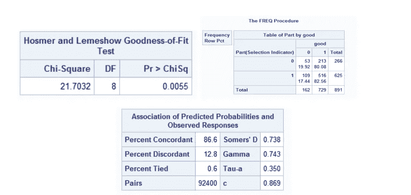

对于训练集(部分=1)和验证集(部分=0)，Good=1 都是近似值。训练集和验证集的正确率分别为 82.56%和 80.08%。这是一个稳定的模型，但是，如果我们看到霍斯默测试的 p 值较小。根据这本书，p 值越高，模型拟合得越好。

如果我们能看到一致的配对，它是 86.6 %。一致性用于评估记分卡如何区分开发样本中的好客户和坏客户。一致性越高，好账户和坏账户之间的分数分离就越大。

## **测试测试数据集**

我们可以通过使用测试数据集来测试我们的训练模型。使用 Proc import 在 SAS 中导入测试数据集和估算所有缺失值的过程是相同的。

## **使用我们的模型**测试测试数据集

```
/* Testing with our model titanic_logisitic */proc plm source=titanic_logistic;score data=test1 out=test_scored predicted=p / ilink;run;
```

现在，我们使用 proc export 将结果导出到 CSV 文件中。我通过使用概率 0.5 并在结果中只保留`PassengerId`和`Survived`变量来分离存活率。

```
data test_scored;set test_scored;if p > 0.5 then Survived = 1;else Survived = 0;keep PassengerId Survived;run;/* Exporting the output into csv file */proc export data=test_scoredfile=”C:/dev/projects/sas/pracdata/Result.csv” replace;run;**Note:**
```

模型中仅使用了三个变量(年龄、阶级和性别),结果为 74.64 %。这是一个不错的模型；然而，我们有很大的空间通过使用其他变量来改进模型。

## 下一步是什么

在我的下一篇文章中，我将尝试使用其他变量并改进模型。此外，我们可以应用其他算法，如决策树，随机森林来检查准确性水平。我会试着在我的下一篇博客中发表。

如果您发现任何错误或需要改进的地方，请不吝赐教。

**参考:**

1)【https://support.sas.com/en/documentation.html】T4

2)[https://en.wikipedia.org/wiki/Logistic_regression](https://en.wikipedia.org/wiki/Logistic_regression)

3)[https://www.kaggle.com/c/titanic](https://www.kaggle.com/c/titanic)