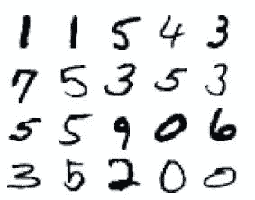

# 使用 TensorFlow 和 Keras 的逻辑回归

> 原文：<https://medium.com/hackernoon/logistic-regression-with-tensorflow-and-keras-83d2487aed89>

*在这篇文章中，Armando Fandango 通过 TensorFlow 和 Keras 学习逻辑回归，他是人工智能产品的发明者，利用深度学习、机器学习、分布式计算和计算方法方面的专业知识。他还在初创公司和大型企业中担任首席数据科学家和总监等思想领袖角色。*

本文将向您展示如何实现一种称为多项式逻辑回归的分类算法来识别手写数字数据集。您将使用 TensorFlow core 和 Keras 来实现这个逻辑回归算法。

# 张量流逻辑回归

关于多类分类的一个最流行的例子是标记手写数字的图像。本例中的类别或标签为 ***{0，1，2，3，4，5，6，7，8，9}*** 。您将使用的数据集通常被称为 MNIST，可通过以下链接获得:[http://yann.lecun.com/exdb/mnist/](http://yann.lecun.com/exdb/mnist/)。MNIST 数据集有 60，000 幅用于训练的图像和 10，000 幅用于测试的图像。数据集中的图像如下所示:



1.首先，从[https://github . com/packt publishing/tensor flow-Machine-Learning-Projects](https://github.com/PacktPublishing/TensorFlow-Machine-Learning-Projects)导入`datasetslib`，一个库:

```
DSLIB_HOME = '../datasetslib'import sysif not DSLIB_HOME in sys.path:sys.path.append(DSLIB_HOME)%reload_ext autoreload%autoreload 2import datasetslib as dslibfrom datasetslib.utils import imutilfrom datasetslib.utils import nputilfrom datasetslib.mnist import MNIST
```

2.将路径设置为您的主目录中的`datasets`文件夹，这是您想要存储所有`datasets`的位置:

```
import osdatasets_root = os.path.join(os.path.expanduser('~'),'datasets')
```

3.使用`datasetslib`获取 MNIST 数据，并打印图形以确保数据正确加载:

```
mnist=MNIST()x_train,y_train,x_test,y_test=mnist.load_data()mnist.y_onehot = Truemnist.x_layout = imutil.LAYOUT_NPx_test = mnist.load_images(x_test)y_test = nputil.onehot(y_test)print('Loaded x and y')print('Train: x:{}, y:{}'.format(len(x_train),y_train.shape))print('Test: x:{}, y:{}'.format(x_test.shape,y_test.shape))
```

4.定义用于训练模型的超参数:

```
learning_rate = 0.001n_epochs = 5mnist.batch_size = 100
```

5.为简单模型定义占位符和参数:

```
# define input imagesx = tf.placeholder(dtype=tf.float32, shape=[None, mnist.n_features])# define output labelsy = tf.placeholder(dtype=tf.float32, shape=[None, mnist.n_classes])# model parametersw = tf.Variable(tf.zeros([mnist.n_features, mnist.n_classes]))b = tf.Variable(tf.zeros([mnist.n_classes]))
```

6.用`logits`和`y_hat`定义型号:

```
logits = tf.add(tf.matmul(x, w), b)y_hat = tf.nn.softmax(logits)
```

7.定义`loss`功能:

```
epsilon = tf.keras.backend.epsilon()y_hat_clipped = tf.clip_by_value(y_hat, epsilon, 1 - epsilon)y_hat_log = tf.log(y_hat_clipped)cross_entropy = -tf.reduce_sum(y * y_hat_log, axis=1)loss_f = tf.reduce_mean(cross_entropy)
```

8.定义`optimizer`功能:

```
optimizer = tf.train.GradientDescentOptimizeroptimizer_f = optimizer(learning_rate=learning_rate).minimize(loss_f)
```

9.定义函数以检查训练模型的准确性:

```
predictions_check = tf.equal(tf.argmax(y_hat, 1), tf.argmax(y, 1))accuracy_f = tf.reduce_mean(tf.cast(predictions_check, tf.float32))
```

10.在 TensorFlow 会话中为每个历元运行`training`循环:

```
n_batches = int(60000/mnist.batch_size)with tf.Session() as tfs:tf.global_variables_initializer().run()for epoch in range(n_epochs):mnist.reset_index()for batch in range(n_batches):x_batch, y_batch = mnist.next_batch()feed_dict={x: x_batch, y: y_batch}batch_loss,_ = tfs.run([loss_f, optimizer_f],feed_dict=feed_dict )#print('Batch loss:{}'.format(batch_loss))
```

11.使用之前创建的相同 TensorFlow 会话中的测试数据，为每个历元运行评估函数:

```
feed_dict = {x: x_test, y: y_test}accuracy_score = tfs.run(accuracy_f, feed_dict=feed_dict)print('epoch {0:04d}  accuracy={1:.8f}'.format(epoch, accuracy_score))
```

您将获得以下输出:

```
epoch 0000 accuracy=0.73280001 epoch 0001 accuracy=0.72869998 epoch 0002 accuracy=0.74550003 epoch 0003 accuracy=0.75260001 epoch 0004 accuracy=0.74299997
```

给你。您刚刚使用 TensorFlow 训练了您的第一个逻辑回归模型，用于对手写数字图像进行分类，并获得了 74.3%的准确率。现在，看看在 Keras 中编写相同的模型如何使这个过程变得更加容易。

# 使用 Keras 的逻辑回归

**Keras** 是一个高级库，是 TensorFlow 的一部分。在本节中，您将使用 Keras 重建之前使用 TensorFlow core 构建的相同模型:

1.Keras 采用不同格式的数据，因此您必须首先使用`datasetslib`重新格式化数据:

```
x_train_im = mnist.load_images(x_train)x_train_im, x_test_im = x_train_im / 255.0, x_test / 255.0
```

在前面的代码中，在缩放训练图像和测试图像之前，将训练图像加载到内存中，方法是将它们除以`255`。

2.然后，您构建模型:

```
model = tf.keras.models.Sequential([tf.keras.layers.Flatten(),tf.keras.layers.Dense(10, activation=tf.nn.softmax)])
```

3.用`sgd`优化器编译模型。将分类熵设置为`loss`函数，将准确度设置为度量标准来测试模型:

```
model.compile(optimizer='sgd',loss='sparse_categorical_crossentropy',metrics=['accuracy'])
```

4.使用图像和标签的训练集为`5`时代训练模型:

```
model.fit(x_train_im, y_train, epochs=5)Epoch 1/560000/60000 [==============================] - 3s 45us/step - loss: 0.7874 - acc: 0.8095Epoch 2/560000/60000 [==============================] - 3s 42us/step - loss: 0.4585 - acc: 0.8792Epoch 3/560000/60000 [==============================] - 2s 42us/step - loss: 0.4049 - acc: 0.8909Epoch 4/560000/60000 [==============================] - 3s 42us/step - loss: 0.3780 - acc: 0.8965Epoch 5/560000/60000 [==============================] - 3s 42us/step - loss: 0.3610 - acc: 0.901210000/10000 [==============================] - 0s 24us/step
```

5.用测试数据评估模型:

```
model.evaluate(x_test_im, nputil.argmax(y_test))
```

您将获得以下评估分数作为输出:

```
[0.33530342621803283, 0.9097]
```

哇！使用 Keras，可以获得更高的精度。在这里，你达到了大约 90%的准确率。这是因为 Keras 内部设置了许多最佳值，以便您可以快速开始构建模型。

*如果你觉得这篇文章有意思，可以探索* [TensorFlow 机器学习项目](https://www.amazon.com/TensorFlow-Machine-Learning-Projects-computations-ebook/dp/B07GDHJBDZ) *实现 TensorFlow 的 TensorBoard、TensorFlow.js、TensorFlow Probability、TensorFlow Lite 等产品，构建智能自动化项目。在* [TensorFlow 机器学习项目](https://www.packtpub.com/big-data-and-business-intelligence/tensorflow-machine-learning-projects) *的帮助下，您不仅可以学习如何使用不同的数据集构建高级项目，还可以使用 TensorFlow 生态系统中的一系列库来应对常见挑战。*