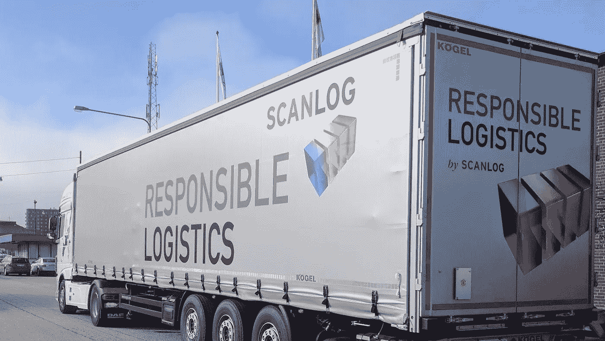
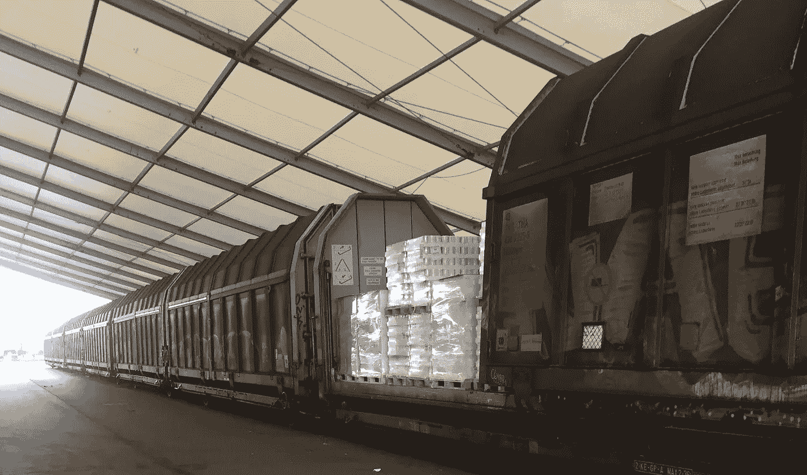

# 物流公司与基于区块链的“ShipChain”合作，为供应链带来尖端技术

> 原文：<https://medium.com/hackernoon/logistics-company-partners-with-blockchain-based-shipchain-to-bring-cutting-edge-tech-to-supply-ch-ae8a852e8757>

在技术领域，许多公司(及其竞争对手)自称为“区块链解决方案”但是，大多数这些协会都有一个问题——“区块链”这个词只是出于营销目的而加入的，仅此而已。通常情况下，公司并没有实现“真正的”区块链技术，因为这些系统本身并没有完全分散。

# **增加供应链的可见性**

区块链技术能够并且已经开始为世界带来的最大优势之一是增加供应链的可见性。

总部位于区块链的端到端物流初创公司 [Shipchain](https://shipchain.io/) 宣布将其平台与斯堪的纳维亚物流公司 [Scanlog](http://www.scanlog.se/en/) 整合，以帮助跟踪和追踪 Scanlog 在公司物流网络中的货运。

通过这种集成，Shipchain 能够帮助监控 Scanlog 的卡车，从装货点到目的地，所有这一切都有智能合同技术的帮助。

我与 ShipChain 的首席执行官 John Monarch 讨论了最近的公告，以及这如何有助于整个供应链领域受益。

ShipChain CEO, John Monarch

Andrew Rossow: 在您看来，为什么您认为“跟踪与追踪”是必要的？

John Monarch: 这对增加供应链的可见性具有重大意义。就行业现状而言，一批货物在到达最终消费者手中之前必须经过几个不同的人。

**AR:** 对于可能不熟悉这个流程的人，你能给我们演示一下吗？

**JM:** 它通常从一个制造工厂开始旅程，然后通过卡车运输到港口，再通过船运到海外，然后再通过卡车运输，直到到达最终目的地。

包裹要经过如此多不同的设施和流程，以至于很难跟踪它的去向。

AR: 那么，问题是什么？

**JM:** 随着每天都有商品被盗或下落不明，缺乏透明度成为一个问题。如果没有区块链带来的额外可见性，当事情确实出错时，追究责任是极其困难的。

据 Monarch 报道，每年都有价值数十亿美元的商品消失得无影无踪，完全不知去向。Monarch 强调说:“跟踪和追溯可以让你准确定位它们在供应链中的缺失位置，最近是谁在处理它们，以及它们最后一次出现在的时间。”。

在最大限度减少欺诈和盗窃机会的同时，它还“*提高了整体效率，因为花在寻找货物上的时间更少了*

# **从端到端解决供应链问题**

随着像*沃尔玛*和*惠普*这样的公司利用区块链来帮助改善跟踪和追踪程序，特别是与食品可追溯性有关的程序，问题变成了其他竞争者如何能够平等地站在一起。

“我们正在采取一种整体的方法来解决航运和物流中最紧迫的问题，并且在这样做的时候不会要求您将您的数据交给我们。”。

**“***在使用区块链的领域中还有其他公司，但是只有 ShipChain 在端到端的整个供应链上工作*。”

该公司告诉我，我们目前正处于当今技术和世界上最古老的行业之一——搬运物品——之间的十字路口。一方面，Shipchain 与传统解决方案竞争——从文件跟踪到供应链控制塔，但另一方面，他们拥有区块链解决方案，承诺摒弃“旧的”做事方式，彻底改变世界。

**AR:** 谈到这项技术，你从你的竞争对手或业内其他人那里观察到了什么？

**JM:** 私人区块链的出现。与我们不同，我们的许多竞争对手自称是“区块链解决方案”，但并没有真正实施区块链技术。

我的意思是有大量的“私人区块链”如你所知，私有区块链不是分散的——有人或一些实体拥有它们。在许多方面，它与基于云的解决方案非常相似。通过加入私人区块链，您实际上是将您的数据交给了上述区块链的所有者。既然他们现在拥有这些数据，他们就可以篡改它们。

我们认为，要真正获得区块链的好处，你必须加入一个公共链，就像 ShipChain 正在构建的那样。

为什么“公共区块链”比“私人区块链”提供更多的灵活性

**JM:** 私营连锁店只会进一步分裂这个行业，因为它们可能没有能力与其他区块链互动或交流。这限制了所有公司使用同一个平台的能力，从本质上挫败了区块链技术的核心使命，即精简和提高效率和透明度。

另一方面，公共区块链是分散的。它们没有主人，极难破解或篡改。事实上，将您的数据放在公共区块链上意味着通过分布式共识和验证来提高安全性。随着行业慢慢过渡到公共区块链，玩家将能够依靠技术本身来获得安全，从而增加信任。

ShipChain 将在未来几个月内在多辆与 Scanlog 相关的参与卡车的主驾驶室中安装其支持 GPS 的蜂窝设备，称为*轴网关*。

*轴网关*是一个司机可以通过 ShipChain 门户连接到各种工作的设备。该设备允许实时进行的运输与跟踪数据和以太坊区块链自动同步。

君主指出:“*它将把加密的 GPS 数据发布到 Scanlog 的现场存储位置，并将生成一个独特的数据签名，该签名将发布到区块链*。

然后，该公司授予 Scanlog 访问 ShipChain 移动应用程序的权限，进而允许 Scanlog 将照片和其他相关信息附加到沿途的特定货物上。

"*我们的主要目标是提高 Scanlog 供应链的透明度，从而让公司及其客户安心*。"

Shipchain 在结束我们的谈话时表示，这种合作关系有助于从*制药*到*食品、农业、*和*农业*供应链的其他领域受益。

"*药物或医疗设备的任何问题都可能对患者及其家人造成灾难性的影响，因此在这一领域的可见性极其重要。区块链有助于确保所有药品都是合法的，并保持在正确的温度和正确的储存条件下*。