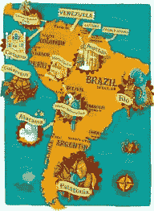

# 比特币时代的爱情:拉丁美洲和加密货币

> 原文：<https://medium.com/hackernoon/love-in-the-time-of-bitcoin-latin-america-and-cryptocurrency-42d60cc4c177>

Photo by [Matt Seymour](https://unsplash.com/photos/EEtDt8QdfU0?utm_source=unsplash&utm_medium=referral&utm_content=creditCopyText) on [Unsplash](https://unsplash.com/search/photos/che-guevara-grafitti?utm_source=unsplash&utm_medium=referral&utm_content=creditCopyText)

## 加密货币的全面采用是一个缓慢的过程。这需要时间。但当它发生时，它肯定会彻底改变金融和商业世界。遗憾的是，对许多拉美国家来说，这一切都为时已晚，尤其是对委内瑞拉来说。就在我们说话的时候，委内瑞拉正面临更大的政治和财政危机。

# 新曙光

像所有新的黎明一样，变革的时刻到来了。在发展中国家和第三世界——尽管是非洲和亚洲——进入传统模式的银行体系以及其它现代金融体系一直很难。拉丁美洲也不例外。过去二十年来，互联网的普及以及它在中美洲和南美洲被全心全意采用的方式，使得人们对转移和储蓄资金的替代方式的兴趣激增。从半个世纪前全球 2500 万互联网用户到 2019 年超过 30 亿，到 2018 年 12 月，全球已有超过 3200 万个比特币钱包，约有 700 万活跃比特币用户，这并不奇怪。

Source: Pinterest.com

*虽然从全球范围来看，比特币用户似乎并不算多，但这确实表明，这种货币——以及其他加密货币——的受欢迎程度正在上升。*

在经济稳步发展的拉丁美洲国家，加密货币为用户提供了一个独立于其国家财政约束的框架，尽管并非总是如此，但这些国家往往由裙带关系和腐败的政客统治，他们往往遭受通货膨胀经济学的退化。

**那么，终于从专制的枷锁中解放出来了吗？**

不完全是，但是它正在到达那里。

> 拉丁美洲非常不稳定。Cryptos 正成为这些家庭的新避难所。
> 
> 对冲基金 Solidus Capital 创始人卡洛斯·莫斯克拉(Carlos Mosquera)

# 比特币取得控制权

南美洲和中美洲的 6 亿人口已经到了变革的时候了。近四分之一的人拥有手机和其他设备。遗憾的是，这些人中只有 40%的人可以获得银行服务。

这就是比特币可以控制的地方。

**与欧洲和美国相比，拉丁美洲是比特币和替代加密货币在未来几年占据市场并成为各大洲真正的替代——甚至取代——金融系统的理想候选地。欧洲和美国都拥有完善、可信的法定货币银行系统。**

巴西和阿根廷是加密货币的早期采用者之一，阿根廷首都布宜诺斯艾利斯[被列为全球使用比特币](https://dailyhodl.com/2019/02/09/top-10-bitcoin-friendliest-cities-in-the-world/)的十大城市。

在现实经济背景下，比特币构成了技术和经济意义上的一次飞跃。国外汇款——许多在美国或智利和墨西哥等较富裕的拉美国家工作的较贫穷的拉美人为了将钱汇回家而遭受的灾难(或者我应该说是拯救恩典),将随着比特币的出现而成为过去。它还可以作为当地货币的替代品，而当地的通货膨胀往往会随一时兴起而上下波动，它还可以给较贫困的公民带来更多的金融稳定。

*比特币对拉丁美洲的小企业和企业家也有好处，绕过了当地官僚要求硬通货回扣的烦恼。随着客户不再需要为跨境业务转移支付昂贵的交易费，比特币这个世界的牡蛎打开了全球潜在投资的大门。*

[2017 年拉丁美洲的入境汇款水平为 805 亿美元](https://blogs.imf.org/2019/05/07/fintech-can-cut-costs-of-remittances-to-latin-america/)。其中很大一部分来自费用和汇率波动。比特币将解决所有这些问题，随着大规模采用，将为这些国家的经济增加财富。

此外，拉丁美洲至少有六个国家遭受着恶性通货膨胀和严格货币监管的耻辱。通过采用比特币，各国可以维持经济独立，帮助它们走上发展之路。

# 委内瑞拉的情况

我们已经可以在委内瑞拉看到这样的例子，自 2013 年乌戈·查韦斯总统去世以来，委内瑞拉经历了一场又一场的经济灾难。目前，查韦斯的继任者尼古拉斯·马杜罗(Nicolás Maduro)正在与年轻的伪装者、委内瑞拉国民议会主席胡安·瓜伊多(Juan Guaidó)争夺他的政治生命，他自 2019 年 1 月以来一直担任代理总统。

> **“许多委内瑞拉人正在使用比特币兑换他们的玻利瓦尔，以保持一些有价值的东西，这些玻利瓦尔因恶性通货膨胀而永久贬值”**
> 
> 加拉加斯咨询公司 Econanalitica 的经济学家阿斯德鲁巴·奥利韦罗斯(Asdrubal Oliveros)。

在这里，比特币可以创造奇迹，尽管目前只有较富裕的委内瑞拉人使用比特币进行储蓄和汇款，更不用说外币兑换了，因为玻利瓦尔实际上一文不值。初创公司也开始使用数字货币，希望避免在使用法定货币交易时遇到麻烦。遗憾的是，现实是，该国大多数人仍在使用充满通胀的国家货币，因为大多数人发现很难理解和操纵该国加密货币的数字钱包。

**A peer-to-peer bitcoin marketplace, volume (in bitcoin) in Venezuela:** Source: Coin.dance

随着今年通货膨胀率达到 10，000，000%,大多数委内瑞拉人认为玻利瓦尔毫无用处，但他们需要它，因为他们在经济上没有其他选择。无数经济移民在哥伦比亚工作后，被迫将 [*美元和食物从哥伦比亚*](https://www.bloomberg.com/news/articles/2019-02-12/pocketing-1-000-markup-venezuelans-smuggle-out-precious-food) *跨境偷运回来，藏在他们的头发和其他难以找到的地方。这是一个冒险的尝试:如果被抓住，这些人中的许多人会受到国民警卫队殴打的威胁。*

至少在理论上，这种情况会将加密货币的广泛采用视为最佳选择。然而，该国以外的许多人并没有看到全貌:购买食品和药品等日常必需品不能用比特币购买。企业和商人出售更有价值的东西，然而，这是可能的。因此，如果你想购买一辆汽车或一些高科技电子设备，在加拉加斯购买的可能性相当高。但大多数委内瑞拉人的需求要平凡得多:一条面包或一串香蕉就够了。

Hugo Chavez, former president of Venezuela. Source: cartoonstock.com

然而，要将委内瑞拉从其政治弊病中拯救出来，需要的不仅仅是比特币。国内和整个拉丁美洲的态度必须改变。首先，有银行账户的人和没有银行账户的人之间需要平衡。只有巴西有银行账户的人口比例高于无银行账户的人口比例，这是一种可悲的状况。国有和私营金融机构也没有动力去改变本国庞大的无银行账户人口。

> 拉丁美洲非常喜欢“希望”这个词。我们喜欢被称为“希望的大陆”。众议员、参议员、总统的候选人自称为“希望的候选人”。这种希望真的有点像上天的承诺，一张总是延期支付的欠条。它被推迟到下一次立法活动，推迟到明年，推迟到下个世纪。
> 
> — **巴勃罗·聂鲁达**

但是有了这些可怕的消息，让我们保持希望。比特币和加密货币仍处于初级阶段。它们的全面使用——不仅在拉丁美洲，而且在全世界——才刚刚开始。我们祈祷，无论如何，未来这种数字货币将至少在某些情况下，帮助像委内瑞拉这样的国家应对其金融和政治灾难。