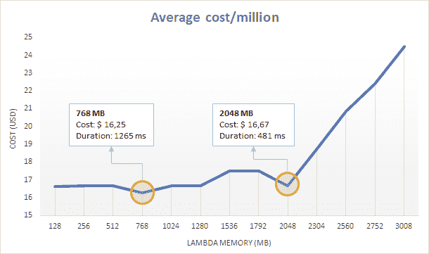
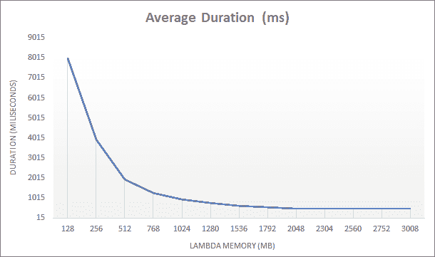
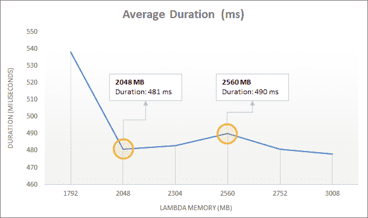

# 通过增加内存大小来降低 AWS Lambda 账单——没错！

> 原文：<https://medium.com/hackernoon/lower-your-aws-lambda-bill-by-increasing-memory-size-yep-e591ae499692>

*Photo by* [*Joshua Sortino*](https://unsplash.com/photos/LqKhnDzSF-8?utm_source=unsplash&utm_medium=referral&utm_content=creditCopyText) *on* [*Unsplash*](https://unsplash.com/search/photos/data-center?utm_source=unsplash&utm_medium=referral&utm_content=creditCopyText)

当我们为 Lambda 函数指定内存大小时，AWS 将按比例分配 CPU。例如，256 MB 功能的处理能力是 128 MB 功能的两倍。这看起来简单明了，但是…

> 我有这样一个问题:在 Lambda 上运行一个给定任务时，会有一个理想的内存大小来最小化成本吗？

为了回答这个问题，我测试了在多种内存大小上运行的相同任务，以检查是否存在这样的成本/内存权衡最佳点。

# 基准 Lambdas

我创建了两个 Lambda 函数来运行这个测试:

*   斐波那契数列:生成一系列……你猜对了，斐波那契数列的基本代码！这只是一个低内存、CPU 密集型的任务。
*   **基准测试**:多次调用斐波那契函数(或任何其他函数)，切换内存大小；最后，它会对结果进行平均，以确定哪个内存大小可以优化速度和成本。

如果你想测试你自己的 Lambdas，[代码是开源的](https://github.com/byrro/awslambda-memory-tradeoff)。下面给出的结果肯定会根据您测试的函数而有所不同，所以我鼓励您下载 Benchmarker Lambda 并亲自运行它。

*Photo by* [*Stephen Dawson*](https://unsplash.com/photos/qwtCeJ5cLYs?utm_source=unsplash&utm_medium=referral&utm_content=creditCopyText) *on* [*Unsplash*](https://unsplash.com/search/photos/data-center?utm_source=unsplash&utm_medium=referral&utm_content=creditCopyText)

# 测试参数

*   AWS 地区:美国东部-1(北弗吉尼亚)
*   测试的内存大小:128、256、512、768、1024、1280、1536、1792、2048、2304、2560、2752、3008
*   对于每种内存大小，斐波那契被调用 20 次
*   调用以 10 个并发请求为一批运行，以加快进程
*   每次调用时，Fibonacci 函数都会构建前 30 个 Fibonacci 数的序列
*   忽略冷启动以标准化持续时间结果

# 试验结果

Average cost (USD) per million executions of the Fibonacci sequence builder (n=30)

成本方面最有利的地方是:

*   768 MB :这是我们在 Lambda 上能得到的最便宜的任务了；为什么 128 MB 不便宜？它需要更长的处理时间，长到足以使它的总成本更高！
*   **2048 MB** :虽然价格比 768 MB 高~3%，但运行速度快 2.5 倍；在某些情况下，多花点钱来加快处理速度可能是值得的。

举例来说，与 128 MB 相比，运行 768 MB 的任务花费更少，这是违反直觉的。这意味着在某些情况下，我们实际上可以通过增加内存大小来降低 AWS 账单。当然，在考虑改变设置时，我们需要知道我们的函数需要的最小内存是多少。有一些监控服务——比如[dash bird](https://dashbird.io)——可以更容易地分析 Lambda 内存使用情况，并为这种基准分析确定阈值。

内存容量越大，线斜率(上图)的急剧上升引起了我的注意。从那时起，有报道称——尽管不是官方的 Lambda 提供了两个内核。我的假设是处理能力在内核之间分配，由于我的工作只使用了一个内核，测试实际上是在惩罚双核功能设置。这是在未来的测试中需要更密切关注的事情，这项任务可以利用多个内核。

Average duration (milliseconds) for running the Fibonacci sequence builder (n=30)

在时长方面，上图看似没有什么惊喜，但我其实在结果中发现了一贯怪异的地方: **2048 MB** 总是比 **2304** 和 **2560 MB** 执行*快*，这是意料之外的。放大到最高内存大小，我们可以注意到差异。

Average duration (milliseconds) for running the Fibonacci sequence builder (n=30)

这可能是可以忽略的，因为它代表大约 2%的额外执行时间。尽管如此，如果我们运行这个函数数百万次，或者如果延迟非常重要，那么这些额外的毫秒可能是相关的。

很难准确理解哪些因素在产生这些意想不到的结果中发挥了作用。Lambda 基础设施是一种黑箱。也许服务于每个请求的硬件有所不同，这将在我们的测试中引入一些不期望的可变性。底线是:如果你想优化 Lambda 的使用，以获得最快的执行速度或最低的成本，你应该明确地对你的函数进行基准测试。

我已经[发布了基准函数](https://github.com/byrro/awslambda-memory-tradeoff)，这样你就可以自己部署和测试你自己的 Lambda 函数。只需按照存储库自述文件中的说明进行操作。