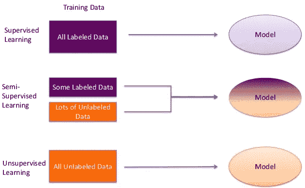
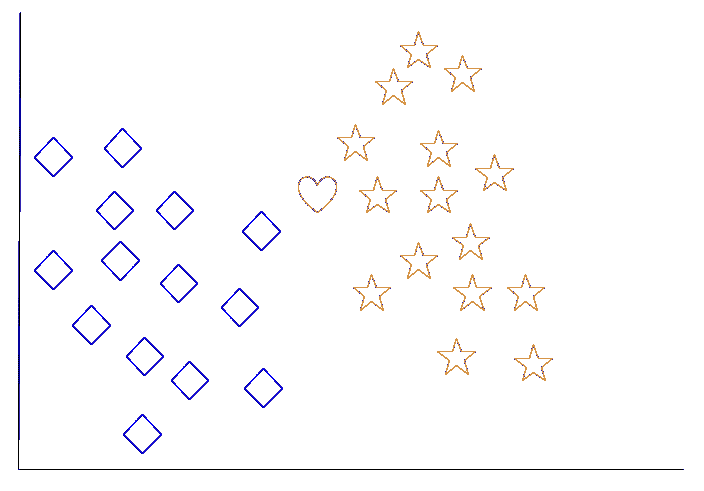
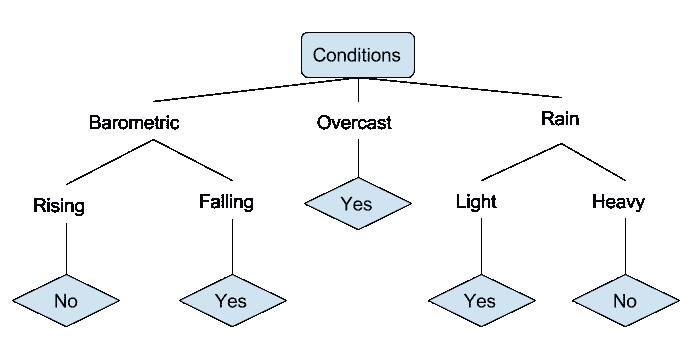
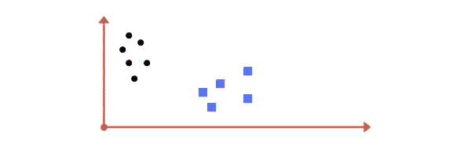
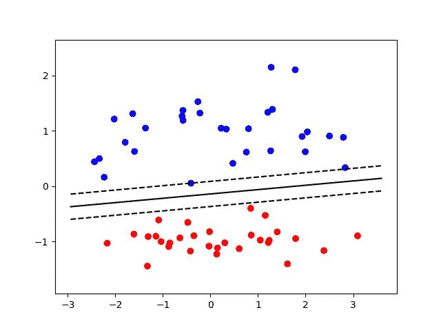
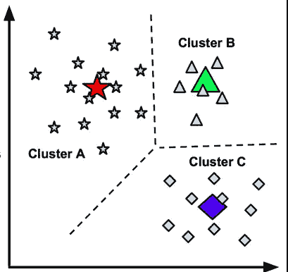
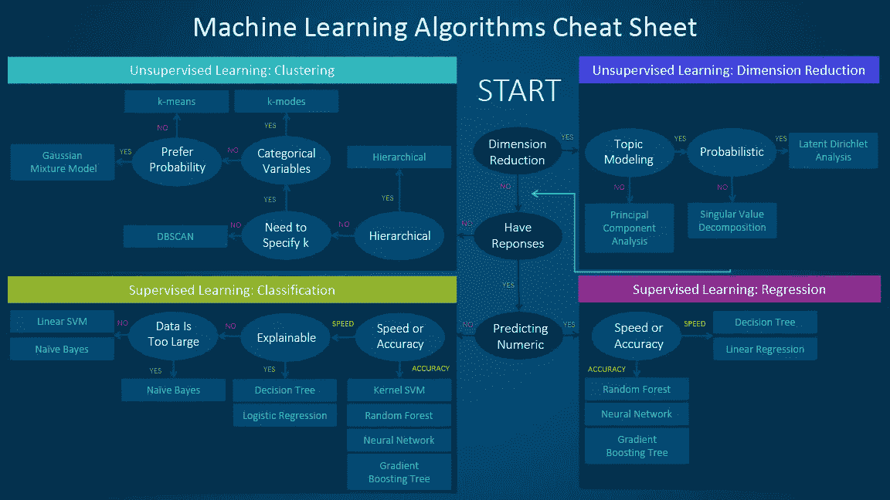

# 机器学习:基本算法

> 原文：<https://medium.com/hackernoon/machine-learning-for-grandmothers-eabcf87285b4>

机器学习是计算机科学的一个领域。但是，它与传统的计算领域有着本质的不同。在传统领域，算法是由计算机执行的显式指令集。算法指令不会随着时间而改变，除非开发人员重写它们。然而，机器学习算法被设计成基于输入、权重和输出随时间变化。

机器学习的现代例子包括:面部识别、字符识别(允许手写或印刷文本转换为机器编码文本)、推荐引擎、股市算法和无人驾驶汽车。

机器学习能够解决许多不同类别的问题。不同的问题需要不同的学习算法。学习算法的根本区别在于输出是否被“标记”，以及你希望算法如何“学习”。最常见的两种机器学习方法是**监督**和**非监督**学习。

在**监督学习**中，一个标有期望输出的输入值池被传递给算法。这里的目标是让算法将它的实际输出与期望输出进行比较，并相应地调整它的模型。一旦算法准确，您就可以使用它来自动分类成千上万个未标记的输入。监督学习的一个常见例子是股票市场算法，它使用历史数据和趋势来预测波动。

在**无监督学习**中，没有输入被标记，而是由算法来寻找不同输入之间的共性，并相应地对它们进行分类。无监督学习方法对于想要发现他们的消费者原型(最有可能购买他们产品的那类人)的数字营销人员或初创公司创始人来说可能特别有价值。如果你将一堆交易数据输入到一个无人监管的机器学习算法中，你就可以确定这样的事情:谁更有可能购买某种产品？(男性或女性)，什么年龄的消费者最常见？在购买该产品的人群中，他们还购买了哪些其他产品？

无监督学习的一个优势是，自然界中的大多数数据都是“未标记的”因此，有人会认为无监督学习方法更有用，因为每个输入不需要相应的“正确”输出。出于同样的原因，使用无监督的学习方法更有可能做出新的发现，因为你可以将大量看似无关的数据扔给无监督的机器学习算法，看看是否发现了任何有趣的关系。

识别变量之间的**关系是机器学习算法的基本组成部分。理解机器学习的两个重要统计概念是相关性和回归。**

**相关性**衡量两个(或更多)变量一起波动的程度。“正相关”表示所有变量平行移动的情况。例如，目前，比特币和加密货币市场之间存在相对正相关的关系。随着比特币价格的上涨，其他加密货币也跟着上涨。“负相关”衡量的是一个变量增加而其他变量减少的程度。例如，失业率和经济中的消费支出水平之间存在负相关关系。随着消费者支出增加，公司需要生产更多产品，这迫使他们雇佣更多工人，从而降低失业率。

**回归超越了相关性，因为它增加了预测能力。**回归用于“检验一个因变量和一个自变量之间的关系”(www.statpac.com)。在进行分析之后，如果自变量是已知的，人们应该能够预测因变量。例如，想象一个医生试图决定给病人服用多少剂量。在这个例子中，因变量是剂量(因为它取决于患者),患者体重是自变量。医生知道病人的体重，需要确定适当的剂量。通过进行回归，医生可以开发出一个公式，当给定病人的体重时，该公式可以确定正确的剂量。

让我们检查几个常见的机器学习算法:

**k-最近邻(k-NN)-**

k-NN 是一种基本的机器学习算法，用于回归和**分类**。k 代表一个小正整数。在这个例子中，我们将使用 k-NN 进行分类。这意味着算法的输出将是类成员。该算法将“将新对象分配到其 k 个最近邻居中最常见的类别”(www.digitalocean.com)。在本例中，我们还将假设要求我们基于 k = 1 执行分类。这告诉我们，对象应该被分配到与其最近的邻居相同的类中。

想象一下，我们的机器人捕捉到了下面的图像:

一秒钟后，我们的机器人捕捉到了这个图像:

我们的机器人识别未知图像，需要将其分类为星形或菱形。因为我们正在执行 k = 1 分类，所以我们的机器人会将新对象分类为与其最近的邻居属于同一类。在这种情况下，它最近的邻居是一颗恒星，所以这个物体被归类为恒星。

如果我们进行了 k = 3 的分类，我们的机器人会检查离三个邻居最近的新物体(两颗星和一颗钻石)。同样，在这种情况下，我们的机器人会将新物体归类为恒星。

这可能看起来像是一种任意且无效的“学习”方法但是想象一下某些对象持续显示在屏幕的某些部分的场景。在这些情况下，简单的 k-NN 算法可能是训练机器正确识别新对象的最快方法。

**决策树学习-**

决策树用于创建预测模型。决策树学习的目标是基于某些输入生成目标值。这是一个简单的决策树。想象一个人用它来决定他是否应该打高尔夫球:

数据的属性(气压、阴天、降雨等)由分支表示，而基于这些条件的有效性的输出由树叶表示。如果下雨，而且下得很大，你就不应该去打高尔夫球。构建决策树时，必须回答以下问题:包括哪些属性(分支)？，应该如何拆分这些属性？，树应该什么时候结束？

**深度学习:**

深度学习更多地是指机器学习算法的一般类别或结构，而不是任何特定的算法。基本上，深度学习算法通过实现“神经网络”来模拟人脑。神经网络是分层的，一层的输出被输入到网络的下一层。神经网络也是“加权”的，这意味着一些输入和输出比其他的具有更大的影响。深度学习算法可以是有监督的，也可以是无监督的。深度学习已经成为人工智能领域最具潜力的方法(www.digitalocean.com)。一些深度学习算法在认知任务中的表现超过了人类。

**线性回归:**

线性回归算法基于自变量和因变量之间的线性关系对目标值进行建模。我们通过计算直线 y = ax + b 来发展我们的线性回归，对于直线 y = ax+b，期望值和实际值之间的差异最小。上式中，y 为因变量(输出)，a 为斜率，x 为因变量(输入)，b 为 y 截距。

最左边的图像显示了正线性回归(自变量和因变量一起增加)，中间的图像显示了负线性回归(因为自变量和因变量的移动方向相反)，最右边的图像显示了自变量和因变量之间的指数关系。

**逻辑回归:**

逻辑回归是一种监督分类算法。回顾一下，这意味着传递给算法的值被标上了它们期望的输出。这里的目标是将实际输出与期望输出进行比较，并相应地调整算法。具体来说，当因变量是二元的(例如:赢或输)时，逻辑回归非常有用，您可以使用逻辑回归，根据独立变量来估计某个事件发生的可能性(例如:您将赢得比赛)。一个伟大的逻辑回归可以准确地预测结果。

Predicted “y” remains within 0 and 1 range

**支持向量机:**

支持向量机(SVM)是另一种监督分类算法，在给定训练数据的情况下，在两个类别之间绘制一个向量。这乍听起来很奇怪。这里有一个例子。想象一下，我们希望我们的算法能够区分圆形和方形。我们将通过构建一个算法来实现这一点，该算法绘制一条分隔圆和正方形的线。

该算法通过确保每个相对类的最近数据点尽可能远离彼此来优化边界线。

这些最接近的数据点是我们样本中的“极值”，并定义了“支持向量”(如上面的虚线所示)。我们的边界线必须始终保持在每个支持向量之间。否则我们有分类错误的风险。支持向量机可用于确定图像中包含猫还是狗。在这个例子中，我们的猫类别的支持向量将由一只看起来像狗的猫来定义。

**随机森林:**

随机森林是一种流行的监督“集成”学习算法。随机森林可用于分类或回归。“整体”一词意味着该算法采用许多“弱学习者”并让他们一起工作以形成一个强预测器。在随机森林中，弱学习器是决策树，森林表示合并在一起以形成更准确模型(强预测器)的决策树。那么如何创建一个随机森林呢？许多浅层决策树是从随机数据样本中创建的。单个决策树可能存在偏差，因为输入数据不能保证准确代表整个样本空间。因此，通过聚合来自多个决策树的数据，随机森林希望通过“洗去”偏差来提高预测准确性。

想象你正在购买一辆新车。你被市场上的众多选择淹没了，所以你决定咨询你的朋友。你的朋友可能会问你，你希望汽车有什么样的特点。我们可以将这种反馈建模为决策树。你的朋友让你考虑的每个特征(属性)代表一个分支，而每个分支又被对该特征的可能反应所分割。例如，如果你的朋友问你是否想在沙滩上开车，这个分支会被分成“四轮驱动”或“不四轮驱动”。在咨询了很多朋友，考虑了很多不同的特性之后，你可以通过在你购买的汽车中包含最频繁向你推荐的特性，来生成你的强预测器(确定最适合你的汽车)。

**K 均值聚类:**

K-Means 聚类是一种无监督的机器学习分类算法。“k”由用户输入，指的是数据集中期望的聚类数。聚类被定义为“将一组数据实例分组，使得一个组(或一个聚类)中的实例比其他组中的实例更相似(根据某些标准)”(SAS 数据科学博客)。该算法考虑数据点的样本，并且最好将样本分成 K 个聚类。选择适当数量的聚类完全是数据科学家的责任。与其他无监督算法相比，K-Means 非常快。K-Means 可用于识别市场中不同的客户群，并将新客户分类为属于这些类别之一。通过收集关于不同客户群行为的进一步数据，企业可以对未来收益、增长潜力、客户人口统计、平均客户寿命等做出准确预测。

**那么我应该使用什么机器学习算法呢？**

这是一个大问题。首先，您可以通过确定**来缩小范围，确定您是否需要监督或无监督的学习算法。**请记住，如果您的每个输入值都有期望的输出(标签),那么您将需要使用监督学习算法。如果你想让机器学习如何为你分类数据，那么你应该使用无监督算法。根据 SAS 数据科学博客，选择算法时要考虑的最重要因素是:

*   **数据的大小、质量和性质。**
*   **可用的计算时间。**
*   任务的紧迫性。
*   **您希望如何处理数据。**
*   **准确性、培训时间、易用性**

这里有一个机器学习备忘单，它提供了一些关于在给定的情况下你应该首先尝试哪些算法的指导。

Read the path and algorithm labels on the chart as “If *<path label>* then use *<algorithm>*.” For example: If you need a numeric prediction quickly, use decision trees or logistic regression.

该图表仅用作“经验法则”有时候，没有一种途径会完全适用于你的情况。这就是为什么一些数据科学家说“保证最好算法的唯一方法是尝试所有算法。”