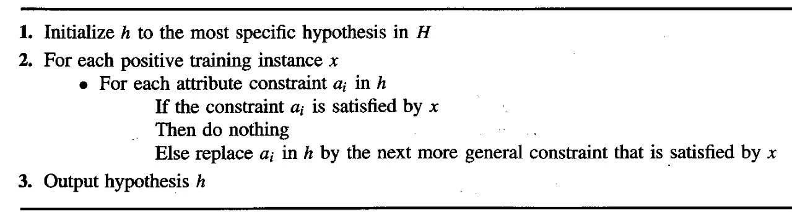
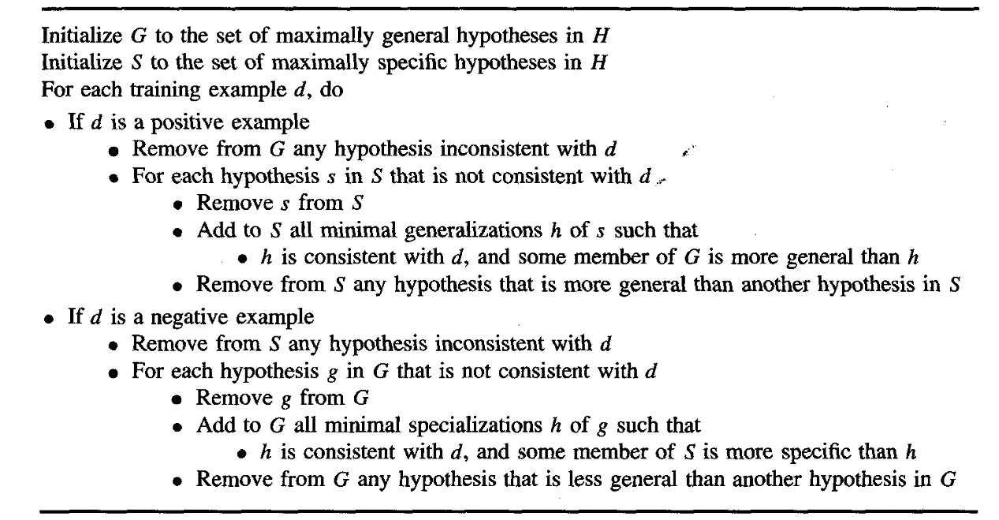
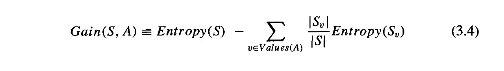

# 机器学习笔记 2

> 原文：<https://medium.com/hackernoon/machine-learning-notes-2-c0fe5a841c54>

## 来自机器学习——汤姆·m·米切尔

机器学习处于人工智能进步的最前沿。随着每天都有新的研究出来，它在快速发展。这篇文章是对重要概念和笔记的延续，从基础知识开始推进，出自《机器学习》**，作者汤姆·米切尔* ***。****

*机器学习笔记 1，请点击下面的链接。*

* [## 机器学习笔记 1

### 来自机器学习——汤姆·m·米切尔

hackernoon.com](https://hackernoon.com/machine-learning-notes-1-c496591f49b8) 

# 第二章:概念学习和从一般到特殊的排序

# **2.1 概念学习**

在预定义的潜在假设空间中搜索最适合训练样本的假设的问题。

> 从输入和输出的训练样本推断一个布尔值函数。

# 归纳学习假说

> 任何在足够大的训练样本集上被发现很好地逼近目标函数的假设也将在未观察到的样本上很好地逼近目标函数。

# 2.2 Find-S 算法

从所有假设中找出最具体的假设或最适合的假设的算法。

该算法仅适用于正例。

一般而言，任何具有一个以上值的正特征实例都应替换为通用术语>，该术语适用于两个值。

算法:

最具体的假设，不允许任何新的值适合。

h←<**ϕ,ϕ,ϕ,ϕ,ϕ>t16】**

# 缺点:仅为正面实例定义。

# **2.3 候选人淘汰**

为我们提供了一个训练示例的最具体&最一般的假设。

考虑正反两方面的情况。

返回**一般假设(G)** 和**具体假设(S)**

# 2.4 感应偏置

> 归纳偏见谈论的是未被观察到的实例，假设如何对其做出反应。

假设对于测试数据中面临的未观察到的实例可能不完美，这是因为它从未面对过。

为了克服这一点，我们已经:**无偏见的学习者**

其解决方案是假设应该能够表示实例 X 的每个可能的子集，即对于 X 的所有子集，X 的幂集。这使得假设函数 V(h) ←h '的学习

其中 h '是未观察实例后的假设状态。* 

# *第 3 章:决策树学习*

# *3.1 导言*

> *决策树学习是一种逼近离散值函数的方法，对噪声数据具有鲁棒性，能够学习析取表达式，是归纳推理的一种实用方法。*

*决策树通过从根到某个叶节点对实例进行排序来对实例进行分类，这提供了实例的分类。树中的每个节点都指定了实例的某个属性的测试，从节点向下的每个分支都对应于属性的一个可能值。*

# *3.2 决策树学习的问题集*

*   *实例由一个属性值对表示。*
*   *目标函数有一个离散的输出值。*
*   *可能需要一个分离的描述。*
*   *训练数据可能包含错误。*
*   *训练数据可能包含缺失值。*

# *3.3 ID3*

*信息增益，衡量一个给定的属性如何区分训练。*

*为了精确地定义信息增益，我们定义了熵，它表征了任意样本集合的杂质。*

**

*更一般化*

**

*属性有效性的度量是信息增益。*

**

*与较大的树相比，ID3 在较短的树中更好。*

**

***问题:**避免数据过拟合。*

*可以通过两种主要方式避免:*

*   *这种方法使树更早停止生长，直到它达到完美。*
*   *这种方法允许对数据进行过度拟合，然后对树进行后期修剪。**(更成功)***

*可以采取的一些其他方法。*

*   *使用不同于培训示例的一组单独的示例。*
*   *使用所有训练数据，但应用统计测试来估计修剪特定节点以产生超出训练集的改进。*
*   *使用明确的复杂性度量。*

***修剪**:删除以该节点为根的子树。仅当树的性能比原始树差时执行(删除节点)。*

**记得给这个帖子一些*👏如果你喜欢的话。关注我了解更多内容。*

*访问我的 github repo:*

* [## sahilverma0696 -概述

### Python 和 C++开发人员。机器学习爱好者。sahilverma 0696 . github . io-sahilverma 0696

github.com](https://github.com/sahilverma0696)*