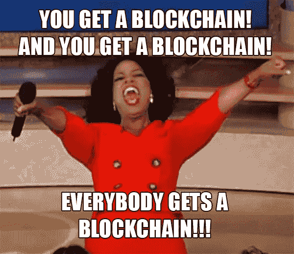

# 主流媒体对加密货币的误解-事实是什么？

> 原文：<https://medium.com/hackernoon/mainstream-media-misconceptions-about-cryptocurrencies-what-the-actual-facts-are-5c443180b39d>

## 区块链和加密货币现在是常见的概念。人们在许多论坛、新闻网站和报纸上广泛地写下和谈论它们。


[Source](https://unsplash.com?utm_source=medium&utm_medium=referral)

关于区块链技术的信息可以在各种平台上获得，个人作者和公司可以给出他们自己对区块链技术的看法和评估。

在关于区块链和加密货币的浩瀚信息海洋中，存在几个误解，贬低了区块链技术和加密货币的真实性质。

本文强调了围绕加密货币的误解，揭开了它们的神秘面纱，并揭示了加密货币的真实性质、用途和服务，从而为加密货币投资者和普通公众提供了一个清醒的加密货币表现，以防止被误导的加密货币投资。

# 了解加密货币

关于加密货币的两个最常见的误解是，加密货币是用来取代法定货币的，加密货币都是一样的，但事实并非如此。对加密货币的进一步分析揭示了这两种形式的加密货币之间存在的差异以及它们的用途。

各种来源的加密货币的基本定义是“使用加密技术保护金融交易、验证交易和创造新的货币单位的数字交易媒介。”大多数加密货币都是在构思阶段创建的..创建一个加密签名，对每笔加密货币交易都是唯一的，证明加密货币的真实性。

> 加密货币分为两大类；**硬币**和**代币**。

## 硬币

硬币用于金融交易，是 ICOs 期间推出的加密货币(因此称为初始硬币发行)。硬币包括仅用于金融交易的加密货币，如比特币；因此，在一些实体店和网上商店中，它被作为一种替代支付方式提及。

## 代币

其他类型的加密货币是代币。代币代表一种形式的公用事业、资产或两者兼而有之，通常在不太可能出现货币用例的区块链发行。代币具有市场价值，但不被视为硬币。它们就像区块链生态系统中的次级资产，可以交易。

代币有时会被一些投资者误认为股票。虽然它们有惊人的相似之处，代币和股票却有着根本的不同。股份代表公司的部分所有权，而代币则是产品、资源和服务的交换媒介。了解这两种资产之间的差异将有助于投资者做出明智的选择。

从对加密货币类型的解释来看，很明显只有硬币可以代替法定货币使用。比特币和以太坊等加密货币可以用来在接受它们的机构之间进行购买。它们也可以作为财富的储存手段，比如美元等法定货币。然而，这并不意味着它们可以取代法定货币，因为它们的价值通常与法定货币挂钩，主要是美元。

另一方面，代币是用于内部购买的。代币可以在他们自己的区块链平台上用作交易媒介，正如目前通过数以千计的上市加密货币所看到的那样。代币可以在加密货币交易所上市，在这里，根据代币具有的交易边界，代币也可以用作价值存储。

代币和硬币都是由区块链的分布式账本技术(也将讨论)管理的。硬币和代币都存储在装有加密货币的加密钱包中。数字钱包拥有公钥和私钥，私钥允许您转移存储的加密货币，而公钥允许从其他用户接收加密货币。

上面的解释揭示了一个错误，即所有加密货币都像比特币一样，它们是为了取代传统的法定货币而发明的。我们已经看到，每一类加密货币都有其基于其起源平台的独特用途。

> 另一个常见的误解是加密货币不受管制。所有加密货币都源于其底层的区块链技术，该技术是基于平台创建者确定的共识算法来控制的。此外，加密货币满足可替代性、稀缺性、可转移性、可分性和持久性的要求，这些都需要某种程度的控制才能实现。

# 了解分布式分类帐技术(DLT)

分布式账本技术是区块链背后的主要技术。它使用来自任何地点的独立计算机(称为节点)来记录、共享和同步各自电子分类账中的交易。区块链使用分布式账本技术将其数据组织成块，并以不可变的仅附加模式存储。

分布式账本技术可以改变我们的日常运营。根据 DLT 的定义，有“事务/数据的同步”和“数据的存储”交易/数据的同步在数据的组织中是至关重要的，尤其是那些大规模交易，而数据的存储，以分布式方式完成，如 DLT 所提供的，简化了记录保存和检索。一旦实施，这些技术可能会改变世界上的大多数系统。

通过区块链模型的交互记录使得价值的不变转移成为可能，而不需要中央实体来验证或协调。在区块链的情况下，转移的价值由加密货币表示，如上所述，加密货币可以是硬币或代币。因此，数据的同步和传输由加密货币支持，但不依赖于加密货币，因为它们是区块链平台中的价值衡量标准。

因此，从对加密货币和分布式账本技术的解释可以得出结论，加密货币不仅仅是无人控制的虚拟货币，而是作为区块链技术的支持机制。



With the rate of development, the continued adoption of blockchain will only continue to increase | [Source](http://ezemaitis.com/10-crypto-predictions-2018-don-tapscott/blockchain-meme/)

为了进一步证明加密货币不仅仅是“虚拟货币”，我们将讨论加密货币的一些应用。

# 流程改进

在金融科技和银行等领域，加密货币拥有令行业兴奋的革命性力量。加密货币允许降低运营此类机构的管理费用，同时允许降低交易费率，根据机构的不同，交易费率甚至可以降低到几乎为零。

加密货币的好处正在全球范围内得到体现，这促使 Circle、PayPal 和 Subway 等公司在其应用程序中集成加密货币支付和投资选项。像 [TMX 全球](https://businesstoday.co.ke/global-logistics-cryptocurrency-firm-opens-branch-kenya/)和 [JP 摩根](https://www.jpmorgan.com/global/news/digital-coin-payments)这样的公司甚至已经推出了他们的加密货币来帮助他们的运营。区块链应用有可能显著提高运输效率；因此，TMX 环球所表现出的信心。

加密货币的其他应用也可以在开源和分散的超级计算机中看到，如假人使用其基于以太坊的 GNT 令牌作为其平台上的价值存储。

除了改进流程，通过使用加密货币支持的区块链技术，创新解决方案的创建和实施也成为可能。分散的云存储和公证只是加密货币在确保其成功方面发挥支持作用的一些例子。

# 辅助服务

像 Aelf 这样的平台热衷于使 dApp 开发和整个区块链的采用变得更容易。它引入了可扩展节点、并行处理、共识协议、互操作性和智能合同优化等功能，以简化其平台上的 dApp 操作。它还具有侧链，有助于隔离其平台上的不同 dApp 操作，允许以最少的费用和开发人员资源对单个 dApp 进行详细定制。通过这些改进，该平台可以轻松运行许多 dApps。

其基础是通过加密货币和区块链技术，使每个负责方都能获得权力下放，从而改善服务。用户可以创建自己的 dApps，这可以显著改善他们的日常运营和服务。用户也可以拥有这些平台的加密货币，他们可以将其用作价值储存手段或交易货币。

理解区块链空间中的加密货币及其本质，可以揭开主流媒体所持的许多不一致和误解。因此，在计划投资加密货币时，可以做出明智的决定。

```
***Disclaimer:*** *Please only take this information as my* ***OWN*** *opinion and should not be regarded as financial advice in any situation. Please remember to* ***DYOR*** *before making any decisions.*
```

♂️你好，我叫萨尔。*如果你觉得这篇文章很有用，并想看我的其他作品，请务必鼓掌并关注我的* [*中型*](/@salmanmiah) *和* [*LinkedIn！*](https://linkedin.com/in/salman-miah-57aa90a0/) *😎*