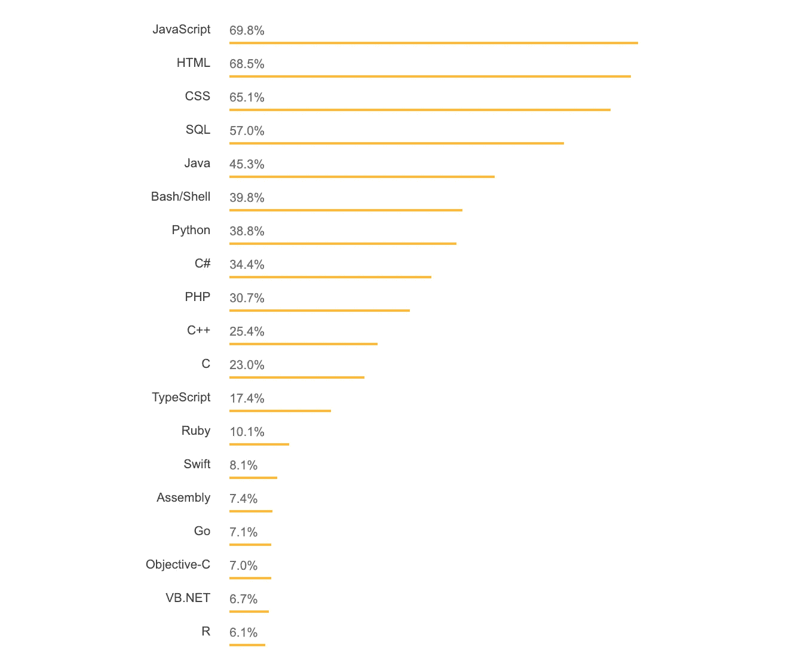
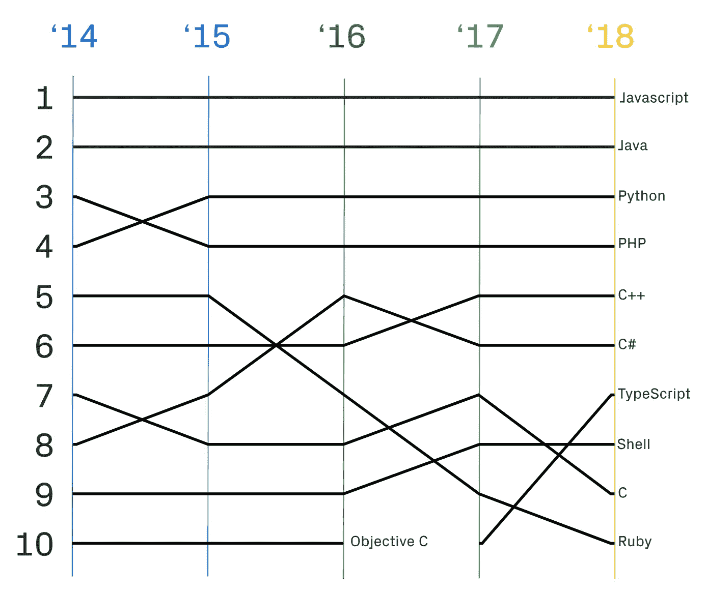
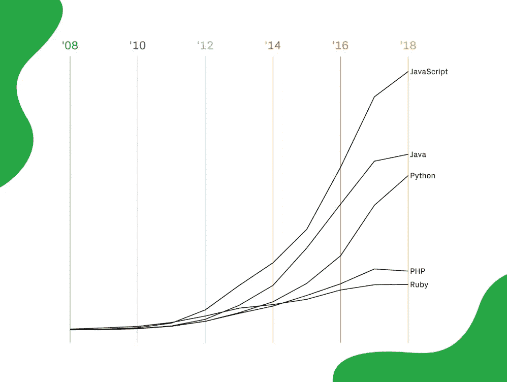
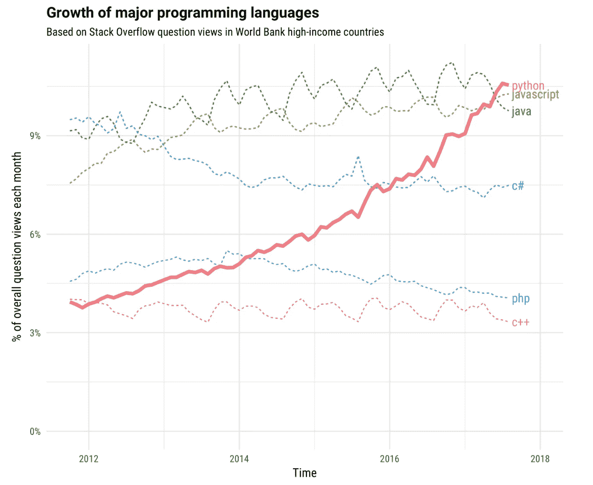
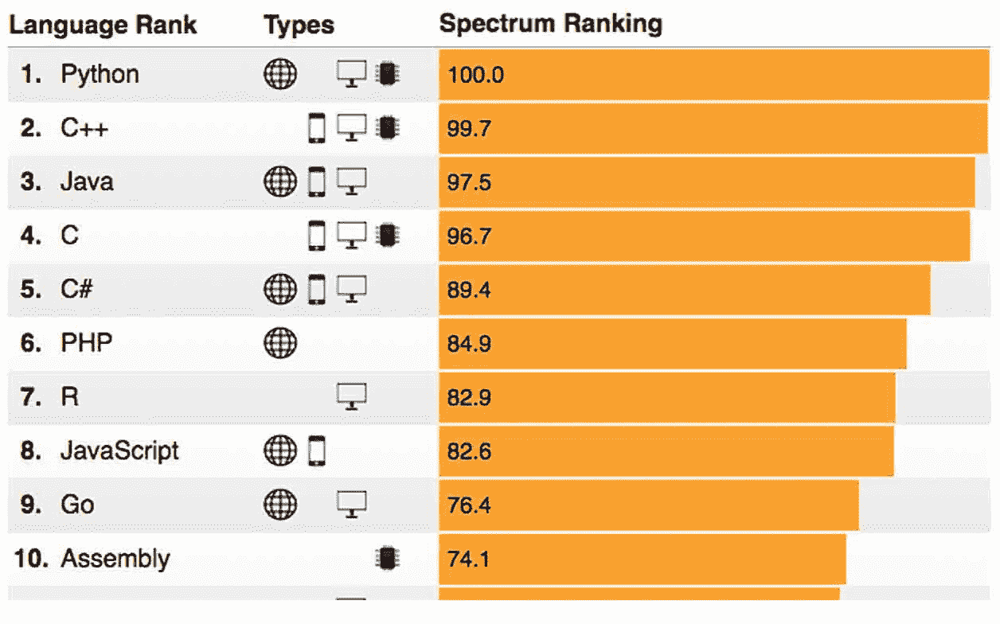
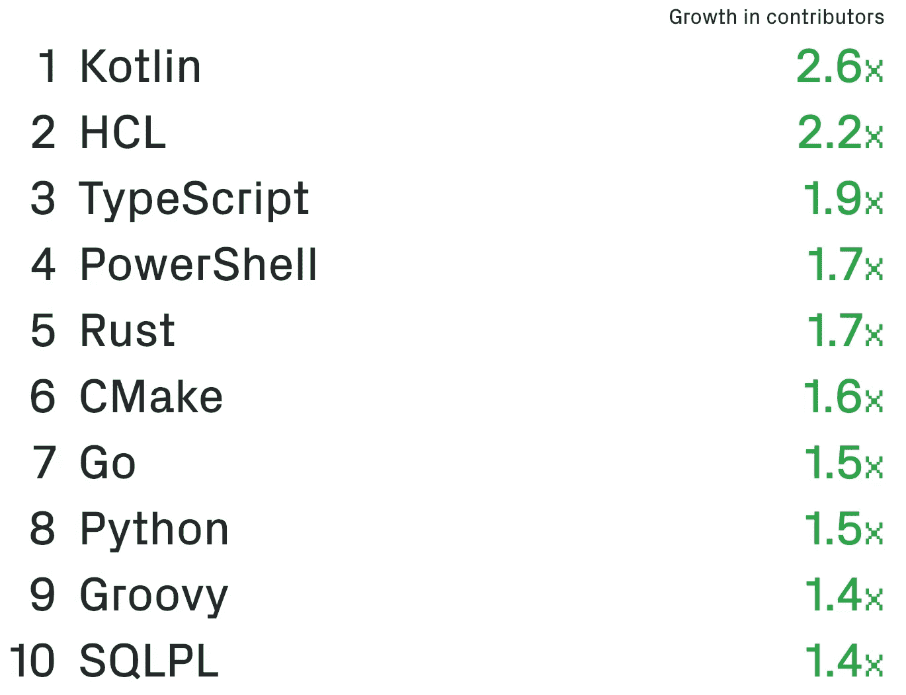

# 2019 年要准备的主要编程趋势

> 原文：<https://medium.com/hackernoon/major-programming-trends-to-prepare-for-in-2019-169987cc75f4>

新年总是一个反思过去一年的好时机，也是一个展望来年和想象未来的好时机。

对于程序员来说，这是一个思考你想要学习的新技能或者你想要参与的有趣项目的好时机。在 Indorse，我们最近就 2019 年将会发生什么进行了一次小组讨论，团队提出了一些有趣的想法。

下面，我们将介绍一些需要准备的主要编程趋势，以帮助您在 2019 年保持领先地位——但在此之前，我们会回顾一下 2018 年的关键编程主题。

# 2018 年编程趋势回顾

[栈溢出](https://stackoverflow.com/)和 [GitHub](https://github.com/) 都有大量关于最常用或最流行编程语言的数据集。

以下来自 Stack Overflow 的图表显示了 2018 年最受欢迎的语言。如您所见，JavaScript 名列榜首，这并不奇怪:它继续在任何地方被使用，包括前端和后端开发。事实上，这是 JavaScript 连续第六年高居榜首。

Source: [Stack OverFlow](https://insights.stackoverflow.com/survey/2018#most-popular-technologies)

来自 GitHub 的数据也将 JavaScript 放在了首位(见下图)。据 GitHub 称，JavaScript 在公共和私有存储库中拥有最多的贡献者，跨越各种规模的组织，遍布世界各地。

Source: [GitHub Octoverse Report](https://octoverse.github.com/projects)

从其他方面来看，JavaScript 也是至高无上的。除了拥有最多的贡献者之外，JavaScript 还代表了 2018 年创建的最多的新 GitHub 知识库，如下图所示。

Top programming languages by repositories created, 2008–2018\. Source: [GitHub Octoverse Report](https://octoverse.github.com/projects)

这种快速增长部分得益于 node . js(2009 年推出)等新的 JavaScript 服务器，它允许程序员在客户端和服务器端使用相同的代码。

但是其他语言呢？Python 和 C++的排名都上升了，而 C 下降了一点，Ruby 从第五名跌至第十名。TypeScript 是另一个大赢家，去年从第 10 名升至第 7 名。

我们在 2018 年看到的趋势将如何影响 2019 年的编程世界？显然，JavaScript 仍将是一种占主导地位的语言。但是还有其他发展更快的语言。

# 2019 趋势 Python 能赶上 Java 吗？

如果你看上面的图表，你会发现 Python 已经是世界上第三流行的编程语言。根据 Stack Overflow，2018 年超过 C#，2017 年超过 PHP。但是 Python 只是最近才达到这个地位。

下图展示了 Python 的迅速崛起。

Source: [Stack Overflow](https://stackoverflow.blog/2017/09/06/incredible-growth-python/)

> 发生了什么事？

毫无疑问，对人工智能(AI)日益增长的兴趣推动了 Python 的发展。而且工程师们似乎很喜欢用它编程:根据一项[调查](https://spectrum.ieee.org/at-work/innovation/the-2018-top-programming-languages)，Python 是 2018 年 IEEE 成员最喜欢的语言。

Source: [IEEE Spectrum](https://spectrum.ieee.org/at-work/innovation/the-2018-top-programming-languages)

Python 在 2017 年的 IEEE 调查中也名列榜首，只是勉强击败了 c。它似乎正在取代 R 的许多用途(R 是一种处理统计和大数据的专门语言，对人工智能和机器学习应用程序至关重要)。

用于统计和机器学习的 Python 库的可用性很可能使 Python 成为比 R 更有吸引力的机器学习语言。总的来说，与 R 相比，使用 Python 可以做更多的事情，R 实际上只是用于统计和大数据。例如，您可以使用 Python 来构建游戏、网站、商业应用程序等等。

因此，如果你正在考虑进入人工智能和机器学习领域——或者如果你已经在用 R 做这种工作——Python 是你在 2019 年必须学习的语言。

# 2019 趋势#2: TypeScript 现在是十大语言之一

根据最新的 [GitHub Octoverse 报告](https://octoverse.github.com/projects)，TypeScript 现在是第七大最常用语言，高于 2017 年的第十位(见上面我们分享的第二张图表)。正如你在下面的图片中看到的，它是第三种增长最快的语言。

Fastest growing languages by contributors as of September 30, 2018\. Source: [GitHub Octoverse Report](https://octoverse.github.com/projects)

TypeScript 本质上是 JavaScript 的一个**强类型**版本，旨在实现类型安全和互操作性。因为它是强类型的，你永远不需要为变量定义类型，因为它们已经被[类型推断](https://en.wikipedia.org/wiki/Go_(programming_language)#Language_design)定义了。

有趣的是，你可以用 TypeScript 编码，然后**trans file**(转换)你的代码到 JavaScript。这意味着您可以使用 TypeScript 来规避 JavaScript 的一些更烦人的特性。

# 2019 趋势# 3:“Go”让编程变得更简单

[Go](https://tip.golang.org/doc/faq#go_or_golang) 首次登上[2018 年 IEEE 十大榜单](https://spectrum.ieee.org/at-work/innovation/the-2018-top-programming-languages)(见上图 IEEE 频谱图)。根据 IEEE，它也是发展速度第五快的语言，根据 GitHub，它是发展速度第七快的语言。这一定很特别。我们来看看为什么。

Go 是 Google 推出的开源编程语言。它在语法上类似于 C，但是像 Python 一样，比大多数其他语言更容易读写。这也许是它如此迅速流行的一个原因。

Go 也是强类型的(像 TypeScript 一样),你可以将它用于各种前端和后端应用程序。您还可以使用 Go 构建并发应用程序，在执行过程中将工作分解成多个线程。令人惊讶的是，你甚至可以把你的 Go 代码转换成 JavaScript。

显然，谷歌正在考虑将其产品过渡到 Go，这将有助于进一步推动该语言的普及。所以如果你想在 2019 年寻找一门新的语言来学习，那么 go 绝对不会错。

# 结论

现在你知道了:2019 年值得关注的三大编程趋势是 Python、TypeScript 和 Go 的崛起。如果你想学习一门新的语言，这三个都是不错的选择。

如果你想对大数据进行统计分析或机器学习，你可能会选择 Python。或者，您可能决定使用 TypeScript，以便用 JavaScript 编写代码。如果你习惯用 C 语言编码，Go 可以让你的生活变得更简单，如果你需要的话，它可以让你把代码转换成 JavaScript。

像 Go 和 TypeScript 这样的新语言会让学习 JavaScript 成为过去吗？这肯定会让许多新开发人员感到高兴。但现在说还为时过早。可以肯定的是，我们将在 2019 年看到更多这三种语言(Python、TypeScript 和 Go)。

# 想要测试您的编程技能吗？

在编程实践之前、之后和/或期间，对自己所处的位置有一个客观的想法是很重要的。为了公平简单地评估您的编程技能， [**在 Indorse 平台上分享您的代码**](https://indorse.io/claims/new?utm_source=Medium&utm_term=Share_Code&utm_content=Major_Programming_Trends_to_Prepare_for_in_2019_Share) ，让我们的专家开发者审查您的代码并评估您的技能！

[Python](https://indorse.io/claims/new?utm_source=Medium&utm_term=Python&utm_content=Major_Programming_Trends_to_Prepare_for_in_2019_Python)|[c#](https://indorse.io/claims/new?skill=c&utm_source=Medium&utm_term=C&utm_content=Major_Programming_Trends_to_Prepare_for_in_2019_C)|[Java](https://indorse.io/claims/new?skill=java&utm_source=Medium&utm_term=Java&utm_content=Major_Programming_Trends_to_Prepare_for_in_2019_Java)|[PHP](https://indorse.io/claims/new?skill=php&utm_source=Medium&utm_term=PHP&utm_content=Major_Programming_Trends_to_Prepare_for_in_2019_PHP)|[JavaScript](https://indorse.io/claims/new?skill=javascript&utm_source=Medium&utm_term=JS&utm_content=Major_Programming_Trends_to_Prepare_for_in_2019_JS)|[Ruby](https://indorse.io/claims/new?skill=ruby&utm_source=Medium&utm_term=Ruby&utm_content=Major_Programming_Trends_to_Prepare_for_in_2019_Ruby)

**考虑使用 Indorse 来预先筛选你的技术候选人**？我们给你涂上了 Naqib！

