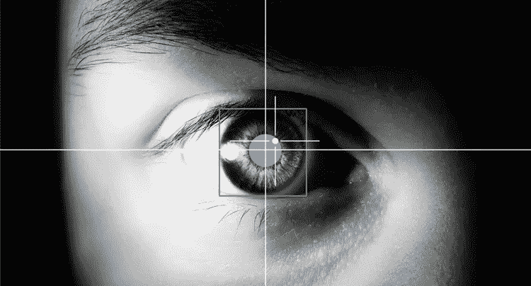
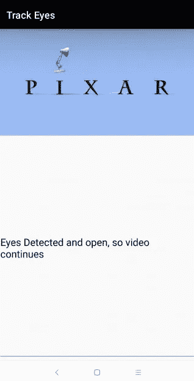
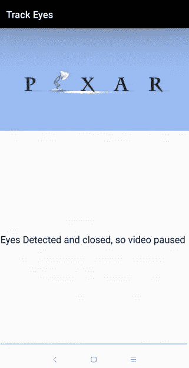

# 作为初学者制作一个眼球追踪和人脸检测应用程序

> 原文：<https://medium.com/hackernoon/make-an-eye-tracking-and-face-detection-app-as-a-beginner-d72e0139546b>

我们都知道，当 android 应用程序可以检测我们的面部或跟踪我们的眼睛是闭着还是睁开时，它看起来有多酷。当应用程序甚至可以检测我们是否在微笑、在手机上阅读或不看手机时，这变得更酷了。

嗯…

> 我相信..任何吸引我的东西，都会让我建造它！

抱歉，尝试了一个“黑暗骑士”双关语:)

因此，让我们使用谷歌视觉 API 制作一个 android 眼球跟踪和人脸检测应用程序。

来自谷歌:

> **云视觉 API** 通过将强大的机器学习模型封装在一个易于使用的 REST API 中，使开发者能够理解图像的内容。它可以快速地将图像分为数千种类别(例如，“帆船”)，检测图像中的单个对象和人脸，并读取图像中包含的印刷文字。您可以在您的图像目录上构建元数据，缓和攻击性内容，或者通过图像情感分析实现新的营销场景。

在这里，我们将制作一个 android 应用程序，可以跟踪我们的面部，并检测我们的眼睛是闭着还是睁着。



track eye

听起来很酷？这并不难。

因此，让我们深入了解这在一个简单的流程图中是如何工作的。

我们的 android 应用程序→使用相机→检测面部→开始一些操作→检查查看者的眼睛是否睁开→继续操作→如果眼睛闭上→停止操作。

这是我们 android 应用的基本理念。出于学习目的，我们将只在我们的应用程序中做这么多，但更多的高级功能可以使用谷歌视觉 API 添加。

我们将在应用程序中执行的操作是播放一个简单的视频。嗯，我选了一段来自 [**皮克斯动画**](https://www.google.com/url?sa=t&rct=j&q=&esrc=s&source=web&cd=1&cad=rja&uact=8&ved=2ahUKEwjQwPGqvuLfAhUSqaQKHbjmAtMQFjAAegQIAhAB&url=https%3A%2F%2Fwww.pixar.com%2F&usg=AOvVaw3ljkKg1b3PA_wsLJzsSPYO) **的视频。**

你可以在这里找到该应用的完整源代码。

在你的 IDE 中启动一个新的 Android 项目,就像 Android Studio 或任何其他项目一样。

转到**清单文件**并添加以下权限，对于此应用程序，我们需要使用设备前置摄像头的权限。

```
<uses-permission android:name="android.permission.CAMERA" />
```

我们还必须在我们的 android 应用程序中导入 **Google Vision API** ，所以直接进入 app 的 Build Gradle，大部分写为**Build . Gradle(Module:app)**。

您将看到一个文本如下的文件:

```
apply plugin: 'com.android.application'

android {
    compileSdkVersion 28
    defaultConfig {
        applicationId "com.pd.trackeye"
        minSdkVersion 15
        targetSdkVersion 28
        versionCode 1
        versionName "1.0"
        testInstrumentationRunner "android.support.test.runner.AndroidJUnitRunner"
    }
    buildTypes {
        release {
            minifyEnabled false
            proguardFiles getDefaultProguardFile('proguard-android.txt'), 'proguard-rules.pro'
        }
    }
}

dependencies {
    implementation fileTree(dir: 'libs', include: ['*.jar'])
    implementation 'com.android.support:appcompat-v7:28.0.0'
    implementation 'com.android.support.constraint:constraint-layout:1.1.3'
    testImplementation 'junit:junit:4.12'
    androidTestImplementation 'com.android.support.test:runner:1.0.2'
    androidTestImplementation 'com.android.support.test.espresso:espresso-core:3.0.2'
    implementation 'com.google.android.gms:play-services:12.0.1'
}
```

如果它看起来像这样，那么你在正确的文件目的地。复制上面的全部代码并粘贴在上面。

你会看到一个弹出的顶栏，说明要同步文件。点击**立即同步**并等待项目构建。

当你在你的建造日志中获得所有绿色 OK 标志后，你就可以继续前进了。

现在让我们来写一些 android 代码来实现这个神奇的功能。转到文件的 **MainActivity** ，声明如下变量，如下所示:

```
private static final String *TAG* = "MainActivity";
VideoView videoView;
EditText textView;

//For looking logs
ArrayAdapter adapter;
ArrayList<String> list = new ArrayList<>();

CameraSource cameraSource;
```

这几行代码应该位于如下代码行的下方:

```
public class MainActivity extends AppCompatActivity {
```

现在让我们在同一个文件中执行 **onCreate()方法**中的神奇代码。

让我们首先在我们的代码中添加一些东西，**允许用户授予添加 android 应用程序的权限，否则我们的应用程序将会崩溃并且无法工作。**

```
if (ActivityCompat.*checkSelfPermission*(this, android.Manifest.permission.*CAMERA*) != PackageManager.*PERMISSION_GRANTED*) {
    ActivityCompat.*requestPermissions*(this, new String[]{Manifest.permission.*CAMERA*}, 1);
    Toast.*makeText*(this, "Grant Permission and restart app", Toast.*LENGTH_SHORT*).show();
}
else {
    videoView = findViewById(R.id.*videoView*);
    textView = findViewById(R.id.*textView*);
    adapter = new ArrayAdapter<>(this,   android.R.layout.*simple_list_item_1*, list);
    videoView.setVideoURI(Uri.*parse*("android.resource://" + getPackageName() + "/" + R.raw.*videoplayback*));
    videoView.start();
    createCameraSource();
}
```

将上面的代码添加到我们前面谈到的`**onCreate()**`方法中。

现在我们应该添加使用 Google vision API 跟踪眼睛的代码。我们将为此创建一个新的`private`类，命名为`**EyesTracker**` **。该类的代码如下所示:**

```
private class EyesTracker extends Tracker<Face> {

    private final float THRESHOLD = 0.75f;

    private EyesTracker() {

    }

    @Override
    public void onUpdate(Detector.Detections<Face> detections, Face face) {
        if (face.getIsLeftEyeOpenProbability() > THRESHOLD || face.getIsRightEyeOpenProbability() > THRESHOLD) {
            Log.*i*(*TAG*, "onUpdate: Eyes Detected");
            showStatus("Eyes Detected and open, so video continues");
            if (!videoView.isPlaying())
                videoView.start();

        }
        else {
            if (videoView.isPlaying())
                videoView.pause();

            showStatus("Eyes Detected and closed, so video paused");
        }
    }

    @Override
    public void onMissing(Detector.Detections<Face> detections) {
        super.onMissing(detections);
        showStatus("Face Not Detected yet!");
    }

    @Override
    public void onDone() {
        super.onDone();
    }
}
```

这里的`videoView`是对应用 UI 的`activity_main.xml`中 **VideoView** 属性设置的视频的引用。

现在我们可以在名为`**FaceTrackerFactory**`的新`private`类中添加检测用户面部的代码。代码看起来会像这样:

```
private class FaceTrackerFactory implements MultiProcessor.Factory<Face> {

    private FaceTrackerFactory() {

    }

    @Override
    public Tracker<Face> create(Face face) {
        return new EyesTracker();
    }
}

public void createCameraSource() {
    FaceDetector detector = new FaceDetector.Builder(this)
            .setTrackingEnabled(true)
            .setClassificationType(FaceDetector.*ALL_CLASSIFICATIONS*)
            .setMode(FaceDetector.*FAST_MODE*)
            .build();
    detector.setProcessor(new MultiProcessor.Builder(new FaceTrackerFactory()).build());

    cameraSource = new CameraSource.Builder(this, detector)
            .setRequestedPreviewSize(1024, 768)
            .setFacing(CameraSource.*CAMERA_FACING_FRONT*)
            .setRequestedFps(30.0f)
            .build();

    try {
        if (ActivityCompat.*checkSelfPermission*(this, Manifest.permission.*CAMERA*) != PackageManager.*PERMISSION_GRANTED*) {
            // *TODO: Consider calling* //    ActivityCompat#requestPermissions
            // here to request the missing permissions, and then overriding
            //   public void onRequestPermissionsResult(int requestCode, String[] permissions,
            //                                          int[] grantResults)
            // to handle the case where the user grants the permission. See the documentation
            // for ActivityCompat#requestPermissions for more details.
            return;
        }
        cameraSource.start();
    }
    catch (IOException e) {
        e.printStackTrace();
    }
}
```

我们还需要暂停视频和结束视频，我们将在`MainActivity`的`onDestory()`和`onPause()`方法中处理。

现在让我们**为应用的基本 UI** 添加一些 XML 代码。

转到名为类似于`activity_main.xml`的文件。现在只需用下面的代码替换其中的代码。

```
<?xml version="1.0" encoding="utf-8"?>
<LinearLayout xmlns:android="http://schemas.android.com/apk/res/android"
    xmlns:app="http://schemas.android.com/apk/res-auto"
    xmlns:tools="http://schemas.android.com/tools"
    android:layout_width="match_parent"
    android:layout_height="match_parent"
    tools:context=".MainActivity"
    android:orientation="vertical">

    <VideoView
        android:layout_width="match_parent"
        android:layout_height="wrap_content"
        android:id="@+id/videoView"/>

    <EditText
        android:layout_width="match_parent"
        android:layout_height="match_parent"
        android:id="@+id/textView"
        android:text="@string/face_not_found"
        android:textSize="20sp"/>

</LinearLayout>
```

这段代码所做的就是添加一个`EditText`来显示文本，说明什么被检测到，什么不被用户检测到。以及为用户播放视频的`VideoView`。

你可以在这里找到这个应用的完整源代码。

差不多就是这样。你已经开发了自己的眼球追踪和面部检测 android 应用程序。

一切完成后，看起来是这样的:



Eyes open



Eyes closed

现在去炫耀吧！！

阅读我之前的一篇关于 android 库的文章，它可以用很少几行代码轻松地帮助你定制 Snackbar。巧克力棒。