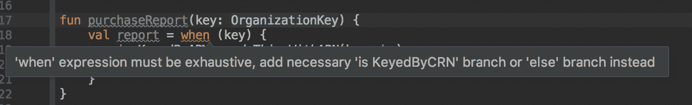

# 使非法状态不可再现:科特林数据类版

> 原文：<https://medium.com/hackernoon/make-illegal-states-unrepresentable-kotlin-data-class-edition-96ec84ad4e29>

## 因为墨菲定律是一种软件工程技术

Photo by [SpaceX](https://unsplash.com/@spacex?utm_source=medium&utm_medium=referral) on [Unsplash](https://unsplash.com?utm_source=medium&utm_medium=referral)

## 墨菲定律和软件工程

墨菲定律通常被引用为:“任何可能出错的事情都会出错。”我们当中的学究们会知道，这实际上不是墨菲定律。这是欺诈法则。或 Sod 的法律。墨菲的实际法则更好地表述为:“如果有两种或更多种方式来做某事，其中一种方式可能导致灾难，那么有人会以那种方式来做。”

墨菲定律的起源通常归因于爱德华·a·墨菲，他是 1949 年美国空军 MX981 项目的一名工程师。空军想知道如果将脆弱的人体加速到可笑的速度，会发生什么。显然，测试这一点的最佳方法是让人体加速到可笑的速度。所以他们把一个可怜的测试对象绑在雪橇上，把火箭绑在背上，然后发射出去。我敢肯定*我在一部漫步者卡通片里见过。*

为了将这个“实验”从幸灾乐祸转化为科学，他们在测试对象身上安装了 16 个加速度计。有两种可能的方式来连接传感器。正确的方式，和错误的方式。每个传感器都装错了。所以这毕竟是幸灾乐祸。

但这也是工程学上的一课，因为如果传感器没有被设计成有两种可能的安装方式，并且其中一种不正确，灾难就不会发生。这个原则可以被推广，当然也适用于软件工程。

特别是，如果我们有幸使用类型化语言——让类型尽可能地做更多的工作。编写您的代码，这样就不可能以错误的方式构造对象或调用方法。这不是一个新的想法，但在具有表达类型系统的语言中更容易做到，如 OCaml、F#、Scala 和 [Idris](https://www.idris-lang.org/) 。

在这篇文章中，我们将看看科特林。特别是如何简单而有力地将数据类、密封类和空安全结合起来，以消除通常困扰 Java 程序(以及具有类似特性的语言)的一类错误。

## 用例:订购信用报告

澳大利亚的企业可以通过澳大利亚企业编号(ABN)或澳大利亚公司编号(ACN)进行唯一识别。所有注册企业都将有一个 ACN。首选标识符是 ABN，但不是所有的企业都有 ABN。由于商业实体和信用报告的复杂性，我们需要通过 ABN 或 ACN 识别业务的能力。

因为我们是优秀的开发人员，喜欢验证，讨厌[字符串类型的](http://www.codinghorror.com/blog/2012/07/new-programming-jargon.html)编程，所以我们为 ABN 和 ACN 创建值类型，就像这样:

Value classes with validation

接下来假设我们需要一个为公司购买报告的方法。我们可以提供 ABN 或 ACN。孤立地考虑，首先想到的可能是重载方法，比如:

然而，让我们假设我们正在构建一个管道，它需要我们的业务密钥通过多个处理步骤来传递。这很快使重载方法站不住脚。你可能会考虑的下一件事是把两者放在一个参数类中。

Data class with nullable types

就目前而言，那很好。但是如果它们都是空的呢？无论我们的业务关键字放在哪里，我们都会得到这样的代码:

Famous last words…

你写过这样的代码吗？我当然有。在 Java 中，这被认为是很好的实践！防御性编程。覆盖你所有的基地。即使是不可能发生的事情。因为，记住墨菲定律，如果它可能以错误的方式发生——它就会发生。通常在凌晨 2:00 当你需要帮助的时候。

科特林给了我们更好的选择。让我们试着消除那些讨厌的无效支票。

## 尝试 1:构造函数验证

当我们构造一个`OrganizationKey`时，我们可以验证至少有一个 ACN 或 ABN 存在。它看起来会像这样:

Constructor validation

老实说，也没好多少。我把这种解决方案称为“把食物铲到你的盘子里”。有时你可以将问题转移到其他地方，但它仍然存在。

实际上，由于我们使用的是 Kotlin 数据类，所以一点好处也没有。Kotlin 数据类公开了一个“复制”操作符，这使得睡眠不足的开发人员可以做错误的事情，绕过构造函数验证。像这样:

Damaged data class

## 尝试 2:工厂方法

如果您从 Java 进入 Kotlin，另一种可能出现的方法是使用工厂方法。

在科特林，它看起来像下面这样:

Factory methods

事实上，如果你在 IntelliJ 中尝试这样做，IDE 本身会给你一个难看的黄色曲线，说明“copy”方法允许你绕过私有构造函数。所以实际上这个解决方案并不比上面的好。

您可以将其更改为非数据类，以避免暴露复制方法，但这只是一个遗憾。幸运的是，我们的问题确实有一个简单的解决方案。

## 尝试 3:密封类

让我们子类化`OrganizationKey`，给每个子类一个 ABN 或者一个 ACN。然后我们可以使它们不可空。我们应该让它成为一个“密封的”类——原因稍后会解释。

Sealed data class

那更好！我想我们可能已经破解了。当我们需要使用我们的密钥时，它看起来像这样:

请注意这里的“智能转换”。与 Java 不同，在类型检查之后，您不需要将 organization 键转换成子类。此外，现在我们已经消除了在 ABN 或 ACN 周围有一个可空类型的需要，我们不能意外地构造一个无效的键。

ABN is no longer nullable.

上面的代码无法编译。任务完成。

请注意，这并不能保护您免受试图注入 bug 的恶意参与者的攻击。同样，反射，或者任何进出 Java 库的东西，尤其是像 Hibernate、GSON、Jackson 这样的编组和解组的库，都可能让你的战舰沉没。但是您有更强的编译时保证，防止有人意外地以错误的方式使用该对象。

但是为什么我们需要把`OrganizationKey`做成一个密封的类呢？因为有了这个小小的关键词，我们就多了一层保护。

## 有人多加了一种类型怎么办？

啊哦。现在我们要在使用密钥的地方添加一个额外的分支。希望我们有好的测试！

实际上，我们这样更好。将`OrganizationKey`标记为 sealed 允许编译器在表达式中使用 when 语句时进行穷举检查。

我们将不得不改变'`purchaseReport`'来返回一些东西而不是返回单元，但是编译器将会捕捉任何没有检查所有可能类型的`when`语句。

Screenshot from IntelliJ, showing compile error due to missing check for KeyedByCRN

## 额外提示:解包“联合”类型

当我们在应用程序内部传递它时，我们的`OrganizationKey`工作得非常好。如果我们需要再次通过网络将它发送给另一个服务，我们可能需要弄清楚我们正在处理哪个键，这样我们就可以适当地构建一个 d to 或 JSON 表示。下面的代码展示了如何使用空安全强制转换和析构赋值来再次解包您的业务密钥。

请注意，与上面的代码不同，如果添加新类型，下面的代码不会显示任何编译器错误或警告。所以最好保留这样的方法(如果你真的需要的话！)非常接近类型定义。

总之，Kotlin 的空安全、数据类和密封类可以用来提供一种优雅的方式来消除经常困扰其他语言的防御性“这永远不会发生”分支。(看你的，Java！)以此为具体例子，寻找其他机会来构建您的代码，这样就不可能做错事情。我们可以一起创造墨菲定律的历史！

[1][https://www . neatorama . com/2007/05/10/the-real-story-of-the-murphys-law/](https://www.neatorama.com/2007/05/10/the-real-story-of-murphys-law/)