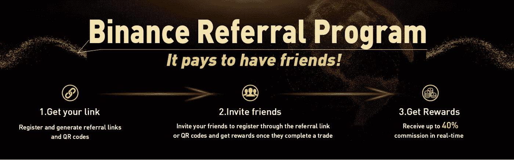
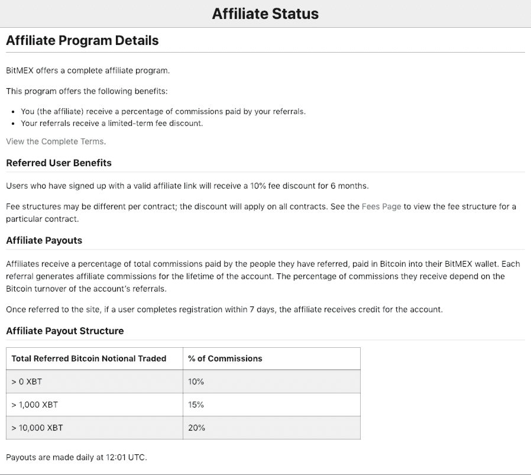
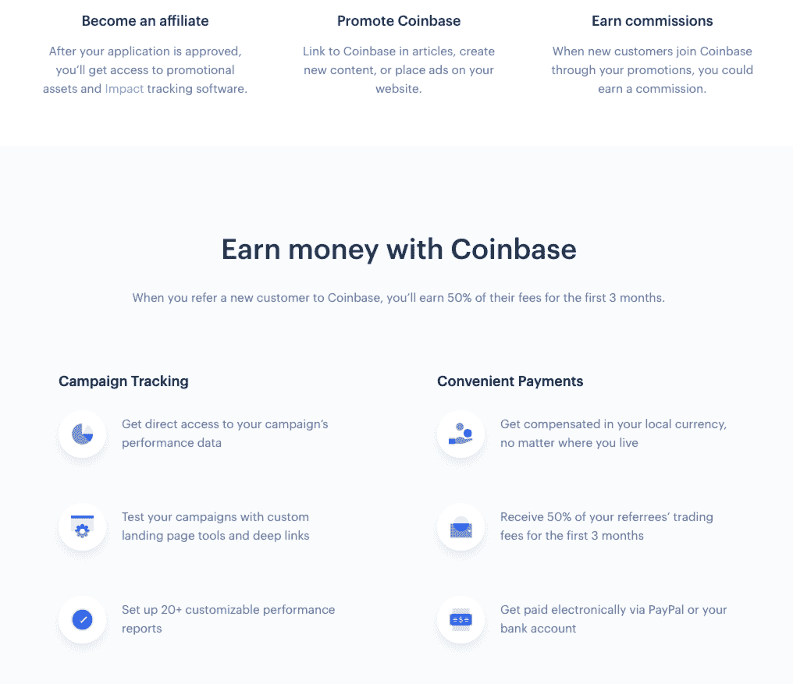
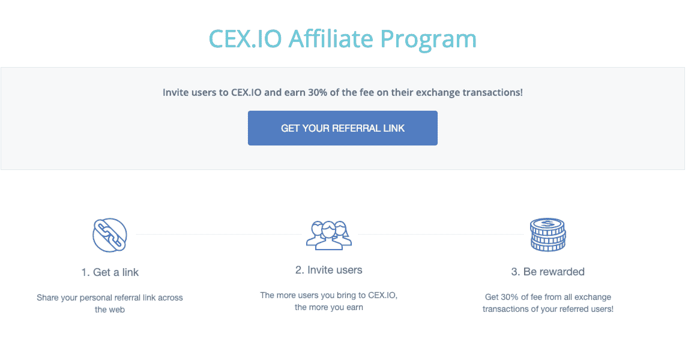
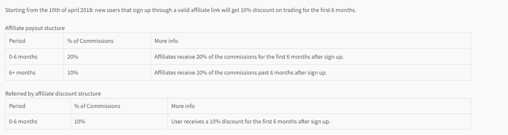
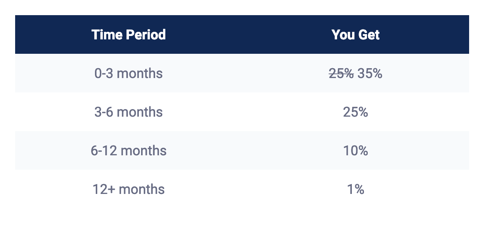
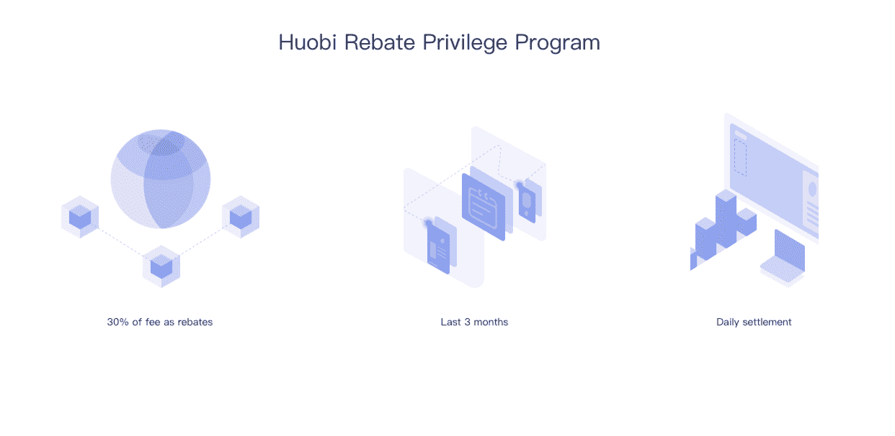
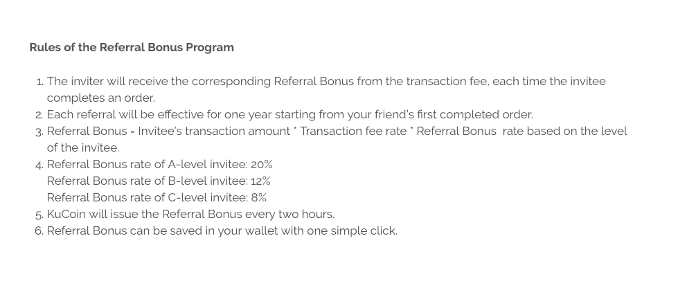
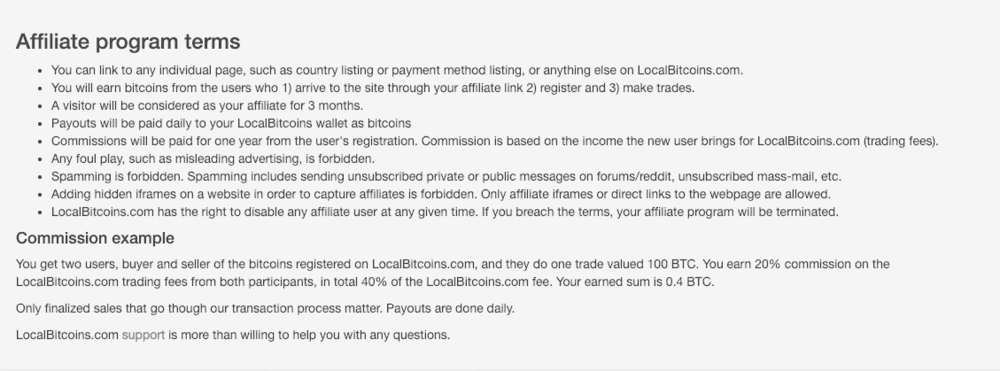
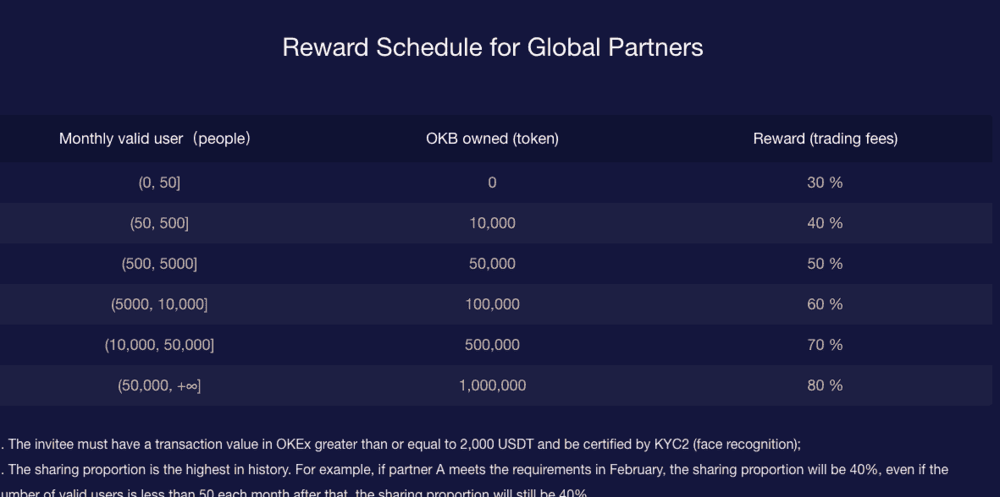

# 不交易赚钱:10 个支付的加密交换附属程序

> 原文：<https://medium.com/hackernoon/make-money-without-trading-10-crypto-exchange-affiliate-programs-that-pay-ba15707dcefa>

## 简单的“注册和分享”计划，鼓励采用数字货币

不管你是密码新手，还是已经交易了近十年，你交易的机会至少部分是因为你喜欢赚钱。幸运的是，交易所增长的最有力的方式之一是通过他们的会员计划与他们的用户分享利润。

会员链接是普通交易者通过与他们的网络、家人或朋友分享信息来赚钱的一种方式。从本质上讲，所有行业的公司和品牌都通过激励更多用户购买产品或注册来奖励用户分享他们的产品或服务。

例如，领先的在线零售商亚马逊有一个会员计划，向会员支付通过其独特的会员链接产生的销售额的一定比例。此外，许多信用卡博客也利用联盟计划来创收。

因此，领先的交易平台也将利用联盟计划的力量来增加用户数量，并在加密领域发展一个值得信赖的品牌，这是有道理的。

今天，我们为交易平台列出了一些最好的联盟计划。这些交易所不仅提供了独特的交易体验，还能帮助你在这个过程中赚到钱。事实上，一些交易者和密码爱好者，只要向他们的网络推荐交易所，就能赚到五到六位数的收入。

# 币安:裁判交易费的 20-40%

作为世界上最受欢迎的加密交易平台之一，币安的联盟计划与其他顶级交易所提供的服务一致。将用户推荐到交易所后，您将实时收到被推荐用户交易费的 20%的佣金。

此外，持有 500 枚 BNB 代币(币安代币)的用户，可以获得高达推荐用户交易费 40%的佣金。

众所周知，币安还会在特定促销和其他与加密相关的重大活动中提高推荐费。

**准备加入币安或想测试推荐经验？** [**只需使用我们这里的链接！**](https://www.binance.com/?ref=13001797)

# bit MEX:6 个月 10%的费用折扣

BitMex 是一个受经验丰富的交易者欢迎的交易平台，目前有一个推荐计划，奖励新用户和推荐用户。一旦用户通过您的链接被转介到 Bitmex，用户必须在 7 天内完成注册，以获得支付信贷。

一旦注册完成，被推荐的用户也有资格获得 6 个月 10%的费用折扣。Bitmex 根据交易所持有的 BTC 数量增加%的佣金，详见下表。

Bitmex 每天都会支付合格的推荐费。你可以通过这个(非附属)链接加入。

# 比特币基地:50%的推荐用户交易费，为期 3 个月

作为当今最著名和最受信任的加密交易所之一，比特币基地最近向公众宣布了他们的官方联盟计划，并且他们的初始支付看起来相当慷慨。在新推出的加盟计划之前，推荐人在 BTC 可获得高达 10 美元的奖励。

比特币基地分支机构现在将收到 50%的推荐用户交易费，为期 3 个月。对于符合条件的分支机构，无论您住在哪里，都可以用您的当地货币进行支付，并且您可以选择通过 Paypal 或银行账户进行电子支付。

**对于加密货币世界最温和的介绍和最好的界面之一，** [**你可以通过我们的推荐加入比特币基地。**](https://coinbase-consumer.sjv.io/EVYz2)

如果你有一个观众——比如说，你是一个博客写手或者有影响力的人——并且准备注册成为比特币基地的会员，[点击这里](https://www.coinbase.com/affiliates)查看这个项目。

没有庞大的观众群要迎合却还想赚？任何用户都可以通过一个像这样的简单分支机构推荐新的比特币基地注册，当你的朋友购买或出售至少 100 美元的数字货币时，双方都可以获得 10 美元的免费比特币。

# CEX。IO:向推荐用户支付 30%的交易费用

CEX 是 200 多万活跃交易者的家园。木卫一越来越受欢迎。CEX。IO 的附属计划相当简单。你可以无限期地赚取 30%的推荐用户交易费，在撰写本文时，你可以赚取的金额没有上限。

与榜单上的其他一些交易所不同，CEX 交易所。IO 不会分享额外的利益给注册的推荐用户，但是当你推荐一个用户时，你会永远收到他们 30%的交易费。

**想加入 CEX.io？** [**访问这里的主页。**](https://cex.io/)

# deri bit:6 个月收取 20%的用户交易费，然后降至 10%

加密货币期货和期权交易交易所 Deribit 有一个会员计划，奖励推荐用户和新注册交易所的用户。

注册时使用有效会员链接的新用户将在前 6 个月获得 10%的交易费折扣。推荐新用户的会员计划成员将在注册后的 6 个月内获得被推荐用户交易佣金的 20%。

一旦 6 个月过去了，佣金百分比就会下降到 10%。

美国用户不能注册账户或参与联盟计划，但你可以访问这里的主页。

# EMX:高达 50%的交易费，取决于时间框架

作为一个崭露头角的交易平台， [EMX](https://www.emx.com) 已经承诺了一个非常有利可图的推荐计划，以帮助交易所在启动后有一个良好的开端。该项目是这个名单上最慷慨的项目之一，这是有道理的——EMX 需要建立一个完整的交流受众群——但这样的利率不可能永远持续下去。

他们的[代销商计划](https://promotions.emx.com/affiliate)不仅为新用户和代销商会员提供即时、有竞争力的支付，而且代销商计划还让你接触到个人客户经理以及高转化率多语言营销创意，帮助你提高代销商业绩。

像 Bitmex 一样，他们为新用户和推荐这些用户的人提供奖励，这使得他们的计划对所有人都是双赢的。

50%的佣金提供给选定的合作伙伴，您可以申请获得这一特殊费率。

**我们决定进入 EMX，并希望您** [**通过我们的推荐链接加入我们**](https://trade.emx.com/sign-up/62A85F916635) **！**

引领交易所向公众开放，EMX 承诺提供有限的时间，增加推荐奖金。他们的介绍费如下:

# 火币:前 90 天用户交易费的 30%

一个新加坡的交易平台和密码交易所，Huobi 是世界各地许多交易商的首选交易所。Huobi 的会员计划目前提供推荐用户账户前 90 天交易费的 30%。

奖励以 USDT 或积分的形式发送给会员，然后可以兑换各种加密或其他法定面值。

附属会员将在每日结算时间 0:00 (GMT +8)后的第二天收到他们的支出

**准备好把火币加入你的交易所名单了吗？** [**你可以在这里加入我们的推荐链接。**](https://www.huobi.com/invite/inviteRank?invite_code=zjh23)

# Kucoin:根据被邀请者的“级别”支付

另一个受欢迎的交易平台，尤其是在亚洲，Kucoin 是当今品牌化程度较高的在线交易所之一。凭借其鲜明的色彩和易于使用的界面，它们越来越受欢迎。

根据被邀请者的级别(基于字母 A、B 和 Kucoin 的加盟计划为其加盟者提供全年一定比例的新用户交易费。您可以看到根据以下级别分配的交易费百分比:

无论你是“A”还是“C”，我们都很乐意帮助你在 Kucoin 上建立自己的网站。 [**你可以使用我们这里的**](https://www.kucoin.com/ucenter/signup?rcode=rJhPh7) **链接加入。**

# 本地比特币:一笔成功交易的最高 40%(买卖双方各 20%)

LocalBitcoins 不是一个典型的交易平台，它旨在通过鼓励两个人在本地在线交换 BTC，而不管你来自哪个国家，来帮助传播比特币革命。

LocalBitcoin 的用户可以根据当地的密码价格轻松买卖密码。作为 LocalBitcoins 的会员，你有权从两个参与者那里获得交易费用的 20%的佣金，这样你的佣金总额就达到了 LocalBitcoins.com 费用的 40%。

正如他们网站上提到的，如果你推荐两个用户做 100 BTC 的买卖订单，你会得到 0.4 BTC。

支出是每天进行的，这也是一个巨大的优势。

**准备好探索本地比特币了吗？** [**使用我们的链接**](https://localbitcoins.com/?ch=ze2f) **查看您所在地区的买卖订单。**

# okex:30-80%的交易费用基于全部转介

另一个领先的交易平台，OKex 的联盟计划比其他上市公司稍微复杂一些。

作为他们的全球合作伙伴计划，他们的奖励和支出基于会员拥有的 OKB 代币数量，如下图所示。

此外，像其他一些高质量的联盟计划，他们的计划是由应用程序只减少垃圾邮件和其他不道德的联盟行为。拥有大量 OKB 的信誉良好的分支机构可以赚取高达 80%的推荐用户交易费

虽然有数百个交易平台，我们希望你花时间考虑注册一些高质量的推荐计划。

因为我们不在 Okex 服务的地方，所以除了[直接到这里的主页](https://www.okex.com/lang/en-US/)之外，我们没有特别的链接给你。

我们是否遗漏了一个交易平台？请在评论中告诉我们。