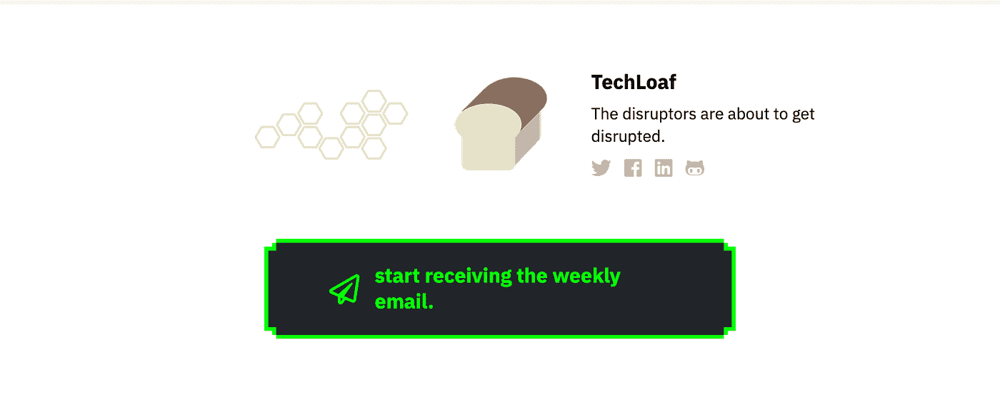
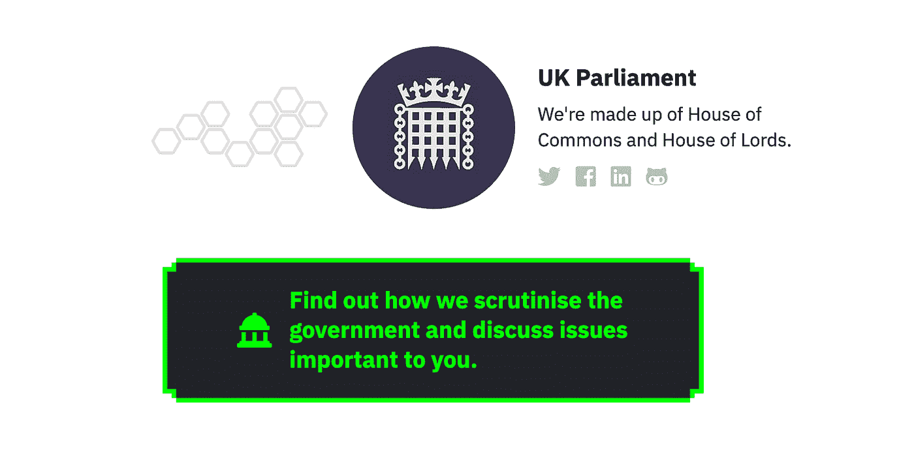

# 利用 Hacker Noon Writer 广告功能，发出自己的行动号召

> 原文：<https://medium.com/hackernoon/make-your-own-call-to-action-with-hacker-noon-writer-ad-feature-15239f0ab3b5>

# 这是来自[黑客正午支持](https://hackernoon.com/@support)的 How to 系列的一部分。

黑客中午的个人资料是你的主要房地产。它有你的个人简历，显示你选择的社交账户，以及所有你的黑客正午故事的链接(包括之前用 Medium 发表的那些)。

但最重要的是，你的可定制、显著位置的个人资料行动号召([一个不错的新黑客正午 2.0 功能](https://community.hackernoon.com/t/3-ways-to-improve-experience-for-contributing-writers/1911/11))可以用来推动你自己的时事通讯订户、社交媒体存在、你相信的公司/组织或其他任何东西。

[*David profile*](https://hackernoon.com/@David) *links to his email*

[*TechLoaf profile*](https://hackernoon.com/@techloaf) *drives people to their newsletters*

[*The UK parliament profile*](https://hackernoon.com/@parliament) *links to their website.*

创建 CTA —分步说明:

1.  参观 app.hackernoon.com/profile
2.  点击作家广告
3.  对于文本，请书写 CTA 副本
4.  对于链接，输入操作的 URL:

*   对于电子邮件，你可以使用格式[mailto:youremail@example.com](mailto:youremail@example.com)

5.对于图标，您可以使用预先存在的图标集，或者转到[FontAwesome.com](https://fontawesome.com/)获取其他图标。

6.单击保存。

7.点击头像旁边的手柄，查看您的个人资料的外观:)