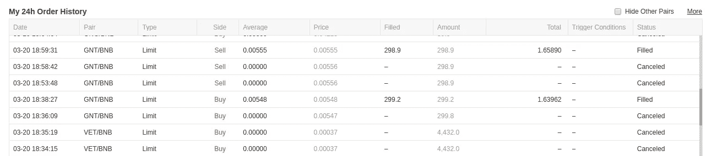
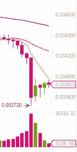

# 做市，移动无密码和开源币安 Bot

> 原文：<https://medium.com/hackernoon/making-markets-moving-crypto-free-and-open-source-binance-9bcea607e57b>

# binanceMarketMaker

[https://github.com/DunnCreativeSS/privateMarketMakerRepo](https://github.com/DunnCreativeSS/privateMarketMakerRepo)**请求访问* *

Buy Low Sell High!

这个机器人在币安自动做市。

其他做市机器人失败的地方(即 BitMex，Deribit，我过去做过的其他尝试)是依靠市场不波动。这个机器人的成功之处在于找到了市场，我们可以通过从利差本身获取利润来吸收波动中的利润，在 BitMex 和 Deribit 上，这些利差为 BTC 的 0.25 美元，币安的一些较小的市场为 1%..2%… 5%的差价，以及高于平均水平的交易量。

在基础资产(BTC、BNB、瑞士联邦理工学院等)中，你希望每对交易市场有大约 20 美元。如果 targetSpread、targetVolDiv 和 targetVolMult 更高，它将会交易更多的市场。特定基础资产的总资金越多，订单的价值就越高。

无论出于何种原因，市场配对离开了考虑配对的整体范围，它将继续以相同的卖出逻辑卖出该资产(在 quoteAsset+BNB 市场，或 BTC 然后 ETH，如果 BNB 不可用)，同时暂停买入。

我没有足够的个人资金来运行这个机器人，但如果我分享它，人们使用我的引用链接，我可以获得一大笔收入。targetOrderSizeMult 的存在是为了让人们可以在相同的市场上使用相同的机器人进行竞争，而不会不断地出价高于其他机器人，因为当有人出价或要价比你高时，你可以设置订单大小的百分比来忽略。当击败你的价格的数量高于—

> 订单规模*这个乘数，

它会重新进入市场。

目前币安的速率限制是:每分钟 1200 个请求。每秒 10 个订单。每 24 小时 10 万份订单。”

未完成订单没有限制，最多一分钟可以生成大约 6x20 对 x2 个订单，1 个取消和 1 个重新发布，同时检查余额并获取订单簿，因此一分钟总共大约 500-不接近 1200:)

就此而言，我只交易了一双鞋，平均每小时 42 单或每天约 1000 单，再交易大约 20 双鞋，每天将有 20 000 单——略低于 100k。

要使用:

1.(请务必)使用我的参考链接报名参加 https://www.binance.com/?ref=27039658[币安](https://www.binance.com/?ref=27039658)

2.将您的币安 API 密钥和秘密放在 binance.js 中

3.可以选择更改 targetSpread、targetVolDiv、targetVolMult、targetOrderSizeMult

4.安装 NPM 和节点

5.将此 repo，cd 克隆到目录中

6.运行 npm i 币安 api 节点

7.运行节点 binance.js

# API 限速？

有人可能会说的第一个 FUD 是，这将为太多的未完成订单或太多的交互锁定您的 API。

目前币安的速率限制是:每分钟 1200 个请求。每秒 10 个订单。每 24 小时 10 万份订单。”

未完成订单没有限制，最多一分钟可以完成大约 6x 20 对 x 2 个订单，1 个取消和 1 个重新发布，同时检查余额并获取订单簿，因此一分钟总共大约 500 英镑-不接近 1200 英镑:)

就这一点而言，我一次只交易三对左右，平均每小时 42 单或每天约 1000 单，同样，大约 20 对将是每天 20 000 单——略低于 100k。

# 结论

我最初交易 GNTBNB 几乎完全是为了测试，第一笔交易被截屏了。从那以后，我开始交易它发现可以交易的任何东西，降低要求的差价，让它隔夜运行。它失去了一点价值，但它也持有了一段时间，而没有做任何事情(由于所需的价差%不够)，但超过 45 个订单(不包括取消的)余额为 0.00568192(左右)，我的成交量为 0.03090300-这意味着虽然它失去了约 3%的 BTC 和约 4%的美元，但它以原来的 0.00568192 来回交易 22-23 次，费用为 0.2%，击败了 4.5%

如果你想开始在币安上建立你的交易量，最简单的方法是让这个机器人工作，选择一些更安全的设置来自动化几对的价差——在交易几个小时后，余额为 0.00568192 左右，我的交易量为 0.03090300。虽然这种策略可能不会自动盈利(至少是现成的)，但它确实交易了很多。如果你查看币安的收费表，你会发现随着你交易量的增加和持有 BNB，你会得到越来越少的交易者/接受者费用，如果你有其他策略(特别是高频交易)会受益于更低的费用，这可能是健康的——尽管 BNB 的要求可能很高，因为 BNB 的当前价值已经爆炸。同样，如果你使用我的邀请代码 27039658 或[邀请链接](https://www.binance.com/?ref=27039658)，我也会得到一小部分奖励！

加入 Telegram 获得互动支持和社区！

贾勒特·邓恩，[21.03.19 15:35]
好的开始使用 bot 的策略的一组新的条件，马克@基准 2 估计值:0.00569181 BTC / $22.57

Jarett Dunn，[21.03.19 15:35]
注意，在一次重大的联邦理工学院崩溃中，它保住了联邦理工学院

杰瑞特·邓恩

 [## 做市商 Bot

### 可以马上查看并加入@themarketmakerbot。

t.me](https://t.me/themarketmakerbot) 

注意:我可以为其他交易所重新编写机器人，在其他地方建立您的卷。