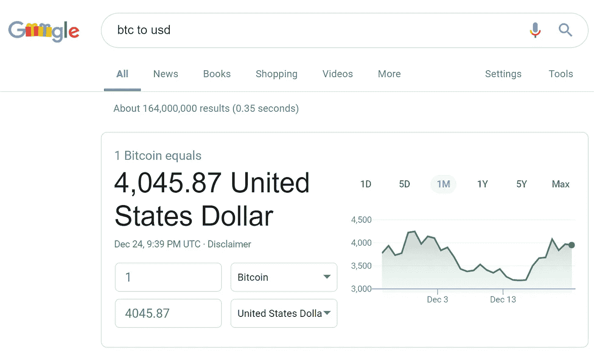

# 在区块链上赚钱

> 原文：<https://medium.com/hackernoon/making-money-on-a-blockchain-9f53526f78c9>

这将开启一场关于公司如何利用区块链技术赚钱的讨论，该技术本质上是开源软件和/或协议。作为类比，回想一下 20 世纪 90 年代早期，讨论公司如何从 TCP/IP 中赚钱。

# 区块链

与其讨论什么是区块链技术，不如让我们关注这项技术的关键功能:将任何信息(文档、交易、账户余额)的加密证据记录到不可变的共享数据库中的能力。这仅在不止一个实体需要信息的情况下有用；当两方或多方进行互动时。在这种情况下，区块链技术使得不需要可信的第三方就能够验证信息。不需要公证人、官方(土地、车辆、船只、飞机、疫苗……)登记处或银行。

从某种意义上说，这是共享/云模型的下一个逻辑步骤，因为现在系统的可信运营商不存在，所以它不能改变服务运行的规则。此外，用户不需要可信的操作员来验证他们自己和其他用户的信息。

这使得没有区块链就不可能实现的事情成为可能，包括:

1)拥有业务(或任何其他)流程的当前和过去状态的即时、可验证的证据。

2)具有履行合同义务的即时、经核实的证据。

3)以分散的方式持有和转移价值，不需要可信方，也没有民族国家的法律结构。

4)建立独立于民族国家或公司的治理和社会经济结构。

5)共享商业网络或生态系统的成本和收益。

6)为生态系统的独立参与者设计激励机制。

7)将所有权、价值分配和激励结合在单个资产(加密令牌)中。

8)将身份、法律地位、会计交易、付款等信息以及可能更多的信息(如商品的物理状态)合并到一个交易中。

# 商业模式与技术

互联网带来的革命是由技术支持的新商业模式引起的，而不是由技术本身引起的。区块链理工大学也是如此。

然而，必须有人来开发和构建技术:具体的解决方案、标准和协议，它们对最终用户来说是不可见的，并将使新的商业模式变得无缝和明显。

技术领域所需解决方案的几个例子包括基本解决方案:

-处理在线身份以及随之而来的一切，包括身份验证和隐私。

-安全的，最好是分散的，加密与菲亚特的集成/交互(所有加密攻击都发生在交易所和其他集中服务上)。

-将智能合同融入现有法律体系(可执行性)。

-验证区块链上的内容是否真实(是否与现实相符)。

更复杂的解决方案需要基本的解决方案才能工作:

-带有赌注机制的信誉协议。

-资产的令牌化，从虚拟(发票、索赔、音乐、电影、品牌、网址)开始，扩展到现实世界。

-由真实世界资产支持的稳定硬币，如货币或任何其他东西(包括资产代币)。

还有更多的例子，但是随着事情变得越来越复杂，技术和商业模式之间的界限开始变得模糊。以下是一些可能的技术/商业模式的例子:

-供应链的发票融资。

-防篡改产品来源系统。

-防篡改文件控制系统。

-区块链上的忠诚度计划，带有公开、可交易的永久折扣代币。

-反向广告“付费给我”模式，人们可以根据自己的判断创建自己的“广告档案”,分享关于自己的验证信息，并通过阅读/观看宣传材料获得报酬。

-直接投资创业项目和公司，不通过任何金融中介，如风投、证券交易所、共同基金等。，通过购买数字币。让我们称这个想法为 ICO(或 STO)。

-社区拥有的自动驾驶汽车，与公共交通工具协同工作。

-司机和社区拥有的拼车平台，使用折扣代币和经验证的信誉机制。

# 市场现实

那么，你如何在这个领域赚钱呢？你是怎么做的呢？下一个合理的步骤是什么？

让我们从对市场状况的一些观察开始。似乎在加密世界和真实的商业世界之间有一条很大的鸿沟。加密世界正围绕着交易所旋转，将加密转换为菲亚特，反之亦然。商业世界(除了像富士康这样明显的例外)考虑私有区块链和共享数据模型(由 IBM 提供)。两个世界以及生活在其中的人们都不了解另一个世界以及那里的需求、动力和机遇。

现实世界显然比秘密世界大得多，所以创业机会(或者至少是潜力)更大。但一个面对现实或面向商业的初创公司需要理解 2 件关键的事情:根据定义，如果它使用公共区块链技术做任何事情(如通过代币销售筹集资本)，它就是加密工作的一部分，不管它是否想要它。它需要尊重这个世界、它的规则、习俗和做生意的方式。其次，任何面向现实世界的项目最初都是一种教育努力；一个关于如何理解区块链在解决商业问题中的应用的研究项目。理想情况下，这应该与潜在或实际的客户/用户一起进行。在技术、商业模式和产品定义如此复杂的情况下,“造出来，他们就会来”的策略可能会奏效。

# 作为产品的代币

回到理解和拥抱加密空间的想法:出售代币/硬币是一种明显的赚钱方式。2017 年的 ICO 资助已经高于 VC startup/seed 资助([https://www . CNBC . com/2017/08/09/initial-coin-offerings-surpass-early-stage-venture-capital-funding . html](https://www.cnbc.com/2017/08/09/initial-coin-offerings-surpass-early-stage-venture-capital-funding.html))。尽管市场据称很冷，但 2018 年的融资额甚至更高([https://www . coin desk . com/6-30 亿-2018-ico-funding-已经超过-2017/](https://www.coindesk.com/6-3-billion-2018-ico-funding-already-outpaced-2017/) )。

EOS 的例子证明了一个异常成功的 ICO 是可能的，只要它是按照 crypto world 规则来做的，并且令牌被视为一个有其自身权利的产品。一个产品需要有其独特的卖点或竞争优势，明确的目标市场，价位等。

吸引(甚至是认真的)投资者投资 ICO 的关键因素之一是代币流动性的承诺:在交易所上市的代币比私人公司的股票更具流动性。这应该是所提供的任何令牌的关键特征之一。否则，如果代币没有市场，为什么不发行私人公司的股票呢？

在交易所上市代币会造成价格波动，可能会低于最初的 ICO 价格。这种情况发生在许多没有用例或没有工作产品或平台的令牌上，因此除了投机或纯粹的情绪驱动之外，对令牌没有任何需求。发生这种情况的原因之一是，项目希望不惜一切代价避免创建安全令牌，而是希望有一个实用令牌。因此，在 ICO 和发布使用效用令牌的平台/产品之间的过渡阶段，没有效用，因此没有效用价值。一些实际上有用例的实用令牌没有这个问题(【https://coinmarketcap.com/currencies/binance-coin/】T4)。

# 安全令牌

处理这个问题(代币价格低)的一种方法是通过人为制造代币需求来操纵市场。另一个(也许是激进的)想法是克服对安全令牌的恐惧。

最有可能的是，任何为一个全新的想法/项目/产品/公司筹集的 ICO 风格的资本都会被 SEC 视为证券发行。因此，新项目可以专注于将令牌设计为有意义的安全令牌，而不是设计需要用例才能工作的实用令牌。

将股票令牌化或创造类似于带有股息和投票权的股票的令牌是没有意义的，因为股票交易所和整个法律基础设施已经存在。但是至少有两种有趣的安全令牌设计:

1.让我们称之为回购代币:一个新项目发行代币来筹集资本，创建一个将产生收入的企业。它可以是一个 SaaS 平台，一个咖啡店，一个太阳能发电厂。一旦业务运营，部分收入用于从市场上回购代币并烧掉。就像股票回购一样。这增加了代币的流动性，限制了流通中的供应量。这两个因素都会提高代币的价格。任何持有人都可以选择现在退出，或者持有更长时间，等待价格进一步上涨。

2.让我们称之为虚拟出租车徽章或虚拟商城令牌:一个新项目正在一个平台上工作，该平台将允许其他人开展业务并提供服务。例如:由独立运营商组成的网络，这些运营商使用特定协议为供应链提供流动性和支付解决方案。该平台将要求任何运营商购买并托管(作为股份)特定数量的奖章/商城令牌。代币的供应将是有限的，因此随着市场的增长和变得更有吸引力，代币的需求增加，代币的价格也增加。就像一个真正的出租车徽章或商场空间。

也可能有一个实体应用这两种模型，为有影响力的真实项目提供 ICO rails，就像区块链上的 Impact Kickstarter 一样。早期阶段，有风险，但重要和强大的想法，像海水淡化技术或海洋塑料回收现在可以更容易地筹集种子/早期资本。ICO rails 公司可以提供尽职调查、KYC、智能合同开发和专业资金，只需支付一定费用并提供初始令牌。

这项业务的一部分也将是一个负责任的 ICO 模型，其中一个项目只能根据拟议的预算筹集资金，资金将根据进度与预算的评估以里程碑付款的形式发放。

我认为这个想法会让币安(https://TechCrunch . com/2018/08/23/币安-实验室-孵化-程序/)或 EOS(https://www . econotimes . com/block chain-startup-block one-announces-1B-venture-fund-EOS-VC-1330074)感兴趣。

# 采用和收益时间

转到现实世界的应用程序，必须有一个产品或服务在这个过程中的某个地方产生收入。出售代币并没有产生收入。它筹集资金是为了创造能产生收入的东西，并最终获得所筹集资金的回报。这里的关键概念是，筹集的资金需要持续足够长的时间，以使初创公司产生收入。花费或产生收入的时间越长，所需的初始资本就越多。

另一个问题是使项目/业务盈利所需的采用水平。这一点非常重要，尤其是对于一家希望通过网络效应创造价值的初创公司。很多时候，基于网络的业务只有在成熟和采用的后期阶段才有利可图。这就造成了利润是在 1000 英里行程的最后一英里产生的情况，进一步增加了资本要求和项目的风险。

区块链创业公司面临的真实世界的市场形势看起来很困难:商业客户不理解技术或其含义，需要大量资金来开发今天不存在的技术和应用程序。让市场接受可能是漫长而昂贵的。

# 研究

对于一家区块链初创公司来说，除了筹集尽可能多的资金(最好至少 1 亿美元)，并希望在 1 年、2 年或 3 年内达到快速发展的市场目标，还有更好的方式吗？在开发改变世界的产品的同时，有没有可能更快地开始创收？一个解决方案是让团队中的一部分人提供专注于业务模式转型的咨询服务。另一种方法是提供联合区块链研究/发现项目，最好使用敏捷方法，包括冲刺、持续反馈循环等。

然而，任何接近潜在企业客户的区块链初创公司都需要明白，一家《财富》100 强公司拥有品牌影响力和财务实力，能够独自开发区块链解决方案(或任何其他创新)并将其引入整个供应链。就像富士康那样([https://www . coin desk . com/Foxconn-wants-take-global-supply-chain-区块链](https://www.coindesk.com/foxconn-wants-take-global-supply-chain-blockchain))。他们为什么会决定与一家没有可用产品/平台或重要客户群的区块链初创公司合作？他们可以接受初创公司提出的任何有趣的想法，去 IBM 或埃森哲开发专有的区块链平台或解决方案。

企业愿意与初创公司合作有两个原因:

1)如果有一个团队想出了好主意(比 IBM 或埃森哲或他们的内部团队想出的任何主意都好)，并且现在可以开始设计和构建产品和解决方案。既了解区块链/加密又了解真实世界的人，可以交付高质量的软件。

2)如果初创公司在 ICO、KYC、合规性、公用事业与安全令牌、与 SEC 对话、铸造令牌、税务影响等领域拥有现实生活中的一线经验。

雇佣一家创业公司会节省他们大量的时间和金钱。他们可以利用一个好的团队及其经验，而不是从零开始。

这将是一个有趣的想法，只要企业可以与初创公司合作/雇佣/组建合资企业，开发专门为他们量身定制的解决方案，而不一定是初创公司正在开发的改变世界的原始产品。在这种模式下，创业公司是作为企业的顾问/智囊团/研究公司。

这种关系对初创企业非常有益，可以用于 1)提高初创企业的声望，2)获得更多高端客户，3)利用为企业所做的工作开发自己的产品、平台和服务。

下面是一个具体商业模式的例子:

折扣券的想法是非常强大的，它不会被消费掉，而是给持有者永久的折扣。基于这一理念的忠诚度计划是一个杀手级的忠诚度计划。

然而，尽管“用一个终极忠诚令牌来统治所有人”的想法非常诱人，但在没有工作平台和大量营销预算的情况下，这是不现实的。向任何公司或组织提出这样的提议:“付钱给我，这样我就可以用自己的令牌开发我的平台”似乎有些天真，因为他们可以用自己的令牌开发自己的平台，保留所有的利益。

因此，对于一家公司来说，可能有一个商业案例，该公司从为第三方开发折扣令牌平台开始，基于为特定案例定制的白标软件解决方案。这种实体可以为航空公司、当地商人社区、市政当局、能源公司等公司工作(更注重具体的激励措施，而不是忠诚度)。

该产品将包括 KYC、ICO(我可能是错的，但我认为现有的用例使其成为实际的实用工具令牌，而不是安全性)、客户的手机和网络钱包、程序所有者的仪表板。有了这一点，就有可能有一个钱包来存放任何兼容的品牌代币，这是不同忠诚度计划的一部分，因此从用户体验的角度来看，不同代币的数量不是问题。这样的创业公司可以收取一定费用，并保留部分新品牌折扣代币(比如 5%)。它甚至可以基于自己的白标开发套件推出自己的品牌忠诚度令牌计划。

# 教育

将付费研究的想法更进一步，是否有更好的商业开发方式？与对区块链感兴趣的企业交谈而不是在会议上花钱就能获得报酬？也许有可能组织一次高规格的 C 级活动(一次晚宴，一次静修),参加者人数有限，并付费参加。他们可以直接接触到区块链空间中最聪明的头脑，那里没有人试图向他们推销任何东西。

已经有一些通过教育企业赚钱的区块链项目，BRI([https://www.blockchainresearchinstitute.org/](https://www.blockchainresearchinstitute.org/))就是最好的例子。

# 分散和开源

顺便说一句，任何区块链的初创公司都应该本着真正的分权精神，明智地尝试与其他区块链初创公司合作，而不是试图在内部做所有事情。此外，由于许多软件是开源的，使用它，即使它需要修改，可能是一种更便宜、更有效的软件开发方式。

# 亚马逊方法

据说“在阅读了一份关于互联网未来的报告后，该报告预测网络商务的年增长率为 2300%，贝佐斯列出了 20 种可以在网上销售的产品。他将清单缩小到他认为最有前途的五种产品，包括:光盘、计算机硬件、计算机软件、视频和书籍。贝佐斯最终决定，他的新业务将在网上销售图书，因为全球对文学的需求很大，图书的价格很低，还有大量的纸质图书。([https://en . Wikipedia . org/wiki/Amazon _(公司)](https://en.wikipedia.org/wiki/Amazon_(company)))

我个人的观点是，今天的“亚马逊方法”应该是参与“安全令牌 ICO on rails”项目。这可能会演变成一个安全 ICO 交易所，类似于密码领域的纳斯达克(Nasdaq ):自我监管，拥有成熟的结构化流程，包括项目审查和尽职调查。

如果你想讨论代币经济学、战略或应用，请随时与我联系:【https://www.linkedin.com/in/michalbacia/

我能够以通俗易懂的方式解释非常复杂的主题，同时让人们发笑并参与其中。