# 让我们的小功能免费，在两个月内就有了 20，000 名用户和 2，500 条线索

> 原文：<https://medium.com/hackernoon/making-our-tiny-feature-free-led-to-20-000-users-and-2-500-leads-within-2-months-98c6d23485d4>

## 第 1 部分:构建

这个项目最初是为我们的 DataOps BI 平台设计的一个小功能。我们的实习生帮助开发了 dbdiagram.io，以帮助我们的客户将他们自己的数据库关系可视化为图表。这是为数据分析师和开发人员设计的一个快速简单的工具，帮助他们只需使用键盘就可以设计数据库图表。

受[产品导向增长](https://openviewpartners.com/product-led-growth/)方法和[免费工具——我在 TradeGecko 的朋友 Lucas 的 SKU 生成器](https://www.tradegecko.com/free-tools/sku-generator)的启发，我们发现了一个为数据社区做贡献的机会，将它作为免费工具和我们公司可持续的流量来源发布。

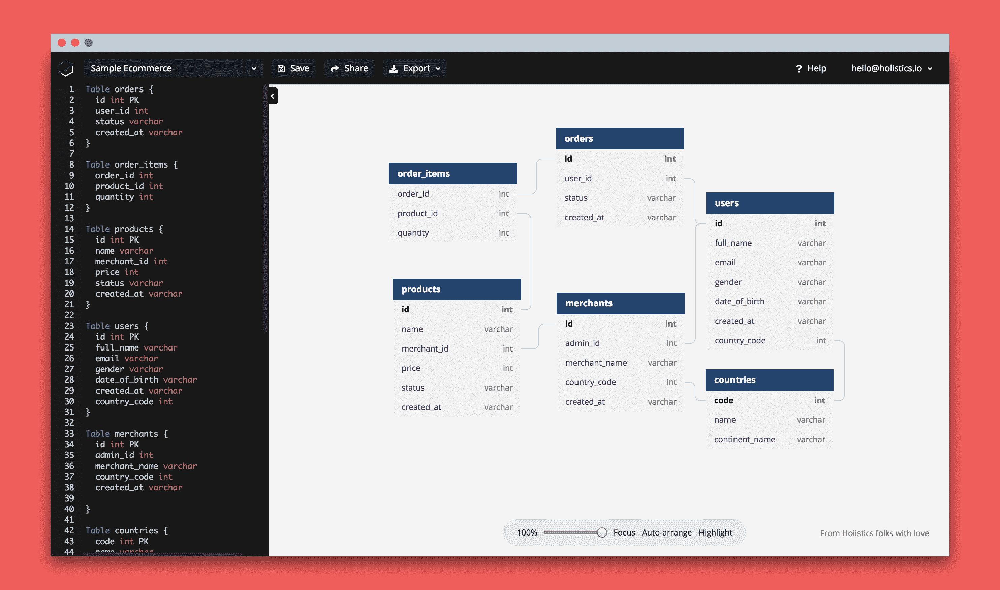

在最初的 2 个月内， [dbdiagram.io](https://dbdiagram.io/) 获得了 20000+的用户(现在已经达到 80K)并产生了 2500+的 Holistics 线索。仅仅设法推出一个产品不可能带来这样的成功，但这也是为了打造一个适合市场的产品。我认为与你们分享这个惊人的实验可能是有用的，你们是那些总是渴望学习和建设的创客或企业家。

第一部分，我要和大家分享我们是如何从零开始构建 dbdiagram.io 的。

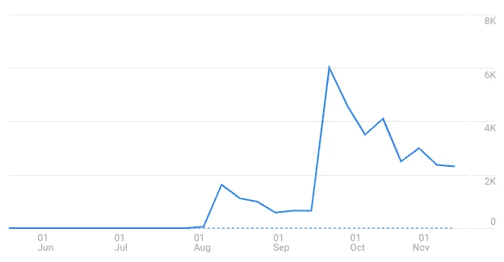 [## 为开发人员和分析人员构建的数据库图表设计器

### 快速简单的数据库设计器，为数据分析师和开发人员设计数据库图表而优化，只需使用…

hackernoon.com](https://hackernoon.com/dbdiagram-io-a-database-diagram-designer-built-for-developers-and-analysts-975f310d4f13) 

# TL；速度三角形定位法(dead reckoning)

1.  背后的故事
2.  定义目标
3.  通过使用待完成工作框架定义问题和目标受众，专注于交付价值
4.  对市场、搜索引擎优化和竞争进行研究
5.  精心制作信息
6.  创建线框和模型
7.  将工作故事分解成任务，并对其进行优先排序
8.  实施数据跟踪
9.  自动化反馈和支持流程
10.  发布公共路线图和发行说明
11.  不断迭代产品

# 它是如何开始的

*   我们刚刚雇佣了两名软件工程师实习生👨‍🎓👨‍🎓
*   然而，结果是主要产品对实习生来说太复杂了，难以上手🤔
*   与此同时，我们正在开发一个名为数据模型的功能，它允许我们的用户可视化他们的数据库，并通过拖放获得洞察力。
*   数据模型的一个重要子特性是可视化数据库关系的能力。我们发现，对于我们的实习生来说，研究和使用一个单独的数据库可视化工具会很有意思。
*   仅仅一个星期后，我们的实习生展示了第一个版本，让我们大吃一惊，图表能够完美地从 JSON 文件中生成。它太酷了，这让我们不禁想知道，如果我们允许用户直接编辑图表，它将成为可视化和设计数据库的超级有用的工具。因此，我们决定把它变成一个独立的产品。

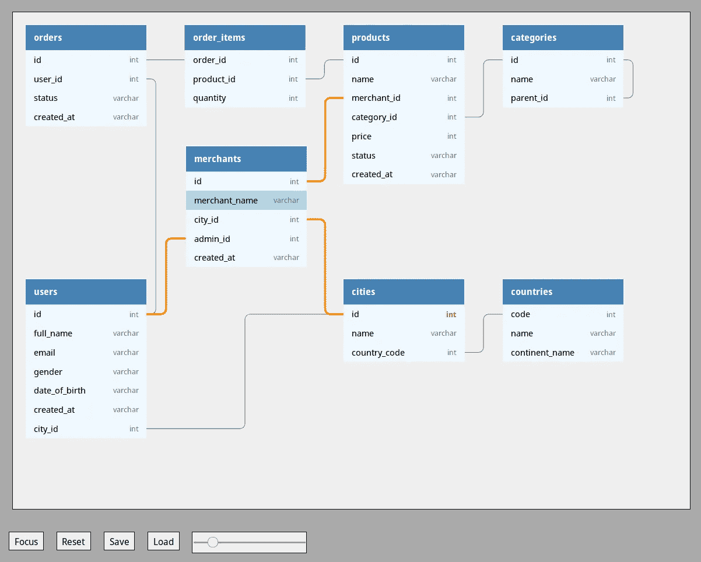

The 1st version of dbdiagram.io, looks exactly like a student project!

*   我们开始为它做计划，同时我们的实习生继续开发更多的功能，使它成为一个独立的产品，例如编辑代码以生成图表，注册/登录，保存图表，共享图表…
*   经过 2 个月的开发，我们骄傲地发布了第一个 MVP。

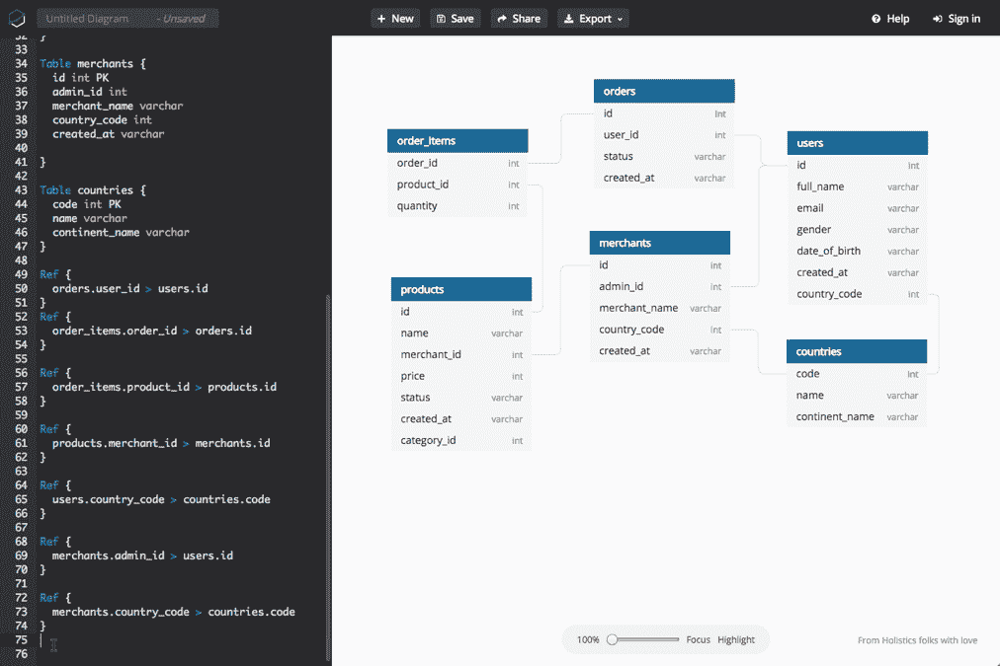

*   它成为一个令人难忘的项目，帮助他们学习 D3JS、NodeJS，并获得真正的产品开发经验。

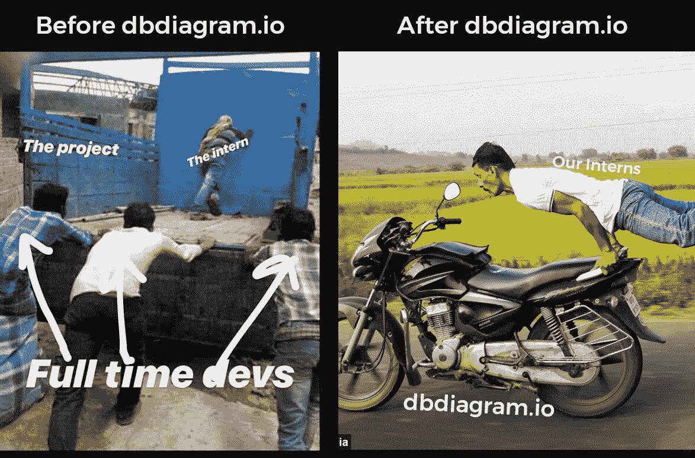

## 从哲学开始

> 首先传递价值

*   用利润传递价值= **好生意**
*   传递价值而不盈利= **慈善**
*   没有通过利润实现价值= **你是在钓鱼吗？**
*   没有利润就没有价值= **你傻吗？**

不仅是产品，这也是我们对所有事情的原则，无论是电子邮件还是推文，都必须从向受众传递明确的价值开始。

出于对交付价值的痴迷，我们甚至没有在一开始创建主页，因此当有用户访问 dbdiagram.io 时，我们直接将他们导航到编辑器，这样他/她就可以立即开始绘制图表，而不会有任何摩擦。

…后来，我们发现这损害了我们的搜索引擎优化😅因此，现在您可以在 dbdiagram.io 上看到一个简单的登录页面，它只有一个目的，那就是传达产品的价值。

## 它是一个产品，但不是一个创业公司

它不是一家试图退出或成为下一个独角兽的初创公司，它只是一个提供价值的微小产品。

意识到这一点有助于我们确定关注产品功能和体验的领域，而不是如何赚钱。

# 我们如何建造它

## #1 为什么——定义您的目标🎯

在启动任何产品之前，定义明确的目标必须始终是待办事项列表中的首要任务，因为这是你做所有事情的原因和动力。

为了确定目标，不仅仅是从一开始，这些问题应该一直被重新考虑

*   你为什么想这么做？
*   你想实现什么？
*   你如何平衡商业价值和用户价值？

使用 dbdiagram.io，我们将目标分为两个主要类别

**对于整体主义——商业价值**:

*   提高我们的**品牌知名度**和**从社区获得线索**的绝佳来源。
*   **对团队的启发**。既然我们已经把所有的精力都花在了主要产品上，一个试图解决拥挤的商业智能行业中的巨大问题的 B2B SaaS，这是我们休息一下并从贡献一些东西中获得动力的好时机。
*   **以最小的风险进行实验和实践**。对于我们来说，这是一个很好的方式来学习如何为即将到来的 Holistics 特性构建产品和做更好的营销。

**对于数据社区——用户价值:**

*   一个免费的工具，帮助开发人员和分析师轻松设计数据库。

## #2 定义目标受众👷‍👨‍🏫👩‍🎓👩‍💻🧛‍

第二件重要的事情是，确定你想让谁用你的产品改善他们的生活。

永远不要低估它，它将是你最主要的关注点，指导你如何**设计产品**(产品体验)以及**在哪里找到用户**(销售&营销)。

然而，你不必盲目追随它，你受益的用户群可能会随着时间的推移而改变，这取决于市场的反应和你的产品如何增长。

举个例子，一开始我们以为，*“是关于数据库图的，先从数据分析师和数据工程师开始吧”*。

但事实上，他们并没有那么兴奋，他们中的大多数人都是各自领域的专业人士，并且已经为自己找到了生活的工具。

一天下午，我和我的朋友去了一家咖啡店，他是一名网站开发人员，正准备开始他的新项目。当他在寻找一个工具来设计他的数据库时，我和他分享了 dbdiagram.io 作为题外话。

💡

这是我生命中的一个亮点，**独立和网络开发者**肯定从一开始就是真正的关键目标受众。从那次发现开始，很多事情都发生了变化，我们更加关注开发人员的渠道，使用了新的标语“**为开发人员和分析师构建的数据库图表设计者**”。到目前为止，我们 70%的用户是开发者。

后来，通过他们的反馈，我们发现了更多有趣的资料，这些资料也认为 dbdiagram.io 很有用，如业务分析师、教师、学生，这扩大了我们能够接触的渠道数量。

 [## 嘿！很棒的作品，我已经开始使用它了，我会把它推荐给我教的班级。

### 一名教师在课堂上使用 dbdiagram.io

medium.com](/@alexius.diakogiannis/hey-great-work-ive-already-started-using-it-and-i-ll-recommend-it-to-a-class-i-am-teaching-f9ead6dcc94c) 

## 研究(市场—搜索引擎优化—竞争……)🔍

你可能会认为这个产品是一个**数据库设计器**，可悲的是，可能没有多少人搜索它，或者它在互联网上的排名竞争太激烈。

无论你认为你的产品是什么，它在别人心目中可能是完全不同的。有必要在这一点上保持一致，否则，你的产品将仍然是一个未被发现的宝藏。

这可以很容易地通过做一些小的研究来了解当人们在互联网上的搜索框中输入时他们在想什么。

为此，我们使用了 **SerpStats** 和**谷歌关键词规划器**。我们发现人们搜索**数据库图表、数据库图表工具、数据库设计工具……**的次数远远多于**数据库设计师**的次数。所以我们决定将我们的内容集中在这些关键词上，当你搜索 [**数据库图表**](https://www.google.com/search?q=database+diagram) **时，我们得到了很高的位置。**

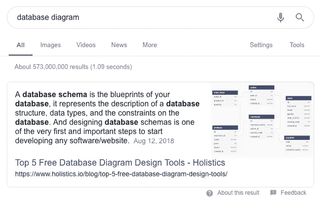

你选择的关键词也不应该是静态的，它们会随着目标受众的变化而变化。然而，正确的策略会给你一个很好的推动，我将在下一部分分享更多。

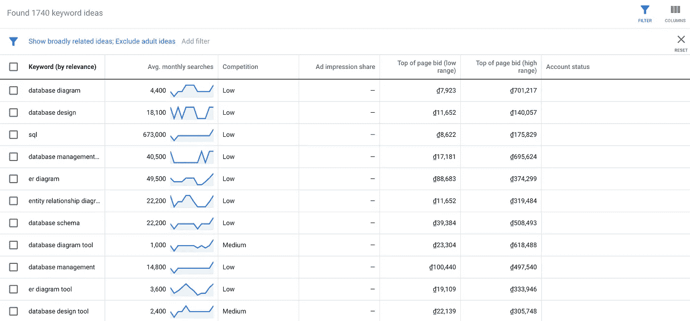

不仅如此，这项研究还让我们知道了该产品的命名方式。团队生产副产品的能力是有限的，我们知道我们没有太多的时间向市场宣传这个产品，所以让我们用一个不言自明的名字👉 **dbdiagram.io**

## 向后工作，定义单行间距📰

> [dbdiagram.io](http://dbdiagram.io/) 是一个快速简单的工具，专为开发人员和分析师打造，只需使用键盘就能快速绘制数据库关系图。

因此，它可以帮助你设计数据库，快速，简单，它是为开发人员和分析师，而不是一个非技术的家伙。这一小段是我们的北极星，让我们保持在正确的轨道上。

## 定义工作经历📒

> 记住，要做的工作描述了“更好的我”它回答了这样一个问题:“自从您开始使用[产品]以来，您感觉如何？”

通过专注于让用户生活得更好，工作完成(JTBD)框架真正改变了我对任何产品的看法。这有助于我们深入了解**为什么**顾客真正想要某样东西，以便建立更好的**什么**和**如何**从而帮助顾客实现他们的目标。

 [## 需要做什么工作(JTBD)？

### 升级你的用户，而不是你的产品。不要造更好的相机，要造更好的摄影师。

jtbd.info](https://jtbd.info/2-what-is-jobs-to-be-done-jtbd-796b82081cca)  [## 在产品开发的“待完成工作”框架中使用的 8 件事

### 尽管你想谈论战略或运营效率的重要性，但事实是公司…

medium.com](/@zbigniewgecis/8-things-to-use-in-jobs-to-be-done-framework-for-product-development-4ae7c6f3c30b) 

我们为 dbdiagram.io 定义的一些主要工作案例:

*   当我向客户介绍新软件或数据库结构时，我希望能很快有一个数据库图表，这样我的客户就能很容易地理解整个想法。
*   当我开始开发新软件时，我希望尽可能快地起草一个数据库结构，这样我就可以立即投入编码工作。
*   当我向学生讲授数据库结构时，我希望有一些示例数据库模式，这样我的学生就可以很容易地理解数据库模式的概念。

## 创建线框/模型🎨

建筑从蓝图开始，软件从线框开始。

一个线框可能需要几个小时来更新，而编码可能需要几天或几周。它帮助你让每个人都在同一页上，并立即开始头脑风暴。所以不要直接跳到代码里，先画点东西来讨论。

多年来，我从线框中发现了另一种力量，它们也有助于激励你的团队。仅仅经过几个小时的设计，它可能看起来不完全是你将来会有的样子，但它有能力让你团队中的任何人都很容易理解你的愿景，这很难用语言来交流。

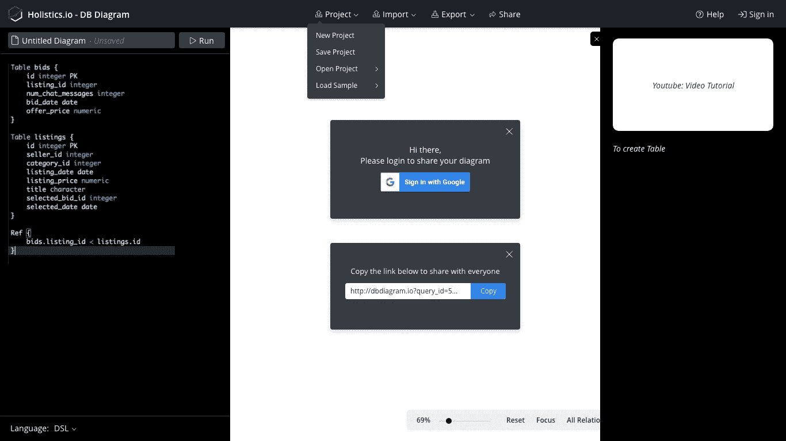

## 将工作故事分解成可行的任务💾

在进入第一行代码之前的最后一步，是将你的工作故事转化为你的团队可以完成的任务，以及一路上需要管理的优先级。

由于积压的工作很快就会被来自想法和反馈的成千上万的任务填满，只有无情的优先排序才能拯救你的一天。

我们使用体式和一个简单的优先顺序框架，例如:

**P1——用户离不开**

*   能够从编辑器中创建表/关系
*   能够注册/登录
*   能够保存图表

**P2——必须有**

*   能够分享
*   能够从一个字段拖动到另一个字段以创建关系
*   能够导出到 SQL

**P3——应该有**

*   能够从 PostgreSQL，MySQL，Rails 模式导入
*   双击表格标题时，导航到其定义

**P4——很高兴有**

*   协同工作
*   暗/亮模式
*   …

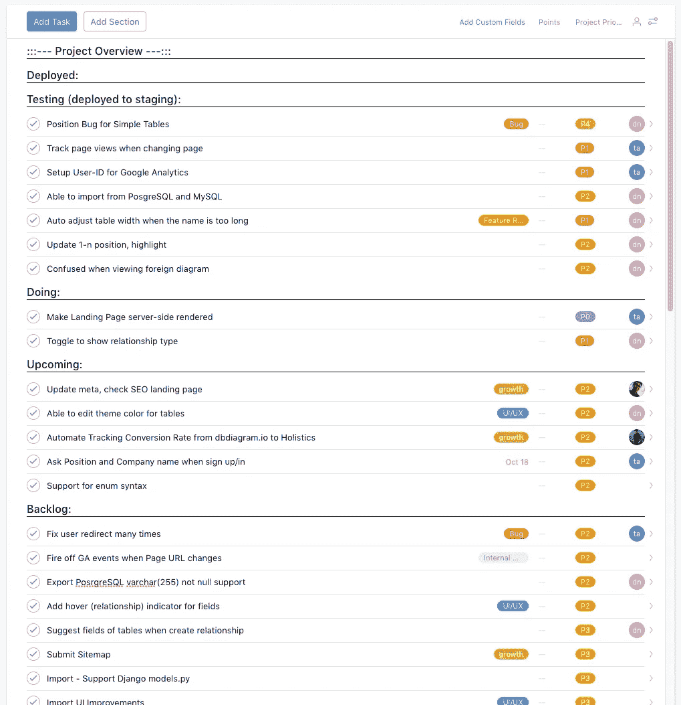

一个有良好优先级的项目总是会让你知道下一步该做什么，而不是通过做无价值的任务来制造容量过载。

优先化需要无情地完成，然而，这并不像看起来那么容易，需要时间去学习和实践，这是我最喜欢的关于产品管理中优先化的文章之一，一定要看看

 [## 无情的优先排序

### 所有高功能团队必须优先考虑。不是一个月一次，也不是一周一次——而是严格而无情的。

blackboxofpm.com](https://blackboxofpm.com/ruthless-prioritization-e4256e3520a9) 

注意:如果你的工作故事足够复杂，也要优先考虑它们。

## 分析学📊

在一个产品的早期阶段，如果你试图实现一个完整的事件跟踪系统，这可能会让人不知所措。然而，了解您的关键指标是成功的先决条件，它让您知道您的产品是否正在增长，我们选择**创建的图的数量**作为 dbdiagram.io 的北极星指标。

到目前为止，我们只是简单地实现了 [**谷歌标签管理器**](http://tagmanager.google.com) **，** [**谷歌分析**](http://analytics.google.com) **，并使用** [**整体性**](http://holistics.io) 进行通用分析。

我们将在下一部分深入探讨如何跟踪和衡量绩效的更多细节。

## 实施反馈系统

在一天结束时，你所做的是向你的客户传递价值，询问他们对你的产品体验的意见将会反映这一点。以适当的方式去做，它不仅会成为商业决策最有力的资源，还会帮助建立他们的信任。

然而，如果有太多的摩擦，收集反馈很容易变得令人筋疲力尽。通过最少的努力，我们使用一个简单的 Google 表单来收集反馈和一些 Zapier 集成，使整个过程自动化。

*   **我们的谷歌表单:**[https://goo.gl/forms/88AmYOyiIiTuFuzG3](https://goo.gl/forms/88AmYOyiIiTuFuzG3)
*   谷歌表单+推特+ Slack :所以我们的团队总是实时了解最新的反馈

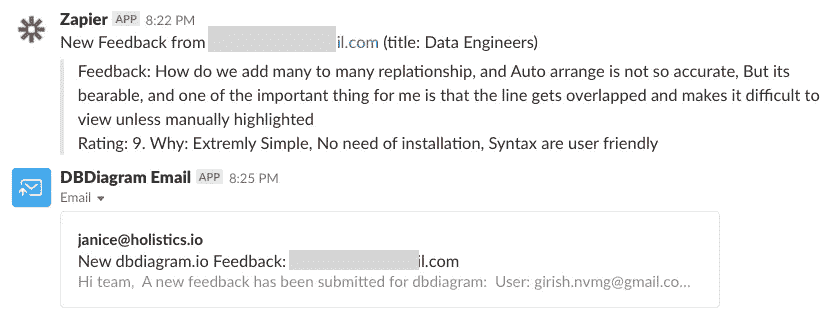

*   谷歌表单+邮箱:直接从我们的收件箱回复我们的客户。

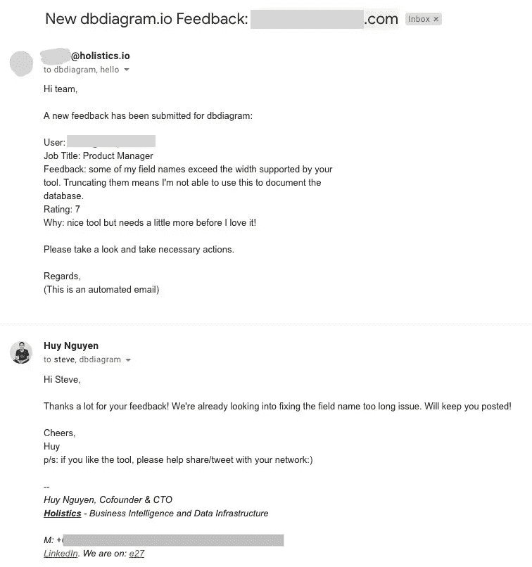

*   **谷歌表单+体式:**为每条反馈信息创建一个体式任务

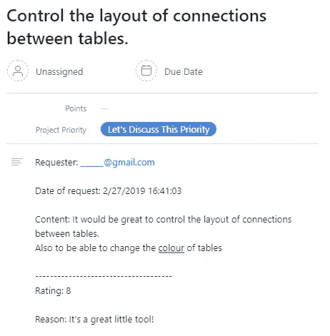

## 公共路线图和发行说明

> 一个好的倾听者知道如何回应。

**公共路线图和发行说明**是一种透明的沟通方式，让您的客户了解最新的新功能或改进，这也赋予他们权力，并将其视为您旅途中的真正伴侣。

在这种重复的工作中，应该再次消除摩擦，所以我们花了 5 分钟的时间通过 [noting.io](http://noting.io) 进行设置，将它包含在我们的主页中，结果是无与伦比的，它让我们的用户不仅知道发生了什么，还知道接下来会发生什么。更新的频率告诉他们我们有多关心这个产品，以及为什么他们应该信任我们。

[https://db diagram . noting . io](http://dbdiagram.noting.io)

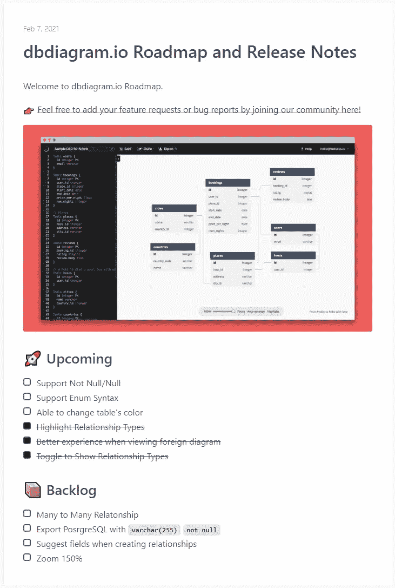 [## 为什么您应该有一个公共路线图，以及如何构建它

### 在 5 分钟内构建您自己的公共路线图

medium.com](/holistics-software/why-should-you-have-a-public-roadmap-and-how-to-build-it-56f3a55a8604) 

## 不断学习迭代😍

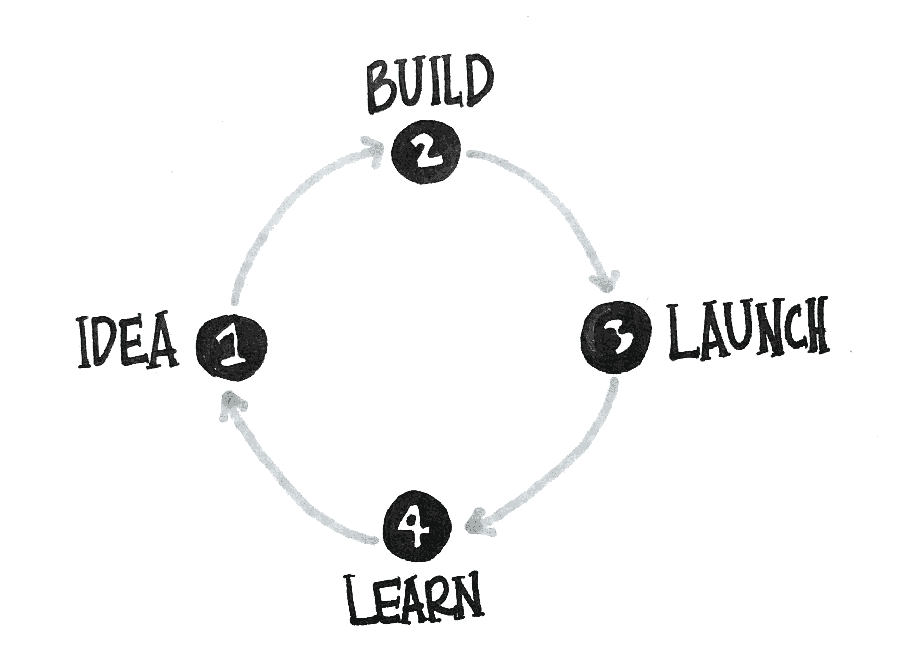

> 以最小的努力关注价值，尽快学习和迭代它

无论你做什么，定义目标受众，工作故事或设计用户体验，一切都只是你的假设，直到有人真正使用它。

不要在你的假设上浪费太多时间，遵循精益原则，尽快推出，尽快获得反馈，明智地使用它来改进你的产品，并重复。这样，你将知道用户接下来要做的最有价值的事情是什么，并减少你将要承担的风险。

Ps:别忘了把它们都记到文档里，这样你的团队就很容易跟踪和跟上你了。

# 未完待续…

我是 Holistics 的产品经理，这是 dbdiagram.io 背后的团队。我仍在撰写这篇文章的第二部分，介绍我们如何设法推出 dbdiagram.io，如果你觉得有趣，请关注我的下一次更新😊

最后，非常感谢我们出色的实习生 nhật·泰 nguyen 和阮晋勇，是他们让这一切成为现实🤟