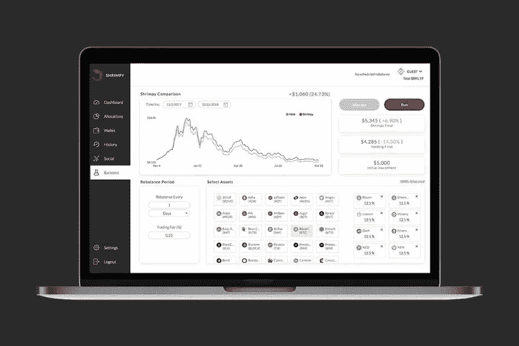
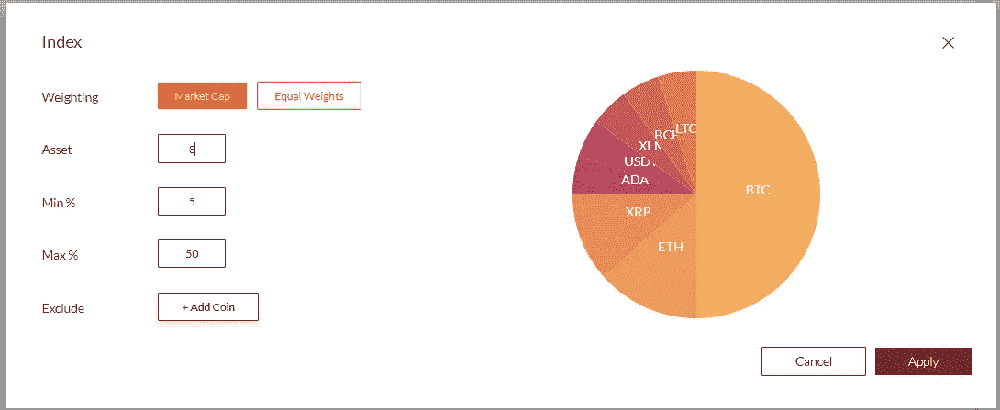
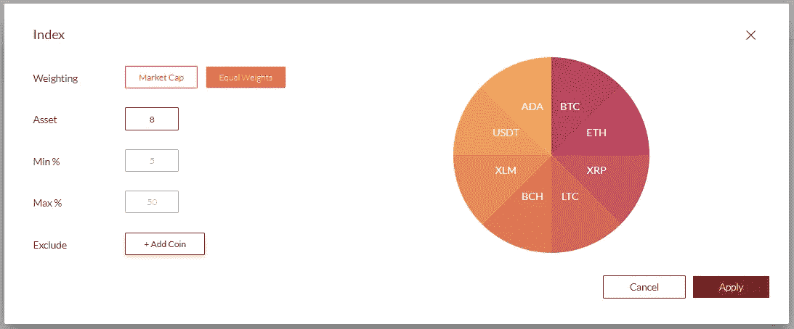
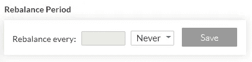
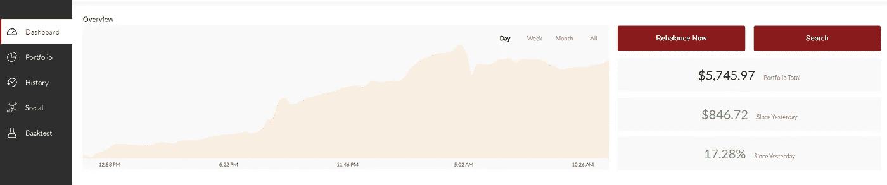
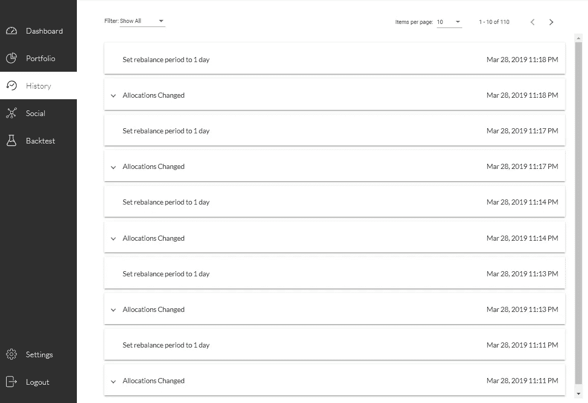
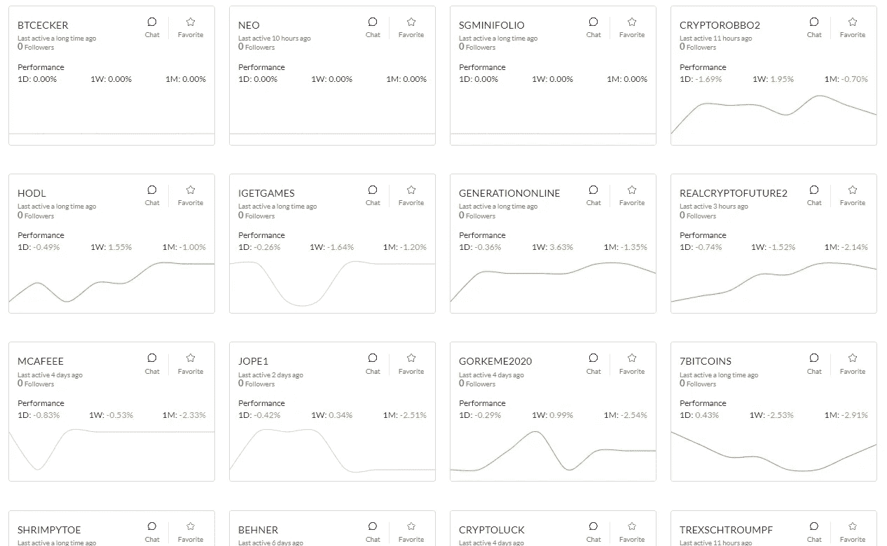
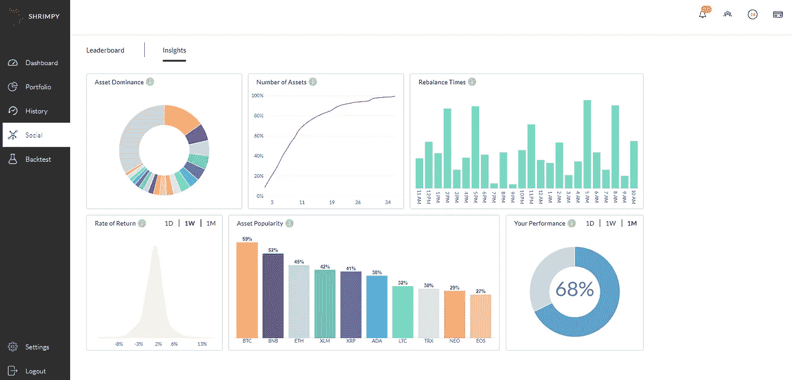
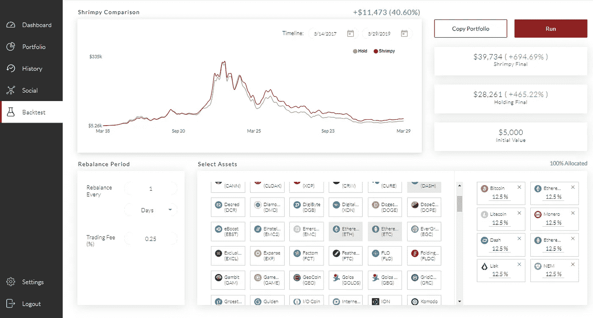

# 加密索引以及如何管理它们

> 原文：<https://medium.com/hackernoon/manage-your-own-crypto-index-fbe77f40e41d>

对于几乎没有交易经验的加密所有者来说，Shrimpy 应用程序是一个简单有效的管理加密的解决方案，没有复杂的附加功能。不像大多数复杂的加密交易机器人，Shrimpy 只需要几分钟就可以设置好！

让我们通过 Shrimpy 来完成创建和管理您自己的交易所交易加密指数的步骤。

# 创建并连接您的 API 密钥

在我们指导您完成 API 交易步骤之前，您必须创建一个交易所 API 密钥，并将其连接到 Shrimpy 应用程序。关于如何将您的 exchange 帐户链接到 Shrimpy 的详细说明可以在下面找到。

 [## 链接 Bittrex API 密钥[教程]

### 通过将 API 键连接到 Shrimpy，使多样化和重新平衡变得容易。

medium.com](/@ShrimpyApp/linking-bittrex-api-keys-tutorial-8657c779c9f4) 

一旦你链接了你的 API 密钥，前往 **Portfolio** 创建你的个人加密货币指数。这就是创建加密索引的乐趣所在。

# 构建您的自定义加密货币指数

你有两种选择来构建你的投资组合。您可以选择手动添加加密资产，也可以选择使用 Shrimpy 的**指数**功能，根据选定的偏好自动构建投资组合。

**市值加权指数**

当创建市值加权指数时，有 3 个主要设置需要考虑:**、资产数量、最小资产百分比和最大资产百分比**。

选择市值加权指数意味着投资组合将根据每项资产的市值相对于投资组合中其他资产的权重进行分配。

**# of Assets** 设置将包含在指数中的资产数量。所包括的资产首先按照最高市值选择，然后是较低市值的资产。

**最小资产%** 确定分配给投资组合中任何资产的最低分配百分比。由于市场严重偏向少数高市值资产，这有助于防止您的指数保持极小的资产比例。

**最大资产%** 配置旨在作为单个加密资产的最大风险敞口的上限。这可以防止特定资产消耗比您期望的更多的索引。

要创建紧跟市场的指数，您可以:

1.  增加*的资产数量*
2.  *减少 ***最低资产%****
3.  *增加 ***最大资产%****

***等权指数***

**

*创建一个权重相等的指数甚至更容易。现在，您不必选择最小和最大分配百分比，只需选择您想要的总资产数量**。记住将你不想纳入投资组合的任何资产列入黑名单。***

*要了解更多关于多样化您的加密投资组合的影响，我们建议阅读下面讨论投资组合多样性和最佳资产分配的文章。*

* [## 投资组合多样性:技术分析

### 多元化给投资组合增加了多少价值？

hackernoon.com](https://hackernoon.com/portfolio-diversity-a-technical-analysis-c2c49f4d3a77)  [## 优化加密货币再平衡的资产分布

### 在我们之前的研究中，所有的回溯测试都是在资产平均分布的情况下进行的。这意味着如果一个投资组合…

hackernoon.com](https://hackernoon.com/optimizing-asset-distribution-for-cryptocurrency-rebalancing-d31c7a7d607b) 

**动态指数**

所有使用**指数**功能构建的加密投资组合将作为动态指数运行。动态指数简单地说意味着每项资产的权重将在每个再平衡期之前更新。如果一种资产的价格上涨，该资产在指数中的配置比例也会增加。除了权重之外，如果资产在指数中的位置发生变化，它们也会更新。例如，假设您创建了一个包含前 10 项资产的指数。如果按市值排列的第 10 项资产与第 11 项资产互换，这将在指数中通过删除之前的第 10 项资产并用新的第 10 项资产替换来更新。

## 为您的投资组合选择一个再平衡期

当您创建加密货币指数投资组合时，您可能会注意到资产选择窗口右侧的**再平衡期**选项。再平衡期仅仅意味着一个投资组合多长时间再平衡一次，以达到其期望的资产配置。

Set your rebalance period

这就是虾米魔法发生的地方。与其他涉及复杂技术指标和信号的自动交易机器人不同，Shrimpy 通过指数化和再平衡遵循简单而直接的被动管理方法。了解以下关于再平衡的更多信息。

 [## 再平衡和加密货币:简介

### 投资组合再平衡是一种低成本的管理策略，通常用于长期基金。

medium.com](/coinmonks/rebalancing-cryptocurrencies-an-introduction-8e2471ee7b9e) 

在决定加密投资组合的最佳再平衡周期时，请考虑您的风险承受能力，以确定理想的再平衡周期。我们推荐下面讨论各种再平衡策略和结果的研究。

 [## 再平衡与 HODL:熊市分析

### 本研究的目的是确定在…期间重新平衡加密货币投资组合的绩效影响

medium.com](/@ShrimpyApp/rebalance-vs-hodl-a-bear-market-analysis-618b6df3fd9)  [## 再平衡与 HODL:技术分析

### 这项研究的目的是描绘一幅公平的画面，说明再平衡作为一种策略如何符合霍德林。为了…

hackernoon.com](https://hackernoon.com/rebalance-vs-hodl-a-technical-analysis-6f341b0db9cd) 

一旦您添加了所需的加密资产和分配，保存并激活投资组合，以自动触发重新平衡事件。

## 重新平衡您的加密指数组合

一旦您完成设置并激活您的加密索引组合，请前往**仪表板**选项卡。您将能够直接通过**仪表板执行手动重新平衡事件。**

**注意**:您必须有一个激活的投资组合才能执行任何重新平衡事件。如果您选择执行手动重新平衡事件，自动重新平衡事件的计时器将重置为手动重新平衡的时间。

## 交易和投资组合历史

您可以在**历史**选项卡下查看对您的加密组合所做的所有更改和交易。可以在**设置下更改基础货币单位。**

# Shrimpy 高级功能

Shrimpy Premium 用户可以使用该应用程序中的一些额外功能。让我们探索一些高级功能，这些功能可以帮助您改善构建加密组合的体验。

## Shrimpy 社交排行榜

高级订阅者可以复制和跟随其他 Shrimpy 订阅者的投资组合和交易策略。如果你不确定要构建什么类型的加密指数，我们的社交排行榜有一些热情的加密交易者愿意分享他们的交易策略。

## 狭隘的见解

除了访问 Shrimpy 社区，高级订阅者还可以访问[**Shrimpy Insights**](https://blog.goodaudience.com/shrimpy-introduces-insights-70951dd049c9)。**洞察**让你了解其他 Shrimpy 用户是如何构建和管理他们的投资组合的。

## 回溯测试工具

高级用户还可以使用 Shrimpy 的回溯测试工具，该工具允许用户使用历史交易数据分析各种资产配置和再平衡策略的绩效回报。

回溯测试通过将交易策略应用于历史交易数据来快速评估交易策略的可行性。

# 关于虾皮

[Shrimpy](http://shrimpy.io/) 是一个自动化的加密交易&投资组合管理工具，让用户像传统的指数基金一样自动化他们的加密投资组合策略。Shrimpy 有一个面向零售消费者的消费者应用程序和一个面向开发人员和高级交易者的加密交易 API。

## Shrimpy 应用

 [## Shrimpy —加密货币投资组合管理

### 管理您的数字资产的最简单、最值得信赖的方式。

www.shrimpy.io](https://www.shrimpy.io/) 

Shrimpy 应用程序是针对加密货币和数字资产所有者的投资组合管理解决方案。通过其独特的指数和再平衡引擎，Shrimpy 允许交易者管理他们的加密资产，类似于传统的指数基金。通过提供一个简单的被动管理解决方案，Shrimpy 为用户提供了一个有效的长期解决方案来管理他们的加密资产，而不必进行交易。

Shrimpy 的免费版本为所有用户提供了完整的索引和重新平衡功能。Shrimpy 还提供每月 8.99 美元的高级订阅，包括:

[**虾米社交**](https://blog.shrimpy.io/blog/shrimpy-adds-social-portfolios-for-crypto) :跟其他虾米交易者学习，交流，分享策略。

[**Shrimpy Insights**](https://blog.shrimpy.io/blog/shrimpy-introduces-social-insights) :了解其他 Shrimpy 用户如何构建和管理他们的加密组合。

[**高级回溯测试**](https://blog.shrimpy.io/blog/the-crypto-portfolio-rebalancing-backtest-tool) :用于评估定制加密货币组合&策略的健壮回溯测试工具。

## Shrimpy API

 [## 面向开发者的加密交易 API

### 业界领先的加密交易、实时数据收集和交易账户管理 API。

developers.shrimpy.io](https://developers.shrimpy.io/) 

除了消费者应用程序，Shrimpy 还为希望将可扩展的交易所交易功能集成到其应用程序中的开发人员提供了一个 API。

Shrimpy 的加密交易 API 是作为一个基于云的解决方案创建的，以解决几个加密开发者的障碍，包括**交换交易**、**产品可扩展性**和**用户管理。有了 Shrimpy 的 API 在手，开发人员可以专注于创造下一个时代的开创性产品，这些产品将塑造加密的未来。**

Shrimpy 的 API 与以下交易所和 API 端点兼容:币安 API、CoinbasePro API、Bittrex API、北海巨妖 API、Gemini API、Poloniex API、Huobi API、KuCoin API、Bibox API、BitMart API 和 HitBTC API。

交易者和开发者可以利用 Shrimpy 现有的交易基础设施进行交易平台/应用开发，而不必管理与每个交易所的连接。

**附加链接**:

[电报](http://t.me/ShrimpyGroup)

[推特](https://twitter.com/ShrimpyApp)

[脸书](https://www.facebook.com/ShrimpyApp/)

[Reddit](https://www.reddit.com/r/ShrimpyApp/)

*原载于*[*blog . shrimpy . io .*](https://blog.shrimpy.io/blog/manage-your-own-exchange-traded-crypto-index-fund)*