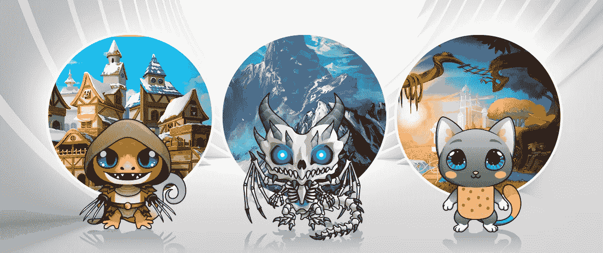
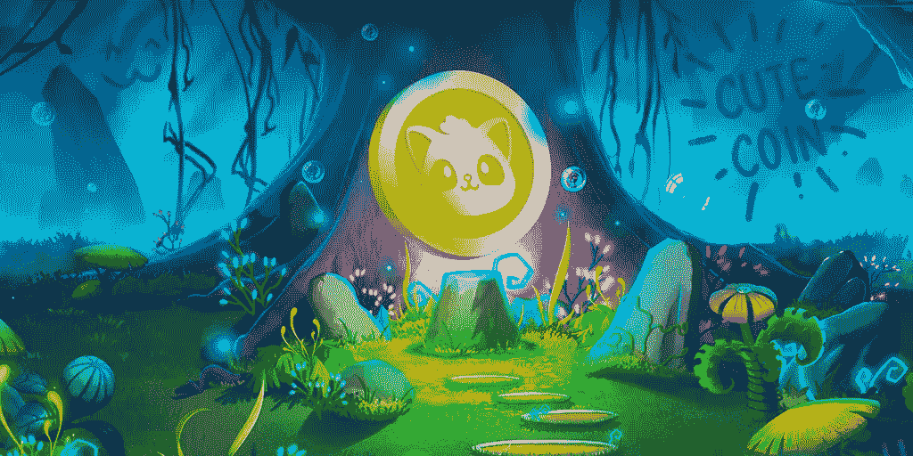

# 管理游戏外的资源和游戏代币

> 原文：<https://medium.com/hackernoon/management-of-resources-and-gaming-tokens-outside-the-game-e40269ad3062>

## …6 个月后世界将如何看待区块链游戏。

区块链游戏已经改变了他们“收集和出售”的基本方法，并转向独特性和复杂性，因为没有创新就不可能留住玩家。在这一点上，可以说区块链博彩已经有了自己独特的历史，所以现在我们可以详细阐述一年多前，即 2018 年初开始的炒作。区块链游戏在一个好奇和新奇的时代突然出现，因此，许多业余爱好者加入了战斗。最早的阶段有很多项目，类似于我们现在看到的所有令人困惑的 alpha 和 beta 版加密游戏的预售和空投。随后，由于熊市急于巩固自己的地位，这一计划最终不了了之。一些像 Parsec Frontiers 和 Lordmancer II 这样的密码游戏非常雄心勃勃，但最终完全耗尽了资金，无法继续开发。有些碰巧是伪装的骗局，你可以很容易地用谷歌搜索到它们的名字，但我们不要关注这些，因为它们很可悲，不值得我们浪费时间。我们现在看到的是一个强大而竞争激烈的市场，每个区块链游戏都巧妙地吸引玩家的注意力，并深深地致力于质量。该行业终于稳定下来，并在某些方面摆脱了不成熟的数字，这些数字对分散式游戏产生了普遍的质疑。

加密游戏的独特之处在于，它没有严格遵守某一特定类型的规则。区块链游戏学会了如何充分利用一切，因此这个行业的构成相当折中。加密部分给他们带来了一点赌博和匆忙，另外，由于智能合同，游戏已经能够将自己确立为一种体面和安全的赚钱方式，同时度过休闲时间。现代中核心战略也影响了分散式游戏。因此，区块链 Cuties Universe，一款基于 TRON、以太坊和 EOS 的多区块链游戏，正在以类似于《王国与维京人的崛起:部落之战——手机游戏》的方式开发其战斗和战术。

# 资源管理

所有经验丰富的中央世界游戏玩家终于可以将希望寄托在 2019 年改进的加密游戏上，这将是稳定发展的一年。好吧，说实话，不仅仅是沉迷于游戏的人应该感到兴奋，而是所有那些寻找娱乐但仍然有意义的方式与 crypto 互动的人。

例如，TRON Arcade 仍在努力将新的强有力的竞争对手纳入竞争范围。因为 TRON 的不断努力，区块链 Cuties Universe 在 2018 年 12 月底成为 Tron 上第一款加密收藏游戏。现在，区块链 Cuties Universe 团队正在开发一个全新的概念，玩家将拥有自己的个人土地，在游戏中建立政府，并决定 Cuties Universe 的命运。区块链 Cuties Universe 的努力成果将很快呈现在密码界。即使在这种情况下，你仍然可以在现实世界和分散式游戏之间进行类比。例如，帝国锻造，这是一个跨平台的游戏，你可以建立自己的城市并进行定制，也使用了前面提到的 cryptogame 计划的类似机制。

最后，区块链游戏的游戏性问题正在处理中。如果以前人们常说密码游戏很吸引人，但不一定有趣(特别是因为它们缺乏高质量的图形)，那么现在这种说法不再成立。在游戏内的资源管理方面也可以看到快速的进步。有太多的游戏内活动计划围绕资源来组织。这些游戏资源的一些例子包括:

*   玩家拥有土地。
*   游戏分数反映在许多方面，如顶级玩家名单或完整冒险次数等。
*   家族和联盟。
*   密码游戏中的角色即数字资产。
*   作为硬通货的游戏内可替换代币。
*   等等。

在这种规则下对资源的巧妙管理允许玩家影响加密游戏。

# 为什么区块链游戏开始发行游戏代币？

区块链游戏中的土地机制由游戏中的领土和政府组成，需要一种特殊的方法，这是以前存在的加密货币无法提供的。这首先是因为个人游戏代币具有实际价值。每个代币都是一个承诺，由一个真实的产品支持，这个产品就是密码游戏本身。在众多不同的 ico 爆炸之后，投资人都在寻找背后有一些像样背景，也能证明自己价值的项目。散户投资者可以适用于那些不一定拥有数百万加密资产的人。基本上就是人们购买加密游戏的专有代币。通过这种方式，他们帮助发展 Dapp 并资助一些重要的变革。

2019 年 4 月 27 日，区块链 Cuties Universe 在 exchange 上推出了一款名为 CUTE 的游戏代币。玩家们说他们把它当作一种艺术货币，而它的主要目的仍然是一件进行中的作品。区块链 Cuties Universe 的首席执行官 Vlad Tomko 表示，他们正在创建一个投票系统，每个拥有 3%以上土地所有权的玩家都可以投票选举 Cutieland 某个派系的下一任国王或王后。土地很快就可以购买了。现在，CUTE 在 HitBTC 上市，hit BTC 是全球首屈一指的加密交易所之一，为交易者提供广泛的功能，如实时清算和尖端的订单匹配算法。

# 你统治

游戏代币也作为一种先进的大众采用工具，因为它们为人们提供了一个切入点。HitBTC 等交易所的用户可以通过注意某个游戏在 CUTE/ETH、CUTE/TRX 等交易对中的令牌上升来发现该游戏。试一试。由于多种原因，强化令牌更强。最主要的一点是他们所展示的项目质量和购买频率之间的直接关联。