# MapKit —使用 Xcode 中的 7 行 Swift 显示地图并跟踪用户位置

> 原文：<https://medium.com/hackernoon/mapkit-display-map-and-track-user-location-with-7-lines-of-swift-in-xcode-26bde7a5646d>

MKMapKit & CoreLocation 初学者快速指南。

我叫 Max，跑 [**maxcodes.io**](https://www.maxcodes.io) **。很高兴终于见到你了。**

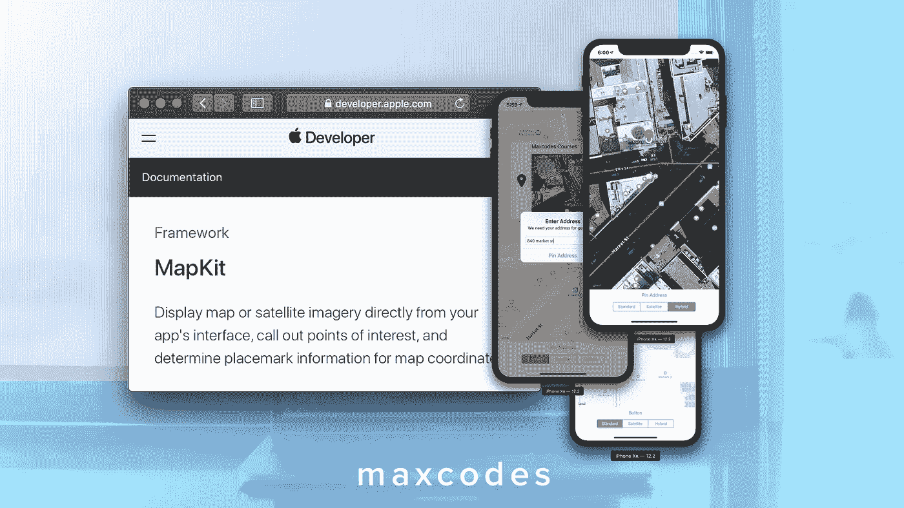

A quick guide to MKMapKit & CoreLocation for beginners.

## 第一步

创建一个新项目，并在 main.storyboard 视图控制器场景中放置一个 MapView。

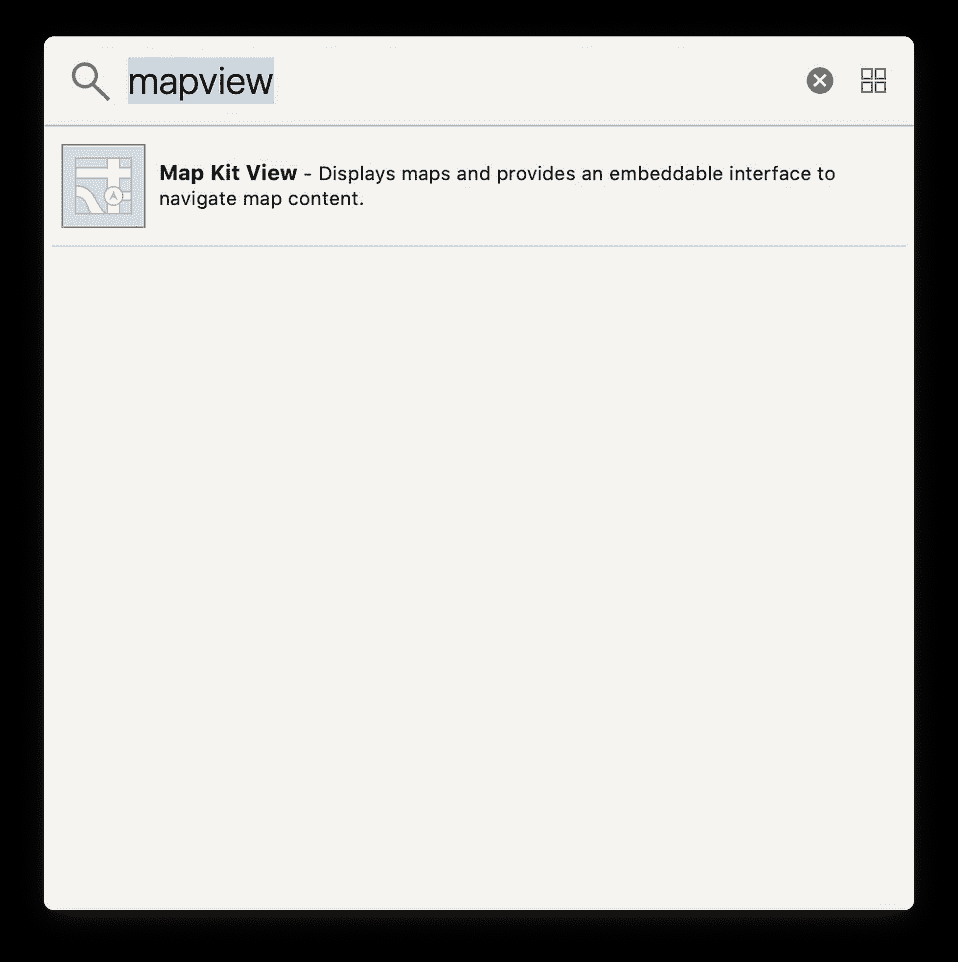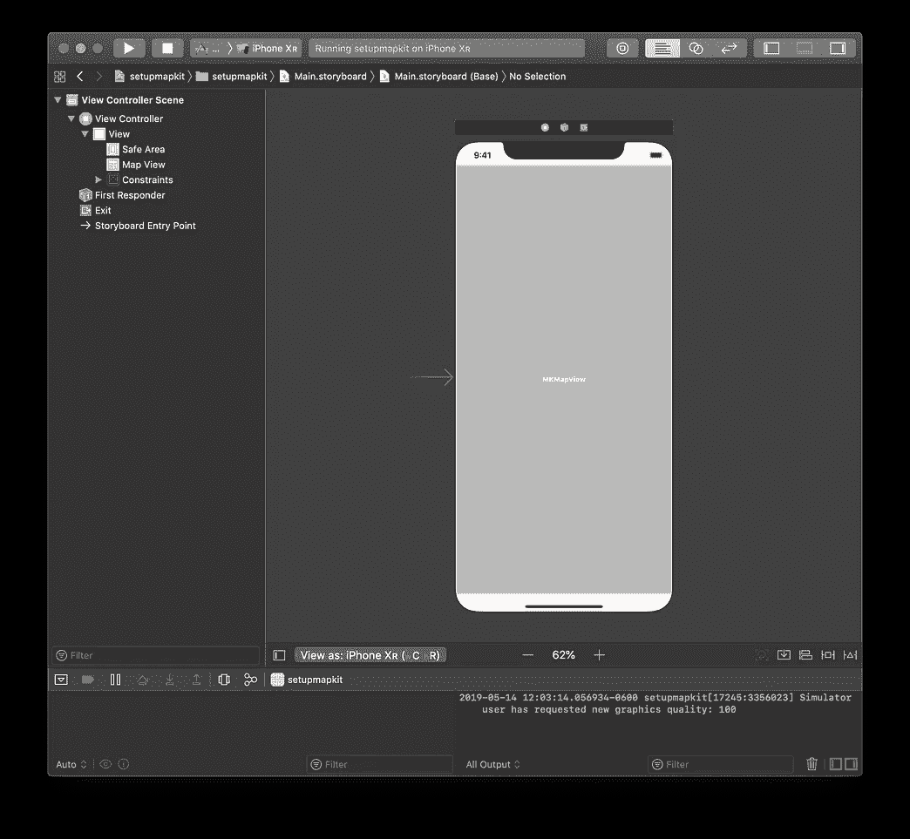

drag the map kit view to your storyboard and size it properly

## 步骤 2-导入地图工具包并连接您的地图视图

创建一个 MapView IBOutlet，以便可以在 ViewController.swift 中使用 MapView

*   按住键盘上的控制键，单击并拖动地图视图到视图控制器(同时保持手指按住控制键)。)
*   在 mapView 中键入
*   点击连接

你会看到这一行出现: ***@IBOutlet 弱 var mapView: MKMapView！***

*   但是，您会得到一个错误。所以**在 ViewController.swift 的顶部导入 map kit**这就会消失。

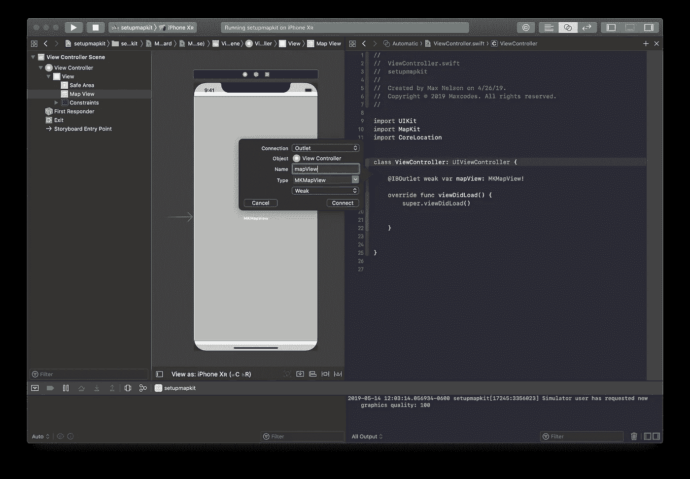

## **步骤 3 —CLLocationManager &追踪用户位置**

*   用下面一行创建一个 file private CLLocationManager 实例…将这一行放在 viewDidLoad 方法的正上方。

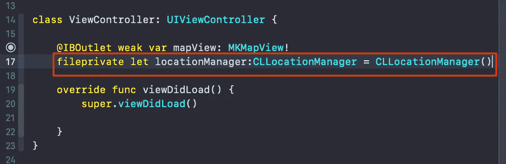

CLLocationManager class instance

*   在 viewDidLoad write 中，这五行。
*   在我的*[***MapKit 课程*** 、](https://www.udemy.com/mkmapkit/?couponCode=MEDIUMDEVELOPERS)中，我一边查阅文档一边解释每一行*

*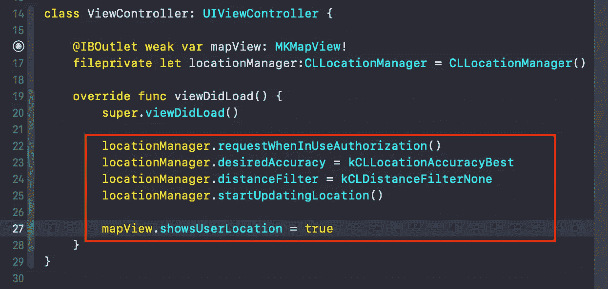*

*tracking user location with core location manager and the map kit framework as a team.*

## *第 4 步— Info.plist & Permissions。*

*如果你编译这个代码，你的用户的位置将不会被跟踪，(等等什么垃圾最大值？)，你会得到一个警告(哦好吧。)你会在控制台/输出中看到这个。我掩盖了一些输出以强调***NSLocationWhenInUseUsageDescription***字符串。但是，我鼓励您阅读整个输出。*

*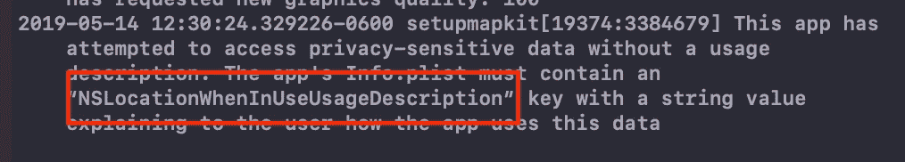*

*The app’s Info.plist must contain an “NSLocationWhenInUseUsageDescription” key*

*所有这些意味着我们需要**请求用户允许我们追踪他们的位置，同时也让他们知道为什么我们有一个很好的理由这么做。**所以这样做是为了避开这个警告，完成应用程序:*

*   *CMD 复制***NSLocationWhenInUseUsageDescription****
*   *点击悬停在 Info.plist 属性上时出现的 **+** 按钮。*
*   *CMD Paste*
*   ****可选提示:*或者，您可以手动输入隐私— …..等等，而不是复制粘贴。***

***你会得到这个… boi。***

***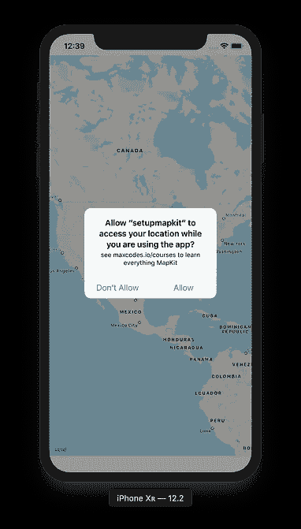******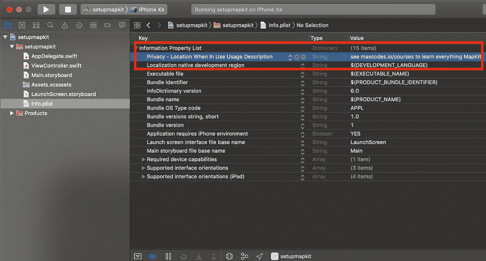******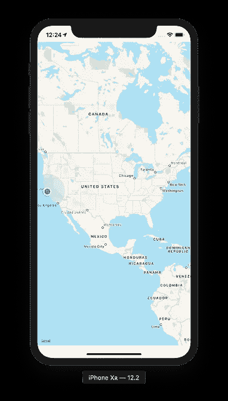***

***Info.plist — A magical file of boring app data.***

## ***第五步——哦，等等，你完成了。***

***如果你跟着走，你的手机或模拟器应该会跟踪一个位置。 ***如果您使用模拟器，您的位置将始终是加州旧金山。******

***如果是 ***而不是*** 工作，尝试进入 iPhone 的设置应用、隐私、定位服务，找到你的应用，让应用追踪你的位置。 ***或者，你可以上*** [***完整的 iOS 开发者地图工具包课程。***](https://www.udemy.com/mkmapkit/?couponCode=MEDIUMDEVELOPERS)***

*********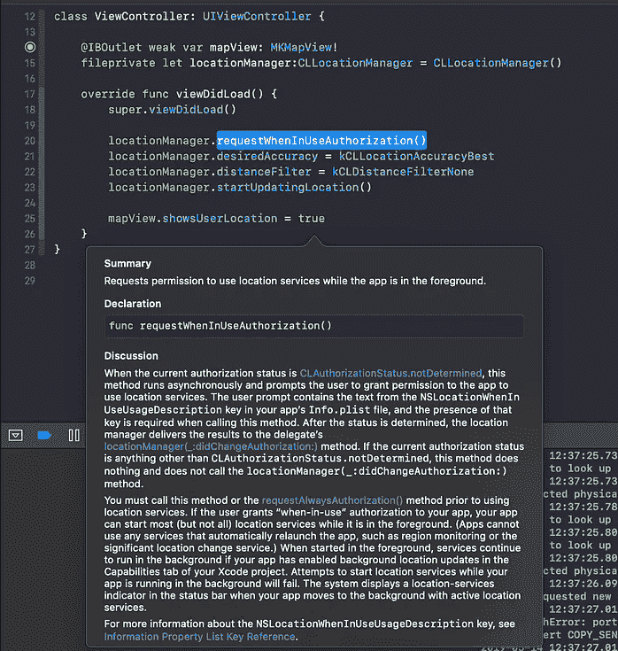***

***The Complete iOS Developer’s MapKit Course — By Maxcodes.io***

## *****下面的代码截图是怎么回事？*****

***这是我在我的课程中教你的一个例子。在我介绍一个新概念的每个视频之前，我都会简要地介绍一下苹果开发者文档。开发者文档可以通过多种方式在线引用或直接通过 Xcode 引用。***

## ***你为什么这么做，麦克斯？***

***我的课程创建任务不仅是教你像 MapKit 和 CoreLocation 这样的具体概念，还教你如何解读和阅读文档，这样你就可以更快、更好地自学。***

## ***好吧，但是这对我有什么好处呢？***

***这意味着你可以通过减少课程的数量来节省时间和金钱，也可以减少你上网寻找解决方案的时间。换句话说， [**我的目标是教你*如何学习如何编码*，而不仅仅是如何编码。**](https://www.udemy.com/mkmapkit/learn/?couponCode=MEDIUMDEVELOPERS)***

## ***所以…***

***如果这个**引起了你的共鸣**，或者你想征服文档，或者如果你只是想一门一门地学习概念，而不是真正关心文档，那么 [***我的课程将帮助你赢得所有的案例。***](http://bit.ly/maxcodes)***

# ***我感谢你的支持。—最大值:)***