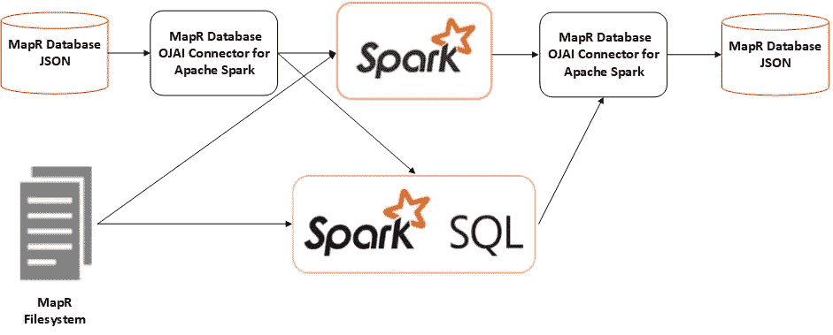

# 带二级索引的 MapR-DB 火花连接器

> 原文：<https://medium.com/hackernoon/mapr-db-spark-connector-with-secondary-indexes-df41909f28ea>

与大数据领域的任何其他工具相比，MapR 数据平台具有显著优势。MapR-DB 是该平台的核心组件之一，它提供了最先进的功能，让大多数 NoSQL 数据库望尘莫及。

MapR-DB 的一个重要附加功能是能够通过 Apache Spark ***的 [***连接器使用 Apache Spark 进行写入和查询。*** 使用这个连接器非常方便，因为它可以使用不同的 spark APIs(如 rdd、DataFrames 和 Streams)从 Spark 向 MapR-DB 读写数据。](https://mapr.com/docs/61/Spark/SparkConnectorsMapRDB.html)***

使用连接器，我们可以发出如下查询。

得到的类型是一个`Dataframe`,我们可以将它用作来自任何其他来源的任何其他数据帧，就像我们通常在 Spark 中所做的那样。

如果我们过滤掉数据集，问题就开始出现了。例如，让我们看看下面的查询。

过滤器被下推，因此 MapR-DB 进行过滤，并且只发送回符合过滤器的数据，从而减少 MapR-DB 和 Spark 之间传输的数据量。但是，如果在 first-name 字段上创建了一个索引，则该索引将被忽略，整个表将被扫描，试图找到符合筛选条件的行。

通过对一个字段建立索引，我们希望使用它来优化对该字段的查询，最终加快计算速度。所提供的连接器并没有使用这个功能。

# 必需品

我们的团队 MapR Professional Services 知道，使用 MapR-DB 二级索引进行过滤对性能有很大影响，因为我们的许多客户实际上都试图利用这一特性(二级索引)，所以我们采取了不同的方法，以便在使用 Spark 时强制使用索引。

以下帖子是一位同事写的， [***如何在 Spark 与 OJAI***](https://mapr.com/blog/how-to-use-secondary-indexes-in-spark-with-open-json-application-interface-ojai/) ***，*** 一起使用二级索引，他解释了一些解决手头问题的方法。

即使我们可以走一些捷径，我们也不得不放弃一些默认连接器拥有的好的构造，比如`.loadFromMapRDB(...)`。

## 独立的连接器

在过去，我已经在 ***太*** 很多方面扩展了 Apache Spark。我写了自己的 [***自定义数据源***](https://hackernoon.com/extending-our-spark-sql-query-engine-5f4a088de986) 和最近的一个 [***自定义流源，用于 Spark 结构化流***](https://hackernoon.com/spark-custom-stream-sources-ec360b8ae240) 。

我又一次冒险编写了自己的 Spark 数据源，但这次是为了 MapR-DB，所以我们充分利用了二级索引的优势，同时保持了当前 Apache Spark 的 MapR-DB 连接器所具有的 API。

在这篇文章的最后，我们将能够在完全使用二级索引的情况下，用下面的方法编写一个查询。

# Spark 数据源版本 2

下面的数据源实现使用 spark 2.3.1，并使用数据源 API V2。

让我们先看看我们需要的东西。

1.  **ReadSupportWithSchema** ，允许我们创建 DataSourceReader。
2.  **DataSourceReader** ，当我们需要指定如何创建一个 **DataReaderFactory** 时，允许我们获取数据的模式。
3.  **supportspushdowfilters**，允许我们拦截查询过滤器，以便我们可以将它们下推到 MapR-DB。
4.  **SupportsPushDownRequiredColumns**，允许我们截取查询投影，以便我们可以将它们下推到 MapR-DB。

让我们从实现 **ReadSupportWithSchema** 开始。

正如我们所看到的，当从 MapR-DB 中读取数据时，我们只需要获得表路径和我们想要使用的模式。然后我们将它们传递给 **MapRDBDataSourceReader** 。

# **MapRDBDataSourceReader**

**MapRDBDataSourceReader** 实现了`DataSourceReader`，我们还混合了`SupportsPushDownFilters`和`SupportsPushDownRequiredColumns`来表示我们想要将过滤器和投影下推到 MapR-DB。

`projections`变量将保存我们想要投影的模式(如果有的话)。如果我们没有通过做`.select`显式地投影字段，我们将把所有的字段投影到`schema`变量上。

`**readSchema**`与`projections`和`pruneColumns`协同工作。如果在我们的 Spark 查询中，我们指定了一个`select`，那么选择的字段将被传递给`pruneColumns`，这些是我们将从 MapR-DB 中带来的唯一字段。

`**pushFilters**`表示我们在 Spark 查询的`where`或`filter`子句中指定了哪些过滤器。基本上，我们必须决定将其中的哪些下推到 MapR-DB，其他的将在数据进入内存后由 Spark 应用。

在上面的代码片段中，我们表示我们将只下推两种类型的过滤器，`EqualTo` 和`GreaterThan` *。*从 MapR-DB 加载数据后，除了这两个过滤器之外的任何其他过滤器都不会被下推，过滤将在内存(火花内存)中进行。

我们正在努力添加更多的过滤器，以匹配当前的 MapR-DB 连接器。

`**createDataReaderFactories**` 创建一个数据读取器列表，这些读取器实际上从我们的数据源 MapR-DB 中执行繁重的读取工作。在我们的例子中，我们只创建了一个数据读取器，但是理想情况下，每个 MapR-DB 区域/分区都有一个读取器，这样我们就可以利用 MapR-DB 提供的并行性。

# MapRDBDataReaderFactory

我们几乎完成了，然而，最重要的部分即将到来。

`**MapRDBDataReaderFactory**` 是我们实际构建 MapR-DB 查询并再次执行 MapR-DB 表的地方。请注意，我们正在传递我们要从中读取的表，我们要下推的过滤器和投影。

现在我们需要通过打开一个连接并创建一个文档存储对象来连接到 MapR-DB。

`**createFilterCondition**`构建我们想要对 MapR-DB 执行的查询条件。这是我们整个实现中最重要的部分。

在这里，我们结合了所有的过滤器。正如我们所看到的，我们只为两种数据类型实现了两个支持的过滤器，但是我们正在努力扩展这个实现以匹配当前的 MapR-DB 连接器。

`**query**`创建发送到 MapR-DB 的最终命令。这个任务就是将查询条件和投影应用到我们的`**connection**`对象。

> 注意到这一点非常重要，因为我们使用的是 ***OJAI*** ，它将自动为属于我们正在应用的过滤器一部分的字段使用任何二级索引。确保你在这篇文章的最后检查输出。

`**documents**`是基于`**query**`来自 MapR-DB 的数据流。

`**createDataReader**`使用我们创建的流(`**documents**`)进行实际读取，并将数据返回给 Spark。

# 使用我们的连接器

此时，我们已经准备好通过以下方式将自定义数据源插入 spark。

这允许我们使用自己的方式从 MapR-DB 中读取数据，这样，作为物理表上二级索引一部分的任何过滤器都将用于优化读取。

## 句法

为了维护与默认 MapR-DB 连接器提供的 API 相似的 API，我们以下面的方式向我们的库添加了一些语法。

我们现在可以像使用默认连接器一样使用我们的连接器了。

# 使用 MapR-DB 辅助索引

当我们运行上面的代码时，来自 **OJAI** 的**跟踪**输出看起来如下所示。

注意，它自动使用名为 **uid_idx** 的索引，这是字段`uid`的索引，同时也是 spark 过滤器中使用的字段。

# 结论

MapR-DB 是一个强大的工具，作为 MapR 数据平台的一部分运行。Spark 连接器提供了一种与 MapR-DB 交互的有趣方式，因为它允许我们在使用这个 NoSQL 系统时大规模使用所有 Spark 结构。但是，有时缺省连接器会出现问题，因为它没有在我们最需要的时候使用 MapR-DB 的辅助索引功能。

另一方面，我们的实现模仿了连接器 API，并确保实现的 Spark 数据源使用 MapR-DB 二级索引，因为它依赖于能够支持现成二级索引的纯 OJAI 查询。

*我们的库代码可以在这里找到*[*MapRDBConnector*](https://github.com/anicolaspp/MapRDBConnector)*。*

*免责声明:这是一项改进 MapR-DB 查询的独立工作。这个库不是官方的* [***连接器的替代品，它是由 MapR 作为其发行版的一部分提供的 Apache Spark***](https://mapr.com/docs/61/Spark/SparkConnectorsMapRDB.html)**连接器。**