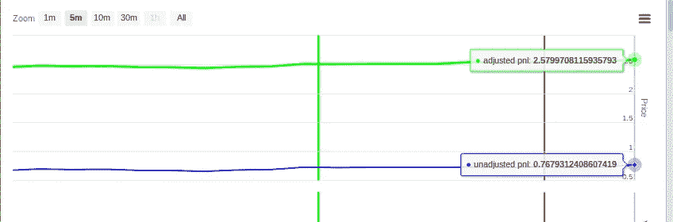
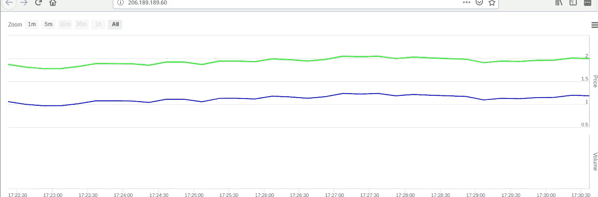
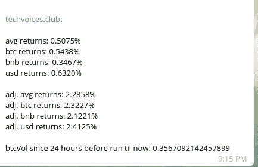
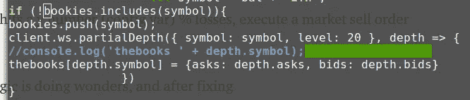

# 几天后做市 Bot:回顾

> 原文：<https://medium.com/hackernoon/market-making-bot-after-a-few-days-in-review-ec0d185c1504>

看到持续的利润是一种难以置信的好感觉:)

[http://techvoices.club/](http://techvoices.club/)

(它不是 24/7 运行的，检查“returns”机器人的电报室，以查看当前的开发/社区机器人…)

不相信开发机器人？社区成员怎么样？

 [## 做市商 Bot

### 可以马上查看并加入@themarketmakerbot。

t.me](https://t.me/themarketmakerbot) 

我们收集了一些社区反馈，并将其整合到机器人中。

1.  布林线指标，分钟，超过 9 分钟，不要买，如果要求高于上限！
2.  RSI 指标，分分钟，14 分钟以上，70 以上不买，30 以下不卖！

整合这些真的很有趣。我创建了一个数组的数组和对象的对象的数组，将 6 秒钟的更新排序为 10 个间隔，用于分钟的数据，当 bot 运行时，它会预热。

3.创建最小 i-1 小时蜡烛线交易量与 24 小时交易量的隐含小时波动率。

这是一个好主意，因为有成吨的对将泵和倾倒，尖峰 24 小时的数量，并没有显着的未来的数量。

4.通过 AWS 或 GCP，开始创建一个可发布的产品，用 export= vars 输入图像启动脚本，并从私有的 GitLab 主分支中提取代码。即将登陆您附近的网站！

5.关于这一点，我们通过 duckdns 将代码从公共免费和开放源代码转移到在我的计算机上运行的私人回购中，并要求捐赠 0.1 btc 或等效物来访问代码。

实现的下一个级别 sh#t 包括允许机器人(可选地，根据布尔 var)购买订单，以高于购买价格的利润%出售，随着价格上下波动，我们一遍又一遍地收集订单。万岁。

审查中的机器人:

我为我的机器人做了一个机器人！发电报来救援！

HitBTC 的交易量非常低，尽管缺少像币安那样的最小名义 1 BNB 0.01 ETH 或 0.001 BTC 帮助这个机器人发展成为今天的野兽…

…最值得注意的是包含和调整了“neversellataloss”布尔值和以下逻辑:

a.当输入购买订单时，注意(如果当前退货为负)负退货和购买价格的函数以弥补损失，以及(如果当前退货为正)购买价格* 1.002 的函数以弥补费用

b.不要输入低于上述金额的卖单——不要重新购买高于上述金额的鞋对

c.每隔 x 分钟，将最低卖价降低 0.9999

d.如果该对达到 y 数字(配置变量)%损失，执行市场卖单作为止损

上面的逻辑很神奇，在修复了由于不必要的重新初始化深度而导致的内存泄漏后，bot 功能齐全，并且完全可以杀死它。

# 结论

如果你想从表现良好的硬币价差中获利，以弥补那些低于你的“永不卖出”损失价值的硬币对的损失，那就提高你在交易所的交易量——是的，我敢说——获利，加入我们的行列吧:)

[https://t.me/themarketmakerbot](https://t.me/themarketmakerbot)