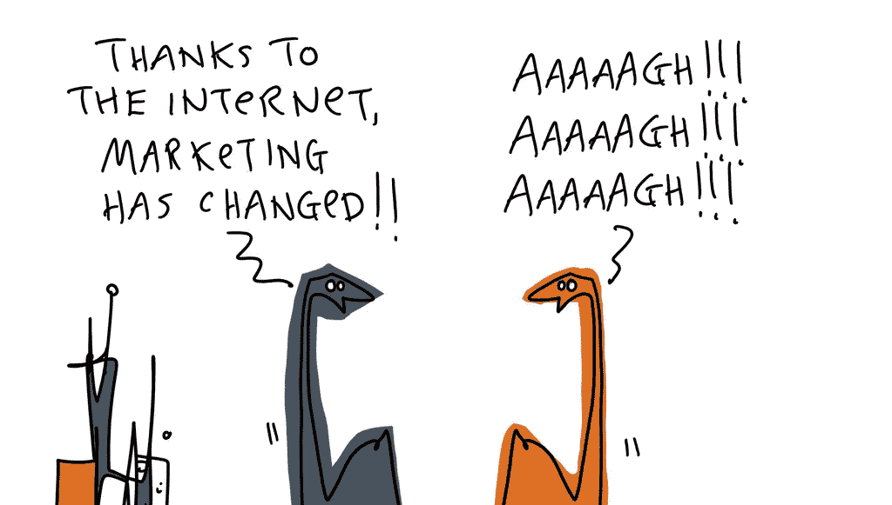
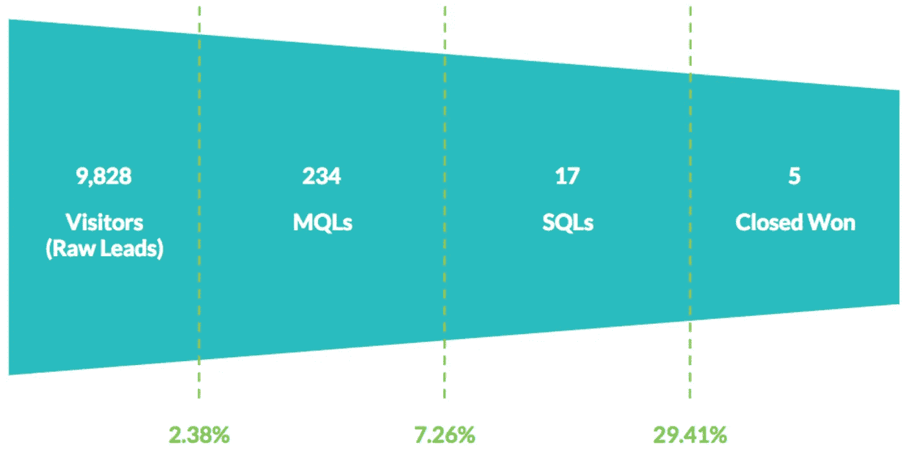
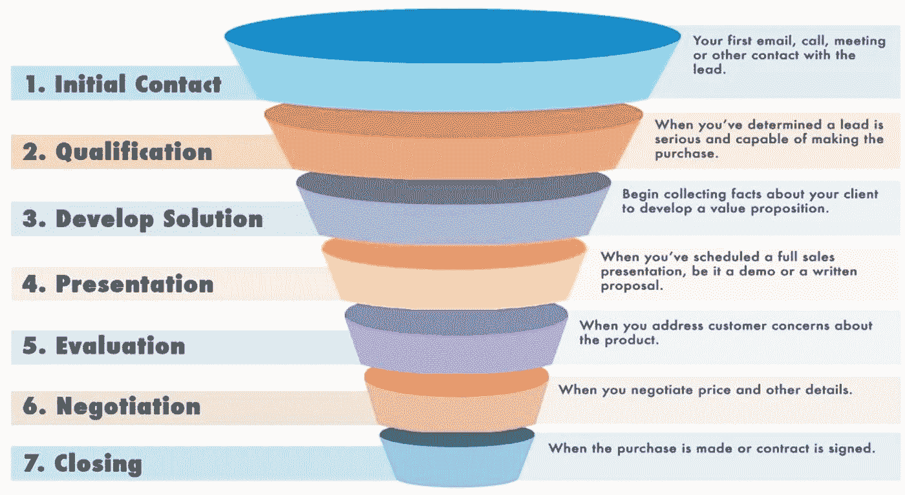
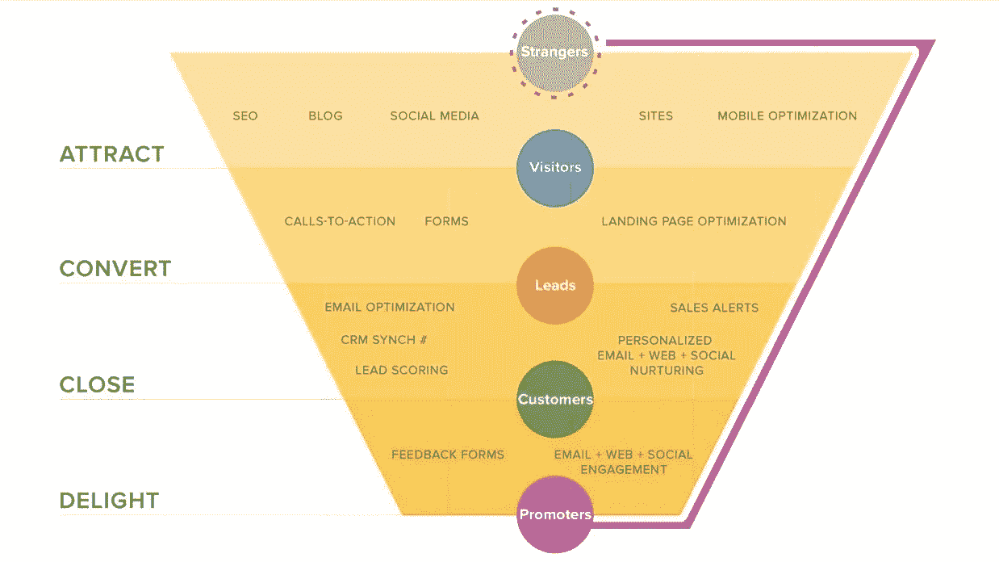
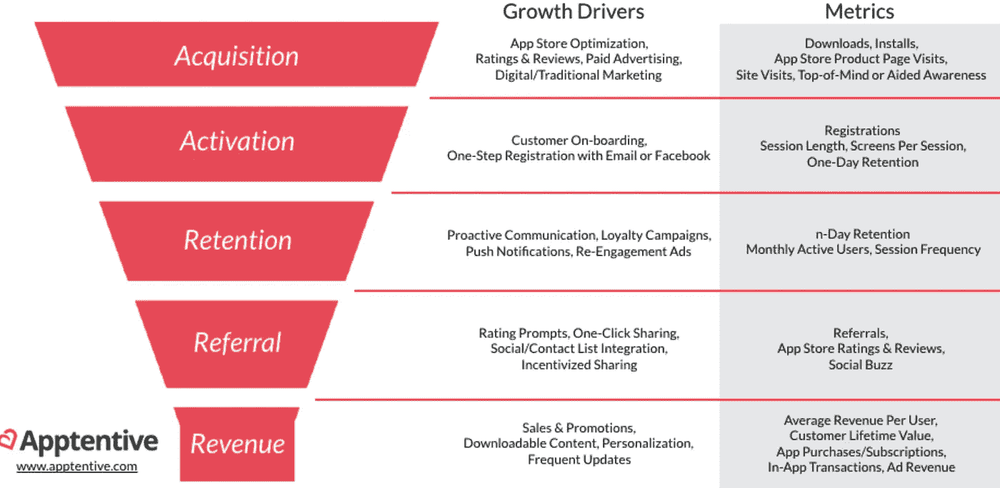
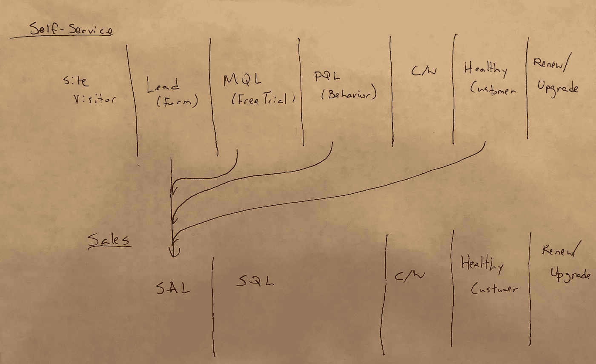
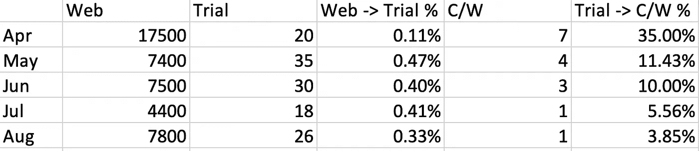

# 工程师营销 102:打造漏斗

> 原文：<https://medium.com/hackernoon/marketing-102-for-engineers-ddf3b7fa61e6>

## 如何找出什么是重要的

[*Art credit to Hugh MacLeod’s work on the HubSpot blog*](https://blog.hubspot.com/blog/tabid/6307/bid/28396/How-to-Make-Marketing-That-People-Love-Gapingvoid-Cartoons.aspx)

*编程注意事项:本帖是 GTM 主题系列中长度不定的 n 篇，主要面向* [*初创*](https://hackernoon.com/tagged/startup) *人群，主要是领导，主要来自非 GTM 背景。末尾有一个列表。*

你怎么知道[营销](https://hackernoon.com/tagged/marketing)有没有在做*的事情？*我们的营销活动模式是什么，它是否会产生回报？

在我看来，做到这一点的唯一方法是知道漏斗看起来像什么——或者我们希望它看起来像什么。

这有点先有鸡还是先有蛋的意思，因为任何漏斗都将与我们销售成功(或失败)的地方共同发展，它还将与产品和信息的核心组件共同发展，比如:*谁是*用户，*谁是*买家，*什么是*价值主张，*什么是*差异化。

## **GTM**

每个漏斗都存在于某些走向市场(GTM)的环境中。

从字面上看，我们如何去市场。我们有样东西想交易。我们需要…

*   决定是给谁的
*   找到拥有这些人的市场
*   想办法让他们知道我们的存在和市场
*   让他们停在我们的摊位前
*   让他们相信价值
*   让他们尝试或购买
*   给东西定价，让我们赚些钱(继续做生意很好)*和*让顾客觉得他们物有所值
*   决定是否会有讨价还价
*   决定支付更多的顾客是否得到更多、不同或更好的商品和/或服务
*   用一种吸引人的方式包装东西，容易理解，也许容易比较..或者不是(有意图地)
*   弄清楚如何进行销售，就像某人的工作是销售，或者顾客只是把钱放入一个盒子，拿走正确的数量
*   实际上*做*销售，要钱，拿钱，交出产品
*   想办法让顾客再次光顾
*   了解让顾客满意或不满意的因素
*   找到下一个市场和下一个客户

## **漏斗**

这就是 GTM 人员——销售和营销人员(&“增长”)—如何从“顶层”(认知)到“底层”(付费客户)对客户获取过程进行建模。

*请注意，在经常性收入中，订阅服务的底部在保留/续订方面可能会进一步下降。*

在其他类型的业务中，你可能根本不是一个漏斗，而是一个飞轮或其他东西。【提示:还是个漏斗。专家有多少，模型就有多少。每一个都是错的，也是有用的。我们必须找到最适合我们特定业务的产品，在特定市场中竞争特定客户群及其特定的成熟和发展状态。

*例子！*

SImple Funnel

[*Outbound Sales-Led Funnel*](https://fitsmallbusiness.com/wp-content/uploads/2017/11/7-Pannel-Funnel-1024x714.jpg)

[*Inbound Self-Service Funnel*](https://blog.hubspot.com/customers/how-to-drive-more-sales-appointments-with-the-hubspot-growth-stack)

[*AARRR Funnel*](https://d35fo82fjcw0y8.cloudfront.net/2017/11/20084658/mobile-customer-purchase-funnel1.png)

*Inbound Self-Service + Inbound Sales Funnel [Yes, I drew that.. sorry]*

只要每个人都知道我们在说什么，我们在每个阶段使用的确切术语并没有太大关系。随着规模的扩大，我们将朝着行业通用语言的方向发展。

如果我们放大到一个特定的阶段，有很多子阶段。特别是销售团队，他们有自己的子漏斗，指定销售资格和机会开发阶段，并有自己的术语。这通常不会反映在顶级漏斗视图中。但是，销售领导使用它(以及薪酬和行动手册)来了解和调整销售组织的绩效。

为了真正有效地进行营销，我们应该确切地了解销售团队是如何运作的，这样我们就可以调整上游活动并诊断失败模式。

*建议*

*   毫不留情地拒绝不工作的型号
*   **定制适合自己的**
*   **经常测量并且**一致****
*   **轻视确认证据**
*   ****采取**不一致的**证据..在很大程度上；大量地****
*   ****在你现在使用的型号停止工作之前，你有没有关于下一个可能工作的型号的想法****

## ******指标******

****下面是我们*需要*测量的内容，以便了解正在发生的事情:****

*   ****每个阶段的绝对人数****
*   ****每一阶段到下一阶段的转换率****
*   ****这些指标的周环比(WoW)、月环比(MoM)、季度环比(QoQ)和年同比(YoY)的变化****

****一般来说，你会认为随着人们通过漏斗，数字会下降。【所以才是漏斗！]为了真正看到这一点，我们需要一些最小的可行群体来衡量。这通常是在时间范围内完成的。每周和每月通常用于营销活动、策略和营销职能的日常运作。每月、每季度和每年是典型的报告和董事会会议。****

****但是我们也可以运行特殊的队列来测试(A/B 或其他)活动、策略和资产，这些活动、策略和资产的时间范围要短得多..或者甚至类似于“被发送到这个登录页面的 100 个站点访问者”。****

****除上述之外，我们还应寻找上游销售线索生成质量和收入机制的替代指标:****

*   ****MQL -> C/W 和 MQL 之间的转换率->流失率****
*   ****MQL 管道****
*   ****每条(不合格)销售线索的成本(CPL)和/或 CPMQL****
*   ****每个不合格销售线索和/或 MQL 的实际收入****
*   ****MQL ->自助漏斗的销售不合格或自助 DQ****

****和[反]指标，这些指标会影响我们对所选 GTM 和销售行动的评估:****

*   ****客户获取成本(CAC)****
*   ****回收期****
*   ****平均售价****
*   ****年度合同价值(ACV)****
*   ****销售周期****
*   ****销售合格线索的转换率(SQL) -> C/W****
*   ****每个 SQL 的 ASP 与管道的比率****

*****示例—缩放！*****

****想看看难以置信的成功企业是什么样的吗？[阅读汤姆·东格斯在 Zoom 的 S-1 上的帖子。](https://tomtunguz.com/benchmarking-zoom-s-s-1-how-7-key-metrics-stack-up//)****

****Zoom 带来 1 美元的营销和销售→**1.80 美元的毛利润**。这就是实际价值创造的样子。我们都应该如此幸运和熟练！****

## ******测量******

****我不是神奇指标的支持者。针对单一指标进行优化会让你看不到我们营销和销售机器的某些部分没有工作(或失去效力，这是正常的)…直到游戏中的*非常晚*。也许太迟了！****

*****建议*****

*   ****尽可能多地测量****
*   ******按照固定的时间表坚持做这件事******
*   ******关于假设和方法要**明确********
*   ****举报**比你收集的少多了******

********

****Minimum Viable Reporting****

****需要注意的事项:****

*   ****将销售效率与不受销售效率控制的任何事情混为一谈——销售开发代表(SDR)在资格认定方面变得更好，客户经理(AE)在预测每笔交易收入方面变得更好，这是更多/更好的销售线索的功能****
*   ****任何上游指标的变化不会导致下游指标在相同方向上发生变化—如果发生这种情况，请找出传播停止的位置，并从那里解决问题，或者意识到上游指标的变化是失败/扯淡****
*   ****独立于上游指标发生的任何下游指标的变化——如果这种变化是无意发生的*,找出如何发生并调整(如果为正)或止血(如果为负)*****

## *******杠杆*******

*****我们建模和测量漏斗的方式应该告诉我们如何改进它。*****

*****让我们勾画出一个*非常*简单的例子:*****

> *****如果我们有一个五阶段漏斗，每月有 10000 个销售线索，每个阶段之间有 10%的转换率，销售周期为 30 天，那么对于从第 0 天开始到第 30 天结束的每个群组，我们最终只有 1 个付费客户[10000 → 1000 → 100 → 10 → 1]。*****

*****我们如何考虑改进这个漏斗？*****

*****目标只有一个:**增加数字**。*****

*****只有两种方法:更大的**音量**或更高的**转换**。*****

*****顶部的交易量越大，底部的顾客就越多。如果没有，我们在下面的某个地方就有能力、效率或执行问题。*****

*****任何一个阶段较好的转化率，都应该导致下一个阶段有更多的成交量，这应该导致更多的底层客户。如果没有，我们在下面的某个地方就有能力、效率或执行问题。*****

> *****只有两种方法可以增加销售和营销数字:1)增加漏斗的容量，2)提高转化率。*****

*****如果我们不能将最复杂的漏斗或飞轮或其他任何东西分解成这些杠杆——交易量和转换率——我们就迷失了方向，应该重新考虑整个建立商业的事情。:)*****

******注意:可以说，第三个杠杆正在缩短销售周期，第四个杠杆正在改变定价。定价的影响是在数量和转换率上，所以它确实在做这些事情。销售周期要复杂得多，通常是其他事情而不是工程的必然结果。在任何情况下，只要我们能够成功缩短销售周期，我们就会为漏斗创造更多的上游需求，最终不得不这样做。******

## *******事不关己*******

*****潜在客户或客户的*生命周期*不仅仅是一个典型的漏斗图。我们应该为该生命周期开发一个完整的模型，即使它没有被定期报告或显示在漏斗图中。*****

******举例！******

*****如果销售线索没有成为客户，他们就会被关闭/失去(C/L)。这是有原因的，通常会以某种方式记录在 CRM 或营销自动化平台中。这些理由中的许多都是合理的:糟糕的时间，感兴趣但没有预算，喜欢它但刚买了别的东西。*****

*****在这种情况下，这些线索应该进入一个阶段，这个阶段没有显示在一个典型的漏斗上，称为“再营销”或“延迟线索培育”或其他什么。这是一个长期运行的阶段，位于 MQL 和接下来的任何事情之间，我们将与那个领导者保持联系，直到他们准备好，或者条件改变，或者他们转移到他们的下一家公司，给我们一个机会。*****

******举例！******

*****对于订阅业务，成为客户后也是一个跟踪客户到客户流失阶段的漏斗，我们可能希望将它作为客户成功功能的一部分单独查看。*****

*******【随意叉！】*******

************

******[Basic Funnel Template — Fork at will!](https://docs.google.com/spreadsheets/d/11r4tHm_es6Tl4DItNUc_KzNdyvrmbbRmb38CJPLCvRU/edit?usp=sharing)******

## ********非正式定义和解释********

******这些来自[销售 101](https://hackernoon.com/sales-101-for-engineers-6fcd1b49cffa)******

*   ******嫌疑人:进入你的网站的人，或者你在营销/销售过程中遇到的人，比如在会议的展位上******
*   ********潜在客户**:可能对购买感兴趣的人。******
*   ********导语**:可能对购买有兴趣的人(注意概率增加)。******
*   ********原始销售线索:**不合格的销售线索，即嫌疑人或潜在客户******
*   ********资格**:逐步确定给定潜在客户/潜在客户愿意、能够和可能购买的可能性的行为******
*   ********取消资格**:确定给定潜在客户/潜在客户*不*愿意、能够和可能购买的行为******
*   ********合格营销主管(MQL)** :可能对购买有一定兴趣的人，并且来自合适的组织，或者有合适的头衔，或者通过查看文档、点击定价页面和填写表格等方式表现出积极的兴趣。MQLs 是一个常用指标，用于衡量营销团队开展的需求挖掘活动(“计划、活动、策略”)的有效性。******
*   ********产品合格销售线索(PQL)** :在自助销售领域，通过在免费试用、免费增值版中与产品互动的行为，甚至在成为其所在层级的客户后(例如“PQL-ed for a upgrade offer”)成为合格销售线索的人。******
*   ********销售接受的销售线索(SAL)** :已被验证为有足够的购买可能性由销售代表积极处理的 mql——SAL 资格是营销和销售团队之间关于营销活动带来的销售线索的*质量*和销售组织用于验证销售线索的流程的*严格性*的争论点。******
*   ********销售合格销售线索(SQL)** :销售代表能够肯定地说销售线索有该产品可以解决的问题、解决该问题的愿望，以及通过购买该产品来解决该问题的预算/权限手段，在这种情况下，销售合格销售线索(SQL)可能是销售团队中的一个争论点，通常会使用非常严格、正式的定义(并被忽略)。******
*   ********机会(Opp 或 Op)** :超出 SAL 且可能超出 SQL 的某种资格级别—机会通常分为多个阶段，例如“阶段 2 机会”，这与销售线索类型的正式定义有关，例如 SQL ==阶段 2 机会。******
*   ********取消资格(DQ)** :表明销售线索不合格。******
*   ********客户获取成本**:总销售额&获取付费客户的营销成本******
*   ********回收期**:客户在盈利前付清 CAC 的时间(这有点天真，因为维护/支持客户的持续成本应该考虑在内，但很少在客户层面进行，而是更像是总体 COGS 资产负债表的底线项目)******
*   ********【客户】终身价值(LTV)** :客户作为您的客户时，其预期产生的总收入(假设所有客户最终都会流失)******
*   ********年度合同价值(ACV)** :正是它听起来的样子******
*   ******平均售价(ASP) :听起来就是这样******
*   ********销售周期**:从交易进入渠道到完成交易所需的时间。******
*   ********销售效率**:投资回收期[的倒数](http://tomtunguz.com/payback_period_cash/)，衡量销售(和营销)产生收入的效率。******
*   ********Pipeline** :在销售组织的任何级别预测的所有交易的金额，即每个销售代表都有一个 Pipeline，但他们的团队和整个销售组织也有。******
*   ********概念证明(POC)【又名试用】**:试用期，有时由潜在客户付费(付费 POC)。POC 通常很长，或者是专门为客户定制的。通常包括客户在实际生活中为特定用例使用产品，并致力于任何相关的集成工作。这些通常是为了有明确的结果和承诺。付费 POC 经常被初创公司作为“客户”进行营销，我称之为“标准废话”。******

## ******本系列中的文章(和模板)******

*   ******[工程师营销 101:功能介绍](/@aneel/marketing-101-for-engineers-ee9e7fcb1a51)******
*   ******工程师的营销 102:打造一个漏斗******
*   ******[面向工程师的营销 201:信息传递&定位](/@aneel/marketing-201-for-engineers-b28147fdb59d)******
*   ******[面向工程师的营销 202:发布](/@aneel/marketing-202-for-engineers-launching-9437aa0e4961)******
*   ******[工程师市场营销 203:销售支持](/@aneel/marketing-203-for-engineers-sales-enablement-e47662ca996a)******
*   ******[面向工程师的营销 204:创造需求](/@aneel/marketing-204-for-engineers-generating-demand-27200085320c)******
*   ******[工程师营销 301:战略&策划](/@aneel/marketing-301-for-engineers-strategy-planning-2e4473fcc879)******
*   ******[工程师市场营销 302:招聘营销人员](/@aneel/marketing-302-for-engineers-hiring-marketers-a3a6d4355a03)******
*   ******[工程师营销 303:定价框架](/@aneel/marketing-303-for-engineers-pricing-frame-aa71c8860a2b)******
*   ******[工程师营销 401:GTM 阶段](/@aneel/marketing-401-for-engineers-stages-of-going-to-market-6adcedc64e17)******
*   ******[面向工程师的营销 402:诊断&故障排除](/@aneel/marketing-402-for-engineers-diagnostics-troubleshooting-d946a337c258)******
*   ******[工程师营销 403:解答创始人常见问题](/@aneel/marketing-403-for-engineers-office-hours-bf4d2d0b5f56)******
*   ******[工程师销售 101:功能介绍](/@aneel/sales-101-for-engineers-6fcd1b49cffa)******
*   ******[针对工程师的 PR 101](/@aneel/pr-101-for-engineers-7cd116cc5347)******
*   ******[工程师分析师关系 101](/@aneel/analyst-relations-for-startups-101-ea9338cb13ed)******
*   ******[基本消息模板【谷歌文档】](https://docs.google.com/document/d/1neA71qCSeV3xH1Dpbtcy67m3v2ETmmB_Qq02ckkKUiQ/edit?usp=sharing)******
*   ******[基本漏斗指标模板【谷歌表单】](https://docs.google.com/spreadsheets/d/11r4tHm_es6Tl4DItNUc_KzNdyvrmbbRmb38CJPLCvRU/edit?usp=sharing)******
*   ******[基本发布时间表模板【谷歌文档】](https://docs.google.com/document/d/13Zscb5sX9ggjpWf05Ka-oj5wulC3Kb9z0LyMEQesnzM/edit?usp=sharing)******
*   ******[基本战斗卡模板【谷歌文档】](https://docs.google.com/document/d/1dOCKhE1Ufmwp7bXeQTBCkST7NPwiCPJ2oyWEdpQut1g/edit?usp=sharing)******
*   ******[详细战斗卡模板【Google Doc】](https://drive.google.com/open?id=1EC3Lq6Z_IVrZKR4-jHgnc5-e3krZw4bA5Z-HAOJlH10)******
*   ******[基本营销日历模板【谷歌表单】](https://docs.google.com/spreadsheets/d/1nXr0IqwnhQsUi_D83ecPXsIyDdiTkpNZ66piRkayPsA/edit?usp=sharing)******
*   ******[基本营销阶梯模板【谷歌表单】](https://docs.google.com/spreadsheets/d/17EfTQp_21WomJ9cwiM4ian9M2QRcbM17_d3DilGNThY/edit?usp=sharing)******

## ********阅读清单和资源********

*   ******鲍勃·廷克的 GTM 飞度[演讲](https://www.youtube.com/watch?v=IsuZzi-Hm3A&list=PLcnNOJoVRnjUmenBf9bAFE2qIxhSgECvx&index=2)和[幻灯片](https://www.slideshare.net/SurvivalToThrival/go-to-market-fit-summit)******
*   ******[托马斯·东古兹的博客](http://tomtunguz.com/)******
*   ******特伦·格里芬的博客******
*   ******[成长黑客社区](https://growthhackers.com/posts)******
*   ******[Kissmetrics 的博客](https://blog.kissmetrics.com/)******
*   ******[HubSpot 的博客](https://blog.hubspot.com/)******
*   ******[优化的博客](https://blog.optimizely.com/)******
*   ******[Reify 的博客](https://blog.reifyworks.com/)******
*   ******[创业公司❤客户](http://startupsheartcustomers.com/)******
*   ******[创业营销剧本](http://www.startupmarketingplaybook.com/)******
*   ******啊哈！营销策略模板******
*   ******[GrokSpark 产品信息模板](https://docs.google.com/spreadsheets/d/183FyklQaBzJh1ZZRvdNKS8TJmVfRm7weTSj4Hb27o8k/edit#gid=409433448)******
*   ******[拍摄卷发营销模板](https://www.shootthecurlmarketing.com/?s=template)******
*   ******啊哈！营销计划模板******