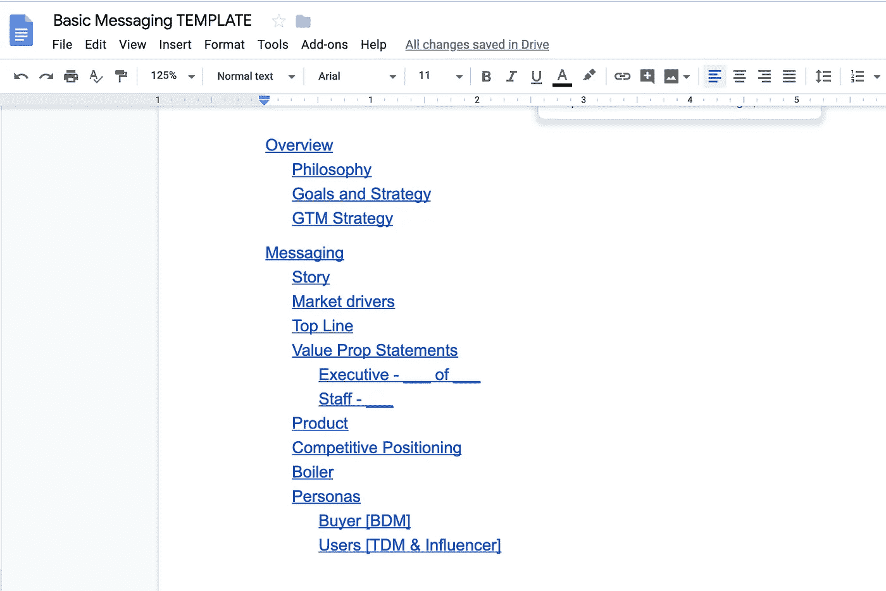

# 工程师营销 201:信息传递和定位

> 原文：<https://medium.com/hackernoon/marketing-201-for-engineers-b28147fdb59d>

## 如何发展和测试你的故事

[Found on QuoteFancy](https://quotefancy.com/quote/1351213/David-Ogilvy-You-cannot-bore-people-into-buying-your-product-you-can-only-interest-them)

***来源于*** [***工程师营销 101:功能介绍***](https://hackernoon.com/marketing-101-for-engineers-ee9e7fcb1a51)***……***

> 产品营销是一个广泛的学科。粗略地说，这是一种漏斗中部活动，尽管根据公司的不同，它会一直到达漏斗的顶部(开展活动和领导需求挖掘活动)和底部(充当销售工程师)。有时，它接管了许多通常被认为是品牌、沟通甚至产品管理的活动。

但是你可以把所有这些东西分成三大类:

*   讲故事—信息传递和定位
*   发布—走向市场
*   成交—销售支持

在这篇文章中，我们将关注第一个。

*编程注意事项:本帖是 GTM 主题系列中长度不定的 n 篇，主要面向* [*创业*](https://hackernoon.com/tagged/startup) *人群，主要是领导，主要来自非 GTM 背景。末尾有一个列表。*

# **故事**

讲述你的故事是营销的首要工作，具体来说是产品营销。你作为一个公司的故事，以及你的产品的故事。在初创公司的早期阶段，这些往往紧密交织在一起，以至于成为同一件事。

这个故事需要和其他故事一样的组成部分:一个有中心冲突的情节，主角和对手，以及一些解决冲突的方法。*

*   你看到的世界有什么问题？
*   是谁或什么造成的？
*   你打算怎么修理它？
*   你修复后的世界会是什么样子？

换句话说:

*   你造了什么？
*   你为什么建造它？
*   你是为谁建造的？
*   他们为什么要使用它？
*   为什么要他们来买单？
*   他们的生活会有什么不同？
*   它与他们能做到的其他方式相比如何？
*   产品的具体特性和功能是如何具体实现所有这些事情的？

应该有一个核心的、总体的故事来回答这些问题。反过来，这个故事又为更小的衍生故事提供素材，这些故事在一个产品或公司的生命周期中来来去去。核心故事是我们的“消息传递平台”衍生故事是在不同的地点、为不同的观众使用的版本，或者是反映非常具体的事情，比如某个特定的功能。

一开始，当我们专注于谈论我们所建立的东西的最佳方式时，一切都在不断完善，通常针对两个主要受众:说服他们给我们钱的投资者和说服他们给我们钱的客户..给我们钱。

随着时间的推移，核心故事将很少改变，而衍生故事可能是一次性的。在这一点上，当核心故事发生变化时，这是一个信号，表明公司正在经历一个重要的产品或走向市场的过渡，可能是中枢。

*建议*

你必须用你想推销的人的语言说话。当你用他们不知道的行话或者发明他们从未听过的词汇时，试图让人们理解你是很难的**。创建类别是**的难点**。你可以做到，但要做好准备，在这之前很长一段时间内不会赢。**

**是的，不是所有的故事都是这样的。Ack。**

## **信息与定位**

**信息是你的故事。**

**定位是你的产品和公司如何适应(竞争)市场——你如何与众不同，如何与众不同。**

**就销售而言，定位比信息传递更重要。**

**反对 BI 工具的立场？然后，您将与商业智能工具进行功能对比，与商业智能工具进行价格对比，受制于潜在客户对商业智能工具的经验和知识所产生的期望。【这是很多创业公司创始人会开始点头叹息的一点。]**

**然而，定位并不完全掌握在你手中。无论你如何努力定位为 X，如果客户、分析师和媒体把你放在 Y 桶里..你在 y 桶里。**

# ****流程****

**开发信息和定位的过程可能是痛苦的，主要是因为人们无法就他们可以支持的东西以及在市场上实际可行的东西达成共识。令人惊讶的是，创业者或风险投资人个人喜欢的东西往往完全胜过实际销售的东西。**

> **“(Datadog)花了两年时间向自己承认，我们是一家监控公司。”**
> 
> **—[Alexis lê-quc](https://twitter.com/alq),[Datadog](https://www.datadoghq.com/)首席技术官兼联合创始人在[纽约企业技术会议](http://nyetm.com/)上**

## **来源和收集**

**这是穷人创业公司的市场调查。如果你想看看系统的、专业的研究是什么样的——找一个在 CPG 公司或专门从事新产品开发消费者研究的机构做研究的人。**

*   **和你的创始人谈谈他们是如何走到这一步的，他们为什么要建立这个公司，为什么要做这个产品，他们想帮助谁，等等**
*   **与您的潜在客户交谈**
*   **与之前购买过类似产品的人交谈**
*   **与潜在用户交谈，他们不是潜在客户，也可能永远不会成为潜在客户**
*   **与该领域的专家交谈(他们可能目前或以前曾为竞争对手工作过)**
*   **调查所有竞争对手的信息和定位*和*如何随着时间的推移而变化**
*   **阅读新闻发布、分析报告、博客文章和文章，关注这个领域和其中的供应商或技术**
*   **观看关于相同内容的会议演示**
*   **看看广告，付费媒体，搜索引擎优化决策，赞助，宣传材料，案例研究，电子邮件等。，来自竞争对手**

## ****提取和构造****

**获取所有的原始材料，并将其提炼为一些结构化的形式，以便进行审查、测试和迭代。至少需要涵盖以下内容:**

*   **故事/创始神话**
*   **市场驱动力要求推出新产品，并促使人们寻找解决方案**
*   **一行文字陈述您为客户做了什么(价值主张！)，产品的用途，理想情况下还包括面向谁**
*   **一行文字的较长版本，在一段文字的上方，你可以在给某人的电子邮件中使用**
*   **最多 3 个要点，说明您的产品解决的具体问题及其解决方式**
*   **对于每个主要竞争对手(或竞争对手类别)，你如何从特定竞争对手(或竞争对手类别)中脱颖而出**
*   **描述购买过程中涉及的“角色”——用户、购买者、影响者——以及他们关心的内容**
*   **对每个人物角色的信息，尤其是价值主张的任何变化、说明或特别强调**
*   **在这些人物角色与你互动后，你希望他们对你的产品/公司的*看法*和*感受***

**[*消息模板*](https://docs.google.com/document/d/1neA71qCSeV3xH1Dpbtcy67m3v2ETmmB_Qq02ckkKUiQ/edit?usp=sharing) *【随意叉！]***

****

**[Basic messaging template — fork at will!](https://docs.google.com/document/d/1neA71qCSeV3xH1Dpbtcy67m3v2ETmmB_Qq02ckkKUiQ/edit?usp=sharing)**

***建议***

**在初创公司的早期阶段，这整个事情要么是一个团队过程，要么是由创始人通过法令宣布的。两者都是..糟透了。**

**大多数小组无法从零开始或从原材料中开发出一些东西。我建议指定一两个人来收集和提炼。然后，给将要打电话的负责人(即使是每个人)提供一些可以推诿和思考的东西。**

**每个人都需要明确目标并保持一致。**

*   **您想创建一个类别吗？如果是这样的话，准备好你的定位在一开始就被拒绝——也许会被拒绝好几年。这意味着无论你如何定位，你都必须卖出**。或者在市场赶上你的时候有一个你不相信的仓位。****
*   **你想成为 X 类的顶级玩家吗？如果是这样的话，在你进入市场之前，准备好拥有一个有足够正价值差异的产品(比所有现有的都好)。**

## **测试和迭代**

**一旦你有了每个人都同意的信息和定位，在所有你提供信息和收集信息的人身上尝试一下。**

**在你以前从未交谈过的潜在客户身上尝试一下。将最高价值放在他们是否会采取下一步行动上:打电话，看演示，开始试用，加入测试程序，等等。**

*   **让他们告诉你他们认为你和谁竞争**
*   **让他们用自己的话告诉你你的产品是做什么的，是给谁用的**
*   **直截了当地问他们，这是否是他们自己或他们的组织可能购买的东西，假设它解决了他们的问题，并且花费不多，等等。**

> **当你说什么的时候，确保你已经说了。你说这话的机会很公平。**
> 
> **— E. B .怀特**

**在最初阶段，这应该由公司的每个人来完成。如果你有销售人员，他们应该在推销、销售电话和报告结果中这样做。创始人和任何其他管理层都应该坐在一起，对这些互动进行抽样调查。**

**一旦你有了一个好的基线，搜索引擎优化为它优化，并从中获得电子邮件活动，广告等的副本，并开始[测量漏斗中的结果](https://hackernoon.com/marketing-102-for-engineers-ddf3b7fa61e6)。**

**如果目标受众不愿意采取下一步行动，或者他们的回答不符合你的预期，或者数字很糟糕..迭代！**

***建议***

**非常清楚信息传递能做什么，不能做什么。**

**如果产品没有兑现信息和定位中的任何承诺，再多的营销也救不了你。**

**在销售驱动或销售中介的漏斗中，如果销售代表不理解信息或不知道如何与角色交谈，或者不能执行等等，那么再多的营销也救不了你。**

**出色的信息传递不会产生销售线索或创造巨大的漏斗顶端。为了做到这一点，这种信息必须得到**分发**并在正确的环境中出现在正确的受众面前。**

## **本系列中的文章(和模板)**

*   **[工程师营销 101:功能介绍](/@aneel/marketing-101-for-engineers-ee9e7fcb1a51)**
*   **[工程师营销 102:打造漏斗](/@aneel/marketing-102-for-engineers-ddf3b7fa61e6)**
*   **[面向工程师的营销 201:信息传递&定位](/@aneel/marketing-201-for-engineers-b28147fdb59d)**
*   **[面向工程师的营销 202:发布](/@aneel/marketing-202-for-engineers-launching-9437aa0e4961)**
*   **[面向工程师的营销 203:销售支持](/@aneel/marketing-203-for-engineers-sales-enablement-e47662ca996a)**
*   **[工程师营销 204:产生需求](/@aneel/marketing-204-for-engineers-generating-demand-27200085320c)**
*   **[工程师营销 301:战略&策划](/@aneel/marketing-301-for-engineers-strategy-planning-2e4473fcc879)**
*   **工程师的营销 302:雇佣营销人员**
*   **[面向工程师的营销 303:定价框架](/@aneel/marketing-303-for-engineers-pricing-frame-aa71c8860a2b)**
*   **[工程师营销 401:GTM 阶段](/@aneel/marketing-401-for-engineers-stages-of-going-to-market-6adcedc64e17)**
*   **[针对工程师的营销 402:诊断&故障排除](/@aneel/marketing-402-for-engineers-diagnostics-troubleshooting-d946a337c258)**
*   **[工程师营销 403:解答创始人常见问题](/@aneel/marketing-403-for-engineers-office-hours-bf4d2d0b5f56)**
*   **[工程师销售 101:功能介绍](/@aneel/sales-101-for-engineers-6fcd1b49cffa)**
*   **[针对工程师的 PR 101](/@aneel/pr-101-for-engineers-7cd116cc5347)**
*   **工程师的分析师关系 101**
*   **[基本消息模板【谷歌文档】](https://docs.google.com/document/d/1neA71qCSeV3xH1Dpbtcy67m3v2ETmmB_Qq02ckkKUiQ/edit?usp=sharing)**
*   **[基本漏斗指标模板【谷歌表单】](https://docs.google.com/spreadsheets/d/11r4tHm_es6Tl4DItNUc_KzNdyvrmbbRmb38CJPLCvRU/edit?usp=sharing)**
*   **[基本发布时间表模板【谷歌文档】](https://docs.google.com/document/d/13Zscb5sX9ggjpWf05Ka-oj5wulC3Kb9z0LyMEQesnzM/edit?usp=sharing)**
*   **[基本战斗卡模板【谷歌文档】](https://docs.google.com/document/d/1dOCKhE1Ufmwp7bXeQTBCkST7NPwiCPJ2oyWEdpQut1g/edit?usp=sharing)**
*   **[详细战斗卡模板【谷歌文档】](https://drive.google.com/open?id=1EC3Lq6Z_IVrZKR4-jHgnc5-e3krZw4bA5Z-HAOJlH10)**
*   **[基本营销日历模板【谷歌表单】](https://docs.google.com/spreadsheets/d/1nXr0IqwnhQsUi_D83ecPXsIyDdiTkpNZ66piRkayPsA/edit?usp=sharing)**
*   **[基本营销阶梯模板【谷歌表单】](https://docs.google.com/spreadsheets/d/17EfTQp_21WomJ9cwiM4ian9M2QRcbM17_d3DilGNThY/edit?usp=sharing)**

****阅读清单和资源****

*   **[首轮资本:定位你的初创公司至关重要——以下是如何搞定它的方法](https://firstround.com/review/Positioning-Your-Startup-is-Vital-Heres-How-to-Do-It-Right/)**
*   **鲍勃·廷克的 GTM Fit [演讲](https://www.youtube.com/watch?v=IsuZzi-Hm3A&list=PLcnNOJoVRnjUmenBf9bAFE2qIxhSgECvx&index=2)和[幻灯片](https://www.slideshare.net/SurvivalToThrival/go-to-market-fit-summit)**
*   **[创业营销剧本](http://www.startupmarketingplaybook.com/)**
*   **[第一轮:创业故事的七宗罪](https://firstround.com/review/The-Seven-Deadly-Sins-of-Startup-Storytelling/)**
*   **[郑植·兰茨:创业公司的品牌信息框架](/@janessalantz/https-medium-com-janessalantz-the-brand-messaging-for-startups-framework-e69de76aa4eb)**
*   **[具体化博客](https://blog.reifyworks.com/)**
*   **[啊哈！营销策略模板](https://www.aha.io/marketing-strategy/guide/marketing-strategy-templates)**
*   **[GrokSpark 产品信息模板](https://docs.google.com/spreadsheets/d/183FyklQaBzJh1ZZRvdNKS8TJmVfRm7weTSj4Hb27o8k/edit#gid=409433448)**
*   **[拍摄卷发营销模板](https://www.shootthecurlmarketing.com/?s=template)**
*   **啊哈！营销计划模板**
*   **[奥美登广告](https://www.amazon.com/dp/B00EMXBZKA/ref=dp-kindle-redirect?_encoding=UTF8&btkr=1)**
*   **艾普丽尔·邓福德**
*   **[产品营销:每个产品营销人员都应该知道的 5 个战略信息框架](/product-mk/5-strategic-messaging-frameworks-every-product-marketer-should-know-7d795f91cde8)**