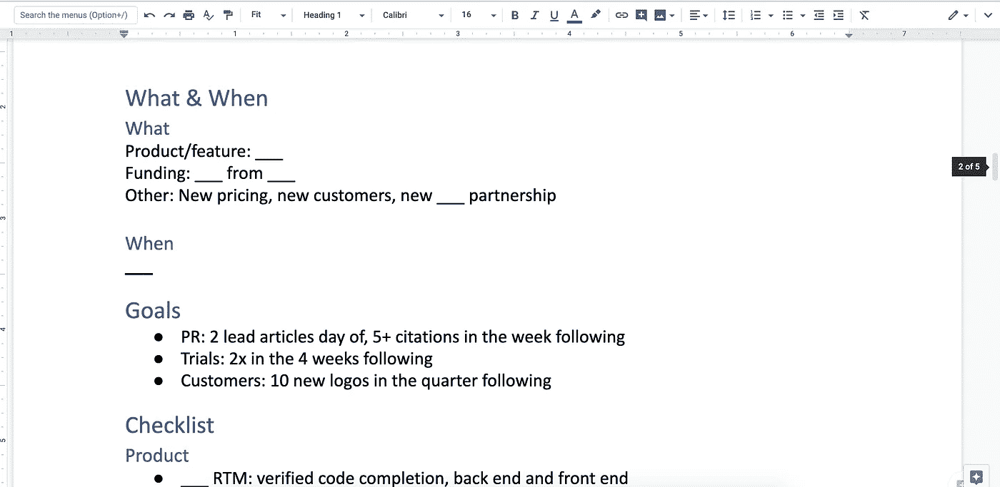

# 工程师营销 202:发布

> 原文：<https://medium.com/hackernoon/marketing-202-for-engineers-launching-9437aa0e4961>

从[面向工程师的营销 201:信息传递和定位](https://hackernoon.com/marketing-201-for-engineers-b28147fdb59d) …

*产品营销是一门广泛的学科。粗略地说，这是一种漏斗中部活动，尽管根据公司的不同，它会一直到达漏斗的顶部(开展活动和领导需求挖掘活动)和底部(充当销售工程师)。有时，它接管了许多通常被认为是品牌、沟通甚至产品管理的活动。*

但是你可以把所有这些东西分成三大类:

*   讲故事—信息传递和定位
*   发布—走向市场
*   成交—销售支持

在本帖中，我们将关注第二个的**。**

*编程注意事项:这篇文章是 GTM 主题的一系列不定长文章中的 n 篇，主要针对* [*初创企业*](https://hackernoon.com/tagged/startup) *的人，主要是领导，主要来自非 GTM 背景。末尾有一个列表。*

# **发射的目的是什么？**

为了引起*的注意*！

发布是一个公开声明，表明你开始营业，产品已经发货。它应该创造一个转折点，让你建立预期，然后你利用创造的注意力来获得客户。

[发射填充漏斗](https://hackernoon.com/marketing-102-for-engineers-ddf3b7fa61e6)。

# **先于 SaaS、云和移动设备发布**

在过去的日子里，在 SaaS 或云或连续任何东西出现之前，将您的产品推向市场的正常模式是这样的:

*   建造一些东西
*   找人帮助在严格的 NDA 下用真实的数据和用户在现实生活中测试它，称之为预发布或测试版或其他什么
*   将它细化到 v1，它几乎不起作用，但至少做了一件你承诺会做的事情
*   将它发布给[营销](https://hackernoon.com/tagged/marketing)【RTM】并停止使用它，除了次要的方式
*   让一些“顾客”同意让你把他们的商标放在你的材料里，不管他们是否给过你一分钱
*   创建所有的文档、支持材料、营销主张等
*   写一篇新闻稿(你可能在开始制作之前就已经写好了)
*   安排一个发布日期，这一天是你向全世界发布产品的日子，也是产品全面上市的日子[GA]
*   制作两组简报幻灯片——媒体和行业分析师各一张
*   推介分析师
*   简要分析
*   如果可能的话，获取分析师的报价
*   沥青压机
*   简短新闻
*   与媒体协商独家报道或其他报道条件
*   发送新闻禁运新闻稿和资产
*   发动
*   解除禁运、新闻稿点击电讯社、网站/页面等上线
*   释放所有的销售人员，如果他们还没有出去销售的话

# 今天发布的产品种类繁多

目标还是一样的——获得关注，填满一个漏斗——但其他都不一样了。

有太多的方法来获得关注，也有太多的模式来获得客户(或仅仅是用户)，这些都不涉及一个单一的时间点启动事件，现在人们甚至都懒得去做了。

*例子！*

*   在 Github 上放一些软件->告诉你的朋友/Twitter/hacker news/product hunt/newsletter->获得采用->持续发布更新
*   建立一些东西->找到你为之建立的人的“影响者”->向影响者发送免费版本/协商独家等->影响者在社交媒体上发布相关信息->客户来找你
*   让一项服务成为“测试版”或“只接受邀请”等->让有影响力的人进入->他们说它有多酷，但没有人能得到它->当你有很多人在等候名单上时，打开它并收费(或不收费)
*   做一个完全免费的产品的发布，为一个*不同的*产品，或一套产品，或服务等创造一个漏斗。，卖给使用免费产品的人

如你所见，总有一些吸引注意力的机制。总会有某种漏斗被填满，即使这个漏斗的最终目标不是销售任何东西，而只是获得使用(“增长”)。

这篇文章的其余部分假设你*将*进行某种形式的发布。

你能想象到的每一种变化都有行之有效的方法去做*。你必须决定什么对你的公司、你的产品、你的市场、你的用户/客户、你的影响者最有利。*

# 启动与释放

以下都是*不同*的事情:

*   **Alpha、Beta、预发布、预览** —产品的一些不完整状态，一些用户或客户可能会接触到它进行测试、烘焙或预烧，或者*只是为了创造一种排他性或期待感*
*   **工程或功能“完成”** —后端工作“完成”
*   **“完成”** —没有人知道这是什么意思，他们通常会拒绝和其他人有相同的意思
*   **【完成】** —一些计划好的后端、前端、UI、集成、文档、标签和对话等已经完成，你可以放心地交给付费客户
*   **【RTS】**“发布”给销售人员——销售人员或任何人都可以自由地主动向潜在客户和现有客户推销该产品，就好像它存在并提供了它应该提供的所有价值
*   **发布到营销部门【RTM】**—产品工作和工程工作都已充分完成，或预计在某个时间内完成，不会与计划有重大偏差，营销部门可以制定消息和宣传，并在日历上标注推出日期
*   **“释放”或“推至戳”** —正是它的发音
*   **全面上市【GA】**—这些东西可供公众购买，并且已经向*每个人*(或应该拥有它的每个人)发布或标记了特征
*   **发布**——一个*营销*事件，围绕一家公司/产品/功能/合作关系/无论什么产生关注/意识/声势

公司成立得越早，流程就越少，任何人都不太可能在大脑中使用这种语言来谈论产品发布过程中的不同途径。一切都将融合在一起。

## 建议！

在大多数走向市场计划中，你不会看到“发布到销售”这个术语。我发现在产品开发和营销时间表方面，现实而明确的销售行为*非常有用，所以这是可以管理的。*

*举例！*

如果 RTS 发生在 RTM，销售可以获得金钱奖励，以获得一个全新的标志，这将提供一个公共报价。但这也意味着销售人员必须准备好推销、材料和实际销售所需的任何其他东西，这推动了更早创造所有这些东西的时间表。

处处权衡。

## 更多建议！

尽早介绍发布和发布的语言，并把它放在你的日历、Trello 板、Asana 任务等上面。即使同时发生了多个里程碑事件，也要把它们都列出来，好好谈谈。

就这些事情的含义进行明确的对话。当不可避免的界限被划定，过程被创造，没有人会感到惊讶。

你需要能够讨论营销目标和实现这些目标所需的时间或材料之间的权衡。

*举例！*

“对于功能 X，我们将在工程完成时进行 RTM，并在两周后发布，届时 UI 应该已经完成。但 docs 可能会在发布后再花两周时间。”

*再比如！*

如果你想让科技媒体报道产品，但营销部门在产品上市并发布在网站上后才知道细节，那么被报道的机会就大大降低了。

这完全没问题。只要期望符合这个特定的现实。

# 发射前

在最好的情况下，在产品工作接近完成之前，产品已经向市场和销售简要介绍了正在构建什么，为什么，为谁等。

产品营销开始运作:

*   新产品的信息
*   该信息如何融入任何现有信息
*   产品是为谁制造的，将向谁营销/销售
*   这些人物角色的价值主张是什么
*   竞争定位是什么
*   该版本有多重要
*   它何时/是否会推出
*   就促销、活动、公关、AR、内容、销售支持等而言，一次发布会将包括哪些内容
*   从一个假设的发布日期向后追溯，发布时间表可能会是什么样子
*   设定发布日期的触发因素是什么
*   什么，或者什么时候，进行进行/不进行决策
*   与其他人共同制定具体的目标，例如:第 x 天的文章，第 y 周的提及次数，第 z 个月的试用次数，第 n 个季度的新客户数

## *决定该产品的营销重要性*

你需要某种方法来对营销工作进行分类。

这是该公司的首次公开亮相，也是它的第一款产品吗？全力以赴！

这是一个需要点击三次的小功能吗？也许可以写一篇博文，在你的时事通讯中做一个简介。

这里有一个可能的框架:

*   **次要功能发布**:发布说明、每月“最新动态”博客文章中发布的新功能列表中的引用、每月时事通讯中新功能列表中的引用、相关文档页面的更新、网站上产品页面的不更新、无 alpha/beta、无 RTS、无 RTM、无 PR、无 AR、无销售材料更新、无销售培训、无 se 培训、无支持培训、正式发布即发布，无发布
*   **Mid 功能发布**:专门的博客文章、新闻稿中的专门部分、测试期、文档更新、销售培训、se 培训、支持培训、RTS = RTM、无 PR、无 AR、销售材料更新、…、发布=正式发布
*   **主要功能包或整个产品版本**:消息更新、专门的发布博客文章、新闻发布、公关推介和简报、AR 简报、发布前与关键客户一起生成报价和案例研究的 alpha/beta 阶段、合作伙伴联合营销、发布后网络研讨会、网站更新、新的销售推介资料、全面的新销售资产、销售培训、se 培训、支持培训、发布时开始的 SEM 活动、重要会议期间的发布、发布=正式发布等

## 设置断点

一旦有了某种相对时间表，就要为影响时间表或是否继续的重大决策设置断点。

一些有用的断点:

*   发布前 1-7 天，立即批准徽标使用、报价和引用
*   在发布日期前 2-4 周进行/不进行
*   RTM 发布前 2-12 周
*   RTM 前 4 周进行发动机完整性检查

*举例！*

如果你决定在会议期间推出，以及你购买的赞助类型(后面的小摊位还是 20 英尺 x 20 英尺的前面和中间？)取决于实际的发布，在发布时做出去/不去决定的截止日期与做出赞助决定的截止日期相同，可能提前 6-12 个月。

## [*基本启动时间轴模板*](https://docs.google.com/document/d/13Zscb5sX9ggjpWf05Ka-oj5wulC3Kb9z0LyMEQesnzM/edit?usp=sharing) *【随意叉！]*

# 发布日

发布日期和时间通常是为了最大限度地吸引目标受众的注意力。在你主要购买地的假日周末的周五下午是个坏主意。但这可能是一个繁忙会议的第一天，每个人都将宣布一些事情。

内容通常会在禁运解除和新闻稿发布之前，或者当你预计有文章发布时(这是你最好要知道的一点)被推送足够长的时间，这样当人们阅读这些内容时，他们会点击链接，找到正确的内容。

## 建议

尽可能提前安排和自动化，这样你就不用手动按键了。

请大家推广，投票，收藏，转发，无论什么…但是*不是*一下子。让它持续一整天和接下来的一周。给他们提供短语、一行文字、图片、gif 等，供他们使用。

# **发射后**

如果有发布后的活动，确保你的时间表继续进行，一切都按计划进行。

常见的发布后活动:

*   网络研讨会、现场问答、ama、Twitch 流、聚会、会议讲座等
*   深度博客帖子
*   个案研究
*   路演

## 测量结果

看看你是否达到了你的预期。

事后分析，找出哪些做得好，哪些做得不好，下次需要改变什么。

## *建议！*

在初创公司，推出任何东西都是全公司的努力。从一开始就让每个人都参与进来。传达给大家。和大家一起验尸。

# 你多久发布一次产品？

只要你不要很长时间无话可说，比如超过一个季度，其他一切都会有所波动。随着业务的成熟或进入更多的细分市场或开发多种产品，你的节奏将发生巨大变化。

因此，这可能意味着你有一个时间表，看起来像:每月次要产品或业务更新，每季度主要产品和业务新闻..

或者看起来像这样的东西:功能在美国东部时间每周三上午 10 点发布，主要公告每 1-2 个季度发布一次，主要是关于重大改革、合作伙伴关系、资金、领导层变动和/或新产品。

## 建议！

无论你最终得到什么，都要找到一种方法，从工程或产品的角度来区分什么时候一个特性/产品是“完整的”,什么时候它被宣布或发布。这两件事是不相关的，每个人都应该明白这一点。

## 本系列中的文章(和模板)

*   [工程师营销 101:功能介绍](/@aneel/marketing-101-for-engineers-ee9e7fcb1a51)
*   [工程师营销 102:打造漏斗](/@aneel/marketing-102-for-engineers-ddf3b7fa61e6)
*   [工程师营销 201:信息传递&定位](/@aneel/marketing-201-for-engineers-b28147fdb59d)
*   [面向工程师的营销 202:发布](/@aneel/marketing-202-for-engineers-launching-9437aa0e4961)
*   [工程师市场营销 203:销售支持](/@aneel/marketing-203-for-engineers-sales-enablement-e47662ca996a)
*   [工程师市场营销 204:产生需求](/@aneel/marketing-204-for-engineers-generating-demand-27200085320c)
*   [工程师营销 301:战略&策划](/@aneel/marketing-301-for-engineers-strategy-planning-2e4473fcc879)
*   [工程师市场营销 302:招聘营销人员](/@aneel/marketing-302-for-engineers-hiring-marketers-a3a6d4355a03)
*   [面向工程师的营销 303:定价框架](/@aneel/marketing-303-for-engineers-pricing-frame-aa71c8860a2b)
*   工程师的营销 401:GTM 的阶段
*   [针对工程师的营销 402:诊断&故障排除](/@aneel/marketing-402-for-engineers-diagnostics-troubleshooting-d946a337c258)
*   [工程师营销 403:解答创始人常见问题](/@aneel/marketing-403-for-engineers-office-hours-bf4d2d0b5f56)
*   [工程师销售 101:功能介绍](/@aneel/sales-101-for-engineers-6fcd1b49cffa)
*   [针对工程师的 PR 101](/@aneel/pr-101-for-engineers-7cd116cc5347)
*   [面向工程师的分析师关系 101](/@aneel/analyst-relations-for-startups-101-ea9338cb13ed)
*   [基本消息模板【谷歌文档】](https://docs.google.com/document/d/1neA71qCSeV3xH1Dpbtcy67m3v2ETmmB_Qq02ckkKUiQ/edit?usp=sharing)
*   [基本漏斗指标模板【谷歌表单】](https://docs.google.com/spreadsheets/d/11r4tHm_es6Tl4DItNUc_KzNdyvrmbbRmb38CJPLCvRU/edit?usp=sharing)
*   [基本发布时间表模板【谷歌文档】](https://docs.google.com/document/d/13Zscb5sX9ggjpWf05Ka-oj5wulC3Kb9z0LyMEQesnzM/edit?usp=sharing)
*   [基本战斗卡模板【谷歌文档】](https://docs.google.com/document/d/1dOCKhE1Ufmwp7bXeQTBCkST7NPwiCPJ2oyWEdpQut1g/edit?usp=sharing)
*   [详细战斗卡模板【谷歌文档】](https://drive.google.com/open?id=1EC3Lq6Z_IVrZKR4-jHgnc5-e3krZw4bA5Z-HAOJlH10)
*   [基本营销日历模板【谷歌表单】](https://docs.google.com/spreadsheets/d/1nXr0IqwnhQsUi_D83ecPXsIyDdiTkpNZ66piRkayPsA/edit?usp=sharing)
*   [基本营销阶梯模板【谷歌表单】](https://docs.google.com/spreadsheets/d/17EfTQp_21WomJ9cwiM4ian9M2QRcbM17_d3DilGNThY/edit?usp=sharing)

## 阅读清单和资源

*   [互动公司的 Piyanka Tiwari 发布清单](https://docs.google.com/spreadsheets/d/1Q61hhzancsgncSe3SNBq7ghNrzFGswxwBvpQ53ao3b4/edit#gid=0)
*   [HubSpot 博客:如何在成长过程中改进产品发布](https://www.intercom.com/blog/how-to-evolve-product-launches-as-you-grow/)
*   [在 SaaS 世界中确定产品发布的优先顺序](https://www.intercom.com/blog/prioritizing-product-announcements-saas-world/)
*   [啊哈！营销策略模板](https://www.aha.io/marketing-strategy/guide/marketing-strategy-templates)
*   [GrokSpark 产品信息模板](https://docs.google.com/spreadsheets/d/183FyklQaBzJh1ZZRvdNKS8TJmVfRm7weTSj4Hb27o8k/edit#gid=409433448)
*   [拍摄卷发营销模板](https://www.shootthecurlmarketing.com/?s=template)
*   [创业营销行动手册](http://www.startupmarketingplaybook.com/)
*   啊哈！营销计划模板