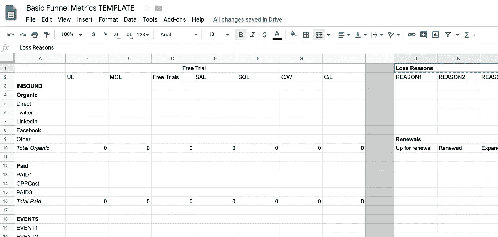

# 工程师营销 204:创造需求

> 原文：<https://medium.com/hackernoon/marketing-204-for-engineers-generating-demand-27200085320c>

Equinox Ad

来自[工程师营销 103:打造一个漏斗](https://hackernoon.com/marketing-102-for-engineers-ddf3b7fa61e6):

> 怎么知道营销有没有在做什么？我们的营销活动模式是什么？它是否产生了回报？
> 
> 在我看来，做到这一点的唯一方法是知道漏斗看起来像什么——或者我们希望它看起来像什么。

在本帖中，我们将关注需求挖掘:漏斗的顶端以及如何满足它。

*编程注意事项:这个帖子是一系列关于 GTM 主题的不确定长度中的 n 个，主要针对* [*初创企业*](https://hackernoon.com/tagged/startup) *人员，主要是领导，主要来自非 GTM 背景。末尾有一个列表。我强烈推荐阅读* [*营销 103*](https://hackernoon.com/marketing-102-for-engineers-ddf3b7fa61e6) *作为这篇帖子的补充。*

# 关于豆腐的一切

漏斗顶端本质上是任何人**在任何场合第一次遇到**你的品牌、公司或产品，并且**变得足够感兴趣**去努力弄清楚你做了什么，以及它是否可能解决他们的问题——即使他们不知道他们有这个问题。

让人们“进入”漏斗始于“顶端”。这方面的训练和工作被称为各种各样的事情:

*   需求生成
*   线索挖掘
*   收购[营销](https://hackernoon.com/tagged/marketing)
*   绩效营销
*   增长营销
*   增长黑客
*   可能是其他东西

在 SaaS 时代之前/应用时代之前/云时代之前，科技领域的营销分为两到三个大的职能领域:需求生成(DG)、产品营销(PMM)和沟通/公关(Comms/MarComms)。今天这些界限已经完全模糊了。你会发现，任何给定角色的范围在不同的公司之间几乎是随机的，在科技世界的特定子行业中普遍存在一些不同的类型。

从建立和运作营销职能的角度来看，我仍然认为这种区分非常有用。marcomms vs DG vs PMM——即使用于执行单一的走向市场战略——也涉及不同的策略和原则。这通常意味着不同的人在寻找、雇用、评估、设定目标和衡量角色的结果方面有明显的差异。

# 需求性别存在于走向市场环境中

所有需求性别都存在于某些走向市场[GTM]环境中。你卖给谁？你销售到什么行业？他们要在你身上花多少钱？一个月、一个季度、一年内，您需要完成多少笔交易？你的(真实的和期望的)销售动机是什么？如果你能回答这些问题，你就可以想办法找到合适的人，让自己站在他们面前。

## *举例！*

如果你销售的企业软件最便宜的价格是每年 25 万美元，那么赞助免费参加的 AWS 峰会将会使你在获得合格的潜在客户方面毫无进展，这些潜在客户可能拥有这种预算权限，或者有这种权限的人伸手可及。

这就是 DG 的意义所在。

# 需求性别战略

在我看来，谈论需求性别策略通常是浪费时间。大多数关于 DG 的讨论都归结为“我们如何获得更多的销售线索？”。他们之间唯一的区别是关于预算，从“尽可能以最低的成本”到“不惜任何代价”。

但是如果你在做 DG 的工作，或者建立和管理团队，你需要*一些*策略。以下是最低可行的 DG 策略示例:

*   入境，有机
*   付费活动
*   外向、现场营销
*   入境游、有机游*和*付费+活动、付费(赞助)

为什么？因为，举例来说，你雇佣(或签约)来创建引人注目的内容并为 SEO 进行优化的人**并不是** 通常是那些知道如何运行一个全球活动项目的人，这个项目每年会创建引人注目的存在和“激活”十几次。

## *建议*

从长远来看，你将**必须**考虑 CAC 和回收期。

根据你所处的行业和你的投资者类型，长期来看可能是明年，也可能是“在 IPO 多年后”。

你应该大致知道你的企业在这个光谱中的位置，并采取相应的行动。

## *更多建议*

当你的市场变化时，每一个成功的收购策略都有失败的可能。或者当孕育它的条件发生变化时。

这包括:新的定价模式、买家角色的变化、新出现的竞争对手、董事会为达到新一轮融资设定的基准而提高的收入目标。

## *更多建议*

没有人能区分战略和战术，所以当你达到某个特定*战术*的收益递减点时，你会受到放弃某个特定战略的压力。你是否选择死在这座山上..由你决定。:)

# 需求性别策略

战术是你为执行策略而做的具体事情。

让我们建立一个以上的策略和战术，看看这可能会是什么样子。

*策略:集客、有机和付费+活动、付费*

入境策略:

*   搜索引擎优化优化整个营销网站的搜索条件:aaaaa，bbbbb，ccccc
*   关于 aaaaa、bbbbb、ccccc 的博客帖子(2-3 篇)每周一次，穿插以下内容:1)对行业发展的评论，2)该主题特定和实用方面的操作方法或专家指南，3)推销产品的内容，如客户评价或案例研究或公告或演示
*   SEM 库存分析、测试和活动主要针对 aaaaa、bbbbb、ccccc，但也针对长尾附件，如“aaaaa 产品”和“bbbbb 即服务”,导致登录页面在营销自动化平台上运行，专门用于线索捕获
*   所有入境嫌疑人都将获得以下两种 CTA 之一:1)获得个性化演示或 2)开始 14 天的免费试用

活动策略:

*   每年主办 6 次相关会议:每半年一次大型会议，每季度一次小型会议
*   在可能的情况下，选择竞争对手 X 旁边或对面的展位，或者合作伙伴 Y 旁边或对面的展位
*   每个创始人在每个活动上提交一个演讲，发送被接受的创始人(如果有的话)
*   利用创始人演讲的结尾，通过台上的陈述和员工在演讲中的活动来吸引观众
*   在整个议程中的每个相关讲座中安排工作人员，与参与者和发言人互动，吸引更多的人来到展位
*   使用对 [Flint Water Fund](https://www.unitedwaygenesee.org/flintwaterfund) 的捐款，而不是展台上的赠品来吸引和吸引路人，提供徽章贴纸或旗帜等品牌捐赠证据
*   通过在展台边缘设置 1-2 个大屏幕，以一对多的形式同时进行演示，同时保留 1-2 个内部位置用于定制/私人演示，从而最大限度地提高展台的演示效果

## *建议*

**每种战术都有半衰期**。

许多有长尾巴。

始终寻找你已经达到营销策略的**收益递减点**的信号，并记住它需要如何发展或如何被取代。

下一个层次的战术是思考*为什么*一个战术会失效。

例如:如果 SEM 对 j[OBS-to-do](https://hbr.org/2016/09/know-your-customers-jobs-to-be-done)oriented search terms 在你的主要市场上不再有效..

*   也许你的品牌已经获得了最大的影响力，人们正在直接搜索它，因为这是他们谈论 JTBD 的方式[…恭喜你，你是“纸巾之王”！]
*   也许你已经达到库存极限，是时候[另外？[商务英语针对竞争对手做广告
*   也许您已经获得了(或烧掉了)所有可以获得的线索，但仅限于北美，这种策略应该在拉美部署

## *更多建议*

变平的战术和下坡的战术是不一样的。

一个平淡的策略可能代表着某种能产生跑量(但不是增长)业务的东西。它是让你尝试其他事情的东西，比如为你的下一个产品或下一轮融资提供收入基础的第一个产品。

走下坡路的战术不是无用的战术。在未来很长一段时间内，它仍可能带来增量销售。

把你的策略想成一个投资组合。根据结果重新平衡你的投资组合。

# 需求性别指标

需求生成通常以进入漏斗[ **量** ]或交付给销售人员[量 x **转换** ]的销售线索来衡量。随着业务变得越来越复杂，真正重要的是显示营销支出对收入贡献的事情。

一些关键指标将帮助您了解营销收入与收入之比:

*   原始销售线索、营销合格销售线索、销售合格销售线索、已完成/赢得[C/W]、已完成/失去[C/L]
*   上述阶段之间的转换率
*   这些转换率随时间的变化
*   信用证与信用证的比例
*   管道/销售线索，管道/MQL，管道/SQL，收入/销售线索，收入/MQL，收入/SQL，LTV
*   成本/销售线索[CPL]，成本/MQL，成本/SQL，客户获取成本[CAC]
*   以上$ numbers 随着时间的变化
*   回收期
*   上述数字随时间的变化

理解这些数字的一些启发:

*   线索类型和销售阶段之间的转换率越高，就越合格[越好！]线索
*   任何队列的 C/W/C/L 比越高，就越合格[越好！]线索
*   CPL 和 CAC 越低，您的营销支出在生成销售线索和收入方面的效率就越高(分别)
*   回收期越短，企业就越有能力偿还你的 CPL 和 CAC，营销支出产生收入的效率就越高

## [*漏斗模板*](https://docs.google.com/spreadsheets/d/11r4tHm_es6Tl4DItNUc_KzNdyvrmbbRmb38CJPLCvRU/edit?usp=sharing) *【随意叉！]*

## *建议*

您可能已经注意到，您无法控制其中的许多指标，并且/或者您所做的对最终的重要业务指标只有很小的影响。

你需要熟悉并对需求生成下游发生的一切事情感兴趣，以确保 1)获得关于销售线索数量和质量的充分反馈，2)能够看出问题实际上是由漏斗下游的战略或战术问题引起的。

例如:销售开发代表[SDR]在资格认定方面变得更好，客户经理[AEs]在渠道预测方面变得更好**并不是**更多/更好的销售线索的功能。

## *更多建议*

*   尽可能多地测量
*   **按照固定的时间表坚持做**
*   ****对假设和方法要**明确******
*   ****报告比你收集的少得多****

# ****需求生成杠杆****

****你建模和测量漏斗的方式应该告诉你如何改进它。****

****让我们勾画出一个*非常*简单的例子:****

> ****如果我们有一个五阶段漏斗，每月有 10000 个销售线索，每个阶段之间有 10%的转换率，销售周期为 30 天，那么对于从第 0 天开始到第 30 天结束的每个群组，我们最终只有 1 个付费客户[10000 → 1000 → 100 → 10 → 1]。****

****你认为如何改进这个漏斗？****

****目标只有一个:**增加数字**。****

****只有两种方法:**更大的音量**或**更高的转换率**。****

****顶部更多的交易量会导致底部更多的客户和收入。如果没有，那么你在下游的某个地方就有能力、效率或执行问题。****

****在任何阶段更好的转化率都应该导致下一阶段更大的交易量，这应该导致更多的客户和底部的收入。如果没有，那么你在下游的某个地方就有能力、效率或执行问题。****

*****注:以上点滴重复自* [*营销 103 对于工程师:粗加工出一个漏斗*](https://hackernoon.com/marketing-102-for-engineers-ddf3b7fa61e6) *。如果你真的对这个话题感兴趣，就去读吧。*****

## ****本系列中的文章(和模板)****

*   ****[工程师营销 101:功能介绍](/@aneel/marketing-101-for-engineers-ee9e7fcb1a51)****
*   ****[工程师营销 102:打造一个漏斗](/@aneel/marketing-102-for-engineers-ddf3b7fa61e6)****
*   ****[工程师营销 201:信息传递&定位](/@aneel/marketing-201-for-engineers-b28147fdb59d)****
*   ****[面向工程师的营销 202:推出](/@aneel/marketing-202-for-engineers-launching-9437aa0e4961)****
*   ****[面向工程师的营销 203:销售支持](/@aneel/marketing-203-for-engineers-sales-enablement-e47662ca996a)****
*   ****[面向工程师的营销 204:创造需求](/@aneel/marketing-204-for-engineers-generating-demand-27200085320c)****
*   ****[工程师营销 301:战略&策划](/@aneel/marketing-301-for-engineers-strategy-planning-2e4473fcc879)****
*   ****[工程师营销 302:招聘营销人员](/@aneel/marketing-302-for-engineers-hiring-marketers-a3a6d4355a03)****
*   ****[工程师营销 303:定价框架](/@aneel/marketing-303-for-engineers-pricing-frame-aa71c8860a2b)****
*   ****[工程师营销 401:GTM 阶段](/@aneel/marketing-401-for-engineers-stages-of-going-to-market-6adcedc64e17)****
*   ****[工程师营销 402:诊断&故障排除](/@aneel/marketing-402-for-engineers-diagnostics-troubleshooting-d946a337c258)****
*   ****[工程师营销 403:解答创始人常见问题](/@aneel/marketing-403-for-engineers-office-hours-bf4d2d0b5f56)****
*   ****[工程师销售 101:功能介绍](/@aneel/sales-101-for-engineers-6fcd1b49cffa)****
*   ****[针对工程师的 PR 101](/@aneel/pr-101-for-engineers-7cd116cc5347)****
*   ****[工程师分析师关系 101](/@aneel/analyst-relations-for-startups-101-ea9338cb13ed)****
*   ****[基本消息模板【谷歌文档】](https://docs.google.com/document/d/1neA71qCSeV3xH1Dpbtcy67m3v2ETmmB_Qq02ckkKUiQ/edit?usp=sharing)****
*   ****[基本漏斗指标模板【谷歌表单】](https://docs.google.com/spreadsheets/d/11r4tHm_es6Tl4DItNUc_KzNdyvrmbbRmb38CJPLCvRU/edit?usp=sharing)****
*   ****[基本发布时间表模板【谷歌文档】](https://docs.google.com/document/d/13Zscb5sX9ggjpWf05Ka-oj5wulC3Kb9z0LyMEQesnzM/edit?usp=sharing)****
*   ****[基本战斗卡模板【谷歌文档】](https://docs.google.com/document/d/1dOCKhE1Ufmwp7bXeQTBCkST7NPwiCPJ2oyWEdpQut1g/edit?usp=sharing)****
*   ****[详细战斗卡模板【Google Doc】](https://drive.google.com/open?id=1EC3Lq6Z_IVrZKR4-jHgnc5-e3krZw4bA5Z-HAOJlH10)****
*   ****[基本营销日历模板【谷歌表单】](https://docs.google.com/spreadsheets/d/1nXr0IqwnhQsUi_D83ecPXsIyDdiTkpNZ66piRkayPsA/edit?usp=sharing)****
*   ****[基本营销阶梯模板【谷歌表单】](https://docs.google.com/spreadsheets/d/17EfTQp_21WomJ9cwiM4ian9M2QRcbM17_d3DilGNThY/edit?usp=sharing)****

******阅读清单和资源******

*   ****鲍勃·廷克的 GTM Fit [演讲](https://www.youtube.com/watch?v=IsuZzi-Hm3A&list=PLcnNOJoVRnjUmenBf9bAFE2qIxhSgECvx&index=2)和[幻灯片](https://www.slideshare.net/SurvivalToThrival/go-to-market-fit-summit)****
*   ****[托马斯·东古兹的博客](http://tomtunguz.com/)****
*   ****[成长黑客社区](https://growthhackers.com/posts)****
*   ****[Kissmetrics 的博客](https://blog.kissmetrics.com/)****
*   ****HubSpot 的博客****
*   ****[Optimizely 的博客](https://blog.optimizely.com/)****
*   ****[创业营销剧本](http://www.startupmarketingplaybook.com/)****
*   ****[啊哈！营销策略模板](https://www.aha.io/marketing-strategy/guide/marketing-strategy-templates)****
*   ****[啊哈！营销计划模板](https://www.aha.io/marketing-strategy/guide/marketing-plan-templates)****
*   ****[拍摄卷发营销模板](https://www.shootthecurlmarketing.com/?s=template)****
*   ****[奥美在广告上](https://www.amazon.com/dp/B00EMXBZKA/ref=dp-kindle-redirect?_encoding=UTF8&btkr=1)****