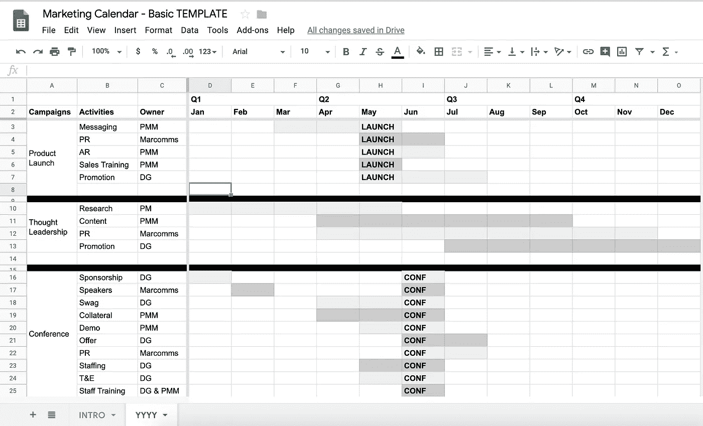

# 工程师市场营销 301:战略与规划

> 原文：<https://medium.com/hackernoon/marketing-301-for-engineers-strategy-planning-2e4473fcc879>

Photo by [Alexander Andrews](https://unsplash.com/photos/4JdvOwrVzfY?utm_source=unsplash&utm_medium=referral&utm_content=creditCopyText) on [Unsplash](https://unsplash.com/?utm_source=unsplash&utm_medium=referral&utm_content=creditCopyText)

从[面向工程师的营销 204:产生需求](https://hackernoon.com/marketing-204-for-engineers-generating-demand-27200085320c)..

> 在我看来，谈论需求性别策略通常是浪费时间。大多数关于 DG 的讨论都归结为“我们如何获得更多的销售线索？”。他们之间唯一的区别是关于预算，从“尽可能以最低的成本”到“不惜任何代价”。

你与首席执行官和创始人讨论的大多数“营销战略”都与营销无关，也与战略无关。相反，它们将是关于需求性别和策略。

如果你负责营销，你仍然需要*一些*策略。如果没有明确的策略，你会发现很难理解或解释营销实际上是如何产生结果的。

*编程注释:这篇文章是一系列关于 GTM 主题的不定长度的文章中的第 n 篇，主要面向创业人士，主要是领导，主要来自非 GTM 背景。末尾有一个列表。*

# **营销存在于走向市场和产品环境中**

所有营销都存在于某些走向市场[GTM]和产品环境中。你在卖什么？谁要用呢？这将如何让他们的生活变得更好？你卖给谁？你销售到什么行业？你需要他们在你身上花多少钱？一个月、一个季度、一年内，您需要完成多少笔交易？你的(真实的和期望的)销售动机是什么？你的竞争对手是谁？市场怎么谈论你做的事情？你的用户和买家对你的产品类别的包装、定价、交付和消费有什么期望？

## **举例！**

如果你正在向医院集团销售企业软件，最便宜的价格是每年 25 万美元，需要三个月的时间进行试点并通过 HIPAA 审查，另外三个月的时间在销售工程或专业服务的帮助下整合并成功接纳客户，一旦他们签订合同，你将拥有一个**非常不同的**营销战略(和战术) 相比之下，面向销售到不受监管行业的 ISR 的免费增值产品的初始买入费为每年 100 美元，提供 14 天的免费试用，并在文档和应用内教程的指导下进行自我入职，平均不到 30 天。

# **营销目标源自业务目标**

市场营销，就像企业的其他功能领域一样，应该有自己的目标，这些目标显然来自于企业目标，并且可以被视为有助于企业目标。

对于市场营销的每个主要领域——公司/品牌/沟通、产品、需求创造/销售线索创造/业绩/增长——都应该有一个总体目标。

## **举例！**

业务目标可能看起来像这样:

*   成为美国使用和引用最多的房屋价值数据来源
*   通过销售给房地产代理商和业主的广告位置创造收入

其营销目标可能如下所示:

*   品牌:发展品牌，赋予房主以前只有房地产经纪人才能获得的信息，使他们处于平等的地位
*   产品:将产品定位为**最准确的**房屋价值估算来源
*   需求:推动**大规模采用**并优先考虑增长*

**注意:在这种情况下,“需求”的目的是建立将出售给广告商的眼球供应或库存。*

# **战略是如何实现目标的**

对于你的每一个目标，都会有一些策略来定义你如何实现这个目标。

## **举例！**

*从上继续..*

实现上述目标的营销策略可能是这样的:

*   通过**内容**创造品牌认知
*   通过**产品文案和用户故事**建立产品定位
*   通过**完全免费和无网关**、**针对家庭地址的搜索优化**，以及通过**社交机制**促进口碑传播，创造用户增长

从战术上来说，现在，你必须弄清楚你的内容策略将是什么，你的编辑风格将是什么，你想要优化哪些关键词和搜索类型，在产品中放入哪些具体的副本，如何获取和放大用户故事，测试和使用哪些社交机制，等等。

## **建议**

将营销战略与信息和定位捆绑到一个记录文档中，因为这些往往是其他一切的来源和指导材料，从需求挖掘活动到产品发布，再到漏斗指标。你可以在这里找到复制[的模板。](https://docs.google.com/document/d/1neA71qCSeV3xH1Dpbtcy67m3v2ETmmB_Qq02ckkKUiQ/edit?usp=sharing)

[Basic Marketing Strategy & Messaging Template](https://docs.google.com/document/d/1neA71qCSeV3xH1Dpbtcy67m3v2ETmmB_Qq02ckkKUiQ/edit?usp=sharing)

## 更多建议

如果 GTM 或产品环境发生变化，您的战略也需要改变。在不同的商业环境下，不加修改地采用相同的营销策略是失败的秘诀。

## 更多建议

如果战术不起作用，那就改变他们。如果你的所有策略都不起作用，你的策略可能就是问题所在。

# **战术是实施的战略**

对于你的每一个策略，根据你的每一个目标，你会部署一些策略来实际执行这个策略。

## **举例！**

从上面继续..

上述策略的营销策略可能是:

*   内容:基于从房地产来源获得的房屋价值数据，结合从产品的搜索和使用趋势获得的专有数据，制作**原始的一手和二手研究**,以品牌内容的形式按月度和季度的节奏呈现，针对社交分发和搜索进行优化
*   公关:利用内容和内部专业知识(创始人、经济学家)向媒体推介面向技术、经济、金融和房地产的**有趣/独特的趋势** *和* **让专家参与**关于房地产市场的新闻评论
*   公关:与那些最能接触到精通技术的消费者的媒体建立媒体关系
*   信息和定位:开发产品/功能命名和标签短语**，强调授权和准确性**，并在整个产品体验、搜索优化、社交分享副本和标签以及所有内容中一致应用
*   客户营销:邀请用户在使用该工具时**讲述他们在产品中的故事**，在他们使用该工具后通过电子邮件等方式。测试无激励与无成本激励(访问比较数据或早期报告)与付费激励(礼品卡)
*   SEO:确保在搜索栏中输入的每个地址以及任何房屋价值、价格或市场研究的结果都排在前五名
*   WOM: **提示**使用预填充内容进行社交分享，以及通过电子邮件链接和产品内表单进行私人分享

## **建议**

**每一个战术都有半衰期。**

许多有长尾巴。

始终寻找信号，表明你已经达到了一个特定策略的收益递减点，并记住该特定策略需要如何发展或如何被取代。

下一个层次的战术是思考*为什么*一个战术会失效。

变平的战术和下坡的战术是不一样的。

一个平淡的策略可能代表着某种能产生跑量(但不是增长)业务的东西。

下坡路上的战术不是无用的战术。未来很长一段时间仍可能产生**增量铅量**。

把你的策略想成一个投资组合。按照结果的比例重新平衡你的投资组合。

# **营销计划将战略和战术付诸实施**

实际营销*工作*一般是围绕特定的事件或节奏来组织的。

在科技领域，尤其是在初创公司，通常重要的事件是:产品发布会、会议(自有或赞助)和商业公告(融资轮次、收购、合作、高管变动)。

通常，重要的节奏是由销售额驱动的:月度、季度和年度。

在事件和节奏的覆盖下，营销工作历来被组织成“活动”。营销活动是一系列协调的营销活动，旨在实现特定的时间限制目标。您可以深入了解特定活动每周的细节——谁负责产生什么产出或执行什么细节。

活动可以持续几周、几个月甚至几个季度。不会超过一年。

## **举例！**

*从上面继续..*

*   产品发布— 3 个月:从发布前 2 个月开始，到发布后 1 个月结束，协调消息传递、定位、沟通、公关
*   思想领导活动——6 个月:从产品发布开始，通过内容和公关策略协同努力执行品牌战略，使 Q2 成为媒体公认的住房市场信息、分析和公共评论的领先来源
*   住房市场分析师会议——2 个月:在会议召开前 1 个月开始，以分析师新闻和媒体为目标，提供专家评论和市场分析，在会议上安排发言人，创建面向分析师的数据报价，要求对数据的任何使用进行引用，但不妨碍使用，在会议期间推广报价，使用获得的与会者名单在会后推广报价

[*营销日历模板*](https://docs.google.com/spreadsheets/d/1nXr0IqwnhQsUi_D83ecPXsIyDdiTkpNZ66piRkayPsA/edit?usp=sharing) *【随意叉！】*

[Basic Marketing Calendar Template](https://docs.google.com/spreadsheets/d/1nXr0IqwnhQsUi_D83ecPXsIyDdiTkpNZ66piRkayPsA/edit?usp=sharing)

## **建议**

如果你是一个早期创业公司，将营销工作组织成活动对你的团队来说可能是多余的。如果你发现自己花在组织和协调上的时间比交付的时间还多，那就去掉流程。

## **更多建议**

你是否使用电子表格、项目管理软件、[谷歌](https://hackernoon.com/tagged/google)日历、维基或任何特定的工具来协调和交流工作并不重要。您团队中的每个人是否都使用相同的工具，以及其他团队中的每个人是否都能通过查看这些工具来理解您正在做的事情，这些都很重要。

## 本系列中的文章(和模板)

*   [工程师营销 101:功能介绍](/@aneel/marketing-101-for-engineers-ee9e7fcb1a51)
*   [工程师营销 102:打造漏斗](/@aneel/marketing-102-for-engineers-ddf3b7fa61e6)
*   [工程师营销 201:信息传递&定位](/@aneel/marketing-201-for-engineers-b28147fdb59d)
*   [工程师营销 202:推出](/@aneel/marketing-202-for-engineers-launching-9437aa0e4961)
*   [工程师市场营销 203:销售支持](/@aneel/marketing-203-for-engineers-sales-enablement-e47662ca996a)
*   [面向工程师的营销 204:创造需求](/@aneel/marketing-204-for-engineers-generating-demand-27200085320c)
*   [工程师营销 301:战略&策划](/@aneel/marketing-301-for-engineers-strategy-planning-2e4473fcc879)
*   [工程师市场营销 302:招聘营销人员](/@aneel/marketing-302-for-engineers-hiring-marketers-a3a6d4355a03)
*   [面向工程师的营销 303:定价框架](/@aneel/marketing-303-for-engineers-pricing-frame-aa71c8860a2b)
*   [工程师营销 401:GTM 阶段](/@aneel/marketing-401-for-engineers-stages-of-going-to-market-6adcedc64e17)
*   [针对工程师的营销 402:诊断&故障排除](/@aneel/marketing-402-for-engineers-diagnostics-troubleshooting-d946a337c258)
*   工程师营销 403:回答创始人的常见问题
*   [工程师销售 101:功能介绍](/@aneel/sales-101-for-engineers-6fcd1b49cffa)
*   [针对工程师的 PR 101](/@aneel/pr-101-for-engineers-7cd116cc5347)
*   [面向工程师的分析师关系 101](/@aneel/analyst-relations-for-startups-101-ea9338cb13ed)
*   [基本消息模板【谷歌文档】](https://docs.google.com/document/d/1neA71qCSeV3xH1Dpbtcy67m3v2ETmmB_Qq02ckkKUiQ/edit?usp=sharing)
*   [基本漏斗指标模板【谷歌表单】](https://docs.google.com/spreadsheets/d/11r4tHm_es6Tl4DItNUc_KzNdyvrmbbRmb38CJPLCvRU/edit?usp=sharing)
*   [基本发布时间表模板【谷歌文档】](https://docs.google.com/document/d/13Zscb5sX9ggjpWf05Ka-oj5wulC3Kb9z0LyMEQesnzM/edit?usp=sharing)
*   [基础战斗卡模板【谷歌文档】](https://docs.google.com/document/d/1dOCKhE1Ufmwp7bXeQTBCkST7NPwiCPJ2oyWEdpQut1g/edit?usp=sharing)
*   [详细战斗卡模板【谷歌文档】](https://drive.google.com/open?id=1EC3Lq6Z_IVrZKR4-jHgnc5-e3krZw4bA5Z-HAOJlH10)
*   [基本营销日历模板【谷歌表单】](https://docs.google.com/spreadsheets/d/1nXr0IqwnhQsUi_D83ecPXsIyDdiTkpNZ66piRkayPsA/edit?usp=sharing)
*   [基本营销阶梯模板【谷歌表单】](https://docs.google.com/spreadsheets/d/17EfTQp_21WomJ9cwiM4ian9M2QRcbM17_d3DilGNThY/edit?usp=sharing)

**阅读清单和资源**

*   鲍勃·廷克的 GTM Fit [演讲](https://www.youtube.com/watch?v=IsuZzi-Hm3A&list=PLcnNOJoVRnjUmenBf9bAFE2qIxhSgECvx&index=2)和[幻灯片](https://www.slideshare.net/SurvivalToThrival/go-to-market-fit-summit)
*   [创业营销行动手册](http://www.startupmarketingplaybook.com/)
*   [啊哈！营销策略模板](https://www.aha.io/marketing-strategy/guide/marketing-strategy-templates)
*   [拍摄卷发营销模板](https://www.shootthecurlmarketing.com/?s=template)
*   [奥美在广告上](https://www.amazon.com/dp/B00EMXBZKA/ref=dp-kindle-redirect?_encoding=UTF8&btkr=1)