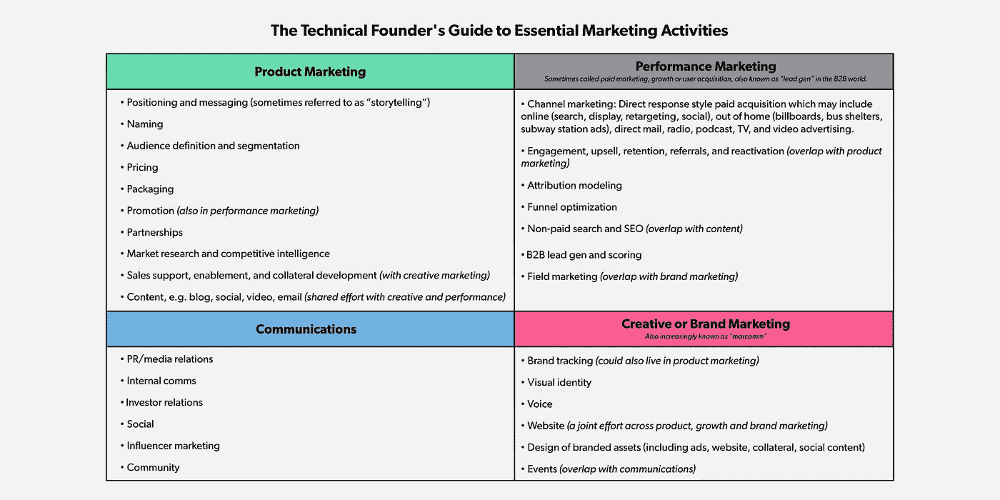
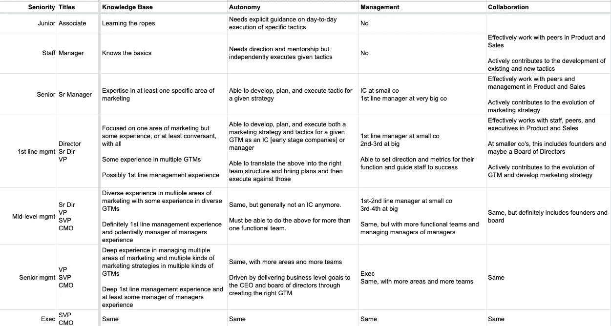

# 工程师营销 302:雇佣营销人员

> 原文：<https://medium.com/hackernoon/marketing-302-for-engineers-hiring-marketers-a3a6d4355a03>

Photo by [Josh Calabrese](https://unsplash.com/@joshcala?utm_source=unsplash&utm_medium=referral&utm_content=creditCopyText) on [Unsplash](https://unsplash.com/search/photos/teamwork?utm_source=unsplash&utm_medium=referral&utm_content=creditCopyText)

我们在这个系列中花了很多话来谈论理解和操作营销功能，但几乎没有人。创业营销[和销售]面临的共同挑战！]招聘大概是这样的:

*   没有走向市场战略→
*   没有角色的范围，这看起来与角色的范围太大是一样的→
*   不知道该找什么样的人→
*   工作描述或对招聘人员的指示不清晰→
*   没有评估与实际业务目标相关的候选人的标准

在本帖中，我们将讨论如何在你的市场中为你的公司雇佣最合适的营销人员来为你的用户和客户服务。

编程说明:这篇文章是一系列关于 GTM 主题的不确定长度的文章中的第 n 篇，主要面向创业人士，主要是领导，主要来自非 GTM 背景。末尾有一个列表。

# **营销人员走向市场**

所有营销都存在于某些走向市场[GTM]中。你在卖什么？谁要用呢？这将如何让他们的生活变得更好？你卖给谁？你销售到什么行业？你的销售动机是什么？你的竞争对手是谁？你的漏斗会是什么样子？它是低成本进入、自下而上、土地扩张还是开源、社区、使用增长、商业支持还是..？

如果你没有这些问题的答案，你就没有进入到建立一家真正走向市场的公司的阶段。你真的不应该去找营销人员，除非你有一大笔钱，并且在推出之前正在招聘高管，或者你非常清楚要找一个能帮你回答所有这些问题的人，然后执行这些答案[罕见！].

为什么？因为你雇来为 GTM A 制定或执行[营销策略](https://hackernoon.com/marketing-301-for-engineers-strategy-planning-2e4473fcc879)的人不会是 GTM B 的人。销售也是如此。

## **举例！**

如果你向医院集团销售企业软件，最便宜的价格是每年 25 万美元，需要三个月的时间进行试点并通过 HIPAA 审查，另外三个月的时间在销售工程或专业服务的帮助下整合并成功接纳客户，一旦他们签订合同，你将拥有**非常不同的**营销战略(和战术) 相比之下，面向销售到不受监管行业的 ISR 的免费增值产品的初始买入费为每年 100 美元，提供 14 天的免费试用，并在文档和应用内教程的指导下进行自我入职，平均不到 30 天。

## **Anecdata！**

注意初创公司的销售和营销人员的流动量:早期，他们试图找出产品的市场适合度，后来，他们试图找出走向市场的适合度，后来，他们转向产品或 GTM，或者处于不同的增长阶段(500 万美元、500 万美元、2000 万美元、2000 万美元、5000 万美元、1 亿美元、1 亿美元)。

每当 GTM 发生重大变化时，营销和销售都必须重新进行。

无论好坏，营销和销售人员往往是单一的经营者，在不同的上市模式和行业中效率不高。*

**注:这绝对是* ***不是真的*** *对于所有的销售和营销专业人士来说。但事实是，跨越边界，比如从 B2B → D2C，对卖家和营销人员来说是极其困难的，不一定是因为他们做不到。彻底改变职业比让别人给你一个机会更容易。*

# **定义角色**

你希望有一个营销人员使用 Github 和 Hugo 设计、构建和维护一个静态网站，同时设计一个标志和视觉识别，并弄清楚你的需求获取策略是什么，同时在 mailchimp 上运行电子邮件活动，并每月参加活动进行演讲或经营你的摊位，同时开发你的产品信息，帮助销售人员针对客户定位产品，同时研究关键词库存和进行搜索广告实验，同时撰写新闻稿并与技术记者建立关系，同时采访客户进行案例研究和其他一些事情吗？

这不是一个东西。你可能会找到一个愿意为你做所有这些事情的人，至少有一半是糟糕的，并且很快让他们筋疲力尽。但是你不会幸福的。他们也不会。

用 Arielle Jackson 的话说:

> 大多数对该领域并不陌生的营销人员擅长所谓的“软”或“硬”营销，更关注品牌和沟通或增长、分析和渠道优化。“即使是 CMO 级别的候选人通常也更倾向于一个方向，”她说。“我不确定这种将所有功能集于一身的愿望从何而来——你不会期望一名工程师在前端和后端都很出色，但不幸的是，这种期望存在于营销人员中。”

因此，你必须决定哪些事情对这个职位来说更重要:产品营销、需求挖掘、公关/沟通或品牌。在早期或成长前的创业公司，比如说<100 people and pre-C, the answer to this is almost always Product Marketing or Demand Gen.

[From First Round’s: So You Think You’re Ready to Hire a Marketer? Read This First.](https://firstround.com/review/so-you-think-youre-ready-to-hire-a-marketer-read-this-first/)

# **了解你的 GTM**

*   B2B 企业 SaaS 产品与入境事件驱动的漏斗和土地和扩大内部销售？
*   D2C 高端设计——具有内向型社交媒体和影响者驱动的漏斗和自助销售的前卫旅行装备？
*   三边市场通过内向 SEM 和品牌赞助和推荐驱动的漏斗和内部销售，将厨师、厨房场所和私人派对举办者联系起来？
*   面向土木工程的 B2B 物联网传感器和 SaaS 产品包，以及基于惠普的通讯录呼叫漏斗和自上而下的捕鲸领域销售？

如果你不知道你在做什么生意，你卖给谁，你解决了什么问题，以及成功看起来是什么样的——你将根本无法成功地雇佣*任何*走向市场的角色，销售或营销。如果你需要帮助弄清楚这些事情，你需要把它弄得非常清楚。

这对于招聘人员、你的人际网络以及把它放在你的工作描述的最前面都是很关键的。

# **堆栈排列功能性工作**

组织你认为他们必须立即解决的问题，然后写下来。

*   你的免费层的使用增长比收入更重要吗？
*   品牌认知度比使用率更重要吗？
*   进入魔力象限比技术博客内容更重要吗？

## **举个例子！**

*   活动策略和执行:开发、协调和推动需求性别活动执行，重点关注 SEM、社交广告和影响者营销
*   运营:选择和建立营销堆栈，开发报告以评估营销活动的绩效
*   领导力:招募和雇佣一个营销团队来推动增长

## **建议！**

任何一组优先级都有半衰期。通常，你的主要目标是雇佣一个能让你从 a 点，也就是你现在所在的地方，到达 B 点的人，不管下一个大的商业里程碑是什么——比如从 0 到 500 万美元的 ARR。

你将寻找在相同或相似的 GTM 背景下，在之前和之后的下一个成长阶段做过这件事的人。这个人的危险在于，他们只是简单地重复他们在贵公司上一份工作中所做的事情，而没有运用任何批判性思维或考虑您的特定 GTM 所面临的具体挑战。

## **多多指教！**

确保每个筛选或面试候选人的人都完全理解要做的工作，并按比例衡量候选人的品质和能力。仅仅因为他们没有低优先级技能的经验而忽略一个优秀的候选人是一个不必要的错误。

# **找出非功能性工作**

现在你知道了这个人在这个角色中需要*在功能上*做什么，他们需要什么才能在你的团队中*做到这一点？*

*   这是个人贡献者[IC]还是经理或经理的经理角色？是 IC 和管理的结合？
*   该角色是否会从一个贡献级别开始，但在预期的未来会过渡到另一个级别？
*   这个人会设定战略方向，决定策略，制定所有计划，并且执行所有的计划吗..还是其中的一部分？
*   他们需要雇佣和建立一个团队吗？如果是，你的管理风格和团队结构是什么样的，你对新经理的期望是什么？
*   你想在多大程度上参与管理这个人？你会设定方向，让他们自行其是，还是希望在功能战略或战术层面密切参与细节？
*   此人是高管吗？他们会参加董事会吗？他们会被期望与高管们合作和争吵吗？
*   是否有现有的 ICs 或经理向此人汇报？
*   他们将与谁合作最密切？涉及哪些性格和工作风格？什么样的互补风格才是正确的？你是有意引入某人来改变局面，还是希望引起一点建设性的摩擦？
*   这个人会对外吗？他们需要与潜在客户、客户、合作伙伴、媒体、分析师或投资者互动吗？
*   他们会在聚会、会议和其他活动中发展和发表演讲吗？
*   他们需要与承包商互动或管理承包商吗？
*   他们会被要求去旅行吗？
*   他们会被期望每天都在办公室吗？

就像你的职能要求一样，这些也必须进行排序，并在内部和招聘人员面前明确表达。这些事情中的大部分永远不会出现在工作描述中，但是那些有助于人们自我选择的事情应该出现在工作描述中。这包括:关于资历和管理的细节，对面向外部的期望，以及出差和办公时间。

# **寻找好人**

你需要一个在你所处的阶段或下一个阶段的公司中有一定经验的人，他能够胜任并有效地执行你对该角色的首要任务，同时满足你认为在你的特定走向市场的特定挑战中取得成功所必需的非功能性要求。

这样的人不太可能存在*和*你能请得起他们*和*他们会为你工作。

所以，权衡。明确列出清单上哪些项目是绝对必要的，哪些是非常需要的，哪些是最好的。确保招聘过程中的每个人都知道。

## **关于资历权衡的建议！**

职位越初级，你的经验和工作经历就越少。这意味着必须更加重视他们在学习曲线上爬得有多快，他们可能表现得有多好，以及他们在你的特定环境中成长得有多成功。

## **给招聘人员的建议！**

如果你的招聘人员没有询问你的需求和优先事项的细节，以及对某个职位的可接受的权衡，那么这些招聘人员不会给你找到你需要的人。确实挖进来的招聘人员一般都很贵。

# **写好职位描述**

职位描述应该包含候选人在与你谈论这个职位时需要自己选择的一切。就像你在你的网站、广告或公共汽车上做广告一样看待它。这是您的漏斗顶端的一部分，您希望合格的销售线索能够很好地适合这个角色和您的团队进行自我选择。

*   什么工作？
*   公司、产品和市场的本质是什么？
*   这个角色会给公司带来什么价值？
*   公司会给这个角色的人带来什么价值？
*   有什么期望和要求？
*   哪些事情是交易破坏者，哪些不是？
*   什么样的人会成功？
*   它位于哪里？

如果你听到或收到的求职者都是错的，问题出在你的工作描述，你对招聘人员的选择，或者你是如何培训招聘人员的。换句话说，**这是你的错**。

# **理解营销资历的语言**

随着公司的成长，深度专家比多面手更受重视，营销角色和职责也有很大不同。这里有一个模板中非常[基本的阶梯，你可以为你的公司](https://docs.google.com/spreadsheets/d/17EfTQp_21WomJ9cwiM4ian9M2QRcbM17_d3DilGNThY/edit?usp=sharing)复制和修改。

# **关于“作业”**

如果你让任何人做你可能会用到的实质性的工作，付钱给他们。否则，在面试或面试时间内，一切都是可行的。

## **例子！**

*   建立一个网站或浏览一组演示文稿中的一些幻灯片，让他们对信息、人物角色和 GTM 战略进行逆向工程
*   请他们评论竞争对手网站上的产品页面
*   问他们最喜欢的应用程序或产品是什么，然后起草一封冷冰冰的邮件，向潜在客户推销
*   让他们为新功能发布草拟一份社交媒体计划
*   让他们草拟一份产品发布时间表
*   画出一个有明确问题的交易量和转换率的漏斗，然后询问他们将如何着手调试漏斗

# **被面试者面试**

职位越高，你越有可能被面试，而不是相反。候选人问的问题类型和他们选择挖掘的内容是他们如何对待这个角色以及他们的兴趣或专长所在的有力指标。

## **例子！**

这些是我期望高级职位提出的问题:

*   今天你的漏斗看起来像什么？你希望它看起来像什么？他们挖掘的细节越多越好。
*   你在市场营销中与谁竞争？现实生活中你和谁竞争？
*   他们应该询问一些关键指标，如销售线索量、销售周期、ACV、CAC
*   他们应该询问潜在客户的来源和渠道，目前为止哪些是可行的，哪些是不可行的
*   他们应该询问销售行动和模式，如果他们问你具体的情况会更好，比如是内部还是外部，第一天的土地扩张还是大项目，小团队还是整个部门，等等
*   你的市场缺口是什么，或者在实现你想要的商业结果的过程中你看到了什么风险？
*   你希望这个角色在第一年完成什么？
*   今天营销团队的结构是怎样的？
*   今天销售团队的结构是怎样的？预计明年这种情况会有什么变化？
*   什么是跑道/燃烧？你什么时候再出去养？为了提高，你需要展示什么？今天和那时的差距是什么？
*   这个角色成功的关键是什么？
*   风险是什么，或者什么会导致某人失败？

# **期末笔记**

我在任何招聘中寻求的东西是:

*   他们有能力或者他们能足够快地在工作中学习吗
*   他们能考虑工作的所有部分以及它如何与其他团队交叉吗
*   他们能带来结构吗，或者他们需要被提供结构吗，需要多少
*   他们是否能够以必要的形式浓缩、解释和谈论事物，以便有效地与不同的受众沟通并推动预期的行动

经验、能力、潜力和管理费用的组合是什么？

最后，具体到面向外部的角色:他们能在房间里工作得多好，能在个人或观众面前成为一个有效的沟通者吗？

## 本系列中的文章(和模板)

*   [工程师营销 101:功能介绍](/@aneel/marketing-101-for-engineers-ee9e7fcb1a51)
*   [工程师营销 102:打造漏斗](/@aneel/marketing-102-for-engineers-ddf3b7fa61e6)
*   [面向工程师的营销 201:信息传递&定位](/@aneel/marketing-201-for-engineers-b28147fdb59d)
*   [面向工程师的营销 202:发布](/@aneel/marketing-202-for-engineers-launching-9437aa0e4961)
*   [工程师市场营销 203:销售支持](/@aneel/marketing-203-for-engineers-sales-enablement-e47662ca996a)
*   [工程师市场营销 204:产生需求](/@aneel/marketing-204-for-engineers-generating-demand-27200085320c)
*   [工程师营销 301:战略&策划](/@aneel/marketing-301-for-engineers-strategy-planning-2e4473fcc879)
*   [工程师市场营销 302:招聘营销人员](/@aneel/marketing-302-for-engineers-hiring-marketers-a3a6d4355a03)
*   [工程师营销 303:定价框架](/@aneel/marketing-303-for-engineers-pricing-frame-aa71c8860a2b)
*   [工程师营销 401:GTM 阶段](/@aneel/marketing-401-for-engineers-stages-of-going-to-market-6adcedc64e17)
*   [面向工程师的营销 402:诊断&故障排除](/@aneel/marketing-402-for-engineers-diagnostics-troubleshooting-d946a337c258)
*   [工程师营销 403:解答创始人常见问题](/@aneel/marketing-403-for-engineers-office-hours-bf4d2d0b5f56)
*   [工程师销售 101:功能介绍](/@aneel/sales-101-for-engineers-6fcd1b49cffa)
*   [针对工程师的 PR 101](/@aneel/pr-101-for-engineers-7cd116cc5347)
*   [工程师分析师关系 101](/@aneel/analyst-relations-for-startups-101-ea9338cb13ed)
*   [基本消息模板【谷歌文档】](https://docs.google.com/document/d/1neA71qCSeV3xH1Dpbtcy67m3v2ETmmB_Qq02ckkKUiQ/edit?usp=sharing)
*   [基本漏斗指标模板【谷歌表单】](https://docs.google.com/spreadsheets/d/11r4tHm_es6Tl4DItNUc_KzNdyvrmbbRmb38CJPLCvRU/edit?usp=sharing)
*   [基本发布时间表模板【谷歌文档】](https://docs.google.com/document/d/13Zscb5sX9ggjpWf05Ka-oj5wulC3Kb9z0LyMEQesnzM/edit?usp=sharing)
*   [基本战斗卡模板【谷歌文档】](https://docs.google.com/document/d/1dOCKhE1Ufmwp7bXeQTBCkST7NPwiCPJ2oyWEdpQut1g/edit?usp=sharing)
*   [详细战斗卡模板【Google Doc】](https://drive.google.com/open?id=1EC3Lq6Z_IVrZKR4-jHgnc5-e3krZw4bA5Z-HAOJlH10)
*   [基本营销日历模板【谷歌表单】](https://docs.google.com/spreadsheets/d/1nXr0IqwnhQsUi_D83ecPXsIyDdiTkpNZ66piRkayPsA/edit?usp=sharing)
*   [基本营销阶梯模板【谷歌表单】](https://docs.google.com/spreadsheets/d/17EfTQp_21WomJ9cwiM4ian9M2QRcbM17_d3DilGNThY/edit?usp=sharing)

## 阅读清单和资源

*   第一轮:所以你认为你已经准备好雇佣营销人员了？先看这个。
*   凯莉·沃特金斯:如何雇佣你的第一任营销主管
*   [乔西·金:在高增长的初创企业中拓展产品营销——产品营销峰会](https://www.slideshare.net/JosieKing/scaling-product-marketing-at-a-highgrowth-startup/)
*   [汤姆·东格斯谈营销](https://tomtunguz.com/categories/marketing/)