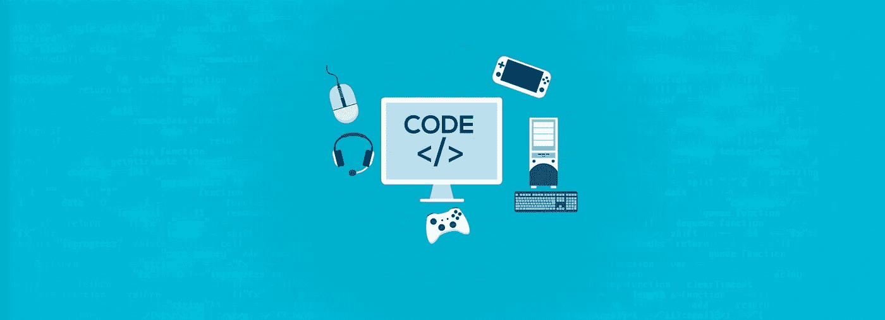
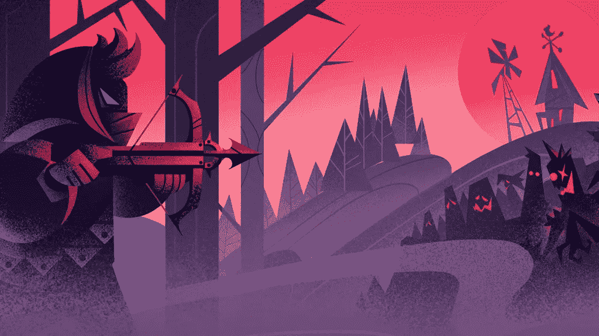
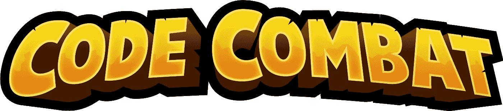
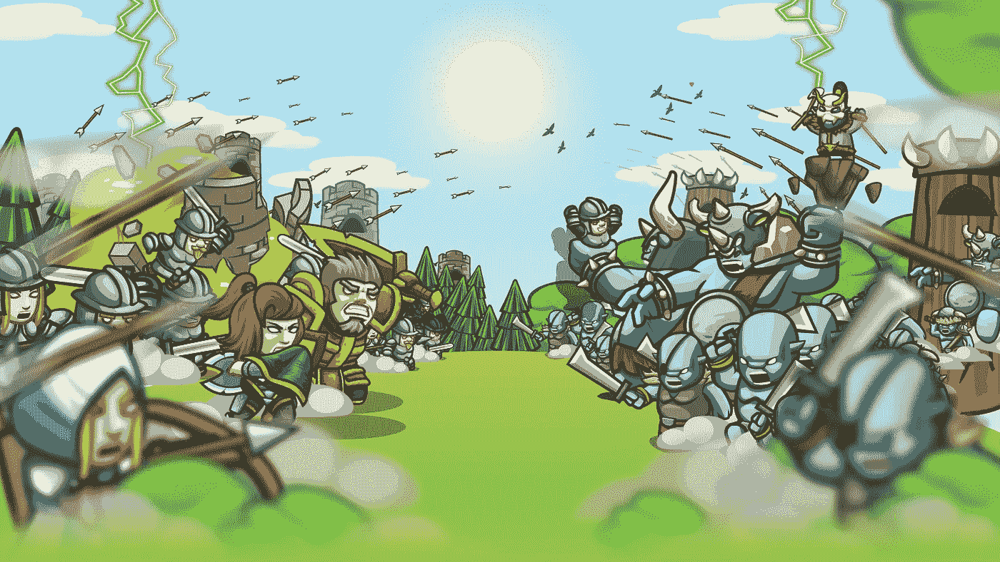
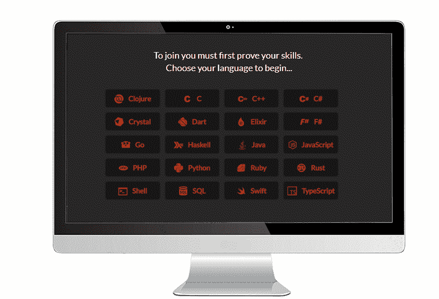
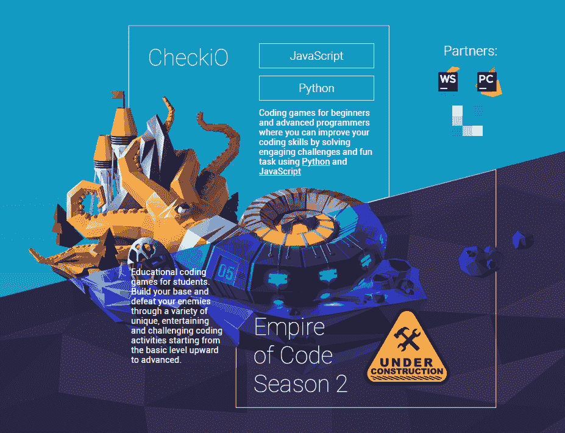
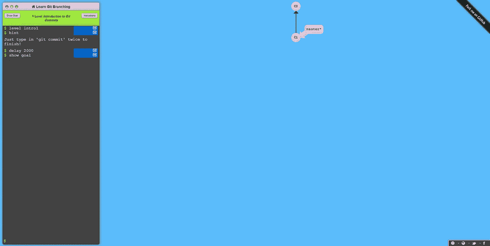
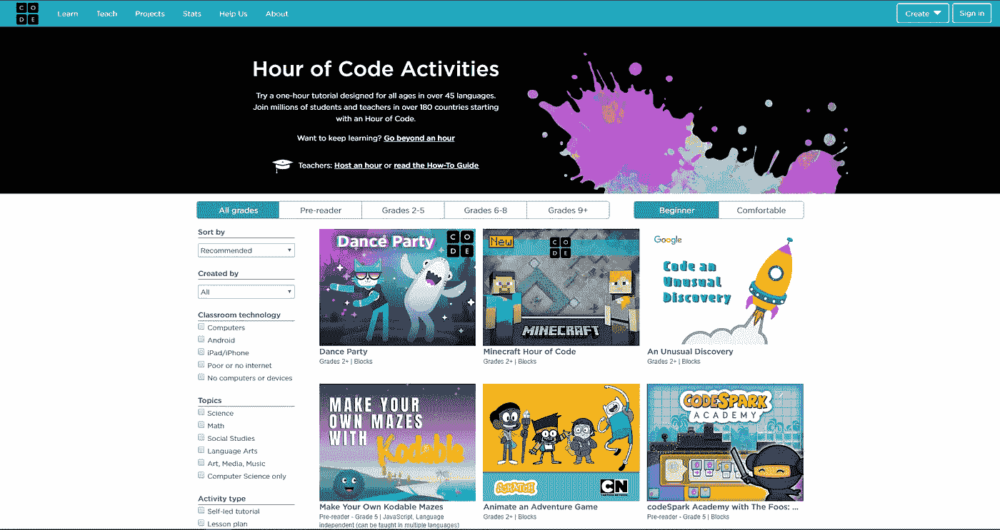

# 边玩边掌握编码

> 原文：<https://medium.com/hackernoon/master-coding-while-playing-69ff218dc8c5>

## 学习编程语言的困难，理解一些概念？你正在阅读正确的文章。

这是一个精选的免费网站，在这里你可以通过游戏或各种挑战来享受学习或提高你的 JavScript、Python、CSS、HTML5、Java 等技能的乐趣。

> 游戏反映了人类思维的学习方式。他们激励玩家去冒险和行动，在失败中坚持不懈，设定并实现越来越困难的目标，并投入注意力、时间和努力来获取知识和技能。所有这一切都是在游戏跟踪玩家的行动，评估玩家的成就和技能。这不正是我们想从教育中得到的吗？

## 1. [Flexbox 僵尸](https://mastery.games/p/flexbox-zombies)

你对响应式设计有问题？灵活的框布局模块，使设计灵活的响应布局结构更容易，而无需使用浮动或定位。

Flexbox Zombies splash

这个游戏带你通过 12 个充满挑战的章节，让你掌握反应式设计。

## 2.[代码战斗](https://codecombat.com/premium)

你喜欢 RPG？中世纪游戏？这是你能做出的最好的选择！

CodeCombat 创建于 2013 年，是一个拥有超过 500 万玩家的社区项目。其中一些玩家愿意通过创建关卡、添加功能和修复游戏漏洞来做出贡献。这款游戏有 50 种语言版本。支持 Javascript、Python、Clojure、Lua、Io 或 CoffeeScript，

CodeCombat splash screen

这也为教师向他们的学员提出挑战提供了可能性。

## 3.[编码游戏](https://www.codingame.com/home)

CodinGame 提供了练习的机会，然后与随机玩家一起参加在线挑战，测试你的技能。从 22 种编程语言中选择你想练习的语言

通过解决算法问题来提高你的技能

Some puzzles available on CodinGame

## 4.[代码大战](https://www.codewars.com/)

Codewars 是其用户的集体努力。他们是创造者——创作形来教授各种技巧，用启发他人的解决方案解决形，用建设性的反馈进行评论。其中的领导者负责协调内容和社区。

Codewars 提供了学习和掌握 20 多种编程语言的机会。通过与他人一起训练真实代码挑战来提高您的技能

> 挑战自己的形，由社区创建，以加强不同的技能。掌握你当前选择的语言，或者扩展你对一种新语言的理解。

Overview of Codewars

## 5. [CheckiO](https://checkio.org/)

通过各种独特的娱乐和具有挑战性的编码活动来建立您的基础并击败您的敌人。

CheckiO 是一套面向初学者和高级程序员的编码游戏，在这里你可以通过使用 Python 和 JavaScript 解决引人入胜的挑战和有趣的任务来提高你的编码技能

包括所有技能水平(初级、中级和高级)

## 6.[学习 git 分支](https://learngitbranching.js.org/)

许多人发现很难理解 git 仓库是如何工作的。从简单到复杂的操作，Learn Git Branching 会用它那令人惊奇的游戏场来指导你，游戏场由一个命令提示符和一个显示操作结果的界面组成。

> “学习 Git 分支”是在 web 上学习 Git 最直观、最互动的方式；您将面临激动人心的关卡挑战，逐步演示强大的功能，甚至可能在过程中获得一点乐趣。

## 7.[代号](https://code.org/learn)

这是最好的游乐场，孩子们可以在这里开始甚至提高他们的编码技能。这是一个学习如何通过游戏编写代码的网站集合，这些游戏的灵感来自著名的卡通、电影甚至游戏，如《冒险时光》、《口香糖》、《星球大战》、《《我的世界》》等等。这里的游戏旨在发展观察和算法技能

请随意删除我在评论中提到的内容。

如有任何疑问，你可以给我发邮件到 jfokoua@gmail.com 的，或者直接在我的[推特](https://twitter.com/mr_j____?s=09)上留言。

❤制造