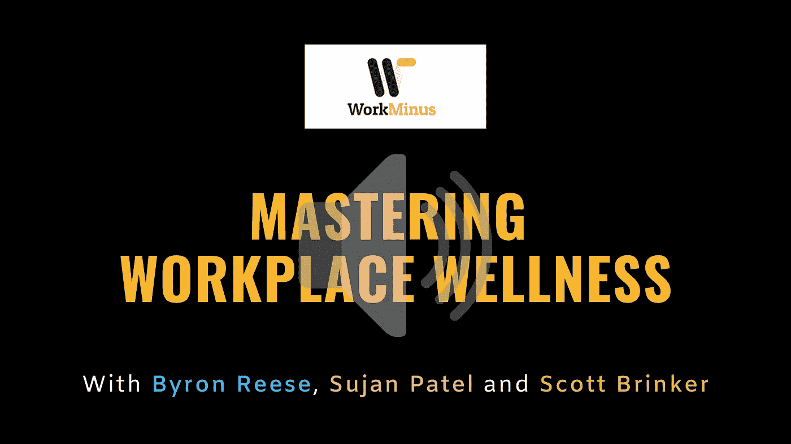
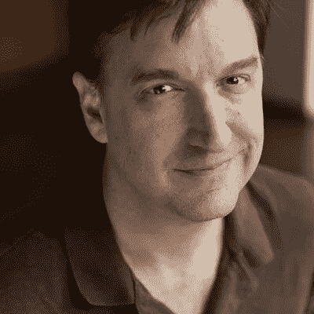
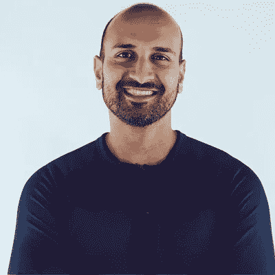
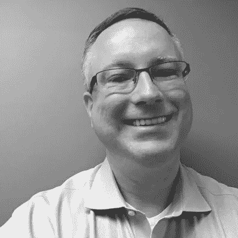

# 掌握工作场所健康

> 原文：<https://medium.com/hackernoon/mastering-workplace-wellness-with-byron-reese-sujan-patel-and-scott-brinker-a7fffc76c02d>

# 拜伦·里斯，苏扬·帕特尔和斯科特·布林克

Image Source: Canva

了解下一波进化是如何以前所未有的速度接管的是一件有趣的事情。我一直在阅读和聆听几位思想领袖的观点，他们决心让这种转变让我们所有人都感到愉快。

有些人说这种转变将有利于人类，例如帮助我们成为更好的自我，而其他人则有与以前观点相反的事情。无论如何，从昏睡和保守的心态转变为广泛和接受的心态是度过这一浪潮所急需的。

我和我的团队正在与一些值得倾听的思想领袖和职场专家就**工作进行交谈，了解职场健康的几个方面。将我们的工作场所转变成我们每个人都愿意逗留的地方的需求和愿望。我们知道和不知道的先进技术和其他对我们的发展有贡献的东西。**

**正如著名心理学家**史蒂芬·平克**在他的 TED 演讲[中提到的，世界是变得更好还是更坏了？看看这些数字](https://www.ted.com/talks/steven_pinker_is_the_world_getting_better_or_worse_a_look_at_the_numbers?language=en)“世界实际上是如何发展的，这与我们对它的假设相反。**

**我们认为世界每天都在退化和恶化，但数字不会说谎，它们表明世界比以前变得更好，实际上好得多。**

**因此，我们与三位技术乐观主义者进行了交谈，以了解他们认为我们应该从现有的工作场所中摆脱出来的东西，以便让它成为一个更好的工作和发展场所。我们的主题是:**

*   **[工作减去单调](https://workminus.com/podcasts/byron-reese)**
*   **[工作减去一切](https://workminus.com/podcasts/sujan-patel)**
*   **[工作减去非此即彼](https://workminus.com/podcasts/scott-brinker)**

## ****工作减去单调**同[**拜伦李斯**](https://twitter.com/byronreese)**

****

**我们问拜伦，工作减去单调是什么意思？**

**“我有一个论点，它说如果你能想到有一天我们会制造一台机器来做的任何工作，我的意思是，忘记我们现在是否有一台机器来做它，只是一些你可以想象机器在未来做的工作，像无人机擦窗机，像你一样，可以想象有一天会有一架无人机飞起来擦大楼侧面的所有窗户。**

**如果你做一件机器可以做的工作，你让一个人去做，有一个词可以形容，这个词就是非人化。这项工作从定义上来说是非人性化的，因为如果你说机器可以做到这一点，那么它不需要激情，创造力，情感，任何使人类成为人类的东西。事实上，你真的是在要求一个人只是机器的替身，直到我们发明出某种机器来做这件事。**

**我认为这类工作是最糟糕的。我认为人类意味着更多，所以这就是我所说的单调。你可以从宏观的角度来看待它，你知道，我举了一个清洁窗户的无人机的例子，但我认为你也可以从微观的角度来看待它——你和我在我们的工作中做的机器可以做的个别任务。**

**因此，即使你有一个伟大的人类“人类工作”，需要独特的人类能力，可能仍然会有一部分是机器可以做的，这就是我对这一点的看法，单调的一部分，因为它不是人类的一部分，它只是你物理上是一台机器的一部分，这就是我们在为每个人摆脱的道路上。"**

****工作减去一切**与[**苏扬·帕特尔**](https://twitter.com/sujanpatel)**

****

**工作减去一切我们真正的意思是:一个人怎么能同时做 9 件不同的事情呢？之后，Sujan 带我们开始了一段漫长的旅程，讲述他是如何以一种不存在“倦怠”的方式做事的。**

**“重要的一点是，作为一家公司，作为公司的个人贡献者，无论你是低级员工、初级员工还是高管或创始人，每个人每天都有相同的时间:24 小时。如果你仔细想想，你可能有八个小时，有些人一天有十六个小时。我不知道你，但我可能有五到六个小时的时间，剩下的时间就像我可以做一些电子表格，一些不用动脑的工作，但我有几个小时的时间，然后我就差不多完成了。**

**我认为这不仅仅是私有化或生产力，我认为这是脑力。那么在给定的一天里，脑力能膨胀多少呢？实际上，我过去经营一家公司时已经精疲力尽了，当时有 30 名员工为我工作，他们中的大多数都是直接下属，但我们做了很多。我从在这方面的惨败中学到了这一点，并最终做了这个生意的甩卖，因为我只想离开。在一天结束时，我很高兴我经历了这一经历，但最终生产力是在优先化之后。"**

****工作减去非此即彼**[斯科特布林克 ](https://twitter.com/chiefmartec)**

****

****我们邀请 Scott 与我们分享忽视“非此即彼”的工作方式背后的理念，以及我们如何做到两者兼顾。下面是他的想法:****

**“我认为这实际上是你以一种平台心态看待集中化的方式。现在有很多关于平台的优秀文献，不仅仅是从技术角度，还从商业模式的角度，一本名为[平台革命](https://www.amazon.com/Platform-Revolution-Networked-Markets-Transforming/dp/0393249131)的好书值得当今商界几乎所有人阅读。**

**但是，如果你带着这种平台心态，这就像，好吧，我们将在某些平台上实现标准化，以在组织的中心提供凝聚力，但该平台的整个要点是，它使组织边缘的创作者能够完成各种高度专业化的任务，或在该平台上自己创造东西。那么你就能得到两者的好处。"**

> **在接下来的几集里，我们将分享更多关于工作场所健康的知识。**
> 
> **敬请关注。**

**再见。**