# 认识 Max——算法加密钱包和监控服务

> 原文：<https://medium.com/hackernoon/meet-max-the-algorithmic-crypto-wallet-monitoring-service-9e76112f5989>

## 不仅仅是一个数字口袋

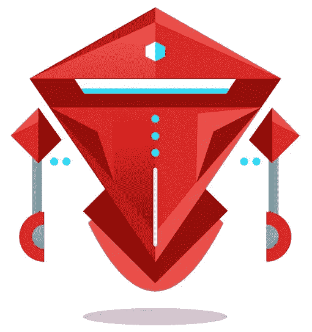

Max Keeps a Watchful Eye Over Your Crypto

如你所知，这是我第一次使用 Max。我现在登录了我的门户，但是还没有点击任何 [**Dropil 项目的**](https://dex.dropil.com/signup?aff=8Oj0nNPbsCnIwfXanxgS0HxLhnLfct) 算法产品。

在分享产品细节之前，我通常会提前对产品进行评估，但我认为尝试一下会很有趣，所以这是一次第一印象体验。

然而，我知道 Max 是 Dropil 团队组装的四个机器人之一。Max 是一个智能钱包，可以储存从套利交易中获得的收益，或者是两个虚拟交易者之一——Jade(目前处于等待名单模式)和 Dex 3。

说到 Dex，这个虚拟的自动驾驶算法就是我写这篇文章的原因。我花了 45 天——相当于 99.99%不干涉交易的 3 个完整周期——测试 Dex 的技能。结果呢？ **4.23%** 。

现在，如果你想详细了解这一过程，以及学习启动自己的自主交易机器人所需的简单步骤，请在这里查看:

 [## 激活这个自动驾驶算法来为你交易密码

### 一个一劳永逸的加密货币交易账户的 45 天实验

hackernoon.com](https://hackernoon.com/activate-this-autopilot-algorithm-to-trade-crypto-on-your-behalf-3e9fae2a4aab) 

在继续之前，您是否阅读了上述文章？如果你回答是，谢谢，我希望你喜欢它。如果没有，在我们深入研究之前，先看看这个…

***免责声明*** *:这不是投资或理财建议。无论如何我都不是金融专家。本文中的信息主要是推测性的观点。在参与任何项目之前，无论是在神秘领域内还是在神秘领域外，都要进行自己的研究。*

*我可能会因创建此内容而获得报酬，也可能不会。也就是说，我尽最大努力保持公正和公平。我尽量避免所有的 FOMO 和 FUD，不希望在我的同伴中引发这些情绪。你走到这一步了吗？恭喜你。你是前 1%的人，应该得到一枚奖牌。*

现在你已经对 Dropil 项目的专有程序有所了解，让我们来看看 Max 能为你做些什么。

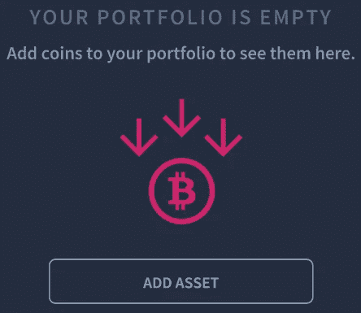

# Max 的内部钱包

由于存放在这里的资金来自互联网，我们可以将它们归类为“热门”。经验告诉我不要在网上留下大量的密码。

在线账户是可以被黑客入侵的。因此，就像加密交换账户一样，热钱包最适合交易，而不是长期存储。

关于这一点，我会把我的第一笔存款放在较轻的一边。然而，我有一种感觉，这是最弱的马克斯的属性。另外，2FA 确实对帐户保护有很大帮助。

点击超大的、非常容易找到的“添加资产”按钮后，你需要让 Max 知道为你保存哪个加密:

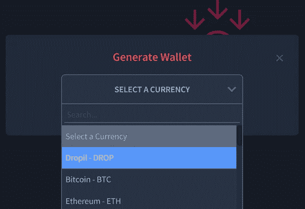

我数了一下，麦克斯体内有超过 75 枚可储藏的硬币和代币。相当多的选择！

因为我不想打断德克斯交易我的$DROP 代币，所以我给了马克斯一些 Pundi X 代币。

选择要存放的加密货币后，您可以随意命名新钱包:

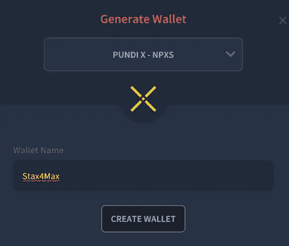

创建您的数字钱包后，您将获得一个存款地址。虽然我没有额外存款，但我确实为其他几种加密货币做了钱包。

这时我意识到产品组合概述可以有多详细:

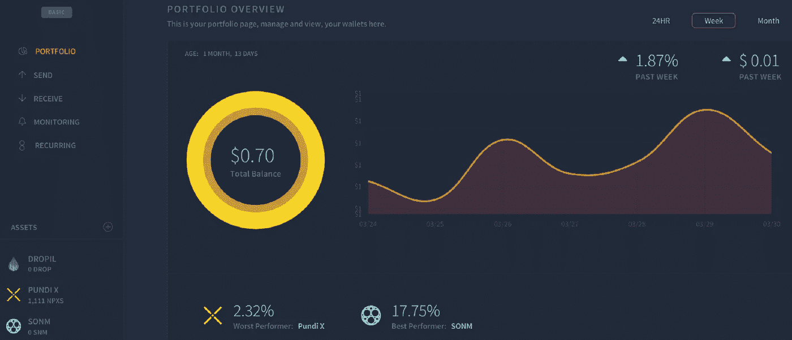

Clean, at-a-glance access to crypto portfolio performance

Max 实时跟踪您的数字资产的价值。你可以快速评估你的储备，看看哪些加密货币表现最好，哪些表现最差。

找到每日，每周和每月的价格表现在一个有吸引力的图表。很容易比较 24H 交易量水平的所有密码，你已经委托给最大。

启动额外存款非常简单，取款过程非常全面。

此外，Max 使您能够手动调整交易速度，有效地将您的网络费用减半。这种节省成本的功能当然不是所有的加密钱包都有的。

到目前为止，一切顺利！就像我使用 Dex 的体验一样，Max 的用户界面非常人性化。虽然马克斯的内部钱包是热门品种，但它确实有一些很酷的技巧。

如果你持有与 Max 兼容的 75+硬币和代币中的任何一个——即使你没有存入它们——这是跟踪他们表现的*极好的*方法。

色彩鲜艳的图表和百分比标注带来引人入胜的互动体验。

现在，让我们进入我最垂涎的特性——监控

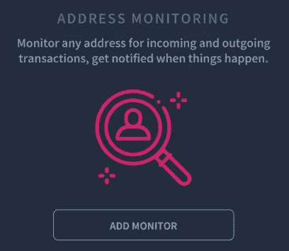

# 赏金猎人的喜悦

耐心是加密货币交易的重要组成部分，当你寻找奖金时，这种情绪更是如此。

你看，在帮助区块链初创公司发展社区的同时，大多数都处于预融资阶段，因为你要执行各种任务。

你完成的任何工作都是基于一个假设，即会有一个成功的 ICO 和最终的交易所上市。希望代币落在你已经使用的交易所。你可能几个星期或几个月看不到付款。

现在，由于隐星正在进行大量的项目，赏金猎人可能会非常忙碌。太忙了，没有时间每天查看他们的 MetaMask 或 MEW 账户的存款情况。

当你有几十个项目可能有一天会发放奖励时，很难跟上。奖金管理人员在支出时并不总是最善于沟通。

> 马克斯解决了永远不知道具体的奖金何时到达你的钱包的问题。

众所周知，时机是成功交易的关键因素。准备好交易的代币，**但甚至不知道它们的存在**，可能是一个代价高昂的疏忽。是的，它发生在我身上。

## 通过两个简单的步骤，Max 让您成为消息灵通的代币接收者:

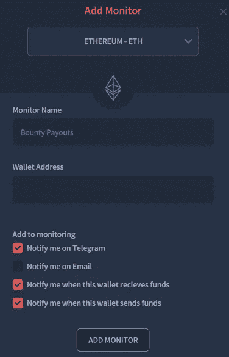

## 1)同步您的 ETH 钱包

一旦你设置好让马克斯盯着你的钱包，你就可以选择通过电子邮件(需要订阅升级)或免费的电报接收通知。

说到电报，如果你在赏金支持频道呆过一段时间，你就会知道 95%的猎人会以“什么时候”开始陈述

**当**令牌，**当**交换，**当**月亮？？？

使用 Max 意味着永远不用问那个不耐烦的问题的第一部分。当 Max 告诉你代币可用时，代币将会准确到达。

无论资金是从你的关联账户流入还是流出，你都会是第一个知道的人。

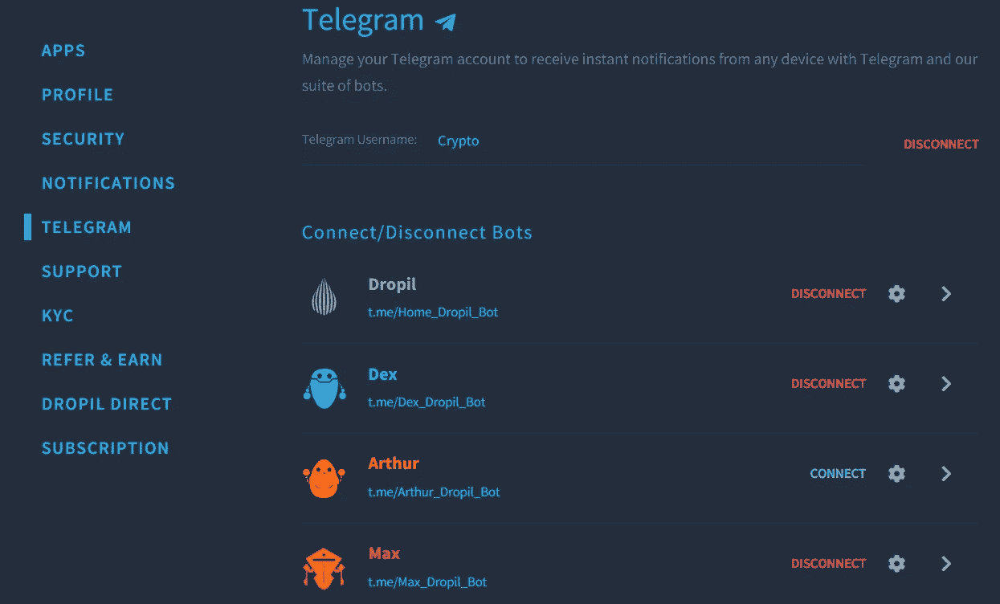

## 2)连接您的电报档案

导航到主 Dropil 门户左侧的“电报”选项卡。

按照简单的说明进行操作。

一旦你的机器人连接上，进入你的电报账户，搜索其中一个——“Max _ drop il _ Bot”很容易定位。

当你发现一个时，你就发现了所有这些——每个活跃的机器人都与 Telegram 上的所有其他 Dropil 助手互连。

现在，在我对通知服务进行有效的认可之前，我必须亲自尝试一下。从 Max 监控的地址发送了一批令牌后，我立即收到了通知:

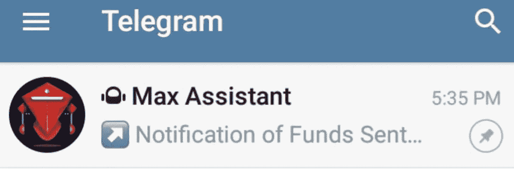

马克斯的仪表板也有记录:

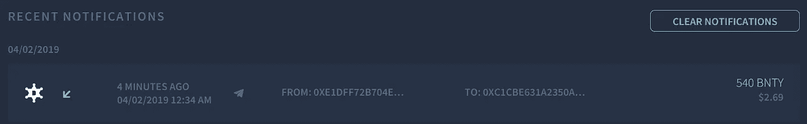

现在，需要注意的是，Max 还不是 ERC20 令牌的总称。定价信息来自于 [**CMC**](https://coinmarketcap.com/) **，**所以现在，Max 只能关注那些项目。

未来的产品版本打算包括跟踪 CMC 之外的硬币的能力。如果您在 Max 的仪表盘中没有看到您想要关注的硬币或代币，并且 CMC 列出了它，请随时联系 [**Dropil 团队**](https://twitter.com/DropilCoin) 询问他们是否会添加它。

我做到了，就在今天。如何看待$BNTY 代币在 Max 内突然变成 live？谢谢，队员们！🤝

# 竞争

Max 不是加密领域唯一的热门钱包。让我们来看看其他人的情况。

## 比特币基地

也许是最热门的加密热钱包。与 Max 不同的是，您可以链接您的银行帐户，并从您的帐户中进行菲亚特到加密的购买。

现在，Dropil 门户网站确实有一个菲亚特 onramp，但它受地理区域(抱歉，美国)的限制，仅适用于$ DROP tokens。

**优点**

*   **投保存款**

虽然马克斯也提供 2FA，比特币基地帐户进行保险。仅此一点就让我放心地把更多的密码留给他们。

**缺点**

*   **可用硬币数量有限**

在撰写本文时，比特币基地热门钱包(标准，非“专业”版本)持有美元和 11 种加密货币——英美烟草，$BCH，$BTC，$ETC，$ETH，$LTC，$USDC，$XLM，$XRP，$ZEC 和$ZRX。

虽然比特币基地的电子邮件提醒是免费的，但它们不能提供与 Telegram 相同的隐私保护。

## Blockchain.com

菲亚特 onramps 的另一个热门钱包竞争对手。虽然法定密码交易很好，但通常很昂贵。对于银行关联加密账户来说，高昂的买卖费用是常态。

从技术上讲，像币安这样非常受欢迎的交易所也有菲亚特 onramps。但这些都与信用卡挂钩，购买时会有 25%的溢价。

**优点**

*   **钱包内交易**

与 ShapeShift 类似，但选择范围小得多，区块链钱包允许你在不使用外部交易所的情况下用一个密码交换另一个密码。

*   **硬件钱包集成**

冷藏钱包被认为是最安全的。区块链钱包可以连接硬件钱包进行账户登录。

**缺点**

*   **严格限制选择**

只有四种密码可供存储— $BCH、$BTC、$ETH 和$XLM。即使按照比特币基地的标准，这也是微不足道的。

*   **繁琐的登录**

如果你没有使用硬件钱包登录，这个过程是违反直觉的。有大量的点击和打开电子邮件——远远不是无缝的。

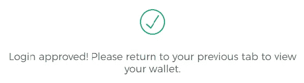

不用了，谢谢。我可以从已经打开的同一个标签页登录吗？

# 包扎

我承认在尝试另一种加密钱包时有些犹豫。毕竟，外面有成百上千的人。虽然 Max 从定义上来说是一个钱包，但监控方面使它不仅仅是一个数字口袋。

马克斯有一个光滑，优质的感觉。Dropil 项目的使命是让每个人都容易加密，这在这个机器人中得到了充分的展示。从存款到通知设置，一切都安排得很好，很容易理解。

而且，随着时间的推移，马克斯会有所改善。“经常性交易”功能仍在开发中。完成后，智能钱包用户可以在预定义的时间间隔发送硬币——这对以加密方式支付员工工资的项目非常有帮助。

麦克斯也不是没有缺点。我在一些地方发现了错别字，并且在投资组合概览图中发现了一些文本重叠。但是这些小细节是可以预期的，因为程序仍在解决这些问题。

Max 的最佳属性—帐户监控—工作起来完美无缺。虽然我不喜欢在热门钱包里放太多密码，但地址活动通知足以让 Max 出现在我的日常加密工具箱中。

Max 是我唯一用过的加密钱包吗？不会吧。功能集不够全面，无法满足我的需求。但是说实话，没有一个加密钱包是完美的。

我理想中的钱包有便宜的上下斜坡、保险、冷热存储、彩色价格显示、电报通知、赌注奖励、交易指标、套利信号，并能容纳加密领域的每一枚硬币。

但在我等待那只虚构的袋鼠出现时，我会继续使用 Max 和其他一些产品作为数字资产的存储解决方案。

*免责声明——作者可能会因创建此内容而获得$ DROP tokens 的小额分配。*

## 顺便说一下…

如果你喜欢你刚刚读到的内容，并且想帮助你把你的加密信息传播给大众，我很想听听你的项目。

即使你只想聊聊加密或你最喜欢的区块链创新，你也可以在这里找到我:Gmail 的 blockchainauthor

并且，你可以随时联系 [**加密推特**](https://twitter.com/CryptoBlastoff) 。