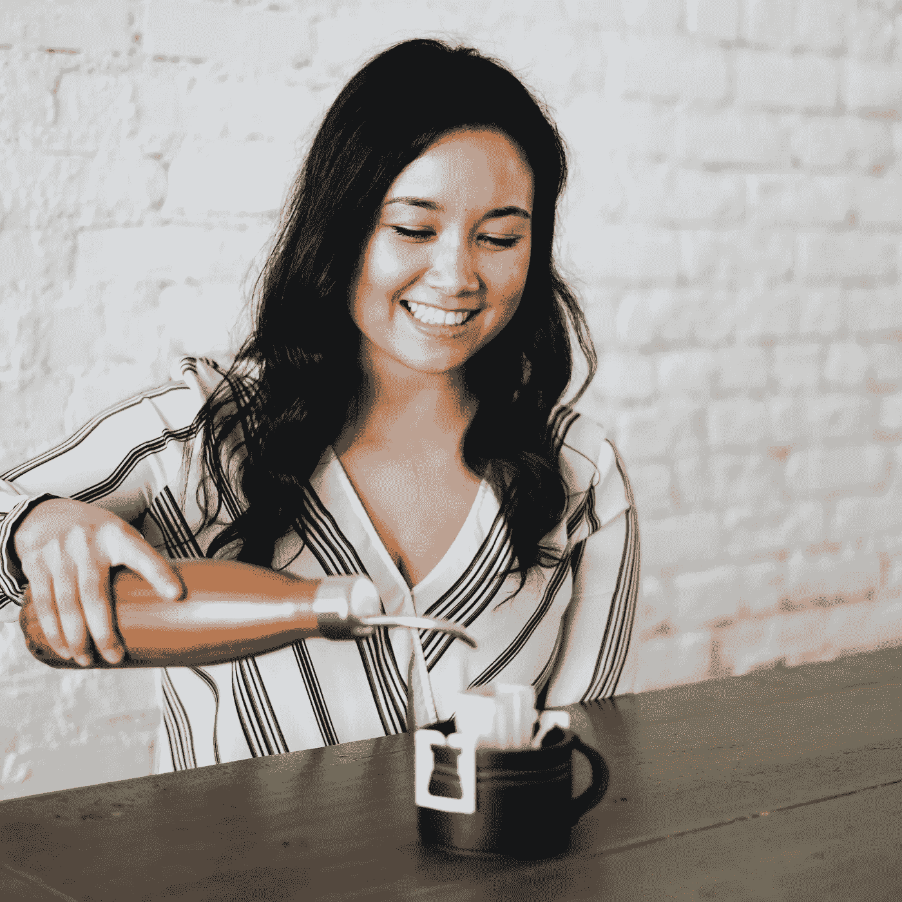

# 见见这位从世界银行高管转行的初创公司创始人，她为自己的越南咖啡公司筹集了 300 万美元

> 原文：<https://medium.com/hackernoon/meet-the-world-bank-exec-turned-startup-founder-who-raised-3-million-for-her-vietnamese-coffee-916af1954ec>

当黛比·魏·穆林(Debbie Wei Mullin)为她的亚洲特色饮料公司[铜牛咖啡(Copper Cow Coffee)](https://coppercowcoffee.com/)筹集资金时，她经常遇到对其吸引力的质疑:“这是一种利基产品。”

黛比说:“我会说，‘尝尝吧。’”。“这不是小生。这是美味的咖啡。只是碰巧是越南人。”

作为一个母亲来自西贡的湾区人，黛比是在这种强烈的甜味饮料中长大的。“每次我把它介绍给任何人，他们都会爱上它，”她说。

她的直觉——如果越南咖啡有“更高级、更容易接受的版本”——被证明是正确的。在 2017 年推出该产品的一个月内，总部位于洛杉矶的 Copper Cow 在 1000 多家商店中销售。

为了满足需求，她从朋友、家人和天使投资人那里筹集了 100 万美元，并通过了 [500 家创业公司](https://500.co/)加速器。

仅仅一年后，这家全球最大的零售商注意到了这一点。“沃尔玛给我们打了电话，”她说。“我们没有联系他们。它真的阻止了那些说这不是主流的反对者。”如今，沃尔玛在 1，000 个地点都有铜牛存货。

咖啡因让世界运转

黛比的第一次创业是在越南食用油和醋生产线 Wei Pantry。她在 2014 年创办了这个网站，当时她还是世界银行的全职顾问。

虽然这家白手起家的公司有早期的吸引力，但黛比意识到增长是有限的。“很快，我进入了许多商店，感觉自己在品牌方面得到了认可，这是一种越南产品，”她说。“但我确实意识到这个市场实际上很小——只有 10%的美国人会做饭。”

当她展望未来时，黛比开始琢磨那些有风险支持的想法。“我希望利用我在世界银行的经验，创建一家专注于供应链的企业。”

黛比说，咖啡的市场相对来说很大。70%的美国人每天喝咖啡，一天多次，其中 60%的人喝咖啡时加牛奶和糖

再加上雀巢公司以超过 7 亿美元的估值收购蓝瓶咖啡，黛比知道咖啡市场是巨大的——并且渴望创新。

“我们正在建立在[倒酒](https://www.perfectdailygrind.com/2019/01/everything-you-need-to-know-to-brew-great-filter-pour-over-drip-coffee/)和人们想要[干净食材](https://www.fooddive.com/news/onward-and-upward-clean-label-trend.../545738/)的趋势之上，”她说。

由于铜牛不是她第一次涉足特色食品，她可以利用她在魏茶水间的关系。当她接触那些销售铜牛产品的零售商时，她说，“很容易改变他们”。

她将公司的快速发展归功于她在以前的生产线上建立关系的能力，了解这些销售渠道是如何运作的，并为市场提供完全独特的东西。“对于我们的第一批客户来说，这非常令人兴奋，”黛比说。

**加速的好处**

带着筹集种子轮但需要指导的目标，黛比在 2018 年加入了 500 家创业公司。“它帮助我们树立了‘不仅仅是一家咖啡公司’的品牌，”她说。“它向人们表明，我们希望成为一家科技公司。这是我们成长的方式，也是我们取胜的方式。”

加速器也帮助她准备筹集风险资本。“500 英镑能让你为艰巨的筹款任务做好准备，”她解释道。“它告诉我，这是一份全职工作。如果你想为你的公司创造一个真正的市场，你必须全职筹集资金，以便尽快启动和结束你的融资。”

**苦尽甘来**

她说，黛比最初是通过“大量的反复试验”找到投资者的。

早些时候，她研究过谁投资了与她类似的公司。事实证明，这个策略对黛比并不那么有效。。

她找到了一家咖啡公司，这家公司几年前在硅谷获得了资助。“这对我是一个很大的鼓舞。我不认为他们和我有竞争力，所以我想也许他们的投资者会想投资我。但当我接近他们时，在真正寻找这些线索后，我很快了解到，这家公司做得不好。如果说有什么不同的话，那就是我的公司绝对不行，因为它和那家公司很像。”

什么效果更好？“最大的联系来源是通过其他创始人，尤其是那些领先一步的创始人，他们已经筹集了种子资金或首轮融资。”

黛比说，与其他企业家分享线索很有帮助。“我的投资者一直告诉我，他们希望得到我的推荐。如果这在他们的能力范围之内，如果我推荐某人，他们很可能会接受。”

**激起兴趣**

这可能看起来违反直觉，但黛比在她的过程中没有针对食品投资者。

她说，他们倾向于强烈关注零售，但她对 Copper Cow 的计划是关注其他渠道。“我们将维持零售业务，”她表示。“今年销售额将翻一番，但我宁愿通过电子商务直接面向消费者实现 10 倍的销售额，而不是将我们的资源投入到三倍。”

黛比发现，投资化妆品和时尚企业的投资者，尤其是围绕订阅模式建立的公司，更合适，尤其是“我在这一领域发展业务所需的那种导师，”她说。

**数豆子**

“500 家初创公司告诉我，要想筹集到 100 万美元，我必须参加大约 100 次会议。我发现这是准确的，”黛比说。“我大概开了 200 次会。其中大约四分之三是和真正的风投在一起，大约四分之一是为了获得风投的线索。

“你正试图建立这个漏斗的顶端，因为找到一个有钱的投资者，并寻找一家像你这样的公司，就像大海捞针一样。这就是为什么你有这么多的会议。”

黛比分享了另一条帮助她正确看待事情的建议:不要担心，直到你被说了 50 次“不”。

“当你第一次把自己放在那里时，真的非常痛苦。但是因为我是如此的目标导向，所以划掉 50 个“不”比在每次会议上都希望一个“是”要容易得多。看看数学:如果我参加 200 次会议，得到 5 个“是”，我就得准备好听到很多“不”

最终，黛比花了三个月的时间完成了她的[200 万美元种子轮](https://www.nosh.com/news/2018/copper-cow-closes-multi-million-dollar-round-to-expands-online-sales)，由 [Silverton Partners](https://www.silvertonpartners.com/) 领投，后者出资一半。 [CRCM 创投](https://www.crcmvc.com/)、[蒙太奇创投](http://montageventures.com/)、 [AmplifyHer 创投](https://www.amplifyherventures.com/)和[社会创业](https://www.socialstarts.com/)也参加了。

**就沏吧**

回想起来，黛比希望自己在整个过程中更加自信。“在你以一种自举的心态建立了一家公司近两年后，你总是在等待末日。你生活在那种模式中，你总是期待一切都会出错。对于关门后的生活会是什么样子，我没有做好足够的准备。

“我还在努力招人。我希望在筹集资金之前，我已经招到人了，或者已经排好队了，而且我对这一切都充满信心。”

尽管她在一名员工的帮助下创造了高达 100 万美元的收入，但投资者想知道她是否有能力建立一个强大的团队。

她表示:“我认为，如果我有兼职同事，我在筹资方面甚至会更成功，即使这会让我在后端损失一点股本。”。

“这是值得的，无论是在收盘后迅速上升，还是有一轮更强劲的融资。”

内森·贝克德是 Foundersuite.com 制作融资软件的公司**的首席执行官。自 2016 年以来，Foundersuite 已帮助企业家筹集了超过 10 亿美元的种子和风险资本。本文基于 Foundersuite 的《我如何筹集资金》播客* *中的一集* [*，深入了解创业公司创始人如何筹集资金的幕后故事。*](https://soundcloud.com/user-2586856/how-i-raised-it-with-debbie-wei-mullin-on-2212019)*