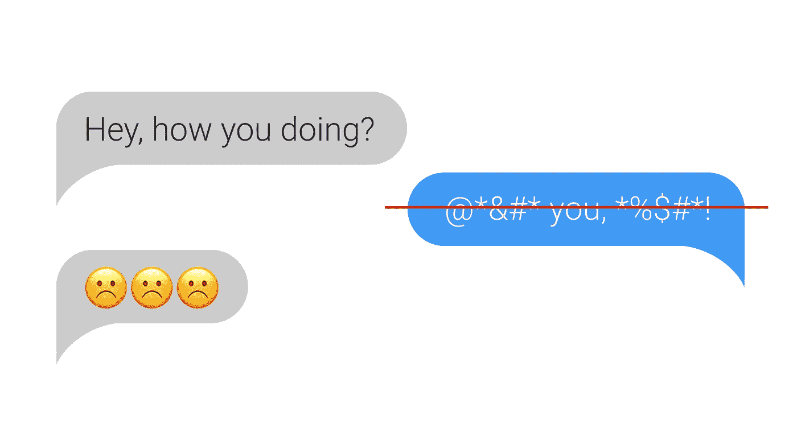
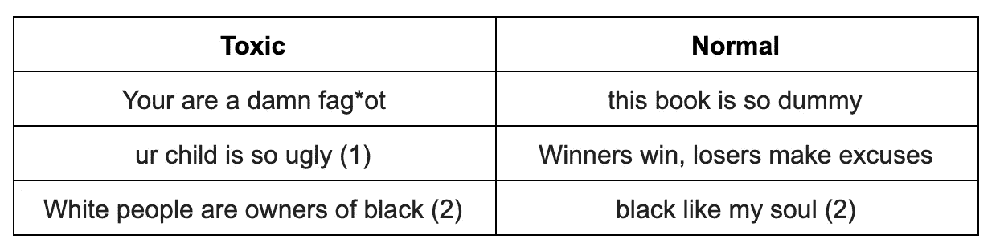
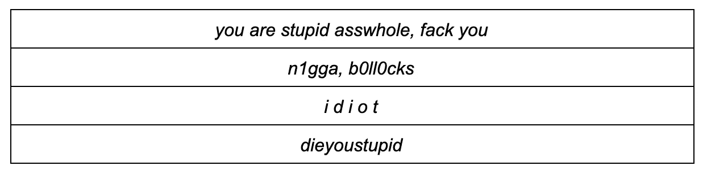
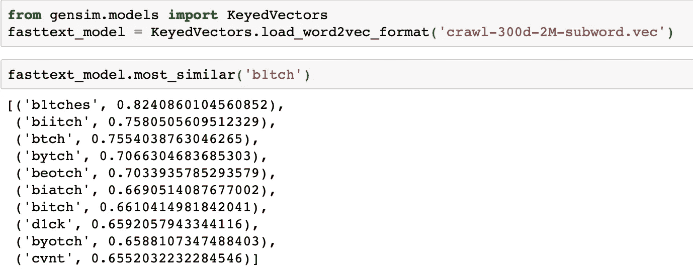
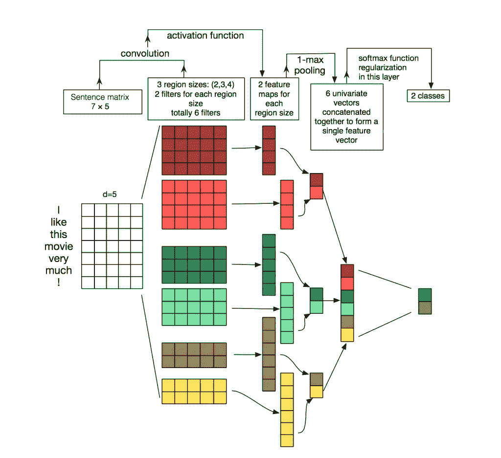

# 如何建立一个邮件审核系统

> 原文：<https://medium.com/hackernoon/message-moderation-system-ac9472962bf>

*由* [*艾拉·斯捷潘尤克*](/@irastepanyuk) *，数据科学家* [*波特哈实验室*](https://potehalabs.com/)

自动审核系统通常嵌入到 web 服务和应用程序中，在这些服务和应用程序中需要处理大量的用户消息。这种系统可以降低人工审核的成本，并通过实时处理所有用户消息来加快审核速度。本文将讨论使用机器学习算法的自动审核系统的开发。我们将经历从研究任务和 ML 算法选择到部署到生产的整个过程。此外，我们将回顾现有的开放数据集，并告诉如何自己收集所需的数据。

## 问题陈述

我们处理活跃的在线聊天，其中每分钟都有几十个用户生成短信。任务是检测这些聊天中的所有有毒消息和包含任何淫秽短语的消息。就机器学习而言，这是一个二元分类问题，其中每个消息必须被分配到其中一个类别。

首先，让我们来定义有毒信息。我们已经研究了互联网上许多典型的用户信息，这里有几个例子已经分成两组:有毒的和正常的。

Toxic and normal messages examples

不出所料，有毒信息通常包含淫秽词语，但这并不是必需的。有些消息，即使不包含任何不恰当的词语，也可能会冒犯到某人(例 1)。此外，有时有毒信息和正常信息包含在不同上下文中使用的相同单词(攻击性或非攻击性，例如 2)。这样的消息也应该加以区分。

因此，我们将 ***有毒*** 消息定义为包含淫秽、攻击性表达或仇恨言论的消息。

# 数据

## 开放数据

最受欢迎的邮件审核数据集之一是为 Kaggle 上的“[有毒评论分类挑战](https://www.kaggle.com/c/jigsaw-toxic-comment-classification-challenge)”提供的数据集。然而，该数据集包含许多不正确的标记:例如，带有淫秽词语的邮件被标记为正常邮件。正因为如此，我们不能简单地运行其中一个竞争核，得到一个高效的分类算法。我们需要深入研究数据，发现我们缺少哪些有毒短语或场景，并将它们添加到训练数据集中。

有一些科学出版物有相关的数据集([例](https://github.com/t-davidson/hate-speech-and-offensive-language))。大多数这样的数据集包含从 Twitter 上收集的信息，在那里你可以找到许多有毒的短文本。数据也经常从 Twitter 上收集的另一个原因是，Twitter 标签可以用于搜索和标记来自用户的新的有毒信息。

## **自行收集数据**

在我们从公开来源收集数据并训练基线模型之后，很明显公开数据是不够的:我们对模型的结果质量不满意。我们决定使用一个游戏信使自己收集数据，因为它们通常包含大量有毒内容。

我们已经收集了大约 10k 条消息，接下来必须对它们进行标记。到那时，基线分类器已经被训练，并准备好用于半自动标记。我们应用它来获得每条消息的毒性概率，然后按降序排列这些概率。查看该消息列表，可以看到在顶部的是那些包含淫秽和攻击性词语的消息，而正常消息在底部。因此，部分数据在没有任何人工标记的情况下立即被归入毒性类别。列表的中间部分是手动标注的。

## **数据增强**

在真实数据集中，可能会出现分类器失败的消息。然而，一个真正的人能正确理解它们的意思。

这是因为用户很快适应了聊天的局限性，并学会了欺骗审核系统，从而使算法在有毒信息上出错。用户做什么:

*   生成错别字
*   用拼写相似的数字替换字母字符
*   在字母之间插入额外的空格
*   删除单词之间的空格。

Words modification examples

为了训练一个对这种替换具有鲁棒性的分类器，我们需要以与这些用户相同的方式行动:在消息中生成类似的变化，并将它们添加到训练数据中。总的来说，斗争是不可避免的:用户总是试图找到漏洞和黑客，而版主将继续改进检测算法。

## **调节模式**

我们必须想出两种模式的消息处理解决方案:

*   在线模式——对回复率高的消息进行实时分析；
*   离线模式-不是快速日志消息分析和突出有毒对话框。

在在线模式下，我们预处理每个用户消息，并通过模型运行它。如果消息有毒，我们不会让它进入聊天界面。但如果是正常的，应该会显示出来。在这种模式下，所有的消息都必须非常快速地处理:模型必须快速地给出响应，这样用户之间的对话结构才不会被打乱。

对于离线模式，没有时间限制，因此我们希望实现尽可能高质量的模型。

# **在线模式**

## **字典搜索**

无论选择哪种模式，我们都应该检测并过滤掉淫秽的词语。解决这个子任务的最简单的方法是编一个不可接受的单词和表达的字典，并使用这个字典检查每个消息。消息预处理部分必须工作得非常快，因此，我们选择了 [Aho-Corasik 算法](https://www.geeksforgeeks.org/aho-corasick-algorithm-pattern-searching/)，它适用于快速查找字符串中的一组单词。由于这种方法，我们可以快速识别有毒短语并阻止消息，而无需将它们转移到主算法。并且接下来将 ML 算法应用于那些已经通过字典检查的消息允许我们理解它们的含义并且提高分类的质量。

## **基线模型**

对于基本模型，我们决定使用标准的文本分类方法:TF-IDF 统计结合经典的分类算法。

TF-IDF 是一种统计度量，它允许使用两个参数来确定一个单词对语料库中的文本有多重要:每个文档中的词频和包含该单词的文档的数量(细节[此处为](https://en.wikipedia.org/wiki/Tf%E2%80%93idf))。当我们为消息中的每个单词计算 TF-IDF 时，我们得到了该消息的向量表示。

可以为文本中的单词以及单词和字符的 n 元语法计算 TF-IDF。这种扩展将更好地工作，因为它将处理在训练数据中不存在的经常遇到的短语和单词。

An example of applying TF-IDF to n-grams of words and symbols

在我们将信息转化为向量后，我们可以应用任何熟悉的分类方法:[逻辑回归，SVM](https://towardsdatascience.com/support-vector-machine-vs-logistic-regression-94cc2975433f) ，[随机森林，梯度推进](https://towardsdatascience.com/ensemble-methods-bagging-boosting-and-stacking-c9214a10a205)。

对于我们的任务，我们选择了逻辑回归，因为与其他经典的 ML 分类器相比，它可以提高速度。

基于 TF-IDF 和逻辑回归的结果算法工作迅速，并且很好地识别具有攻击性词语和表达的消息，但是并不总是理解其余文本的含义。例如，带有“黑人”和“女权主义”字样的非攻击性信息可能会进入有毒类别。有了改进版的分类器，我们想解决这个问题，并学会更好地理解文本的深层含义。

# **离线模式**

为了更深入地了解消息的含义，可以使用以下神经网络算法:

*   嵌入(Word2Vec，FastText)
*   神经网络(美国有线电视新闻网，RNN)
*   新的预训练模型(ELMo、ULMFiT、BERT)

让我们讨论其中的一些算法以及如何使用它们。

## **Word2Vec 和 FastText**

嵌入模型被开发来将单词从文本转换成向量表示。Word2Vec 有两种类型:Skip-gram 和 CBOW(连续单词包)。在 Skip-gram 中，上下文是由单词预测的，而在 CBOW 中，情况正好相反:单词是由上下文预测的。

image [source](https://www.analyticsvidhya.com/blog/2017/06/word-embeddings-count-word2veec/)

这种模型在大型文本语料库上训练，并允许从训练的神经网络的隐藏层获得单词向量表示。这种体系结构的缺点是模型是在语料库中存在的有限的一组单词上训练的。对于在训练阶段没有包括在文本语料库中的所有单词，将不存在嵌入。当使用预训练模型时，会发生这样的情况:一些单词丢失了它们的嵌入，因此丢失了大量有用的信息。

为了解决字典中没有的单词(OOV，不在词汇表中)的问题，有一个改进的嵌入模型叫做 [FastText](https://fasttext.cc) 。FastText 不是使用单独的单词来训练神经网络，而是将单词分解成 n-grams(子单词)并学习它们。为了获得单词的向量表示，我们需要获得单词 n 元文法的向量表示，并将它们相加。

因此，为了从消息中获得特征向量，我们可以使用预先训练的 Word2Vec 和 FastText 模型。然后可以使用经典的 ML 分类器或完全连接的神经网络对这些向量表示进行分类。

An example of the output of the closest words using the pretrained [FastText](https://fasttext.cc/docs/en/english-vectors.html)

**用 CNN 进行文本分类**

关于文本处理的任务，递归神经网络(LSTM，GRU)比其他神经网络结构更经常使用，因为它们更好地处理序列。卷积神经网络(CNN)经常用于图像处理，但是它们[也可以用于](/jatana/report-on-text-classification-using-cnn-rnn-han-f0e887214d5f)文本分类问题。让我们考虑如何实现这一点。

每个消息由一个矩阵表示，其中每行写有一个字向量表示。卷积以某种方式应用于矩阵:卷积过滤器“滑过”矩阵的整行(单词向量)，但同时一次捕捉几个单词(通常为 2-5 个单词)，从而在相邻单词的上下文中处理单词。下图显示了该过程的更多细节。

image [source](http://www.wildml.com/2015/11/understanding-convolutional-neural-networks-for-nlp/)

当我们可以使用递归网络时，为什么要使用卷积网络进行文本处理？事实上，卷积运算要快得多。将它们应用到邮件分类任务中，我们可以节省学习时间。

## 埃尔莫

ELMo(来自语言模型的嵌入)是[最近推出的基于语言模型的嵌入模型](https://arxiv.org/abs/1802.05365)。它不同于 Word2Vec 和 FastText 模型，并提供具有某些优势的单词向量:

*   这个词的表达依赖于使用它的整个上下文。
*   这种表示是基于字符的，这使得对不在词汇表中的单词形成可靠的表示成为可能。

ELMo 可以用于不同的 NLP 任务。在我们的框架中，消息的 ELMo 向量可以再次通过经典的 ML 分类器或卷积或全连接网络进行分类。

预训练的 ELMo 嵌入简单易用，可以在[这里](https://github.com/allenai/allennlp/blob/master/tutorials/how_to/elmo.md)找到使用示例。

# **实现特性**

## **烧瓶 API**

API 原型是用 Flask 编写的，因为它很容易使用。

## **两幅 Docker 图像**

对于部署，我们使用了两个 docker 映像:安装了所有依赖项的基本映像和启动应用程序的主映像。这大大节省了构建时间，因为很少重新构建第一个映像，因此在部署过程中节省了时间。相当多的时间花在构建和下载机器学习框架上，这并不是每次提交都必须的。

## **测试**

相当多的机器学习算法的一个具体特征是，即使在验证数据集上具有高度量值，它们在生产中的实际质量也可能很低。因此，为了在真实条件下测试算法，整个团队在 Slack 中使用了一个机器人。这非常方便，因为任何团队成员都可以检查算法如何响应特定的消息。这种测试方法还允许立即探索算法将如何在真实数据上工作。

Slack bot 的一个很好的替代方案是在 Yandex Toloka 和 AWS Mechanical Turk 等众包服务上运行试用解决方案。

# **结论**

我们已经考虑了几种自动消息审核的方法，并描述了我们的实现的特性。在我们的开发过程中获得的主要观察结果:

*   基于 TF-IDF 和逻辑回归的字典搜索和机器学习算法使得有可能快速但不总是正确地对消息进行分类。
*   基于神经网络和预先训练的嵌入模型的算法更好地处理这种任务，并且可以确定消息含义内的毒性。

最后，我们想宣布我们已经通过脸书机器人发布了一个 [Poteha 毒性评论检测](https://www.facebook.com/potehatoxic/)系统的公开演示。请尝试帮助我们使系统变得更好！

**感谢您的阅读！请向我们提问，留下您的评论，敬请关注！在 https://potehalabs.com****找到我们**