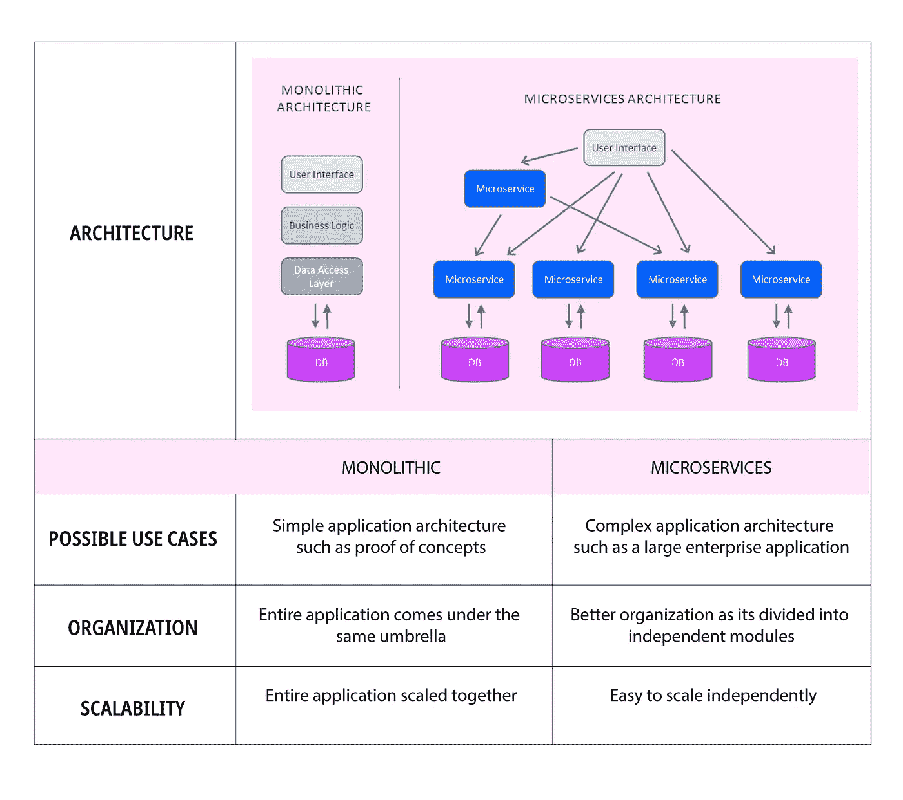

# 微服务架构:新的业务推动者

> 原文：<https://medium.com/hackernoon/microservices-architecture-the-new-business-enablers-3b237807c103>

如今，微服务或微服务架构是软件开发领域中一个熟悉的术语。随着多年来传统软件架构变得越来越复杂和有问题，微服务架构等新进入者正在企业和商业中获得动力。

但是，这仅仅是炒作还是高于此？好吧，让我们仔细看看微服务是如何发展成为新的业务推动者的。

# 什么是微服务？

微服务架构将整个应用程序分解或划分为一组可管理的服务。基本遵循了‘把一件事做得真正好’的现象。根据软件大师 Martin Fowler 的说法，微服务架构由“围绕业务能力、自动化部署、端点智能以及语言和数据的分散控制”组织的“可独立部署的服务套件”组成

当引入微服务时，主要想法是降低应用程序的复杂性。独立的微服务通过简单且通用的应用编程接口(API)相互通信。专家们强烈认为,[容器](https://www.docker.com/resources/what-container)和微服务的概念携手并进，是一个完美的组合。但是，没有容器也可以构建微服务。

所以，回到这个问题——它与整体架构有什么不同？下面是这两种体系结构之间的比较。

# 微服务和整体架构的比较

# 面向企业的微服务架构的主要优势

*   **降低复杂性&提高故障隔离**

微服务架构将整个应用程序分解为多个组件或独立的服务。每个服务都可以独立工作和部署/重新部署，而不会影响其他组件。尽管应用程序会随着时间的推移而发展，但是系统中孤立的代码库不会影响开发团队的生产力，也不会降低关键业务操作的速度。

即使一个微服务出现故障，其他服务也会继续运行，不会受到任何阻碍。这将您的业务应用置于一个安全的位置，因为微服务保证了零应用时间。

*   **简化技术采用&鼓励实验**

微服务架构不会限制您的系统使用特定的技术堆栈。可以根据商业机会和能力提升来选择技术。单个应用程序中的不同服务可以使用不同的语言编写。

为什么这对像您这样的企业如此重要？它降低了失败率。如果你是一个早期的技术采纳者，并且想要尝试最新的技术，那么微服务架构给了你这样做的自由。您可以使用所选择的技术栈来选择要执行的某个服务，分析其性能，然后明智地前进。因此，它允许你承担低失败率的风险。

*   **启用 DevOps 软件交付方法**

微服务通过遵循其持续开发、集成和部署的原则来实现 DevOps。在 DevOps 生态系统中，开发和运营团队同步工作，以更快的速度开发和部署强大的软件应用。

类似地，微服务架构让您能够稳定地开发和部署应用，而没有任何依赖性。在这样的环境中，单个团队可以开发新的版本，还可以防止危险的部署。但是，这些阻止程序不会阻止其他版本进入生产环境。因此，更新在微服务架构中实现更有效，因为它促进了 DevOps。

*   **支持可扩展性需求**

在快速发展的商业技术世界中，完美的客户体验是一个重要的业务推动因素。根据客户反馈和创新的商业理念，应用程序很容易频繁升级和修改。

使用微服务架构构建的应用程序因其独立的可伸缩性优势而成为您最喜欢的增强选择。由于每个微服务都独立运行，您选择的服务可以独立扩展，而不会影响其他微服务。因此，适应不断发展的业务选项变得相当容易。某种程度上，微服务是基于业务能力和机会的。

*   **增强业务灵活性**

微服务给你‘实验快、失败快、学习快’的自由。你的业务转型计划不会因为害怕失败而注定失败。您可以在整个软件应用或产品中选择一个特定的微服务来进行实验、学习和成功/失败。好的一面是，它允许你在不造成整个系统混乱的情况下冒险。这样，您的业务可以通过快速响应不断变化的客户需求来选择中断，而不是被中断。

# 结论

微服务架构可能不是银弹，但它是高级应用管理服务的起点。在速度和敏捷性是关键业务推动因素的世界里，微服务架构绝对值得付出努力和时间。

微服务架构的思想适用于那些分解成更小更简单的组件时运行得更好的应用程序。我们已经看到像沃尔玛、亚马逊和 Spotify 这样的先行者采用微服务来提高运营效率。

然而，选择微服务还是单片架构完全取决于您的[应用需求](https://www.sayonetech.com/services/application-development/)。如果开发大型应用程序，如企业应用程序，那么微服务是理想的选择。另一方面，简单的应用可以从整体架构中获得最大的好处。

还不确定要搭配哪一款？SayOne 拥有一支 70 多名软件专家的团队，擅长为您的应用选择合适的软件架构。此外，我们使用最新的技术和开发方法将您的应用梦想转化为现实。[与我们的专家](https://www.sayonetech.com/contact/)交流，了解更多信息！

*最初发布于*[*https://www . sayone tech . com/blog/micro services-architecture-the-new-business-enablers/*](https://www.sayonetech.com/blog/microservices-architecture-the-new-business-enablers/)*。*