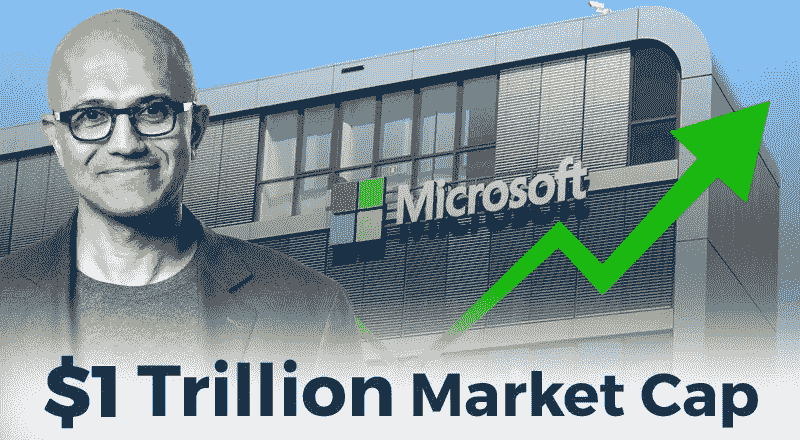

# 微软市值突破 1 万亿美元案例研究:给企业的教训

> 原文：<https://medium.com/hackernoon/microsoft-hits-1-trillion-market-cap-case-study-lessons-for-enterprises-350147ad1aa4>

# 点击刷新。

微软首席执行官塞特亚·纳德拉写了一本名为《热门刷新》的书，他做了同样的事情，将微软定位为继苹果和亚马逊之后第三大市值 1 万亿美元的公司。

我们知道微软是一份遗产。

凭借云优先的方法和塞特亚·纳德拉重新专注于在市场上苦苦挣扎的产品的战略，该公司创造了创纪录的 1 万亿美元市场资本。这种回归得到了全世界的认可，并得到了值得称赞的回应。

所有的企业，无论大小，不管他们经营的是什么行业，都应该吸取一个教训。

是的，微软如何借助 apt 战略和适应性领导重新夺回失去的位置，可以给企业上宝贵的一课。

> 许多公司渴望改变世界。但很少有人具备所需的所有要素:天赋、资源和毅力。微软已经证明，这三者它都有。
> –塞特亚·纳德拉

## 以下是一些支持性的数字和事实:

*   微软旗舰云服务 Azure 的收入在上个季度增长了 73%
*   微软的利润增长了 19%，成为云计算领域的领导者
*   社交网络平台 LinkedIn 和生产力工具 Office 创造了 102 亿美元的收入

# 他们是如何做到的？作为一个企业，我们有哪些经验教训？

**什么对他们有效？**

微软不再仅仅是“视窗公司”。

这家有 43 年历史的公司已经远远超越了企业和商业的订阅模式。他们专注于业务、生产力和实用工具，而不是在移动市场上竞争。

有几件事对微软的东山再起起到了关键作用。

## 他们拥抱强大的现代技术

微软接受了云优先的方法，今天它已经成为云计算的领导者，与亚马逊的 Azure 和谷歌的云产品竞争。

现代技术的使用推动了微软的发展。

**企业的教训:**

过时的技术通常会导致生产力下降、机会减少，并且往往不能引起足够的重视。

要成长，就必须跟上变化的步伐。从根本上说，微软采用了最新的技术，现在它的股票价格几乎翻了三倍。

*塞特亚·纳德拉称微软是移动优先和云优先世界的生产力和平台公司。*

微软将其重点从旧的基于许可证的技术服务转移到现代的、可扩展的、合适的云服务，鼓励小企业主升级他们的技术工具集。

**您是否已经“升级”了您的业务技术？**

## 他们关注的是它的力量

我们都知道微软非常关注商业生产力和实用工具。尽管如此，微软还是进入了移动领域，并开始生产一系列设备。最终，在 2017 年 10 月，微软停止了这项业务，并宣布他们将不再开发新的手机。

微软放弃了移动领域。

**给企业的一课:**

他们不重视它的过去。

他们继续成长。

他们继续改进。

他们继续学习。

他们就是这样取得市场领先地位的。

他们没有一遍又一遍地讨论失败，而是将微软的战略转变为云优先，这反过来又帮助他们获得了新的高度和创新。

> 如果你要有一种冒险文化，你不能真的把每一次失败都视为失败，你必须能够把失败视为一次学习的机会。
> –塞特亚·纳德拉

我们经常会遇到失败。微软并没有因为无法在移动领域继续发展而止步不前。他们重新关注并利用其遗产来构建业务效用解决方案，并将其提升到最高水平。

他们采用新技术和现代方法来改造现有产品，以增强小型企业的实力。

他们没有竞争；相反，他们选择了一条加强自身战略的道路，让每个企业和专业人士都有能力创造更有用的解决方案。

他们已经领先了。

不要坚持失败，吸取教训，走向下一个里程碑。

想想其他的可能性。

## 塞特亚·纳德拉的领导目标

这是每个企业的关键部分。

具有战略眼光和远见卓识的领导者不仅指引着公司的成长之路，还建立了一种文化，让每个员工都尽最大努力。

领导力是关于你如何行动，你如何对待员工，你如何激励他们，你如何决策，你如何区分生产力和创新，等等。

在塞特亚·纳德拉的领导下，微软已经发展成为云计算产品的领导者，市值超过 1 万亿美元。

> 技术会来来去去，所以你需要既能问又能回答这个问题:作为一家公司，你做什么，你为什么存在？
> –塞特亚·纳德拉

这就是他们如何转向云业务并推动公司发展的原因。塞特亚·纳德拉把云作为主要服务，而不是作为副业。

他还做出了有利于小企业的决定，在云中推出了 Office 365。他相信持续学习，并在团队中推广健康文化，以创造人们喜欢使用的美好事物。

**给企业的教训:**

我衡量自己生活的方式是“我比去年更好吗？”

看来塞特亚·纳德拉公式真的起作用了。微软已经做出了重大决策，比如让微软应用在每个平台上可用，从以 Windows 为中心转向基于服务的产品，拥抱开源环境，等等。

领导者建立一种学习文化，鼓励他们充满激情地工作，激励他们取得成就，并在需要时指导他们。

**塞特亚·纳德拉向他的团队致辞，并在电子邮件中写道，**

*“我们每个人都需要推动技术为人类和我们的世界做些什么。保持共同学习和成长需要勇气——鼓励彼此的个人优势，在我们的团队中建立更多的多样性和包容性，以及作为一个微软进行协作。我们一起取得的成就令人惊叹，但我仍然相信我们正处于一切可能的早期阶段。”*

把人放在第一位可以有所作为。

如果你的企业经常缺少火花或能量，或者经常陷入错误的决策，你需要重新定义领导力。

确定组织中的关键人物，并授权他们做决定。允许人们参与决策，并让他们参与到决策过程中，这将永远是最好的回报。

**你想过这个吗？**

## 微软案例研究:你需要学习什么？

我们认为微软的里程碑式的成就应该被视为一个案例研究，而不仅仅是新闻。我们相信以增长为导向的心态有助于公司达到新的高度，但这种心态是从你开始的。

无论你是员工、组织、领导还是决策者，都要把微软作为学习的来源，并应用这些知识来创造能够赋予人们权力的东西。

**你的想法？**

**注**:这篇文章之前发表在我们的博客上: [*这里*](https://www.spec-india.com/blog/microsoft-hits-1-trillion-market-cap-case-study-lessons-for-enterprises/)