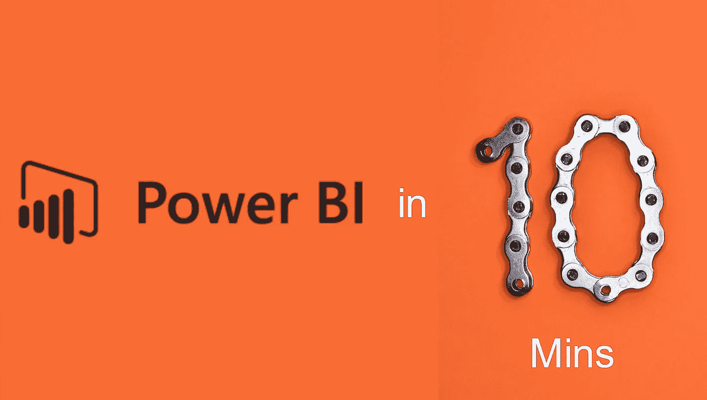
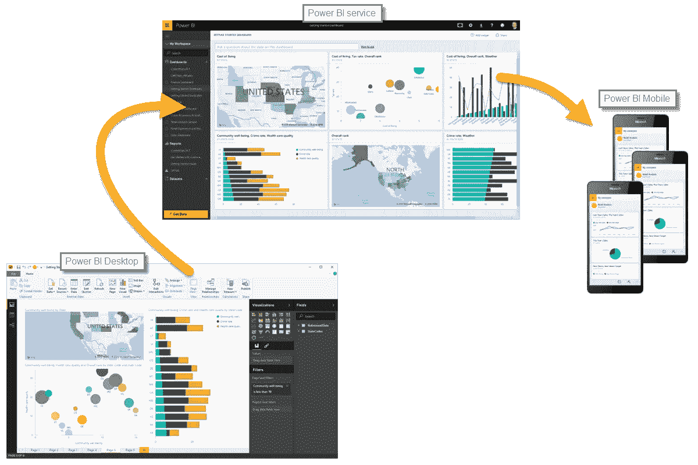
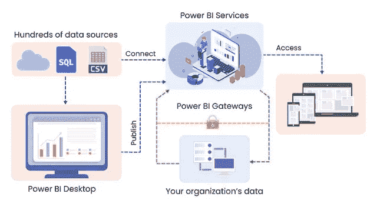
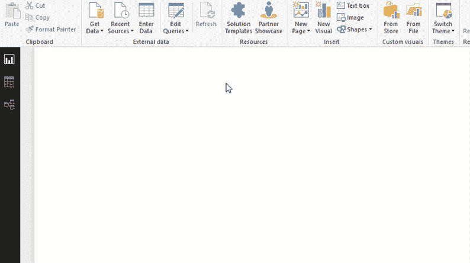
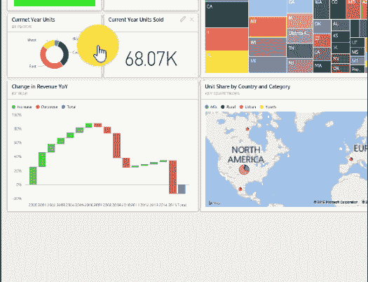
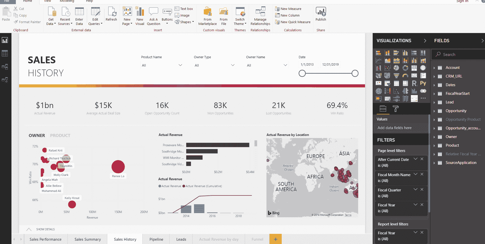
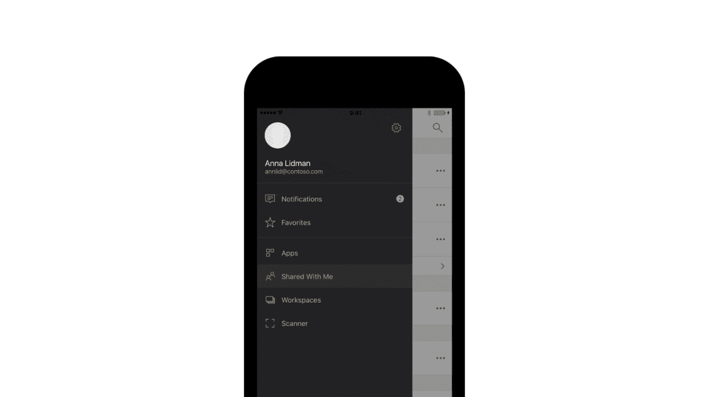

# 10 分钟内完成 Microsoft Power BI 快速指南]

> 原文：<https://medium.com/hackernoon/microsoft-power-bi-in-10-minutes-quick-guide-c70a6155bab9>

Photo by [Johny vino](https://unsplash.com/@johnyvino?utm_source=medium&utm_medium=referral) on [Unsplash](https://unsplash.com?utm_source=medium&utm_medium=referral)

在提供更准确的报告和分析方面，您是否面临困难？你是否无法识别最新的趋势、市场状况并快速应对变化？

在优化内部业务流程和推动决策方面存在问题？如何获取重要的商业报告？将原始数据转化为可操作的见解是否具有挑战性？

如果是，那么这个博客绝对适合你！

嗯，如果您使用 Excel，可能很难处理大量数据，这最终会为数据驱动型企业设置障碍。

如果您使用任何其他能力较弱的工具，可能很难利用数据来推动业务决策。

那么，如何利用数据做出明智的决策呢？

那么，在这种情况下，强大的商业智能系统可以来拯救。

> Gartner 连续 11 年将微软视为分析和 BI 平台的领导者。

为什么组织更喜欢使用 Power BI？

在深入研究之前，让我们从基础开始。

# 什么是 Power BI？

[Power BI](https://powerbi.microsoft.com/en-us/) 是微软基于云的业务分析服务，使任何人都能以更快的速度、更高的效率和更好的理解来可视化和分析数据。

## 此外，电源 BI:-

*   是一个交互式数据可视化工具，它使在整个组织内共享数据变得很容易。
*   提供有价值的见解，以便快速做出明智的决策
*   将原始和未经处理的数据转化为深刻和令人惊叹的视觉效果，供官员交流和更好地理解业务。
*   提供对定制报告和交互式仪表板的访问，这有助于获得完整的 360 度业务视图。

戴尔、Wipro、Metro Bank PLC、Edsby、Oraylis、Vizion solutions 等公司已经在使用 Power BI 来发展业务。

**看看这个视频**

## 谁可以使用 Power BI？

*   它可用于**业务分析师和 It 人员**到
    -从多个数据源创建交互式数据可视化
    -提供整个组织的实时洞察
*   它可用于**企业**到
    -简化管理
    -实现合规
    -获得准确可靠的报告
    -检测异常
    -简化工作流程
*   **开发者**可以使用 **Power BI REST API** 来自动化应用生命周期。此外，他们可以
    -在应用程序、门户、网站等中嵌入令人惊叹的视觉效果。
    -使用开源 JavaScript 库(如 D3、jQuery 等)开发和测试视觉效果。

## 但是，专业人士怎样才能接触到这个工具呢？

嗯，有三种方法可以使用 Power BI

*   **Power BI Desktop** :您可以通过多个数据源连接数据，将它们组合成一个数据模型，并创建引人注目的视觉效果。
*   **Power BI Service** :这是一个基于云的在线服务，用于团队和公司之间的协作。在 Power BI desktop 中创建的报告可以在 Power BI service 中共享，您可以在其中继续修改它们。您还可以在 Power BI service 中基于您的报告创建仪表板。
*   **Power BI 移动应用** : Power BI 为 iOS、Android 和 Windows 10 移动设备提供了一系列移动应用，您可以在旅途中查看、交互和安全访问报告、仪表盘和其他数据，所有这些都在一个应用中。

准确的说，桌面是用来创造内容的；该服务用于共享内容；移动应用程序可以在任何设备上随时随地获取见解。

*Image Credit:* [*https://docs.microsoft.com*](https://docs.microsoft.com/en-us/learn/modules/get-started-with-power-bi/media/pbi-using_01.png)

为了更好的理解，你需要知道 **Power BI 架构**。

但在此之前，你必须了解 **Power BI 组件**。

**Power BI 是多个组件的组合**，其中每个组件在 Power BI 解决方案中都扮演着重要角色。

## Power BI 组件概述

Power BI 提供了几个组件，使用户能够创建和共享数据报告，包括:

*   **超级查询**:促进数据搜索功能和转换&合并来自多个数据源的数据。
*   **Power Pivot** :内存数据建模组件，支持高度压缩的数据存储和极快的聚合和计算。
*   **Power View** :一个交互式可视化工具，支持用户拖拽界面。
*   **Power Map**:3D 地理空间数据可视化工具
*   Power Q & A :自然语言问答引擎
*   **数据管理网关**:通过使用这个组件，您可以获得定期的数据刷新和数据馈送。
*   **数据目录**:用户可以使用数据目录轻松发现和重用查询。可以为搜索功能提供元数据。

让我们来了解一下 Power BI 架构

# Power BI 架构:为 Power BI 解决方案共享和部署文件

*   **连接数据**

Power BI 可以连接来自各种数据源的数据。

有两个主要的数据源选项:

(1)将数据导入 power BI

(2)使用直接查询。

如果您要将文件导入 Power BI，它会将数据集限制为 1 GB，但是如果大小超过 1 GB，您可以使用直接查询(您可以基于非常大的数据集构建报告)。

*   **转换数据**

一旦连接了数据，您就可以根据需要对其进行转换。转换数据包括更改列或表的名称、将文本修改为数字、删除行、调整行、标题等等。有许多[转换选项](https://powerbi.microsoft.com/en-us/documentation/powerbi-desktop-query-overview/)可用于塑造您的数据。

*   **报道和出版**

这里创建的报告代表了来自该数据集的不同发现和见解。基本上是以**图**、**饼状图**、**切片图**等形式出现。它具有高度的交互性和可定制性；它会随着底层数据的变化而更新。创建报告后，您可以将它们发布到 Power BI services。

*   **创建仪表板**

power BI 仪表板由一个页面组成，通常称为 canvas，通过可视化来讲述一个故事。您可以通过锁定单个元素或实时报告页面来创建仪表板。由于它被限制在一个页面中，一个设计良好的仪表板只包含概述。

> 功率 BI
> 
> 体验您的数据。任何数据，任何方式，任何地点

# Power BI:它如何成为企业的游戏规则改变者？

*   **从所有数据源收集数据**

Power BI 可以轻松地从云服务中获取数据，包括 Microsoft Dynamics、Salesforce、Google Analytics、Zen desk、脸书等。无论您的数据在哪里可用，power BI 都能够从不同的来源形成数据；使您能够创建易于与其他人共享的可视报告。

*Image Credit:* [*https://powerbi.microsoft.com/en-us/desktop*](https://powerbicdn.azureedge.net/cvt-bdf935dcf3007a71d6df9bbdff44caa7611c5f816145d35c6a39a75008edb8ac/pictures/pages/desktop/connect_800_450.gif?636862487963432238)

*   **功能强大的 BI 仪表盘，帮助做出明智的决策**

借助 Power BI，您可以创建个性化的仪表盘，使 it 能够实时监控业务需求。当问题发生时，它使解决问题变得容易，并提供业务的整体视图，使团队能够做出明智的决策。您可以轻松地将仪表板和 BI 报告嵌入到应用程序中，以提供统一的用户体验。

Image Credit: [https://community.powerbi.com](https://community.powerbi.com)

*   **提问——实时获得答案**

用自然语言提问，用令人惊叹的交互式可视化得到答案，怎么样？

嗯，有了 Power BI，你可以提出一个问题，以右图右图的形式得到答案。它有自动搜索功能，让你在几秒钟内扫描隐藏的见解。它将所有信息存储在一个集中的位置，并与快速的数据进行交互。

*Image Credit:* [*https://powerbicdn.azureedge.net*](https://powerbicdn.azureedge.net/mediahandler/blog/media/PowerBI/blog/63acda3a-4eb6-41d5-832f-a8a451681e4a.gif)

*   **通过互动报道讲述故事**

时间线故事讲述者是 Power BI 中流行的自定义视觉效果之一，它传达了随时间变化的信息和细节。它以圆形、网格、螺旋或任何自定义形状的形式显示数据，甚至是简单的线性列表。它也有布局，不同的比例表示，如对数和相对，控制过滤，突出和注释。您可以决定如何在时间线中表示、缩放和设计数据。

*Image Credit:* [*https://timelinestoryteller.com*](https://timelinestoryteller.com/img/dailyroutines.gif)

*   **随时随地做出业务决策**

Power BI 提供适用于 Android、iOS 和 Windows 的原生 BI 移动应用，任何人都可以在任何设备上安全地访问和查看实时 Power BI 仪表盘和报告。很容易访问存储在 SQL server 中的本地数据或云中的数据；无论你身在何处。

**使用 Power BI 移动应用程序，您可以:**

*   在移动设备上查看实时仪表板和报告
*   从应用程序直接共享报告和仪表板，这有助于团队保持一致
*   将个人数据提醒的推送通知发送到您的设备

*Image Credit:* [*https://powerbicdn.azureedge.net*](https://powerbicdn.azureedge.net/cvt-d4448a9dba0a094dc096ea5c44b41de8ba2aa68233fa66c919e000867b13ffee/pictures/pages/mobile/notification_800x450@2x.gif?636862294678151758)

## Power BI 的其他优势

*   **几乎不需要辅助**就可以实现 Power BI 不需要技术支持
*   由微软提供的服务，与 Office 365、Microsoft Excel、Azure 和 SQL Server 等其他业务工具紧密集成
*   **与您现有的业务环境轻松集成**
*   帮助您**设置自动数据刷新**
*   用户可以**在社交媒体帖子和电子邮件上发布他们的可视化效果**,让任何可能对它们感兴趣的人都能看到
*   **数据更易访问**Power BI 可以连接 Spark、Hadoop 等软件。并将数据整合到一个集中的仪表板中
*   **没有内存和速度限制**
*   为**频繁更新的**提供新的特性和功能
*   这些年来，社区有了显著的发展

## 看着另一边

虽然 Power BI 塑造了商业世界，并提供了许多优势，但每一个优势都有相应的劣势。

*   仪表板和报告只能与具有相同电子邮件域或与您的 Office 365 租户列出的电子邮件域的用户共享。
*   Power BI 组件的列表非常长，有时很难理解需要哪个组件。
*   Microsoft Power BI 不允许您构建计划报告、个性化用户视图、个性化通知、个性化安全视图
*   并非所有报告都可以与同事共享，因为协同工作需要专业许可

虽然，动力 BI 缺点少；其独特的特性和功能与业务决策保持一致。因此它受到大多数组织的喜爱。

## Power BI 与其他 BI 工具有何不同？

为了简化这一点，让我们将 Power BI 与行业领先的 BI 工具 Tableau 和 QlikView 进行比较。

*   Tableau 没有免费版本。Tableau 的个人版售价 420 美元，专业版每年售价 840 美元。然而，Power BI 的专业版只需 120 美元，但免费版本身涵盖的内容远不止 Tableau。
*   QlikView 不支持预测分析，因此很难做出基于数据的决策，而 Power BI 可以帮助您创建预测模型，通过 Power BI 的内容包，您可以可视化预测结果。

## Power BI 的未来

未来属于解决问题的方法

*   灵活的
*   负担得起的
*   创新的
*   与其他解决方案轻松集成
*   易于配置，可以在任何地方的任何设备上查看。

最重要的是，它应该具有能够做出快速业务决策的特性和功能。Power BI 符合所有这些标准。

因此，当然未来对 Power BI 来说是最好的，而且它将在未来许多年内保持不变。

你有什么看法？你认为企业应该使用 Power BI 吗？请在下面发表您的观点或与我们联系，以了解更多关于 Power BI 的信息。

**注**:这篇文章之前发表在我们的博客上: [*这里*](https://www.spec-india.com/blog/microsoft-power-bi-in-10-minutes-what-why-who-how-justified/)